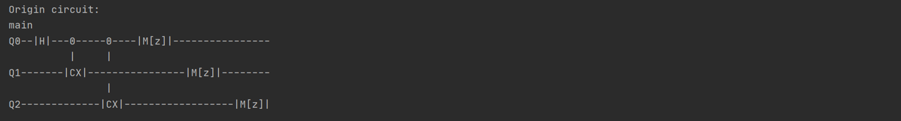
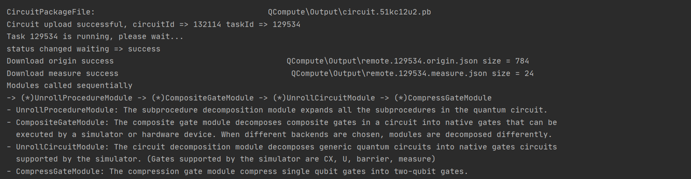

# OutputFormatControl

This tutorial shows what's the output of the QCompute SDK means and how to adjust the format.

## 1.1 commit

You can use the `commit` command to submit a quantum computing task to a local simulator, a cloud simulator, or a QPU and get the results.

```
commit(shots: int, fetchMeasure=True, downloadResult=True, notes=None)
```
> **shots**：The number of times a quantum circuit is executed and results obtained.
> 
> **fetchMeasure**：Default True and shows the results. When set to False, only the path of the results file is printed.
> 
> **downloadMeasure**：Default True and download the results file. When set to False, only the task status is returned and the result won't be downloaded from the server.
> 
> **notes**：Default None. Used to add notes for quantum computing tasks(160 Chinese characters or letters max) and show it on the View Task page of [Quantum-hub](https://quantum-hub.baidu.com/).

## 1.2 Output

The output of Level_1/GHZ_Cloud.py consists of three parts: circuit drawing, process information, and calculation results.

### 1.2.1 Circuit Drawing



Circuit drawing is enabled by default. Disable it with the following statement.

```
from QCompute.Define import Settings
Settings.drawCircuitControl = []
```

Before a simulator runs a quantum task, the system automatically calls the four required modules UnrollProcedureModule, CompositeGateModule, UnrollCircuitModule, and CompressGateModule. Not only the origin circuit will be printed, but also the output circuit of each module will be shown. You can replace the

```
env.backend(BackendName.CloudBaiduSim2Water)
```

by

```
env.backend(BackendName.LocalBaiduSim2)
```

and run again to get the origin circuit and the required modules output circuits. How does this difference between the local simulator and the cloud simulator come about? When a task runs on a cloud simulator, its modules operations are completed in the cloud, so there is no modules output circuits printed. When a task runs on LocalBaiduSim2, modules operations are performed locally, so the output circuits for each module are printed.

### 1.2.2 Process Information



The process information is enabled by default. Disable it with the following statement.

```
from QCompute.Define import Settings
Settings.outputInfo = False
```

Module information is included in the process information, which is used to explain the call sequence and respective functions of each module.

### 1.2.3 Calculation Results


> **counts**: Calculation results.
> 
> **modulelist**: A list of modules that are invoked.
> 
> **origin**: Path of origin calculation results.
> 
> **status**: Task status.
> 
> **taskId**：Task ID. For the task running on cloud simulator or QPU, you can view the running history and circuit in the View Task page of [Quantum-hub](https://quantum-hub.baidu.com/) according to the task ID.

## 1.3 Format Adjustment

The default output result format is binary, big-endian. The big-endian means the qubits order by Q[n]... ,Q[1], Q[0]. You can adjust the output format using the `formatReverseMeasure` tool.

```
formatReverseMeasure(counts: Dict, cRegCount: int, reverse: bool, mFormat)
```
> **counts**：Calculation results.
> 
> **cRegCount**：Numbers of output qubits.
> 
> **reverse**：False is big-endian and True is little-endian
>
> **mFormat**: The target output base can be binary, decimal or hexadecimal.

```
from QCompute import *
from QCompute.Define import MeasureFormat
from QCompute.QPlatform.Processor.PostProcessor import formatReverseMeasure
from QCompute.Define import Settings
Settings.outputInfo = False

env = QEnv()
env.backend(BackendName.LocalBaiduSim2)

q = env.Q.createList(3)

X(q[0])
CX(q[0], q[1])
MeasureZ(*env.Q.toListPair())

# Get the calculation results and convert them
binResult = env.commit(1024, fetchMeasure=True)['counts']
decResult = formatReverseMeasure(binResult, 3, reverse=False, mFormat=MeasureFormat.Dec)
hexResult = formatReverseMeasure(binResult, 3, reverse=False, mFormat=MeasureFormat.Hex)
binResult_re = formatReverseMeasure(binResult, 3, reverse=True, mFormat=MeasureFormat.Bin)
decResult_re = formatReverseMeasure(binResult, 3, reverse=True, mFormat=MeasureFormat.Dec)
hexResult_re = formatReverseMeasure(binResult, 3, reverse=True, mFormat=MeasureFormat.Hex)

# Print the original calculation results
print(binResult)

# Print the result in decimal, big-endian
print(decResult)

# Print the result in hexadecimal, big-endian
print(hexResult)

# Print the result in binary, little-endian
print(binResult_re)

# Print the result in decimal, little-endian
print(decResult_re)

# Print the result in hexadecimal, little-endian
print(hexResult_re)
```

## 1.4 File Storage

### autoClearOutputDirAfterFetchMeasure

Use the following statement before `commit` to clear the temporary files or result files generated during the quantum circuit's operation:

```
Settings.autoClearOutputDirAfterFetchMeasure = True
```

### cloudTaskDoNotWriteFile

Use the following statement before `commit` to and the temporary files or result files won't be generated during the quantum circuit operation:

```
Settings.cloudTaskDoNotWriteFile = True
```
