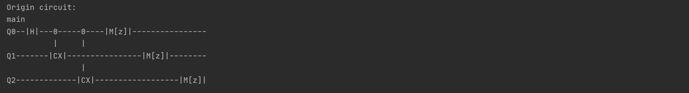
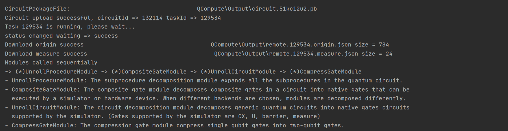
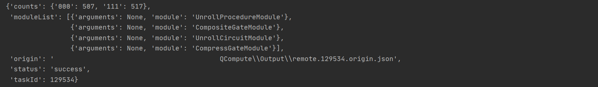

# OutputFormatControl

本教程主要说明量易伏 QCompute SDK 的输出内容及其输出格式的调节方法。

## 1.1 commit 指令

在量易伏中，您可以使用 commit 指令向本地模拟器、云端模拟器或量子真机提交量子计算任务并获取结果。

```
commit(shots: int, fetchMeasure=True, downloadResult=True, notes=None)
```
> **shots**：执行量子电路并获取结果的次数。
> 
> **fetchMeasure**：默认值为 True，输出计算结果的 counts 值；设置为 False 时，则仅输出计算结果的路径而不输出 counts 值。
> 
> **downloadMeasure**：默认值为 True，表示从服务器下载计算结果文件；设置为 False 时，则仅返回任务状态，不从服务器获取结果。
> 
> **notes**：默认值为空，用于为量子计算添加备注，不超过160个汉字或字母，在 [Quantum-hub](https://quantum-hub.baidu.com/) 的查看任务页可查看任务备注。

## 1.2 输出内容

运行 Level_1/GHZ_Cloud.py 时产生输出的主要内容分为三个部分：电路绘图，过程信息，计算结果。

### 1.2.1 电路绘图



电路绘图默认为开启状态，如需关闭，可以使用如下语句：

```
from QCompute.Define import Settings
Settings.drawCircuitControl = []
```

在模拟器计算每个量子任务之前，系统自动调用四个必选模块 UnrollProcedureModule，CompositeGateModule，UnrollCircuitModule 和 CompressGateModule 进行预处理。电路绘图功能不仅绘制原始电路（Origin circuit），还将绘制每个模块的输出电路。您可以将 Level_1/GHZ_Cloud.py 中的

```
env.backend(BackendName.CloudBaiduSim2Water)
```

替换为

```
env.backend(BackendName.LocalBaiduSim2)
```

再次运行，得到原始电路和必选模块输出电路。使用本地模拟器和云端模拟器的电路绘制差异原因在于：当任务使用云端模拟器时，其模块操作在云端完成，因此 SDK 本地没有绘制模块输出的电路；当选用本地模拟器 LocalBaiduSim2 时，模块操作在本地完成，因此绘制出每一步模块输出的电路图。

### 1.2.2 过程信息



过程信息默认为开启状态，如需关闭，可以使用如下语句：

```
from QCompute.Define import Settings
Settings.outputInfo = False
```

过程信息中包含了模块信息，用以说明各模块的调用顺序和各自的作用。

### 1.2.3 计算结果



> **counts**：计算结果
> 
> **modulelist**：被调用的模块列表
> 
> **origin**：原始计算结果文件的路径
> 
> **status**： 任务状态
> 
> **taskId**：任务 ID，对于运行于云端模拟器或 QPU 的任务，可以根据任务号在 [Quantum-hub](https://quantum-hub.baidu.com/) 的查看任务页查看运行历史和电路。

## 1.3 格式转换

量易伏默认输出结果的格式为二进制，大端输出。大端输出即按照量子寄存器 Q[n],...,Q[1], Q[0] 的顺序进行结果输出。您可以使用格式转换工具调节输出样式。

```
formatReverseMeasure(counts: Dict, cRegCount: int, reverse: bool, mFormat)
```
> **counts**：计算结果
> 
> **cRegCount**：输出位数
> 
> **reverse**：False 则大端输出，True 则小端输出
>
> **mFormat**：目标的输出进制，可选二进制，十进制和十六进制

```
from QCompute import *
from QCompute.Define import MeasureFormat
from QCompute.QPlatform.Processor.PostProcessor import formatReverseMeasure
from QCompute.Define import Settings
Settings.outputInfo = False

env = QEnv()
env.backend(BackendName.LocalBaiduSim2)

q = env.Q.createList(3)

X(q[0])
CX(q[0], q[1])
MeasureZ(*env.Q.toListPair())

# 获取计算结果并转换
binResult = env.commit(1024, fetchMeasure=True)['counts']
decResult = formatReverseMeasure(binResult, 3, reverse=False, mFormat=MeasureFormat.Dec)
hexResult = formatReverseMeasure(binResult, 3, reverse=False, mFormat=MeasureFormat.Hex)
binResult_re = formatReverseMeasure(binResult, 3, reverse=True, mFormat=MeasureFormat.Bin)
decResult_re = formatReverseMeasure(binResult, 3, reverse=True, mFormat=MeasureFormat.Dec)
hexResult_re = formatReverseMeasure(binResult, 3, reverse=True, mFormat=MeasureFormat.Hex)

# 输出原始计算结果
print(binResult)

# 以十进制输出结果，大端输出
print(decResult)

# 以十六进制输出结果，大端输出
print(hexResult)

# 以二进制输出结果，小端输出
print(binResult_re)

# 以十进制输出结果，小端输出
print(decResult_re)

# 以十六进制输出结果，小端输出
print(hexResult_re)
```

## 1.4 文件落盘

### autoClearOutputDirAfterFetchMeasure

在 `commit` 之前使用如下语句可以清空量子电路运行产生的中间文件或结果文件：

```
Settings.autoClearOutputDirAfterFetchMeasure = True
```

### cloudTaskDoNotWriteFile

在 `commit` 之前使用如下语句将不生成量子电路运行产生的中间文件或结果文件：

```
Settings.cloudTaskDoNotWriteFile = True
```
