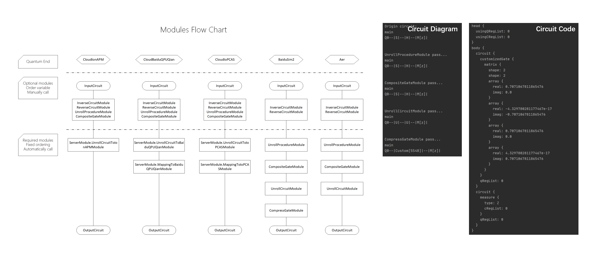

# OpenModule

OpenModule is used to increase the efficiency of building quantum circuits, or to preprocess quantum circuits as necessary before performing tasks. This tutorial describes the functions of OpenModule and how to use it. To make it brief, this tutorial only introduces the basic usage of OpenModule. Advanced usage may refer to [User Guide](https://github.com/baidu/QCompute/blob/master/DocRelease/) or [API documentation](https://quantum-hub.baidu.com/docs/qcompute/).

The OpenModule consists of optional modules and required modules. Optional modules contain various tools that can be used to quickly build inverse circuits and reverse circuits. Optional modules are called by you, and the calling order is not limited. The required module is used to ensure that the quantum terminal can successfully identify and process circuit tasks. The required module varies with different quantum terminal types. **The required modules will be automatically called by the system. You can turn off the required modules or DIY corresponding functions, but this may cause the circuit to fail to run.**

For details about how to use the QPU modules, see the Example code in Example/Level_1.

Run the following code and you will get some of the circuit diagrams and circuit codes that are output to the console.

```
import sys
sys.path.append('../..')
from QCompute import *

# Create a quantum environment env and initialize the 1-qubits circuit
env = QEnv()
env.backend(BackendName.LocalBaiduSim2)
q = env.Q.createList(1)

# Apply gates
S(q[0])
H(q[0])
MeasureZ(*env.Q.toListPair())

# Output circuit code
env.publish()
print(env.program)
```



The circuit code you see might be a little different from what you might expect, as a result of processing the required modules UnrollCircuitModule and CompressGateModule that are automatically called by LocalBaiduSim2. You can use the following code to disable the required modules UnrollCircuitModule and CompressGateModule for a more intuitive view of the circuit code.

```
env.module(UnrollCircuitModule({'disable': True}))
env.module(CompressGateModule({'disable': True}))
```

## Optional Modules

### InverseCircuitModule

InverseCircuitModule is used to generate an inverse circuit. It should be noted that measurement is the last operation of each quantum register, and each quantum register is measured at most once.


```
import sys
sys.path.append('../..')
from QCompute import *

# Create a quantum environment env and initialize the 1-qubits circuit
env = QEnv()
env.backend(BackendName.LocalBaiduSim2)
q = env.Q.createList(1)

# Apply gates
MeasureZ(*env.Q.toListPair())
H(q[0])
S(q[0])

# Call InverseCircuitModule
env.module(InverseCircuitModule())

# Disable circuit drawing
# Disable UnrollCircuitModule and CompressGateModule
from QCompute.Define import Settings
Settings.drawCircuitControl = []
env.module(UnrollCircuitModule({'disable': True}))
env.module(CompressGateModule({'disable': True}))

# Output circuit code
env.publish()
print(env.program)
```

### ReverseCircuitModule

ReverseCircuitModule is used to generate reverse circuits. It should be noted that measurement is the last operation of each quantum register, and each quantum register is measured at most once.


```
import sys
sys.path.append('../..')
from QCompute import *

# Create a quantum environment env and initialize the 1-qubits circuit
env = QEnv()
env.backend(BackendName.LocalBaiduSim2)
q = env.Q.createList(1)

# Apply gates
MeasureZ(*env.Q.toListPair())
H(q[0])
S(q[0])

# Call ReverseCircuitModule
env.module(ReverseCircuitModule())

# Disable circuit drawing
# Disable UnrollCircuitModule and CompressGateModule
from QCompute.Define import Settings
Settings.drawCircuitControl = []
env.module(UnrollCircuitModule({'disable': True}))
env.module(CompressGateModule({'disable': True}))

# Output circuit code
env.publish()
print(env.program)
```

## Required Modules

### UnrollProcedureModule

UnrollProcedureModule works with the quantum subroutine, expanding the quantum subroutine inline into the main program. Subroutines function plays the role of function in Quantum Leaf, and making good use of subroutines function will make your quantum programming more efficiency. 

> **Parameters**
>
> - disable
>
> env.module(UnrollProcedureModule({'disable': True})), disable UnrollProcedureModule, all subroutines remain in the output circuit without being expanded, which may cause the circuit to fail to run.
>
> env.module(UnrollProcedureModule({'disable': False}))，able UnrollProcedureModule, all subroutines are expanded into corresponding quantum gates.

#### Define Subroutines

As shown in the sample code below, first create the quantum environment `procedure1Env`. Second, apply the quantum gate RX on `procedure1env.q[0]` and set the angle parameter as `procedure1env.parameter[0]`. The subroutine `procedure0` is then applied on `procedure1env.q[1]` and `procedure1env.q[0]`. Finally, generate a subroutine named `procedure1` and added to the quantum environment `env` of the main program by the `convertToProcedure` tool.

```
procedure1Env = QEnv()
RX(procedure1Env.Parameter[0])(procedure1Env.Q[0])
procedure0()(procedure1Env.Q[1], procedure1Env.Q[0])
procedure1 = procedure1Env.convertToProcedure('procedure1', env)
```

#### Subroutines Convertors

QCompute SDK provides convertors for quickly generating subroutine inverse circuits and reverse circuits. As shown below, an inverse circuit `Procedure2__inversed` and an reverse circuit `procedure2__reversed` are generated based on the subroutine `procedure2`. 

```
procedure2__inversed, _ = env.inverseProcedure('procedure2')
procedure2__reversed, _ = env.reverseProcedure('procedure2')
```

#### Call Subroutines

Use simple statements to call subroutines as follows. In order to distinguish the boundary of the subroutine , add some `Barrier` gates between the called subroutines. You can refer to the running result of `3_UnrollProcedureModule.py` for further details.

```
procedure0()(q[0], q[1])
Barrier(*q)
procedure1(6.4)(q[1], q[2])
Barrier(*q)
procedure2()(q[0], q[1])
Barrier(*q)
procedure2__inversed()(q[0], q[1])
Barrier(*q)
procedure2__reversed()(q[0], q[1])
Barrier(*q)
```

### UnrollCircuitModule

UnrollCircuitModule is used to expand quantum circuits. By default, expands all gates to U and CX gates, so that it is suitable for Sim2 simulators that only support U and CX gates.

> **Support Gates**
>
> Fixed gates: ID, X, Y, Z, H, S, SDG, T, TDG, CX, CY, CZ, CH, SWAP, CCX, CSWAP
>
> Rotation gates: U, RX, RY, RZ, CU, CRX, CRY, CRZ
>
>**Parameters**
>
> - disable
>
> env.module(UnrollCircuitModule({'disable': True})), disable UnrollCircuitModule, all gates remain in the output circuit without being expanded, which may cause the circuit to fail to run.
>
> env.module(UnrollCircuitModule({'disable': False}))，able UnrollCircuitModule, all gates are expanded into U and CX gates.
>
> - errorOnUnsupported
>
> env.module(UnrollCircuitModule({'errorOnUnsupported': True})), an error will be raise when the gate cannot be processed;
>
> env.module(UnrollCircuitModule({'errorOnUnsupported': False})), ignore unsupported gates, unsupported gates won't be expanded and remain in the output circuit.
>
> - targetGates
>
> A list of gates (U and CX by default) supported by the target simulator/QPU that will not be expanded and remain in the output circuit, including at least U and CX gates. Such as:
>
> env.module(UnrollCircuitModule({'targetGates': ['U', 'CX', 'S']})), U, CX and S gates will not be expanded and remain in the output circuit.
>
> - sourceGates
>
> Specifies a list of decomposed gates (default is all gates in the circuit). Only the specified gates will be decomposed, the other gates will not be expanded and remain in the circuit. Such as:
>
> env.module(UnrollCircuitModule({'sourceGates': ['S']})), S gate will be expanded, other gates will not be expanded and remain in the output circuit.

### CompressGateModule

CompressGateModule compresses quantum circuits. Input any quantum circuit and output the compressed quantum circuit, which reduces the number of gates in the circuit.

> **Parameters**
>
> - disable
>
> env.module(CompressGateModule({'disable': True})), disable CompressGateModule, quantum circuits won't be compress;
>
> env.module(CompressGateModule({'disable': False})), able CompressGateModule, the quantum circuit will be compressed, and the number of gates will be reduced.
