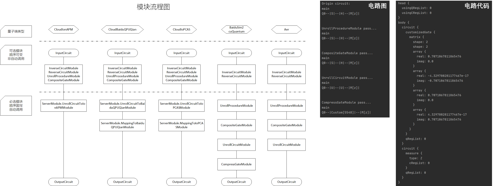

# OpenModule

OpenModule 用于提高构建量子电路的效率，或者在执行任务之前对量子电路进行必要的预处理。本教程主要说明 OpenModule 的功能及其使用方法，为避免本教程过于冗长，这里仅介绍 OpenModule 的基本用法，进阶用法可参考[《量易伏用户手册》](https://github.com/baidu/QCompute/blob/master/DocRelease/)，或者[量易伏在线 API 文档](https://quantum-hub.baidu.com/docs/qcompute/)。

OpenModule 分为可选模块和必选模块。可选模块包含各类工具，它们可以用于快速构建逆电路，反电路。可选模块由您自行调用，调用顺序不作限制。必选模块用于保证量子端能成功识别和处理电路任务，不同的量子端类型，其必选模块存在差异。**必选模块将由系统自动调用，您可以关闭必选模块或 DIY 相应功能，但这可能导致电路无法运行。**

真机相关模块的使用请参照 Example/Level_1 的真机使用示例代码。

运行如下代码，您将得到一些输出于控制台的电路图和电路代码。

```
import sys
sys.path.append('../..')
from QCompute import *

# 创建量子环境 env，并初始化量子比特数为1
env = QEnv()
env.backend(BackendName.LocalBaiduSim2)
q = env.Q.createList(1)

# 添加量子门
S(q[0])
H(q[0])
MeasureZ(*env.Q.toListPair())

# 输出电路代码
env.publish()
print(env.program)
```



您所见到的电路代码可能和您的预期有一些差别，这是量子端 LocalBaiduSim2 自动调用的必选模块 UnrollCircuitModule 和 CompressGateModule 的处理结果。您可以使用如下代码关闭必选模块 UnrollCircuitModule 和 CompressGateModule，以更加直观地查看电路代码。

```
env.module(UnrollCircuitModule({'disable': True}))
env.module(CompressGateModule({'disable': True}))
```

## 可选模块

### InverseCircuitModule

InverseCircuitModule 用于生成逆电路。需注意，测量为每个量子寄存器的最后一个操作，且每个量子寄存器至多进行一次测量。


```
import sys
sys.path.append('../..')
from QCompute import *

# 创建量子环境 env，并初始化量子比特数为1
env = QEnv()
env.backend(BackendName.LocalBaiduSim2)
q = env.Q.createList(1)

# 添加量子门
MeasureZ(*env.Q.toListPair())
H(q[0])
S(q[0])

# 调用 InverseCircuitModule
env.module(InverseCircuitModule())

# 关闭控制台绘制电路
# 关闭 UnrollCircuitModule 和 CompressGateModule
from QCompute.Define import Settings
Settings.drawCircuitControl = []
env.module(UnrollCircuitModule({'disable': True}))
env.module(CompressGateModule({'disable': True}))

# 输出电路代码
env.publish()
print(env.program)
```

### ReverseCircuitModule

ReverseCircuitModule 用于生成反电路。需注意，测量为每个量子寄存器的最后一个操作，且每个量子寄存器至多进行一次测量。


```
import sys
sys.path.append('../..')
from QCompute import *

# 创建量子环境 env，并初始化量子比特数为1
env = QEnv()
env.backend(BackendName.LocalBaiduSim2)
q = env.Q.createList(1)

# 添加量子门
MeasureZ(*env.Q.toListPair())
H(q[0])
S(q[0])

# 调用 ReverseCircuitModule
env.module(ReverseCircuitModule())

# 关闭控制台绘制电路
# 关闭 UnrollCircuitModule 和 CompressGateModule
from QCompute.Define import Settings
Settings.drawCircuitControl = []
env.module(UnrollCircuitModule({'disable': True}))
env.module(CompressGateModule({'disable': True}))

# 输出电路代码
env.publish()
print(env.program)
```

## 必选模块

### UnrollProcedureModule

UnrollProcedureModule 与量子子程序配套使用，将量子子程序内联展开到主程序中。子程序（Subroutines）功能在量易伏中扮演函数的角色，善用子程序功能将使您的量子编程更加得心应手。

> **参数说明**
>
> - disable
>
> env.module(UnrollProcedureModule({'disable': True}))，关闭 UnrollProcedureModule，所有子程序不被展开而保留在输出电路中，这可能导致电路无法运行；
>
> env.module(UnrollProcedureModule({'disable': False}))，开启 UnrollProcedureModule，所有子程序被展开为对应的量子门。

#### 声明子程序

如下示例代码所示，首先创建量子环境 `procedure1Env`。其次，添加量子门 RX，设置角参数为 `procedure1Env.Parameter[0]`，作用在 `procedure1Env.Q[0]` 上。然后调用子程序 `procedure0`，作用在 `procedure1Env.Q[1]` 和 `procedure1Env.Q[0]` 上。最后使用 `convertToProcedure` 工具生成子程序，命名为 `procedure1` 并添加到主程序的量子环境 `env` 中。

```
procedure1Env = QEnv()
RX(procedure1Env.Parameter[0])(procedure1Env.Q[0])
procedure0()(procedure1Env.Q[1], procedure1Env.Q[0])
procedure1 = procedure1Env.convertToProcedure('procedure1', env)
```

#### 子程序转换工具

QCompute SDK 提供快捷生成子程序逆电路和反电路的工具。如下所示，基于子程序 `procedure2` 生成他的逆电路 `procedure2__inversed` 和反电路 `procedure2__reversed`。

```
procedure2__inversed, _ = env.inverseProcedure('procedure2')
procedure2__reversed, _ = env.reverseProcedure('procedure2')
```

#### 调用子程序

如下使用简单的语句即可调用子程序，为区分子程序的边界，方便查看，在被调用的子程序之间添加 Barrier，您可参照 3_UnrollProcedureModule.py 的运行结果进一步体会。

```
procedure0()(q[0], q[1])
Barrier(*q)
procedure1(6.4)(q[1], q[2])
Barrier(*q)
procedure2()(q[0], q[1])
Barrier(*q)
procedure2__inversed()(q[0], q[1])
Barrier(*q)
procedure2__reversed()(q[0], q[1])
Barrier(*q)
```

### UnrollCircuitModule

UnrollCircuitModule 用于展开量子电路，默认展开所有门为 U 和 CX 门，使其适配仅支持 U 和 CX 门的 Sim2 模拟器。

> **支持的门**
>
> 固定门：ID, X, Y, Z, H, S, SDG, T, TDG, CX, CY, CZ, CH, SWAP, CCX, CSWAP
>
> 旋转门：U, RX, RY, RZ, CU, CRX, CRY, CRZ
>
>**参数说明**
>
> - disable
>
> env.module(UnrollCircuitModule({'disable': True}))，关闭 UnrollCircuitModule，所有门不被展开而保留在输出电路中，这可能导致电路无法运行；
>
> env.module(UnrollCircuitModule({'disable': False}))，开启 UnrollCircuitModule，所有门被展开为 U 和 CX 门。
>
> - errorOnUnsupported
>
> env.module(UnrollCircuitModule({'errorOnUnsupported': True}))，遇到不能处理的门会报错；
>
> env.module(UnrollCircuitModule({'errorOnUnsupported': False}))，忽略不支持的门，不支持的门不被展开而保留在输出电路中。
>
> - targetGates
>
> 目标模拟器 / 真机支持的门列表（默认为 U 和 CX），这些门不会被展开而保留在输出电路中，至少包括 U 和 CX 门。如：
>
> env.module(UnrollCircuitModule({'targetGates': ['U', 'CX', 'S']}))，电路中的 U、CX 和 S 门不会被展开而保留在输出电路中。
>
> - sourceGates
>
> 指定分解的门列表（默认为电路中所有门），只有被指定的门会被分解，其他门不会被展开而保留在电路中。如：
>
> env.module(UnrollCircuitModule({'sourceGates': ['S']}))，电路中的 S 门会被展开，其他门不会被展开而保留在输出电路中。

### CompressGateModule

CompressGateModule 用于压缩量子电路，输入任意量子电路，输出压缩后的量子电路，压缩后电路中的门个数会减少。

> **参数说明**
>
> - disable
>
> env.module(CompressGateModule({'disable': True}))，关闭 CompressGateModule，量子电路不会被压缩；
>
> env.module(CompressGateModule({'disable': False}))，开启 CompressGateModule，量子电路被压缩，输出电路中门的个数会减少。
