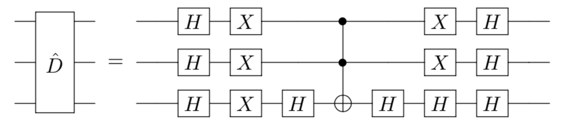

# Grover's Search Algorithm

A salesman wants to promote sales of a newly designed quantum computer by travelling among $n$ cities (New York $\rightarrow$ Shanghai $\rightarrow ...$) and finally travels back to where he starts. He really needs to find the shortest possible route to save his time. This is known as the [Travelling Salesman Porblem (TSP)](https://en.wikipedia.org/wiki/Travelling_salesman_problem) and in its essence an **unstructured** searching problem. Mathematically, this type of problem can be formulated as:
>In an unstructured search problem, given a set of $N$ elements forming a set $S = \{|0\rangle, |1\rangle, \cdots, |N-1\rangle \}$ and a function $f : S \rightarrow \{0, 1\}$, the goal is to find the **only** element $|x^*\rangle$ in $S$ such that $f(|x^∗\rangle) = 1$ and otherwise $f(|x\rangle) = 0$.

By describing the searching problem as unstructured, we mean that no prior knowledge about the contents of the database (searching space) and how it can be sorted is given. With classical methods, we cannot do better than performing a linear number of queries $\mathcal{O}(N)$ to find the target solution. In the worst case, we need to search throughout the whole datebase. This happens when the element we want locates at the very end of database.

However, there exists a quantum searching algorithm named after *Lov Grover* in 1996 that can help us achieve a quadratic speed-up where $\mathcal{O}{(\sqrt{N})}$ queries are needed. For a list of $10^6$ elements, you only have to search a few thousand times. This Grover's algorithm contains three subroutines and here's how it works.

---
## Algorithm
Let's take an easier example to illustrate the algorithm. Suppose we are given a list $S = \{ |0\rangle,\cdots, |6\rangle\}$, and our target is located close to the last index $|x^*\rangle = |5\rangle$. 

- **Preprocessing**

  In order to work on a quantum computer, we first need to fill the searching space up to $2^n$ elements $S = \{ |0\rangle,\cdots, |7\rangle\}$ (it doesn't matter what garbage information one throw into the last element $|7\rangle$, as long as the oracle can recognize whether it is correct). In our case, $n=3$ and it is the qubit number we need to register. Then, we have to convert the decimal index into binary form $S = \{ |000\rangle,\cdots, |111\rangle\}$. It is very easy to initialize qubits in our simulator:

  ```python
  # In this example we use 3 qubits in total
  qubit_num = 3
  # and set the shot number for each request
  shots = 1000
  
  
  def main():
      """
      main
      """
      # Create environment
      env = QEnv()
      # Choose backend Baidu Local Quantum Simulator-Sim2
      env.backend(BackendName.LocalBaiduSim2)
  
      # Initialize the three-qubit circuit
      q = env.Q.createList(qubit_num)
  ```
  
- **Superposition $H$**

  After setting up the problem, we apply a layer of Hadamard gates to the initialized states to prepare a uniform superposition state. The resulting superposition state $|\psi \rangle$ is:
  $$
  |\psi\rangle = (H|0\rangle)^{\otimes n}= \frac{1}{\sqrt{2}}(|0\rangle + |1\rangle)\otimes \cdots \otimes \frac{1}{\sqrt{2}}(|0\rangle + |1\rangle)= \frac{1}{\sqrt{N}}\sum_{x=0}^{N-1} |x\rangle
  $$
  In our case, $n=3$ and the demension of the searching space is $N = 2^3 = 8$. Explicitly,
  $$
  |\psi\rangle = \frac{1}{\sqrt{8}}\bigg(|000\rangle + \cdots +|111\rangle \bigg) \rightarrow_{decimal} \frac{1}{\sqrt{8}}\bigg(|0 \rangle + \cdots +|7\rangle \bigg) = \frac{1}{\sqrt{8}}\sum_{x=0}^{7} |x \rangle 
  = \frac{1}{\sqrt{8}}
  \begin{pmatrix}
  1 \\
  1 \\
  \vdots\\
  1
  \end{pmatrix}_{8\times 1}
  $$
  The circuit model is included:
  

  In our simulator, Hadamard gates are provided as following:
  ```python
    # The first step of Grover's search algorithm, superposition
    H(q[0])
    H(q[1])
    H(q[2])
  ```

- **Oracle $\hat{O}$**

  Once we get superposition, we can implement an oracle $\hat{O}$ (or a quantum black box) that marks the target state. **NOTE:** The oracle can recognize whether the state is desired or not, but this doesn't necessarily require the knowledge about what the solution is exactly. Here, we provide the phase flip oracle that inverts the state amplitude and **doesn't require any ancilla qubits**.
  $$
  \hat{O} |x\rangle = (-1)^{f(x)} |x\rangle, \quad \text{given}    \,
      f(x) = \bigg\{\begin{array}{lr}
          1, & \text{for } x =x^* \\
          0, & \text{otherwise} 
          \end{array}
  $$
  Apply the oracle and we get,
  $$
  \hat{O} |\psi\rangle = \frac{1}{\sqrt{8}}\bigg(|0 \rangle + \cdots - |5 \rangle + |6 \rangle +|7\rangle \bigg) = |\phi \rangle
  = \frac{1}{\sqrt{8}}
  \begin{pmatrix}
  1 \\
  1 \\
  \vdots\\
  -1 \\
  1\\
  1
  \end{pmatrix}_{8\times 1}
  $$
  We will talk more about this `black magic` later. Here is the circuit representation of phase oracle $\hat{O}$:

  


  ```python
      # Enter the first Grover iteration, the oracle Uf for |101>
      X(q[1])
      H(q[2])
      CCX(q[0], q[1], q[2])
      X(q[1])
      H(q[2])
  ```

- **Amplitude purification**

  Next, we implement an amplification circuit that further increases the target state's amplitude while decreasing the amplitude of all other states. This circuit is often referred as the **Diffusion Operator** $\hat{D}$. This operator calculates the mean of probability amplitude $\mu$ of all states and inverts the probability amplitudes around this mean which eventually amplifies the probability amplitude of the target state. In our case, $n=3$
  $$
  \hat{D} = 2*|\psi\rangle\langle \psi| -I^{\otimes n} = 2*H^{\otimes n}|0^{\otimes n} \rangle\langle 0^{\otimes n}|H^{\otimes n} -I^{\otimes n} = \frac{1}{4}
  \begin{pmatrix}
  -3 &1 \cdots &1 \\
  1 &-3  &1 \\
  \vdots &\vdots &\vdots\\
  1 &1 \cdots &-3 
  \end{pmatrix}_{8\times 8}
  $$
  Apply the diffusion gate, we will get
  $$
  \hat{D} |\phi\rangle 
  = \frac{1}{4}
  \begin{pmatrix}
  -3 &1 \cdots &1 \\
  1 &-3  &1 \\
  \vdots &\vdots &\vdots\\
  1 &1 \cdots &-3 
  \end{pmatrix}*
  \frac{1}{\sqrt{8}}
  \begin{pmatrix}
  1 \\
  1 \\
  \vdots\\
  -1 \\
  1\\
  1
  \end{pmatrix}
  =  \frac{1}{4\sqrt{2}}
  \begin{pmatrix}
  1 \\
  1 \\
  \vdots\\
  5 \\
  1\\
  1
  \end{pmatrix}
  $$
  This vector indicates the probability of finding each index. For example, the probability of getting $|101\rangle$ is $|\frac{5}{4\sqrt{2}}|^2 = 78.125\%$ which is much higher than the rest $|\frac{1}{4\sqrt{2}}|^2 = 3.125\%$. People usually combine the oracle and the diffusion operator together as an **Grover iteration** $\hat{G}$.
  $$
  \hat{G} = \hat{D}*\hat{O}
  $$
  Now, if we apply the Grover iteration again, we get
  $$
  \hat{G}^2 |\psi\rangle = 
  \frac{1}{8\sqrt{2}}
  \begin{pmatrix}
  -1 \\
  -1 \\
  \vdots\\
  11 \\
  -1\\
  -1
  \end{pmatrix}
  $$
  Then, we reach $94.53\%$ probability for finding the target state $|x^*\rangle = |101\rangle$. The circuit model for diffusion $\hat{D}$ can be implemented as:
  

- **Overall**
The Grover's search algorithm is concluded in the following pipeline. We denote the Grover iteration with dashed box and repeat this block $\mathcal{O}(\sqrt{N})$ times.


---
## Comments on Oracle

As you may realize, there is no free lunch and it is the same for Grover's algorithm. The quadratic speed-up passes on difficutly to constructing the orcale. Let's come back to the TSP and you would find there is no easy way to construct the oracle. This task itself may require $\mathcal{O}(\sqrt{N})$ queries to complete.

---
## Code and results

We include the complete code for the 3-qubit example we discussed above.
```python
import sys
sys.path.append('../../..')  # "from QCompute import *" requires this
from QCompute import *

matchSdkVersion('Python 2.0.6')

# In this example we use 3 qubits in total
qubit_num = 3
# and set the shot number for each request
shots = 1000

def main():
    """
    main
    """
    # Create environment
    env = QEnv()
    # Choose backend Baidu Local Quantum Simulator-Sim2
    env.backend(BackendName.LocalBaiduSim2)

     # Initialize the three-qubit circuit
    q = env.Q.createList(qubit_num)

    # The first step of Grover's search algorithm, superposition
    H(q[0])
    H(q[1])
    H(q[2])

    # Enter the first Grover iteration, the oracle Uf for |101>
    X(q[1])
    H(q[2])
    CCX(q[0], q[1], q[2])
    X(q[1])
    H(q[2])

    # The first layer of Hadamard gates in the first Grover iteration
    H(q[0])
    H(q[1])
    H(q[2])
    
    # The reflection gate 2|0><0| - I in the first Grover iteration, which is divided to three parts:
    # two layer of X gates and a decomposition for the gate CCZ between the above two
    X(q[0])
    X(q[1])
    X(q[2])

    H(q[2])
    CCX(q[0], q[1], q[2])
    H(q[2])

    X(q[0])
    X(q[1])
    X(q[2])
    
    # The second layer of Hadamard gates in the first Grover iteration
    H(q[0])
    H(q[1])
    H(q[2])

    # Measure with the computational basis;
    # if the user you want to increase the number of Grover iteration,
    # please repeat the code from the comment “Enter the first Grover iteration” to here,
    # and then measure
    MeasureZ(*env.Q.toListPair())
    taskResult = env.commit(shots, fetchMeasure=True)
    return taskResult['counts']


if __name__ == '__main__':
    main()
```

And the measurement results are

```python
Shots 1000
Data {'101': 798, '100': 31, '110': 30, '001': 24, '111': 36, '010': 30, '011': 23, '000': 28}
```

If we apply the Grover's iteration again, the results become:

```python
Shots 1000
Data {'101': 795, '010': 28, '100': 28, '000': 36, '110': 28, '001': 29, '111': 28, '011': 28}
```
**Note:** The returned results are in binary.

---
## Reference
[Grover L.K.: A fast quantum mechanical algorithm for database search, Proceedings, 28th Annual ACM Symposium on the Theory of Computing, (May 1996) p. 212](https://dl.acm.org/doi/abs/10.1145/237814.237866)