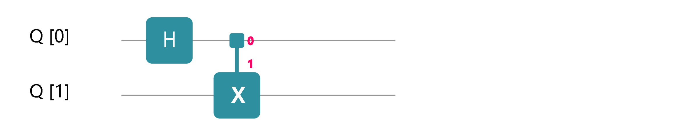
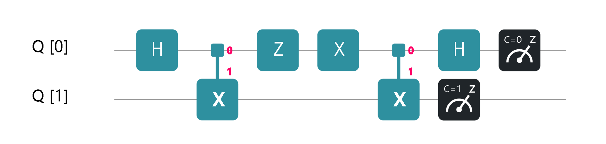

# Superdense Coding

Superdense Coding, invented by *Bennett & Wiesner* in 1992,  is a quantum communication protocol that uses a single quantum bit to transmit two-bit classical information, which cannot be achieved by classical information technology.  Suppose we have two users, Alice and Bob, and they want to use Superdense Coding to transmit information between each other. First, they need to prepare an entangled Bell state $|\Phi^+ \rangle = (|0\rangle_A \otimes|0\rangle_B + |1\rangle_A \otimes|1\rangle_B)/\sqrt{2}$ with the following quantum circuit:



One can easily prepare a Bell state by applying this circuit on initial $|0\rangle_A \otimes|0\rangle_B$ state. Assume Alice has taken the upper qubit $q_0$ while Bob has taken the lower qubit $q_1$. Bob is told that he will receive Alice's qubit soon, which would essentially encode the 2-bit classical information, from one of the messages {$00,01,10,11$}. Suppose that Alice wants to transmit $00$ to Bob, so she sends her qubit to Bob. Bob, after receiving the qubit from Alice, runs the following circuit on the Bell-pair:


Then he measured the whole system. Guess what he gets! He gets the $00$ message! That is exactly what Alice wants to send. Ok, what if Alice wants to transmit $01$ instead? All she needs to do is to implement an $Z$ gate in her qubit before mailing it to Bob. Bob will take exactly the same procedure after he received Alice's qubit. This time, he will get a $01$ instead. The flowing picture shows the whole process.


If Alice wants to send $10$, she runs a $X$ gate in her qubit before mailing it to Bob; if $11$, she runs a $Z$ gate and $X$ gate on her qubit. The process of sending $10$ and $11$ are shown in the two following pictures:




Above is the main idea of superdense coding. Now let's implement this protocol using QCompute.

```python
import sys
sys.path.append('../../..')  # "from QCompute import *" requires this
from QCompute import *

matchSdkVersion('Python 3.0.0')

# Set the shot number for each quest
shots = 1024

# The message that Alice want to send to Bob.
# The user you can modify the massage to '00', '01' or '10' as you like
message = '11'


def main():
    """
    main
    """
    # Create environment
    env = QEnv()
    # Choose backend Baidu Local Quantum Simulator-Sim2
    env.backend(BackendName.LocalBaiduSim2)
    
    # Initialize the two-qubit circuit
    q = env.Q.createList(2)
    
    # Alice and Bob share a Bell state (|00>+|11>) / sqrt(2),
    # where Alice holds q[0] and Bob holds q[1]
    H(q[0])
    CX(q[0], q[1])

    # For different messages, Alice applies different gates on q[0],
    # where she applies nothing to indicate the message '00'
    if message == '01':
        Z(q[0])
    elif message == '10':
        X(q[0])
    elif message == '11':
        # Here ZX = iY
        Z(q[0])
        X(q[0])
    
    # Alice sends her qubit q[0] to Bob,
    # and then Bob decodes the two qubits.
    # Bob needs to measure the two qubits with Bell basis,
    # or transforms the state to computational basis
    # and measures it with the computational basis
    CX(q[0], q[1])
    H(q[0])
    
    # Measure with the computational basis
    MeasureZ(*env.Q.toListPair())
    # Commit the quest
    taskResult = env.commit(shots, fetchMeasure=True)
    print(taskResult['counts'])


if __name__ == '__main__':
    main()
```

Here is the measurement result:

```python
{'11': 1024}
```

**Note:** You may change the message to '01', '10', or '00' as you wish.

---

## Reference

1. [Bennett, C.; Wiesner, S. (1992). "Communication via one- and two-particle operators on Einstein-Podolsky-Rosen states". Physical Review Letters. 69 (20): 2881–2884. ](https://journals.aps.org/prl/abstract/10.1103/PhysRevLett.69.2881)
