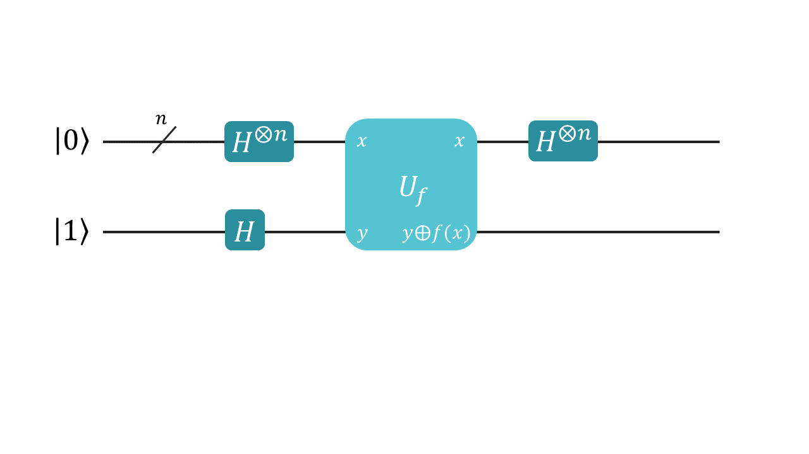

# Deutsch-Jozsa算法

Deutsch-Jozsa 算法是说明量子计算相较于经典计算优势的一个算法。

假设有一个函数 $f$，是定义在长度为 n 的所有比特串上，取值为 0 或 1 的函数，它要么恒为常数，要么是平衡的（即一半的结果是 1，另一半的结果是 0）。现在的任务是判断它是否为常数函数。虽然只要找到两个不同的函数值，就立刻可以得出否定的结果，但若要确定它是常值函数，只能检验它在所有 $2^{n-1}+1$ 个比特串上的值，少一个都不行。因此最坏情况总要做指数多的检验。但是在量子计算机上，给定一个存储 f 信息的酉变换（被称为 quantum oracle）$U_f$，只需要一步就可以验证结果。

此算法的量子电路如下：



其中初始态 $|x\rangle=|0^{\otimes n}\rangle$，$|y\rangle=|1\rangle$。$U_f$ 定义如下：
$$
\begin{aligned}
U_f:\{0,1\}^n\times\{0,1\}\rightarrow\{0,1\}^n\times\{0,1\}\\
|x\rangle \otimes |y\rangle \rightarrow |x\rangle \otimes|y\oplus f(x)\rangle\\
\end{aligned}
$$
$U_f$ 将会作用于已制备好的态：
$$
\frac{1}{\sqrt{2^{n+1}}}\sum_{x=0}^{2^n-1}|x\rangle(|0\rangle-|1\rangle)
$$
随后对前 $n$ 个 qubit 进行 $X$ 基的测量，得到结果 0 后状态：
$$
\begin{aligned}
&\bigg ( \frac{1}{\sqrt{2^{n}}}\sum_{x=0}^{2^n-1}\langle x|\otimes I\bigg )\bigg(\frac{1}{\sqrt{2^{n+1}}}\sum_{x=0}^{2^n-1}|x\rangle\big(|f(x)\rangle-|1\oplus f(x)\rangle\big)\bigg)\\
&=\bigg ( \frac{1}{\sqrt{2^{n}}}\sum_{x=0}^{2^n-1}\langle x|\otimes I\bigg )\bigg(\frac{1}{\sqrt{2^{n+1}}}\sum_{x=0}^{2^n-1}(-1)^{f(x)}|x\rangle\big(|0\rangle-|1\rangle\big)\bigg)\\
&=\frac{1}{2^n}\sum_{x=0}^{2^n-1}(-1)^{f(x)}|-\rangle
\end{aligned}
$$
测量结果只能为 0 或 1。若 $f$ 为常值函数则结果为 1，否则为 0。

若 $f$ 是常值函数，则得到的概率为 $|\frac{1}{2^n}\times 2^n|^2=1$ ，否则为 $|\frac{1}{2^n}\times\big( (-1)\times2^{n-1}+1\times2^{n-1}\big)|^2=0$。

下面我们利用量易伏平台来验证两个简单的例子：$f_1=0$，$f_2(x) = x$ 的第一位。

```python{.line-numbers, highlight=7}
"""
Deutsch-Jozsa Algorithm.
"""

from QCompute import *

matchSdkVersion('Python 3.0.0')

# In this example we use 10 qubits as the main register,
# and also an ancillary qubit else
MainReg_num = 10


def main():
    """
    main
    """
    # Create two environment separately, and choose backend
    # We will execute D-J algorithm for f1 and f2 simultaneously
    env1 = QEnv()
    env1.backend(BackendName.LocalBaiduSim2)
    env2 = QEnv()
    env2.backend(BackendName.LocalBaiduSim2)
    
    # Initialize two registers on 11 qubits respectively,
    # where the last qubit in each register refers to the ancillary qubit,
    # and q1 and q2 correspond to f1 and f2 respectively.
    q1 = env1.Q.createList(MainReg_num + 1)
    q2 = env2.Q.createList(MainReg_num + 1)
    
    # As a preparation for D-J algorithm, we flip the ancillary qubit from |0> to |1>
    X(q1[MainReg_num])
    X(q2[MainReg_num])
    
    # In D-J algorithm, we apply a Hadamard gate on each qubit
    # in main register and the ancillary qubit
    for i in range(MainReg_num + 1):
        H(q1[i])
        H(q2[i])
        
    # Then apply U_f:
    # for f1 = 0, we need to do nothing on q1;
    # for f2 = the value of first qubit,so if f2 = 0 do nothing,
    # else to flip the ancillary qubit in q2, which is exactly a CX gate
    CX(q2[0], q2[MainReg_num])
    
    # Then we apply a Hadamard gate on each qubit in main register again
    for i in range(MainReg_num):
        H(q1[i])
        H(q2[i])
        
    # Measure the main registers with the computational basis
    MeasureZ(q1[:-1], range(MainReg_num))
    MeasureZ(q2[:-1], range(MainReg_num))
    # Commit the quest, where we need only 1 shot to distinguish that
    # f1 is constant for the measurement result |0>,
    # and f2 is balanced for the measurement result unequal to |0>
    env1.commit(shots=1, downloadResult=False)
    env2.commit(shots=1, downloadResult=False)


if __name__ == '__main__':
    main()
```

得到的结果如下：（最高位即 $y$，可能出现 0 或 1）
```python
Result {'0000000000': 1}
Outcome |0>^n|y> appears, so the function is constant.
Result {'0000000001': 1}
Outcome other than |0>^n|y> appears, so the function is balanced.
```
---
## 参考文献
[David Deutsch and Richard Jozsa (1992). "Rapid solutions of problems by quantum computation". Proceedings of the Royal Society of London A. 439 (1907): 553–558.](https://royalsocietypublishing.org/doi/abs/10.1098/rspa.1992.0167)