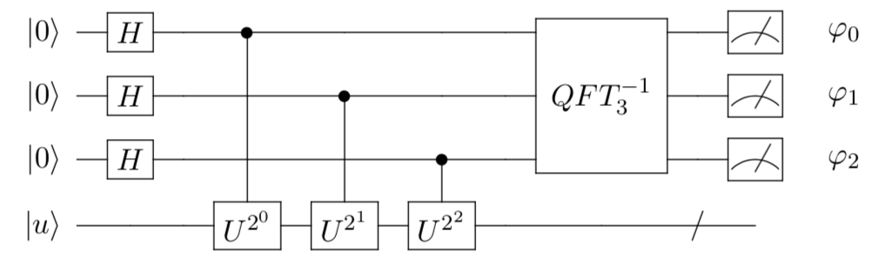

# Quantum Phase Estimation (QPE)

Quantum phase estimation plays an important role as a subroutine in many quantum programs and lays the foundation for the famous Shor's algorithm. The task is usually formulated as:
>Given a unitary operator $U$ and its eigenvector $|u\rangle$, find the associated eigenvalue such that $U|u\rangle = e^{2\pi i\varphi} |u\rangle$ ( phase $\varphi$ unknown ). Since $U$ is unitary, we can say that $0\leq\varphi<1$.

---

## Algorithm

To illustrate how phase estimation works, consider an example. Suppose
$$
U = 
\begin{bmatrix}
1 &0 \\
0 & e^{2i\pi/5}
\end{bmatrix}
$$
with eigenvector $|u\rangle = |1\rangle$. Thus, the phase we want to estimate is $\varphi = 1/5$ since $U|1\rangle = e^{2\pi i\varphi} |1\rangle$. In general, the QPE algorithm can be divided into the following 4 steps:

- **Pre-processing**
  
  The phase estimation algorithm requires two registers. The first part is called counting register and it contains an $n$-qubit state all initialized to $|0\rangle$. They will estimate the unknown phase $\varphi$ in binary form. The number of $n$ depends on the accuracy we want to achieve. The second part contains $m$ qubits and we need to initialize it to the eigenstate $|u\rangle$. In our case, $m=1$ and choose $n=3$ to begin with. We would expect bad precision with only 3 counting qubits. Thus, the overall initial state after preprocessing is:
  $$|\psi_0\rangle = |0\rangle^{\otimes n} \otimes |u\rangle =|000\rangle \otimes |1\rangle$$
  We can easily do this in our simulator:

  ```python
  qubit_num = 4
  shots = 1000
  phase = 2 * np.pi / 5
  
  
  def main():
      """
      main
      """
      # Create environment
      env = QuantumEnvironment()
      # Choose backend machine
      env.backend(BackendName.LocalBaiduSim2)
  
      # Initialize qubits
      q = [env.Q[i] for i in range(qubit_num)]
  
      # Prepare eigenstate |1> = X|0> on the ancilla qubit
      X(q[3])
  ```
  
- **Superposition $H$**
  
  Next, we apply a layer of Hadamard gates to all zero-initialized **counting qubits** to prepare a uniform superposition state. The resulting superposition state $|\psi_1 \rangle$ is
  $$
  |\psi_1\rangle = (H|0\rangle)^{\otimes n} \otimes |u\rangle = \frac{1}{\sqrt{2^n}}(|0\rangle + |1\rangle)^{\otimes n} \otimes |u\rangle\,.
  $$
  In our case, $n=3$ and $|u\rangle = |1\rangle$. Hence,
  $$
  |\psi_1\rangle = \frac{1}{\sqrt{8}} (|0\rangle + |1\rangle)\otimes(|0\rangle + |1\rangle)\otimes(|0\rangle + |1\rangle) \otimes |1\rangle\,.
  $$
  In our simulator, call the Hadamard gate with

  ```python
      # Superposition
      H(q[0])
      H(q[1])
      H(q[2])
  ```
  
- **Oracle $\hat{O}$**
  
  The oracle used in phase estimation algorithm is a bunch of controlled-unitaries by setting control on $j$-th counting qubit and target $U^{2^j}$ on the ancilla qubits in eigenstate $|u\rangle$. Let's see what happens if we apply $U^{2^j}$ to eigenstate $|u\rangle$. Set $j = 2$, we get
  $$
  U^{4}|u\rangle =  U^{3}U|u\rangle = e^{2\pi i\varphi} U^{3}|u\rangle = e^{2\pi i(2^1\varphi)}U^{2}|u\rangle = \cdots = e^{2\pi i (2^2\varphi)} |u\rangle
  $$
  Then, we can see a clear recursion relation where
  $$
  U^{2^j}|u\rangle =  U^{2^j-1}U|u\rangle = U^{2^j-1}e^{2\pi i\varphi} |u\rangle = \cdots = e^{2 \pi i (2^j \varphi)} |u\rangle, \quad j\in [0, n-1]
  $$
  After that, we need to figure out what controlled-unitaries do. Consider a general quantum state vector for counting qubits,
  $$
  |\phi\rangle = \alpha|0\rangle + \beta|1\rangle
  $$
  Apply the controlled-U gate and we get
  $$
  CU|\phi\rangle \otimes  |u\rangle = \alpha|0\rangle \otimes  |u\rangle + \beta \cdot U|1\rangle \otimes  |u\rangle = \alpha|0\rangle \otimes  |u\rangle + \beta \cdot e^{2 \pi i\varphi}|1\rangle \otimes  |u\rangle
  $$
  This trick is usually called the **phase kickback**. Note that the overall effect is adding the unknown phase $\varphi$ to the control qubit by applying a unitary to target ancilla qubits. This is opposite to common sense that the control bit should remain the same. Now, we apply the oracle $\hat{O}$ ( Controlled-$U^{2^j}$) to the whole state $|\psi_1\rangle$.
  $$
  \hat{O} |\psi_1\rangle = \frac{1}{\sqrt{2^n}}(|0\rangle + e^{2\pi i (2^{n-1}\varphi)}|1\rangle) \otimes\cdots \otimes (|0\rangle + e^{2\pi i (2^{0}\varphi)}|1\rangle)  \otimes |u\rangle
  $$
  In our 3-qubit case,
  $$
  |\psi_2\rangle = \hat{O} |\psi_1\rangle =\frac{1}{\sqrt{8}}(|0\rangle + e^{2\pi i (4\varphi)}|1\rangle) \otimes(|0\rangle + e^{2\pi i (2\varphi)}|1\rangle) \otimes (|0\rangle + e^{2\pi i (1\varphi)}|1\rangle)  \otimes |1\rangle
  $$
  So far, our quantum circuit looks like:
  
   
  
  It may still seem confusing what $U^{2^j}$ means. It simply means repeating the controlled-unitary $2^j$ times.
   

  In our simulator, the controlled-U gates can be generated easily by setting a general controlled 3-parameter rotation gate, which is defined as
  $$
  R(\theta, \phi, \varphi) 
  = \begin{bmatrix}
  \cos(\frac{\theta}{2})              & -e^{i\varphi}\sin(\frac{\theta}{2})\\
  e^{i\phi}\sin(\frac{\theta}{2})  & e^{i(\phi+\varphi)} \cos(\frac{\theta}{2})
  \end{bmatrix}
  $$
  It is easy to see that this rotation gate reduces to the given unitary $U$ when $\varphi' = 2\pi/5$.
  $$
  R(0, 0, \varphi') 
  = \begin{bmatrix}
  1  &0\\
  0  & e^{i\varphi'}
  \end{bmatrix}
  $$
  Here is the code.
  
    ```python
        # Control-U gates
        CU(0, 0, phase)(q[0], q[3])
    
        CU(0, 0, phase)(q[1], q[3])
        CU(0, 0, phase)(q[1], q[3])
    
        CU(0, 0, phase)(q[2], q[3])
        CU(0, 0, phase)(q[2], q[3])
        CU(0, 0, phase)(q[2], q[3])
        CU(0, 0, phase)(q[2], q[3])
    ```
  
- **Quantum Fourier Transform (QFT)**

    We are very close to the answer at this stage but it's in **Fourier basis**. We need to get back to the familiar computational basis to read out our 3-qubit phase estimation $\hat{\varphi}$. We refer the details of QFT to another document. Before we explain what QFT does, let's introduce the notation $\varphi = 0.\varphi_0\cdots \varphi_{n-1}$ to represent the **binary fraction** $\varphi = \varphi_0/2+\cdots + \varphi_{n-1}/2^n$ and each $\varphi_i \in \{0,1\}$. In our 3-qubit case, we choose $n=3$ and the best precision we can reach for $\varphi = 1/5$ is between
$$
  \varphi_0 =0, \varphi_1 =0, \varphi_2 = 1
  \quad \Rightarrow \quad
  \hat{\varphi}_{-} = \frac{1}{2}\varphi_0 + \frac{1}{4}\varphi_1 + \frac{1}{8}\varphi_2
   = \frac{1}{8}
$$
  and
$$
  \varphi_0 =0, \varphi_1 = 1,  \varphi_2 = 0
    \quad \Rightarrow \quad
    \hat{\varphi}_{+} = \frac{1}{2}\varphi_0 + \frac{1}{4}\varphi_1 + \frac{1}{8}\varphi_2
     = \frac{1}{4}
$$
  We expect to see the probability amplitude in this range. If we want to increase the accuracy and narrow down this range, we have to increase the counting qubit number. In fact, we can always rewrite the state $|\psi_2 \rangle$ derived from last step as
$$
  |\psi_2\rangle
  =\frac{1}{\sqrt{8}}(|0\rangle + e^{2\pi i (0.\varphi_2)}|1\rangle) \otimes(|0\rangle + e^{2\pi i (0.\varphi_1\varphi_2)}|1\rangle) \otimes (|0\rangle + e^{2\pi i (0.\varphi_0\varphi_1\varphi_2)}|1\rangle)  \otimes |1\rangle
$$
  To illustrate this, consider
$$
  2^1 \varphi = 2^1* (0.\varphi_0\varphi_1\varphi_2)
    = 2*( \frac{1}{2}\varphi_0 + \frac{1}{4}\varphi_1 + \frac{1}{8}\varphi_2)
    = \varphi_0 + \frac{1}{2}\varphi_1 + \frac{1}{4}\varphi_2
    = 0.\varphi_1\varphi_2
$$
  Similarly,
$$
  2^2 \varphi = 2^2* (0.\varphi_0\varphi_1\varphi_2)
    = 4*( \frac{1}{2}\varphi_0 + \frac{1}{4}\varphi_1 + \frac{1}{8}\varphi_2)
    = 2\varphi_0 + \varphi_1 + \frac{1}{2}\varphi_2
    = 0.\varphi_2
$$
  This can be generalized to
$$
  2^j \varphi = 2^j* (0.\varphi_0\cdots\varphi_{n-1})
    = 2^j*( \frac{1}{2}\varphi_0 + \cdots + \frac{1}{2^n}\varphi_{n-1})
    = 2^{j-1}\varphi_0 + \cdots+ \frac{1}{2}\varphi_j + \cdots
    = 0.\varphi_j\cdots\varphi_{n-1}
$$
  Now, we can understand what quantum fourier transform (QFT) does! It maps an n-bit binary string in computational basis into a so-called Fourier basis:
$$
  QFT_n |\varphi_0, \cdots, \varphi_{n-1}\rangle 
    = \frac{1}{\sqrt{2^n}} (|0\rangle + e^{2\pi i (0.\varphi_{n-1})}|1\rangle) \otimes \cdots \otimes (|0\rangle + e^{2\pi i (0.\varphi_0\cdots\varphi_{n-1})}|1\rangle)
$$
  This is exactly the form of $|\psi_2\rangle$ we have seen before. Then, we can apply 3-qubit inverse fourier transform to the counting qubits of $|\psi_2 \rangle$
$$
  QFT^{-1}_3\otimes I |\psi_2 \rangle = |\varphi_0, \varphi_1, \varphi_2\rangle \otimes  |u\rangle
$$
  The matrix representation for this operation is
$$
  QFT^{-1}_{3} = \frac{1}{\sqrt{8}}
    \begin{bmatrix}
    1 &1 &1 &1 &1 &1 &1 &1\\
    1 &\sqrt{-i} &-i &-\sqrt{i} &-1 &-\sqrt{-i} &i &\sqrt{i}\\
    1 &-i &-1 &i &1 &-i &-1 &i\\
    1 &-\sqrt{i} &i &\sqrt{-i} &-1 &i &-i &-\sqrt{-i}\\
    1 &-1 &1 &-1 &1 &-1 &1 &-1\\
    1 &-\sqrt{-i} &i &\sqrt{i} &-1 &\sqrt{-i} &-i &-\sqrt{i}\\
    1 &i &-1 &-i &1 &i &-1 &-i\\
    1 &\sqrt{i} &i &-\sqrt{-i} &-1 &-\sqrt{i} &-i &\sqrt{-i}
    \end{bmatrix}
$$
  And the circuit model is constructed as
     
  Notice the equality between
$$
   R(0, 0, -\pi/4) 
    =    \begin{bmatrix}
    1  &0\\
    0  & e^{-i\frac{\pi}{4}}
    \end{bmatrix} 
    =T^\dagger
$$
  and
$$
  R(0, 0, -\pi/2) 
    =    \begin{bmatrix}
    1  &0\\
    0  & e^{-i\frac{\pi}{2}}
    \end{bmatrix} 
    =    \begin{bmatrix}
    1  &0\\
    0  & -i
    \end{bmatrix} 
    =S^\dagger
$$
  In our simulator, this inverse QFT can be implemented by

    ```python
        # 3-qubit inverse QFT
        SWAP(q[0], q[2])
        H(q[0])
        CU(0, 0, -np.pi / 2)(q[0], q[1])
        H(q[1])
        CU(0, 0, -np.pi / 4)(q[0], q[2])
        CU(0, 0, -np.pi / 2)(q[1], q[2])
        H(q[2])
    ```

- **Read out and measurement**
    
    After so many efforts, we finally reach the point where we read out the 3-qubit estimated phase $\hat{\varphi} = 0.\varphi_0\varphi_1\varphi_2$ in binary fraction.
     
     Combine all the steps above, we get the following measurement results:
     
    Here, we can see that the state with highest probability is $|\varphi_0, \varphi_1, \varphi_2\rangle = |010\rangle$ which corresponds to the estimated phase
    $$
    \hat{\varphi}_{3-qubit} = 0.\varphi_0\varphi_1\varphi_2 = \frac{1}{2}\varphi_0 + \frac{1}{4}\varphi_1 + \frac{1}{8}\varphi_2 = 0.25
    $$
    which is off by $25\%$ from the true value. But this is the best we can get using 3 counting qubits. If we use 5-qubits instead, the result will be much more accurate (error scales as $1/2^n$).

## Code

Here is the complete code. Please try it, change the parameters and see what happens.

```python
import numpy as np

import sys
sys.path.append('../../..')  # "from QCompute import *" requires this
from QCompute import *

matchSdkVersion('Python 3.0.0')

qubit_num = 4
shots = 1000
phase = 2 * np.pi / 5


def main():
    """
    main
    """
    # Create environment
    env = QEnv()
    # Choose backend machine
    env.backend(BackendName.LocalBaiduSim2)

    # Initialize qubits
    q = [env.Q[i] for i in range(qubit_num)]

    # Prepare eigenstate |1> = X|0> on the ancilla qubit
    X(q[3])

    # Superposition
    H(q[0])
    H(q[1])
    H(q[2])

    # Control-U gates
    CU(0, 0, phase)(q[0], q[3])

    CU(0, 0, phase)(q[1], q[3])
    CU(0, 0, phase)(q[1], q[3])

    CU(0, 0, phase)(q[2], q[3])
    CU(0, 0, phase)(q[2], q[3])
    CU(0, 0, phase)(q[2], q[3])
    CU(0, 0, phase)(q[2], q[3])

    # 3-qubit inverse QFT
    SWAP(q[0], q[2])
    H(q[0])
    CU(0, 0, -np.pi / 2)(q[0], q[1])
    H(q[1])
    CU(0, 0, -np.pi / 4)(q[0], q[2])
    CU(0, 0, -np.pi / 2)(q[1], q[2])
    H(q[2])

    # Measurement result
    MeasureZ(*env.Q.toListPair())
    taskResult = env.commit(shots, fetchMeasure=True)
    return taskResult['counts']


if __name__ == '__main__':
    main()
```

---

## Discussion

We can see that the algorithm itself is trying to find the eigenvalue of a given unitary. That's why it is also called **eigenvalue estimation**. Now, it's your turn to have a try. You may change the phase to $\varphi = 2\pi/3$ and generate meaningful explanations.

---

## Reference

[Nielsen, Michael A. & Isaac L. Chuang (2001). Quantum computation and quantum information (Repr. ed.). Cambridge [u.a.]: Cambridge Univ. Press. ISBN 978-0521635035.]()