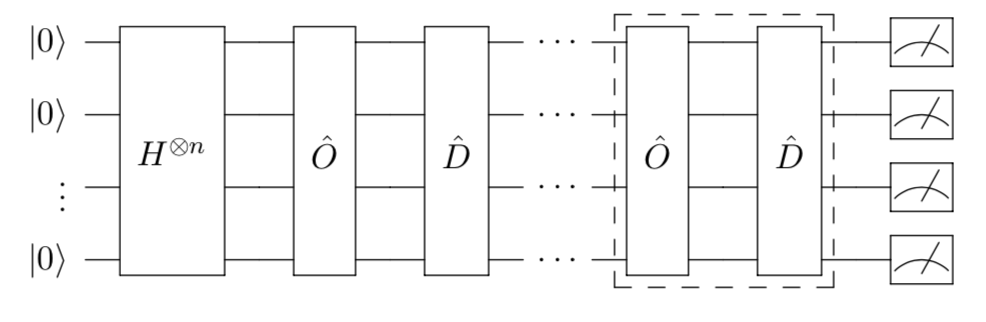
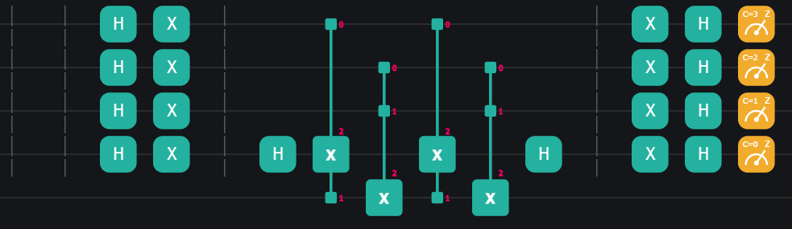

# 格罗弗搜索算法

## 背景介绍

假设一个推销员想推销一种新出的量子计算机，他在世界各大城市间来回穿梭（纽约 $\rightarrow$ 上海 $\rightarrow\cdots$）并且最终回到位于起点的公司总部，他需要提前规划好一条可以经过所有大城市的最短路线以节省时间。这就是著名的[旅行推销员问题](https://baike.baidu.com/item/TSP%E9%97%AE%E9%A2%98?fromtitle=%E6%97%85%E8%A1%8C%E6%8E%A8%E9%94%80%E5%91%98%E9%97%AE%E9%A2%98&fromid=10675002)。本质上，它是一个**非结构化**的搜索问题。


一种非结构化的搜索问题可以形式化定义如下：

> 给定一个具有 $N$ 个元素的集合 $S = \{0, 1, \cdots, N-1 \}$， 给定一个布尔函数 $f : S \rightarrow \{0, 1\}$。目标是找到一个元素 $x\in S$ 使得 $f(x) = 1$，称其为非结构化搜索问题 $f$ 的解。假定 $f$ 的解只有 $1$ 个。

其中"非结构化"是指我们没有关于这个数据集的先验知识，例如数据按照大小、首字母排序等。

对于如上定义的非结构化搜索问题，**经典搜索算法** 只能枚举集合 $S$ 中的元素 $x$，依次判断 $f(x)$ 是否等于 $1$。因为只有一个解，最坏情况下这个算法需要检查完 $S$ 中所有元素，即经典搜索算法在最坏情况下的复杂度为 $\mathcal{O}(N)$。

有趣的是，1996 年计算机科学家格罗弗（Lov Grover）发明了一种奇特的 **量子算法**$^{[1]}$，它只需使用 $\mathcal{O}{(\sqrt{N})}$ 次搜索步骤，就能找到非结构化搜索问题的解。格罗弗算法相比于经典算法是一个多项式加速算法，而不是像多伊奇-约萨算法那样有指数加速。尽管如此，假设非结构搜索的集合有 100 万个元素（$N=1000000$），那么用格罗弗搜索算法只需搜索几千次左右就能找到一个解。这也是很大的进步了！另一方面，本内特等人证明对于非结构化的搜索问题，任何量子算法都至少需要做 $\Omega\left(\sqrt{N}\right)$ 次量子搜索$^{[2]}$，因此格罗弗算法对非结构化的搜索问题是渐进意义下的最优量子算法。

---
## 格罗弗搜索算法

简要地，我们这里只来演示格罗弗搜索算法的工作流程，而不是详细地介绍它的算法原理与复杂度。格罗弗算法的更多理论细节可以参阅[量易简$^{[3]}$](https://qulearn.baidu.com/textbook/chapter3/%E6%A0%BC%E7%BD%97%E5%BC%97%E7%AE%97%E6%B3%95.html)。

### 数据的编码

首先我们需要明确我们要搜索的数据库，且记为 $S=\{|0\rangle,|1\rangle,\cdots,|N-1\rangle\}$。要想得到 $N$ 个正交的量子态，我们的量子系统至少要有 $n=\lceil \log_2 N\rceil$ 个量子比特。不失一般性，我们假设 $N$ 就是 $2$ 的幂，即 $N=2^n$。

### 验证器的编码

为了更好地利用量子叠加与相干的特性，量子的验证器也被更好地设计了。比如经典的验证器是给一个输入 $x$, 通过验证方程 $f(x)=1$，来确认 $x$ 是否是搜索目标。那么量子的验证器应当是对一个输入的叠加态，能区分出搜索目标与非目标的一个量子演化。比如 **格罗弗量子黑盒**（Grover oracle）:

$$
\hat O = I - 2|x^*\rangle\langle x^*|.    \tag{1}
$$

可以看出搜索目标 $x^*$ 与非搜索目标之间会相差一个相对相位 $\pi$。

### 振幅放大

进一步，为了很好地利用格罗弗量子黑盒，格罗弗设计了一个量子电路，后来其思想被总结为振幅放大算法$^{[4,5]}$。简言之，就是通过引入 **弥散算子**，并交替地调用格罗弗量子黑盒 $\hat O$ 与弥散算子 $\hat D$，使得中间过程的量子态在搜索目标分量 $|x^*\rangle$ 上的振幅逐渐放大，直到几乎为 $1$, 此时系统的量子态便可以近似认为就是搜索目标 $|x^*\rangle$。



我们先举一个简单的例子来演示这个过程。

> **问题** 在 $S=\{|0\rangle,|1\rangle,\cdots,|7\rangle\}$ 中搜索出 $|6\rangle$。
**材料** 格罗弗量子黑盒 $\hat O = I - 2|6\rangle\langle 6|$。

可以简单地预想，我们应该从一个叠加态出发：

$$
|\psi_0\rangle=H^{\otimes 3}|0\rangle^{\otimes3}=\frac{1}{\sqrt 8}\sum_{j=0}^7|j\rangle=:\frac{1}{\sqrt 8}|6\rangle+\frac{\sqrt 7}{\sqrt 8}|6^\perp\rangle.
$$

对 $|\psi_0\rangle$ 作用格罗弗量子黑盒，可以得到

$$
|\psi_1\rangle=\hat O|\psi_0\rangle=-\frac{1}{\sqrt 8}|6\rangle+\frac{\sqrt 7}{\sqrt 8}|6^\perp\rangle.
$$

格罗弗引入了弥散算子 

$$
\hat D= I - 2|\psi_0\rangle\langle \psi_0|,
$$

通过对 $|\psi_1\rangle$ 作用弥散算子， 我们得到了

$$
|\psi_2\rangle=\hat D|\psi_1\rangle=-\frac{5}{2\sqrt 8}|6\rangle-\frac{1}{2\sqrt 8}|6^\perp\rangle.
$$

可以看出 $|\psi_2\rangle$ 相比 $|\psi_0\rangle$ 在目标分量 $|6\rangle$ 上有着更大的振幅（的绝对值），所以这一方法被称为 **振幅放大**（amplitude amplification）。通过进一步计算，我们可以得到

$$
|\psi_4\rangle=\hat D\hat O|\psi_2\rangle=\frac{11}{4\sqrt 8}|6\rangle-\frac{1}{4\sqrt 8}|6^\perp\rangle
$$

在目标分量 $|6\rangle$ 上的振幅被进一步放大，而

$$
|\psi_6\rangle=\hat D\hat O|\psi_4\rangle=-\frac{13}{8\sqrt 8}|6\rangle+\frac{7}{8\sqrt 8}|6^\perp\rangle
$$

在目标分量 $|6\rangle$ 上的振幅触顶后减小。

经过精确地计算，我们知道交替调用格罗弗量子黑盒与弥散算子的次数近似为

$$
\frac{\pi}{4\arcsin(1/\sqrt{2^n})} -\frac12
$$

时，搜索目标分量的振幅达到最大。在 $n=3$ 时，上述数值为 $1.673$，故而交替这行 $1$ 或 $2$ 次格罗弗量子黑盒与弥散算子时可以使量子态目标分量达到最大的振幅。

>这里 $\hat D$ 之所以叫弥散算子，是因为其将每个计算基下的量子态 $|j\rangle$ 映射为
$$
\hat D|j\rangle=|j\rangle-2|\psi_0\rangle\langle \psi_0|j\rangle=\frac{N-2}{N}|j\rangle-\sum_{k\ne j}\frac{2}{N}|k\rangle,
$$
在所有的 $|j\rangle$ 以外的分量 $|k\rangle$ 上都产生了等量的振幅，即振幅从 $|j\rangle$ 等量地“弥散”到了各处。正因为弥散出的振幅会正负相消，才实现了目标分量 $|6\rangle$ 的振幅放大这一现象。

---
## 代码演示与解释

### 3 量子比特简例
我们继续以在 $S=\{|0\rangle,|1\rangle,\cdots,|7\rangle\}$ 中搜索出 $|6\rangle$ 为例，来给出简单代码演示。量子电路的实现参照代码文件 `Grover_3qubit.py`

- 首先，我们需要初始化 $3$ 量子比特为叠加态；
    ```python{.line-numbers}
    # Create environment
    env = QEnv()
    # Choose backend Baidu Cloud Quantum Simulator-Sim2
    env.backend(BackendName.CloudBaiduSim2Water)

    # Initialize the three-qubit circuit
    q = env.Q.createList(3)

    # The first step of Grover's search algorithm, superposition
    H(q[0])
    H(q[1])
    H(q[2])
    ```
- 然后调用格罗弗量子黑盒 $\hat O$，这里需要用 ```CCX``` 门，```X``` 门，```H``` 门来制备 $\hat O$；

    ```python{.line-numbers}
    # Call the Grover oracle
    # The first layer of X gates in Grover oracle 
    X(q[2])

    # The CCZ gate in Grover oracle
    H(q[2])
    CCX(q[0], q[1], q[2])
    H(q[2])

    # The second layer of X gates in Grover oracle 
    X(q[2])
    ```
- 然后调用弥散算子 $\hat D$，这里需要用 ```CCX``` 门，```X``` 门，```H``` 门来制备 $\hat D$；

    ```python{.line-numbers}
    # Call the diffusion operator
    # The first layer of Hadamard gates in the diffusion operator
    H(q[0])
    H(q[1])
    H(q[2])

    # The first layer of X gates in the diffusion operator
    X(q[0])
    X(q[1])
    X(q[2])

    # The CCZ gate in the diffusion operator
    H(q[2])
    CCX(q[0], q[1], q[2])
    H(q[2])

    # The second layer of X gates in the diffusion operator
    X(q[0])
    X(q[1])
    X(q[2])

    # The second layer of Hadamard gates in the diffusion operator
    H(q[0])
    H(q[1])
    H(q[2])
    ```
- 我们可以再交替地调用几次格罗弗量子黑盒和弥散算子，也可以选择直接测量。这里选择重复运行并测量电路 ```1000``` 次。

    ```python{.line-numbers}
    # Finally, we measure the quantum system
    MeasureZ(*env.Q.toListPair())
    # Commit the quest to the cloud
    env.commit(1000, downloadResult=False)
    ```

对只交替地调用一次格罗弗量子黑盒和弥散算子的情形，下图为量易伏中 QComposer 的电路演示，及再次运行后的测量结果，在选择 **小端输出** 后可以发现，在该量子电路的 $1000$ 次执行中，量子态 $|6\rangle=|110\rangle$ 被测量到的次数有 $773$ 次。


如果改为交替地调用两次格罗弗量子黑盒和弥散算子，（即将源代码中下述的`1` 改为 `2`）

```python{.line-numbers}
# Alternate calling Grover oracles and the diffusion operators
for _ in range(1):
```

运行后我们可以得到如下测量结果，可以看出 $|6\rangle=|110\rangle$ 被测量到的次数有 $955$ 次，即测量到 $|6\rangle$ 的概率明显提升了。


### 更多的量子比特
我们也提供了更多量子比特时的演示代码。代码文件参照 `Grover.py`

```python{.line-numbers}
def Grover(num_qubit, int_target=None):
    """
    :param num_qubit: n, the number of qubits which will encode the database to search
    :param int_target: t, the index of the search target, defaulted to be generated randomly
    """
    # create environment
    env = QEnv()
    # choose backend Baidu Cloud Quantum Simulator-Sim2
    env.backend(BackendName.CloudBaiduSim2Water)
    # create the quantum register encoding the database
    reg_sys = env.Q.createList(num_qubit)
    # generate the search target randomly if unspecified
    if int_target is None:
        int_target = randint(0, 2 ** num_qubit - 1)
    else:
        assert int_target < 2 ** num_qubit
    # prepare the initial state in Grover's algorithm
    for idx_qubit in reg_sys:
        H(idx_qubit)
    # Alternate the Grover oracle and diffusion operator for certain times,
    # which only depends on the size of the database.
    for _ in range(round(numpy.pi/(4 * numpy.arcsin(2 ** (-num_qubit / 2))) - 1 / 2)):
        Barrier(*reg_sys)
        Barrier(*reg_sys)
        # Call the Grover oracle
        circ_Grover_oracle(reg_sys, int_target)

        Barrier(*reg_sys)
        Barrier(*reg_sys)
        # Call the diffusion operator
        circ_diffusion_operator(reg_sys)

    # Finally, we measure reg_sys to verify Grover's algorithm works correctly.
    # Here the result of measurement is shown in positive sequence.
    MeasureZ(reg_sys, range(num_qubit - 1, -1, -1))
    # Commit the quest to the cloud
    env.commit(16000, downloadResult=False)
```

我们可以这样调用函数 `Grover`：

```python
# searching the state |3> on a 4-qubit circuit
Grover(4, int_target=3)
```

表示在 4 量子比特电路中搜索量子态 $|3\rangle$。如果未指定 `int_target` 的值，将会在代码的第 `13-14` 行随机生成一个合法的值。需要注明的是，上述代码的
- 第 `18-19` 行对应 Grover 算法中的初始叠加态制备；
- 第 `22` 行的循环语句，对应 Grover 算法中交替调用格罗弗量子黑盒和弥散算子的循环次数；
- 第 `26,31` 行分别调用了格罗弗量子黑盒和弥散算子。

为了更好地区分算法的不同步骤，我们在各个步骤之间加了两组 `Barrier` 以作区分。

**格罗弗量子黑盒** 由 `CnZ` 门（多重控制泡利 $Z$ 门）及两层 `X` 门实现，其中 `X` 要作用在哪些量子比特上这件事恰恰编码了格罗弗量子黑盒。其中代码第 `22` 行的 `CnZ` 门调用由函数 `circ_multictrl_Z` 实现。代码注释中用 `GO` 表示 $\hat O$。

```python{.line-numbers}
def circ_Grover_oracle(reg_sys, int_target):
    """
    This function give a circuit to implement the Grover oracle in Grover's algorithm.
    Generally, the search target should be unknown, and encoded by Grover oracle.
    However, in this implement we suppose the search target is known, such that we can implement an oracle to encode it.
    :param reg_sys: |s>, the system register to operate the Grover oracle
    :param int_target: t, the search target we want.
    :return: GO == I - 2|s><s|,
             GO |s> == -|s>, if s == t;
                       |s>,  else.
    """
    num_qubit = len(reg_sys)
    # Since CnZ == I - 2|11...1><11...1|, we can flip CnZ into GO by two layers of X gates.
    # Meanwhile, those X gates encode the search target s.
    # the first layer of X gates encoding the search target s
    for int_k in range(num_qubit):
        if (int_target >> int_k) % 2 == 0:
            X(reg_sys[-1 - int_k])

    Barrier(*reg_sys)
    # the multictrl gate CnZ
    circ_multictrl_Z(reg_sys[-1], reg_sys[:-1])

    Barrier(*reg_sys)
    # the second layer of X gates encoding the search target s
    for int_k in range(num_qubit):
        if (int_target >> int_k) % 2 == 0:
            X(reg_sys[-1 - int_k])
```

**弥散算子** 由 `CnZ` 门，两层 `X` 门及两层 `H` 门实现。其中代码第 `18` 行的 `CnZ` 门调用由函数 `circ_multictrl_Z` 实现。代码注释中用 `DO` 表示 $\hat D$。

```python{.line-numbers}
def circ_diffusion_operator(reg_sys):
    """
    This function give a circuit to implement the diffusion operator in Grover's algorithm.
    The diffusion operator flip the phase along the state |++...+>,
    which could be implemented by CnZ and two layers of H gates and two layers of X gates.
    :param reg_sys: |s>, the system register to operate the diffusion operator
    :return: DO == I - 2|++...+><++...+|,
             DO |s> == -|s>, if |s> == |++...+>;
                       |s>,  else.
    """
    # the first layer of H gates and the first layer of X gates
    for idx_qubit in reg_sys:
        H(idx_qubit)
        X(idx_qubit)

    Barrier(*reg_sys)
    # the multictrl gate CnZ
    circ_multictrl_Z(reg_sys[-1], reg_sys[:-1])

    Barrier(*reg_sys)
    # the second layer of X gates and the second layer of H gates
    for idx_qubit in reg_sys:
        H(idx_qubit)
        X(idx_qubit)
```

**CnZ** 门的实现超出了本篇的内容，详情可以参阅参考资料 [6] 和 [7]。值得补充说明的是，如果查看本代码生成的电路，$n$ 量子比特的搜索算法的量子电路可能会出现第 $n+1$ 个量子比特，不要惊慌，这个量子比特是用于辅助计算的借用型辅助量子比特（borrowed ancilla qubits），我们在算法的最后不需要去测量它，它的引入也不会影响我们的计算结果。如下图为 $4$ 量子比特时本代码生成的量子电路的截取，可以看到有些 `CCX` 门会作用在 `Q[4]` 上。 



---
## 参考资料

[1] Grover, Lov K. "A fast quantum mechanical algorithm for database search." [Proceedings of the 28th Annual ACM Symposium on Theory of Computing](https://dl.acm.org/doi/10.1145/237814.237866). 1996.

[2] Bennett, Charles H., et al. "Strengths and weaknesses of quantum computing." [SIAM Journal on Computing](https://epubs.siam.org/doi/abs/10.1137/S0097539796300933) 26.5 (1997): 1510-1523.

[3] 百度量子计算研究所, "格罗弗算法." [量易简](https://qulearn.baidu.com/textbook/chapter3/格罗弗算法.html)，2022.

[4] Brassard, Gilles, and Hoyer, Peter. "An exact quantum polynomial-time algorithm for Simon's problem." [Proceedings of the Fifth Israeli Symposium on Theory of Computing and Systems](https://ieeexplore.ieee.org/abstract/document/595153). IEEE, 1997.

[5] Grover, Lov K. "Quantum computers can search rapidly by using almost any transformation." [Physical Review Letters](https://journals.aps.org/prl/abstract/10.1103/PhysRevLett.80.4329) 80.19 (1998): 4329.

[6] Barenco, Adriano, et al. "Elementary gates for quantum computation." [Physical review A](https://journals.aps.org/pra/abstract/10.1103/PhysRevA.52.3457) 52.5 (1995): 3457.

[7] Gidney, Craig. "[Constructing Large Controlled Nots.](https://algassert.com/circuits/2015/06/05/Constructing-Large-Controlled-Nots.html)", Web. 05 Jun. 2015.

[8] Wikipedia contributors. "Grover's algorithm." Wikipedia, The Free Encyclopedia. [Wikipedia](https://en.wikipedia.org/wiki/Grover%27s_algorithm), The Free Encyclopedia, Web. 26 Nov. 2020.


*最后更新时间：2022年05月24日*