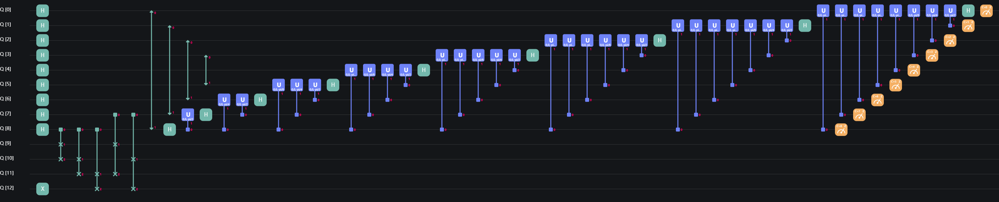
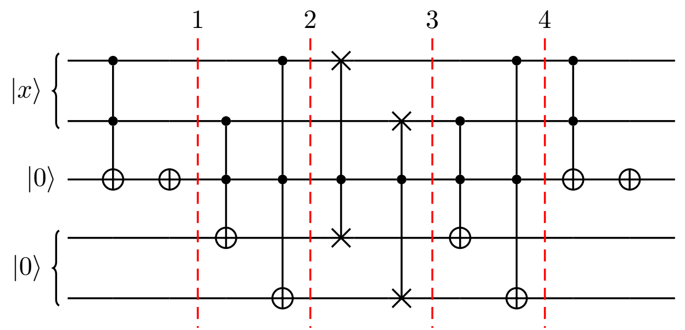
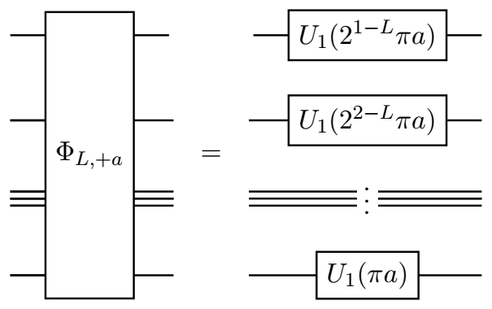
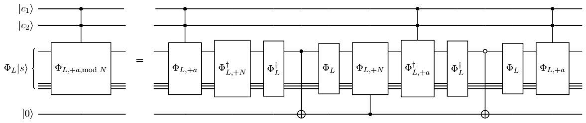
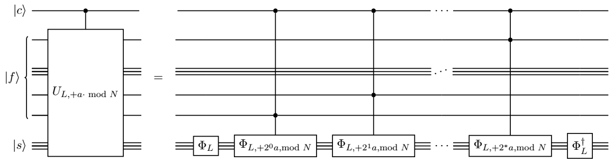
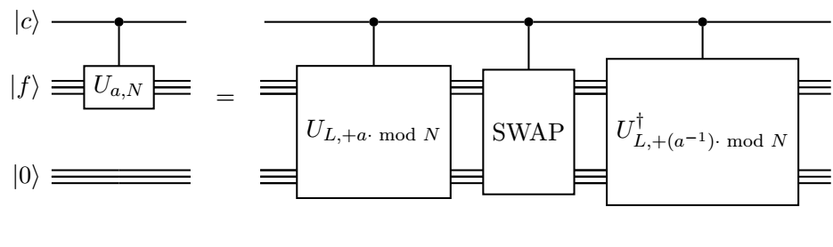

# Shor 算法

## 前言

**整数分解**（Integer Factorization）指将一个正整数 $N$ 分解为若干更小（大于 $1$ 的）正整数的乘积，比如 $45=5\times9$。

**Shor 算法**（Shor's Algorithm），是 Shor 在 1994 年提出的量子算法$^{[2]}$，可以在多项式时间

$$
O\left((\log N)^2(\log \log N)(\log \log \log N)\right)\tag{1}
$$

给出 $N$ 的一个整数分解。

本教程将从三个方面介绍并演示 Shor 算法。首先我们会给出 Shor 算法的轮廓思路，详见 **算法总览** 一段。其会引出 Shor 算法的两个核心步骤：将整数分解问题约化为求阶问题以及量子求阶算法，读者可以分别参照 **从整数分解到求阶问题** 和 **及量子求阶算法** 两节。在这两节的最后，我们分别给出了分解整数 $15$ 和 $63$ 的 QASM 和 QCompute 代码，以供读者上手尝试。前述的方法都不具备普适性，不能作为通用的方法来分解全部的整数，为了克服这一问题，我们使用了文献 [7] 的方法给出了通用算法的代码化，供感兴趣的读者尝试和学习，详见 **$C(U_{a,N})$ 门的实现** 一段。

## 算法总览

Shor 算法可以被理解为对整数分解问题的一个经典求解算法（思想来自 [1]）的量子改进：

1. 两者均将整数分解问题转化为求阶问题（Order-Finding）；
2. Shor 在求阶问题上获得了突破，提出了量子求阶算法（Quantum Order-Finding Algorithm）；
3. 将量子求阶算法替换经典算法中求阶的步骤，便可得到量子版本的整数分解算法，即 Shor 算法。

接下来我们会依次介绍 “转化” 的过程（从整数分解到求阶问题）、量子求阶算法，以及这些的量易伏代码样例。但这些并不能用于通用的整数分解，其涉及到一个关键的难题“量子黑箱”（Oracle）的有效构造方案，我们在最后一段的前半，将给出一种基于可逆计算的实现思路，在后半根据参考文献 [7] 给出了具体的实现代码，供读者量力学习。

## 从整数分解到求阶问题

在本段中，我们给出将整数分解问题约化为求阶问题的一种方案。基于此，只要我们能求解求阶问题，就能给出相应整数的分解。

阅读本节后续内容需要一些基本的数学背景知识如下：

1. 给定整数 $N,a$，若 $N/a$ 也是整数，称 $a$ **整除（Divide）** $N$，$a$ 是 $N$ 的 **因数（Factor）**，记为 $a\,|\,N$；否则称 $a$ 不整除 $N$，记为 $a\nmid N$；
2. $N$ 的 **非平凡因数** 指 $\pm 1$ 和 $\pm N$ 以外的因数；**整数分解** 也可以认为是非平凡因数求解；
4. 若干个整数的 **最大公因数（Greatest Common Divisor）** 定义为同时整除这些整数的最大的正整数，记为 ${\rm gcd}(\cdot,\cdots,\cdot)$，可以使用 [Euclid 辗转相除法](https://baike.baidu.com/item/%E6%AC%A7%E5%87%A0%E9%87%8C%E5%BE%97%E7%AE%97%E6%B3%95/1647675?fr=aladdin) 高效计算；称最大公因数为 $1$ 的两个整数互素；
5. 给定整数 $a,b,N$，若 $N|(a-b)$，称 $a$ 与 $b$ **模** $N$ **同余**，记为 $a\equiv b\pmod{N}$；否则称 $a$ 与 $b$ 模 $N$ 不同余，记为 $a\not\equiv b\pmod{N}$；
6. 给定整数 $a$ 和 $N$，若 $r$ 是使得 $a^r\equiv 1\pmod{N}$ 的最小正整数，称 $r$ 为 $a$ 模 ${N}$ 的 **乘法阶（Multiplicative Order）**，简称为阶，记为 $r={\rm ord}(a,N)$；称 $a$ 为底数，$N$ 为模数。

如果我们知道一个整数 $a$ 和其模 $N$ 的阶 $r$，便有 $N\,|\,(a^r-1)$。若追加假设 $r$ 是偶数，那么由平方差公式有 $N\,|\,(a^{r/2}-1)(a^{r/2}+1)$，由阶定义中的最小性知 $N\nmid(a^{r/2}-1)$。若再追加假设 $N\nmid(a^{r/2}+1)$ 即 $a^{r/2}\not\equiv-1\pmod{N}$，有 $N\nmid(a^{r/2}\pm1)$ 但 $N\mid(a^{r/2}-1)(a^{r/2}+1)$。那么可以证明 ${\rm gcd}(N,a^{r/2}\pm1)$ 均为 $N$ 的非平凡因数。综上所述，如果我们求得了一组 $(a,r)$ 满足前述条件，便可以有效地计算出 $N$ 的一个非平凡因数（等价地，也会得到 $N$ 的一个整数分解）。为了简化表述，笔者给前述条件一个称谓（非通用正式的用语）：

<div class="theorem">

**定义 1（“良性”）.** 给定互素的整数 $a$ 和奇数 $N$，设 $r={\rm ord}(a,N)$ 是 $a$ 模 ${N}$ 的阶，若 $r$ 是偶数且 $a^{r/2}\not\equiv-1\pmod{N}$，我们称 $a$ 模 ${N}$ 是“良性”的；否则称为“非良性”的。我们在不引发歧义时略去“模 ${N}$”以简化表述。

</div>

我们已经知道“良性”的 $a$ 及其阶 $r$ 可以诱导出 $N$ 的整数分解，但如何找到“良性”的 $a$ 和如何计算 $a$ 的阶都是尚未解决的问题。但是如果我们有对任意的 $a$ 和 $N$ 可以计算阶 $\rm{ord}(a,N)$ 的算法，便可随机抽选整数 $a$，然后计算其阶 $r$，再判断 $a$ 是不是“良性”的，若其是“良性”的，便可由 ${\rm gcd}(N,a^{r/2}\pm1)$ 为 $N$ 的非平凡因数得到 $N$ 的整数分解；否则重新抽选 $a$，并重复上述流程。特别地，如果我们抽选到的 $a$ 与 $N$ 不互素，虽然 $a$ 的阶不存在，但 ${\rm gcd}(a,N)$ 已经是 $N$ 的一个非平凡因数了，此时可以不进入求阶步骤就可以得到 $N$ 的整数分解。

<div class="theorem">

**例 2.** 考虑 $N=315$，$a=2$，可以验证 ${\rm ord}(2,315)=12$ 及 $2^{12/2}\equiv 64\not\equiv-1\pmod{315}$，进而 $2$ 是“良性”的， ${\rm gcd}(2^{6}-1,315)=63$ 和 ${\rm gcd}(2^{6}+1,315)=5$ 均为 $315$ 的非平凡因数。特别地，恰有 $315=63\times5$。

</div>

关于求阶这一步骤我们将在下一段中展开，这也是 Shor 算法中唯一量子的部分。作为本段的最后，我们总结一下 Shor 算法的流程如下：

<div class="theorem">

**算法 3（Shor 算法）.**

**输入：** 正奇数 $N$, 至少有两个互素的非平凡因数。

**输出：** $N$ 的一个非平凡因数。

1. 在 $\{2,3,\cdots,N-2\}$ 中随机选取整数 $a$；
2. 使用 [Euclid 辗转相除法](https://baike.baidu.com/item/%E6%AC%A7%E5%87%A0%E9%87%8C%E5%BE%97%E7%AE%97%E6%B3%95/1647675?fr=aladdin) 计算最大公因数 ${\rm gcd}(a,N)$；
3. **若** ${\rm gcd}(a,N)\ne1$，**返回** ${\rm gcd}(a,N)$；
4. 使用（量子）求阶算法计算 $r={\rm ord}(a,N)$；
5. **若** $r$ 为偶数 **并且** $a^{r/2}\not\equiv -1\pmod{N}$，**返回** ${\rm gcd}(a^{r/2}+1,N)$ （或 ${\rm gcd}(a^{r/2}-1,N)$）；
6. **转移** 到步骤 1。

</div>

## 量子求阶算法

### 理论

因为算法旨在求解 $a$ 模 $N$ 的阶 ${\rm ord}(a,N)$，我们称其为量子求阶算法。可以证明

$$
f(x)= a^x\text{ mod }{N}\tag{2}
$$

为周期函数，其（最小正）周期恰是 ${\rm ord}(a,N)$，这里 $x \text{ mod }y:=x-y\lfloor x/y\rfloor\in\{0,\cdots,y-1\}$ 是 $x$ 除以 $y$ 的余数。进而，量子求阶算法可作为 **量子周期求解算法**（Period-Finding）的一个特例。从本质上讲，量子相位估计算法也是量子周期求解算法的一个特例，但是从周期求解算法的方式来理解量子求阶算法和量子相位估计算法相对要困难一些，感兴趣的读者可以自行尝试了解$^{[5]}$。

Shor 的量子求阶算法可以被认为是基于量子相位估计算法的，将阶这一信息 **编码** 到某个量子门（或量子子电路）的本征相位上去，借由相位估计算法 **估计** 出该相位，进而再由连分数展开算法 **恢复** 出阶的值。

#### 将阶编码到本征相位

给定 $a\in\{2,\cdots,N-2\}$ 与 $N$ 互素，现要求解 $a$ 模 $N$ 的阶 $r={\rm ord}(a,N)$。使用 $L=\lceil \log_2(N+1)\rceil$ 个量子比特来编码，设有量子门

$$
U_{a,N}=\sum_{x=0}^{N-1}|{ax\ \textrm{mod } {N}}\rangle\langle{x}|+\sum_{x=N}^{2^L-1}|{x}\rangle\langle{x}|.\tag{3}
$$

可以证明 $|1\rangle$ 是 $U_{a,N}$ 的一些本征态的等概率幅叠加态，对 $|1\rangle$ 和 $U_{a,N}$ 调用量子相位估计算法，可以得到某个相位

$$
2\pi s/r, \ s=0,1,\cdots,r-1\tag{4}
$$

的 **估计** $k$ （这里 $k$ 是 **相位因子** $s/r$ 的近似）。当相位估计算法的精度达到 $N^{-2}$ 时，我们可以使用连分数展开算法从 $k$ 中恢复出相位的分母 $r$.

#### 连分数展开解码相位为阶

这里举例演示一下连分数展开算法，可以看出连分数展开的过程就是 Euclid 辗转相除法，每一次迭代将分数表示为带分数的形式，然后将带分数的分数部分的分子化为 $1$，将新的分母作为下一次迭代的输入，循环至带分数为整数止。

<div class="theorem">

**例 4.** 考虑 $N=63$ 时，对 $k=2729/8192$ 执行连分数展开：

$$
\begin{aligned}
\frac{2729}{8192}
=&\frac{1}{\frac{8192}{2729}}=\frac{1}{3+\frac{5}{2729}}=\frac{1}{3+\frac{1}{545+\frac45}}\\
=&0 + \frac{1}{3+\frac{1}{545+\frac{1}{1+\frac{1}{4}}}}=:[0,3,545,1,4],
\end{aligned}\tag{5}
$$


分别称 $[0]=0$，$[0,3]=0+\frac{1}{3}=\frac{1}{3}$，$[0,3,545]=0+\frac{1}{3+\frac{1}{545}}=\frac{545}{1636}$ 和 $[0,3,545,1]=0+\frac{1}{3+\frac{1}{545+\frac{1}{1}}}=\frac{546}{1639}$ 为连分数 $[0,3,545,1,4]$ 的第 $0$，第 $1$，第 $2$ 和第 $3$ **截断**（convergent，笔者译）。连分数展开算法 **返回** $k$ 各截断的分母中 $< N$ 的最大者（本例为 $3$）。

</div> 

<div class="theorem">

**注 5.** 当相位估计算法的精度达到 $N^{-2}$ 时，连分数展开算法总能返回 $s/r$ 的分母，但 $s/r$ 的分母不一定是 $r$：当 ${\rm gcd}(s,r)\ne1$ 时，$s/r$ 的分母是 $r/{\rm gcd}(s,r)$。此时能恢复出阶 $r$ 的概率与 $N$ 相关，但最糟糕情况下会趋近于 $0$。 

</div> 

为了提高恢复出阶 $r$ 的概率，目前最好的办法是执行两次求阶算法并计算分母的最小公倍数：

<div class="theorem">

**定理 6.** 通过执行两次量子求阶算法，可以得到两个分母 $q$ 和 $q'$，计算 $q$ 和 $q'$ 的最小公倍数 $\tilde r:=q q'/\textrm{gcd}(q,q')$，则 $\tilde r=r$ 的概率 $\ge{6(1-\epsilon)^2}/{\pi^2} \ge60.7\%\cdot(1-\epsilon)^2$，这里 $\epsilon$ 是相位估计算法的失败概率。这里 $q$ 和 $q'$ 分别为两次相位估计算法返回估计 $k$ 和 $k'$ 作为连分数展开算法输入后的返回值。

</div>

#### 总结

本段的最后，我们再总结一下量子求阶算法。

<div class="theorem">

**算法 7（量子求阶算法）.**

**输入：** 整数 $a\in\{2,\cdots,N-2\}$ 与 $N$ 互素，相位估计算法的失败概率 $\epsilon$。

**输出：** ${\rm ord}(a,N)$。


1. 令 $L=\lceil \log_2(N+1)\rceil$；
2. 执行两次：使用 $t=2L+1+\lceil\log_2(1+\frac{2}{\epsilon\pi^2})\rceil$ 个量子比特作为辅助寄存器对量子门 $U_{a,N}$ 和量子态 $|1\rangle$ 执行量子相位估计算法并对辅助寄存器进行测量。分别得到 $|m\rangle$ 和 $|m'\rangle$；
3. 分别对 $k=2^{-t}m$ 和 $k'=2^{-t}m'$ 做连分数展开，分别计算它们各个截断中 $< N$ 的最大分母 $q_j$ 和 $q_k'$；
4. 计算 $r_{jk}=q_jq_k'/{\rm gcd}(q_j,q_k')$，**若** $a^{r_{jk}}\equiv 1\pmod N$ **返回** ${\rm ord}(a,N)=r_{jk}$，**否则** **转移** 到步骤 2 重新计算。

</div>

其中算法 7 步骤 4 的返回 ${\rm ord}(a,N)$ 的概率不小于 $60.7\%\cdot(1-\epsilon)^2$。特别地，取 $t=2L+1+3$ 时，$\epsilon=2.895\%$，算法 7 步骤 4 返回 $\rm{ord}(a,N)$ 的概率不少于 $57.3\%$；此时循环至多 $4$ 次可以返回 $\rm{ord}(a,N)$ 的概率不少于 $96.6\%$。

至此，我们给出了 Shor 算法的全部内容，然后将于下一子段演示两个简单的例子。

### 简例与实验

在本段中，我们会使用量子编程平台——[量易伏](https://quantum-hub.baidu.com/#/)来演示 Shor算法。
我们会先使用量子作曲家（QComposer）来分解一个简单的例子——$15=3\times5$，然后用量子在线平台（PyOnline）来分解一个更复杂的例子——$63=3^2\times 7$。

#### 求 ${\rm ord}(2,15)$ 并分解 $15$

我们需要 $L=\lceil \log_2(15+1)\rceil=4$ 个量子比特来编码量子门 $U_{2,15}$（本子段中也简记为 $U$）：

$$
U_{2,15}=\left[\begin{array}{cccccccccccccccc}
1&0&0&0&0&0&0&0&0&0&0&0&0&0&0&0\\
0&0&0&0&0&0&0&0&1&0&0&0&0&0&0&0\\
0&1&0&0&0&0&0&0&0&0&0&0&0&0&0&0\\
0&0&0&0&0&0&0&0&0&1&0&0&0&0&0&0\\
0&0&1&0&0&0&0&0&0&0&0&0&0&0&0&0\\
0&0&0&0&0&0&0&0&0&0&1&0&0&0&0&0\\
0&0&0&1&0&0&0&0&0&0&0&0&0&0&0&0\\
0&0&0&0&0&0&0&0&0&0&0&1&0&0&0&0\\
0&0&0&0&1&0&0&0&0&0&0&0&0&0&0&0\\
0&0&0&0&0&0&0&0&0&0&0&0&1&0&0&0\\
0&0&0&0&0&1&0&0&0&0&0&0&0&0&0&0\\
0&0&0&0&0&0&0&0&0&0&0&0&0&1&0&0\\
0&0&0&0&0&0&1&0&0&0&0&0&0&0&0&0\\
0&0&0&0&0&0&0&0&0&0&0&0&0&0&1&0\\
0&0&0&0&0&0&0&1&0&0&0&0&0&0&0&0\\
0&0&0&0&0&0&0&0&0&0&0&0&0&0&0&1
\end{array}\right].\tag{6}
$$

我们可以给出 $C(U_{2,15})$ 的一种分解如下图所示，其以第 $0$ 比特为控制比特，第 $1,2,3,4$ 比特按顺序作为 $U_{2,15}$ 的作用比特：


对应 OPENQASM 代码如下：

```cpp{.line-numbers}
OPENQASM 2.0;
include "qelib1.inc";
qreg q[5];
creg c[5];
cswap q[0], q[1], q[2];
cswap q[0], q[2], q[3];
cswap q[0], q[3], q[4];
```

可以简记为

$$
\begin{aligned}
C(U_{2,15})&= \operatorname{CSWAP}_{0,3,4}\cdot\operatorname{CSWAP}_{0,2,3}\cdot\operatorname{CSWAP}_{0,1,2},\tag{7}
\end{aligned}
$$

这里 $\operatorname{CSWAP}_{j,k,l}$ 为第 $j$ 比特为控制比特、以第 $k$ 和 $l$ 比特为受控比特的 $\operatorname{CSWAP}$ 门。相位估计算法中还需要用到其它 $C(U_{2,15}^{2^j})$门:

$$
\begin{aligned}
C(U_{2,15}^2)&= \operatorname{CSWAP}_{0,2,4}\cdot \operatorname{CSWAP}_{0,1,3};\tag{8}
\end{aligned}
$$

$$
\begin{aligned}
C(U_{2,15}^{2^j}) &= I,\quad j\ge3.\tag{9}
\end{aligned}
$$

使用 $2L+1=9$ 个量子比特估计量子态 $|0001\rangle$ 的相位，量子作曲家中的电路如下图所示（这里略去了可以忽略的 $I$ 门）：



其对应的 OPENQASM [代码](https://quantum-hub.baidu.com/#/)如下：

```cpp{.line-numbers}OPENQASM 2.0;
include "qelib1.inc";
qreg q[13]; // q[0],...,q[8] 为辅助寄存器，q[9],...,q[12] 为工作寄存器
creg c[13];
x q[12]; // 制备初始状态|0>|1>，下面开始执行相位估计算法
h q[0];
h q[1];
h q[2];
h q[3];
h q[4];
h q[5];
h q[6];
h q[7];
h q[8]; // 相位估计的辅助步，对辅助寄存器取平均叠加完毕
cswap q[8], q[9], q[10];
cswap q[8], q[10], q[11];
cswap q[8], q[11], q[12]; // 上一注释至此实现了 C(U) 门，q[8] 控制工作寄存器
cswap q[7], q[9], q[11];
cswap q[7], q[10], q[12]; //上一注释至此实现了 C(U^2) 门，q[7] 控制工作寄存器
// 略去为 I 的其他 C(U^(2^j)) 门，准备开始对辅助寄存器做逆 Fourier 变换
// 逆 Fourier 变换的 SWAP 步骤
swap q[0], q[8];
swap q[1], q[7];
swap q[2], q[6];
swap q[3], q[5];
// 逆 Fourier 变换的控制旋转步骤
h q[8];
cu(0, 0, -pi/2) q[8], q[7];
h q[7];
cu(0, 0, -pi/4) q[8], q[6];
cu(0, 0, -pi/2) q[7], q[6];
h q[6];
cu(0, 0, -pi/8) q[8], q[5];
cu(0, 0, -pi/4) q[7], q[5];
cu(0, 0, -pi/2) q[6], q[5];
h q[5];
cu(0, 0, -pi/16) q[8], q[4];
cu(0, 0, -pi/8) q[7], q[4];
cu(0, 0, -pi/4) q[6], q[4];
cu(0, 0, -pi/2) q[5], q[4];
h q[4];
cu(0, 0, -pi/32) q[8], q[3];
cu(0, 0, -pi/16) q[7], q[3];
cu(0, 0, -pi/8) q[6], q[3];
cu(0, 0, -pi/4) q[5], q[3];
cu(0, 0, -pi/2) q[4], q[3];
h q[3];
cu(0, 0, -pi/64) q[8], q[2];
cu(0, 0, -pi/32) q[7], q[2];
cu(0, 0, -pi/16) q[6], q[2];
cu(0, 0, -pi/8) q[5], q[2];
cu(0, 0, -pi/4) q[4], q[2];
cu(0, 0, -pi/2) q[3], q[2];
h q[2];
cu(0, 0, -pi/128) q[8], q[1];
cu(0, 0, -pi/64) q[7], q[1];
cu(0, 0, -pi/32) q[6], q[1];
cu(0, 0, -pi/16) q[5], q[1];
cu(0, 0, -pi/8) q[4], q[1];
cu(0, 0, -pi/4) q[3], q[1];
cu(0, 0, -pi/2) q[2], q[1];
h q[1];
cu(0, 0, -pi/256) q[8], q[0];
cu(0, 0, -pi/128) q[7], q[0];
cu(0, 0, -pi/64) q[6], q[0];
cu(0, 0, -pi/32) q[5], q[0];
cu(0, 0, -pi/16) q[4], q[0];
cu(0, 0, -pi/8) q[3], q[0];
cu(0, 0, -pi/4) q[2], q[0];
cu(0, 0, -pi/2) q[1], q[0];
h q[0]; // 逆 Fourier 变换结束，相位估计算法进入测量阶段
measure q[8] -> c[8];
measure q[7] -> c[7];
measure q[6] -> c[6];
measure q[5] -> c[5];
measure q[4] -> c[4];
measure q[3] -> c[3];
measure q[2] -> c[2];
measure q[1] -> c[1];
measure q[0] -> c[0];
```

某次运行结果如下：

```python
{
    "000000011": 237,
    "000000010": 257,
    "000000000": 269,
    "000000001": 261
}
```

测量结果大约为等频率的 $|000000000\rangle$，$|010000000\rangle$，$|100000000\rangle$ 和 $|110000000\rangle$，分别对应真分数 $0$，$1/4$，$1/2$ 和 $3/4$。这里仅 $3/4$ 可以做连分数展开：

$$
\frac{3}{4}=\frac{1}{1+\frac{1}{3}},\tag{10}
$$ 

其第 $1$ 截断为 $1$。

故而每次相位估计算法有约 $1/2$ 的概率可以得到正确结果 ${\rm ord}(2,15)=4$，两次实验有约 $3/4$ 的概率可以得到正确结果。
由 $2^{4/2} = 4\not\equiv -1\pmod{15}$ 知 $15|(4-1)(4+1)$ 诱导了 $15$ 的一个整数分解：

$$
15=\textrm{gcd}(15,4-1)\times\textrm{gcd}(15,4+1)=3\times5.\tag{11}
$$

至此完成了 Shor 算法分解 $15$ 的演示。

后话：代码演示中“略去为 $I$ 的其他 $C(U^{2^j})$ 门”有循环论证之嫌，正确的演示应当将这些门逐个分解，而不是利用理论证明的方法计算得出 $C(U^{2^j})=I$，在下一子段中，我们在演示 $63$ 的分解时避开了这一问题。

#### 求 ${\rm ord}(2,63)$ 并分解 $63$

在本子段中，我们使用[量易伏](https://quantum-hub.baidu.com/#/)的量子在线平台来演示 Shor 算法。

我们需要 $L=\lceil \log_2(63+1)\rceil=6$ 个量子比特来编码算符 $U_{2,63}$（本子段中也简记为 $U$），使用 $2L+1=13$ 个辅助量子比特来估计相位。考虑到 $j>0$ 时有

$$
U^{2^j}=U^{2^{j\rm{\ mod\ }2}},\tag{12}
$$ 

我们只需要分解门 $C(U)$，$C(U^{2})$ 和 $C(U^{4})$：

$$
\begin{aligned}
C(U)&= \operatorname{CSWAP}_{0,1,2}\cdot\operatorname{CSWAP}_{0,2,3}\cdot\operatorname{CSWAP}_{0,3,4}\cdot\operatorname{CSWAP}_{0,4,5}\cdot\operatorname{CSWAP}_{0,5,6};\tag{13}\\
\end{aligned}
$$

$$
\begin{aligned}
C(U^2)&= \operatorname{CSWAP}_{0,3,5}\cdot \operatorname{CSWAP}_{0,1,3}\cdot\operatorname{CSWAP}_{0,4,6}\cdot \operatorname{CSWAP}_{0,2,4};\tag{14}\\
\end{aligned}
$$

$$
\begin{aligned}
C(U^{4}) &=\operatorname{CSWAP}_{0,1,3} \cdot \operatorname{CSWAP}_{0,3,5}\cdot\operatorname{CSWAP}_{0,2,4}\cdot \operatorname{CSWAP}_{0,4,6}.\tag{15}
\end{aligned}
$$

[量子在线平台](https://quantum-hub.baidu.com/#/)中的代码如下：

```python{.numberLines}
from QCompute import *
from numpy import pi

matchSdkVersion('Python 3.0.0')


def func_order_finding_2_mod_63():
    """
    这个函数将会返回特征相位因子 s/6 的逼近，其中 6 是 2 模 63 的阶，s=0,1,...,5
    """
    env = QEnv()  # 创建环境
    env.backend(BackendName.LocalBaiduSim2)  # 选择后端 LocalBaiduSim2

    L = 6  # 编码 U 门需要的量子比特数、工作寄存器的量子比特数
    N = 3 * L + 1  # 算法需要使用的总量子比特数
    t = 2 * L + 1  # 相位估计算法所需的辅助比特数、辅助寄存器的量子比特数

    q = env.Q.createList(N)  # 生成量子比特的列表

    X(q[N - 1])  # 在工作寄存器制备初始状态 |1>，下面开始执行相位估计算法

    for i in range(t):
        H(q[i])  # 相位估计的第一步，对辅助寄存器取平均叠加完毕，下面开始将相位估计算法的转存步骤

    CSWAP(q[2 * L], q[t + 4], q[t + 5])
    CSWAP(q[2 * L], q[t + 3], q[t + 4])
    CSWAP(q[2 * L], q[t + 2], q[t + 3])
    CSWAP(q[2 * L], q[t + 1], q[t + 2])
    CSWAP(q[2 * L], q[t + 0], q[t + 1])
    # 上一注释至此实现了门 C(U)，辅助寄存器的最后一个量子比特控制工作寄存器

    s = 2 * L - 1  # 准备依次作用其他 C(U^(2^j)) 门，q[s] 即门的控制量子位
    while s >= 0:
        if s % 2 == 1:
            CSWAP(q[s], q[t + 1], q[t + 3])
            CSWAP(q[s], q[t + 3], q[t + 5])
            CSWAP(q[s], q[t + 0], q[t + 2])
            CSWAP(q[s], q[t + 2], q[t + 4])  # 本条件下的门组合后即门 C(U^2)
        else:
            CSWAP(q[s], q[t + 3], q[t + 5])
            CSWAP(q[s], q[t + 1], q[t + 3])
            CSWAP(q[s], q[t + 2], q[t + 4])
            CSWAP(q[s], q[t + 0], q[t + 2])  # 本条件下的门组合后即门 C(U^4)
        s -= 1  # 指针移动到更高位的辅助比特上去

    # 逆 Fourier 变换中的 SWAP 步骤
    for i in range(t // 2):
        SWAP(q[i], q[t - i - 1])

    # 逆 Fourier 变换中的控制旋转步骤
    for i in range(t - 1):
        H(q[t - i - 1])
        for j in range(i + 1):
            CU(0, 0, -pi / pow(2, (i - j + 1)))(q[t - j - 1], q[t - i - 2])
    H(q[0])

    # 完成逆 Fourier 变换，完成相位估计算法，等待测量
    MeasureZ(q[:t], range(t))  # 只测量辅助寄存器即前 t 个比特
    env.commit(8192, downloadResult=False)


if __name__ == "__main__":
    func_order_finding_2_mod_63()
```

执行量子算法 $8192$ 次，忽略总频次 $5\%$ 的一些小概率结果，其余结果经数据处理后如下，其中 `"4096": 1419` 表示 $|4096\rangle$ 出现了 $1419$ 次：

```python
{
    "4096": 1419,
    "0": 1287,
    "5461": 955,
    "2731": 955,
    "1365": 940,
    "6827": 896,
    "6826": 252,
    "1366": 250,
    "2730": 246,
    "5462": 219,
    "2732": 56,
    "5460": 53,
    "6828": 52,
    "1364": 49,
    "2729": 47,
    "1367": 41,
    "5463": 36,
    "6825": 34,
} 
```

分别对这些结果对应的分数做连分数展开并截断，得：

```python
{
    {{0, 1/2}: 1419},
    {{0}: 1287},
    {{0, 1, 1/2, 2/3, 5461/8192}: 955},
    {{0, 1/2, 1/3, 2731/8192}: 955},
    {{0, 1/6, 682/4093, 1365/8192}: 940}, 
    {{0, 1, 5/6, 3411/4093, 6827/8192}: 896}, 
    {{0, 1, 4/5, 5/6, 1704/2045, 3413/4096}: 252}, 
    {{0, 1/5, 1/6, 341/2045, 683/4096}: 250}, 
    {{0, 1/3, 1365/4096}: 246}, 
    {{0, 1, 2/3, 2731/4096}: 219}, 
    {{0, 1/2, 1/3, 683/2048}: 56}, 
    {{0, 1, 1/2, 2/3, 1365/2048}: 53}, 
    {{0, 1, 5/6, 851/1021, 1707/2048}: 52},
    {{0, 1/6, 170/1021, 341/2048}: 49}, 
    {{0, 1/3, 545/1636, 546/1639, 2729/8192}: 47}, 
    {{0, 1/5, 1/6, 136/815, 137/821, 410/2457, 1367/8192}: 41},
    {{0, 1, 2/3, 1091/1636, 1093/1639, 5463/8192}: 36},
    {{0, 1, 4/5, 5/6, 679/815, 684/821, 2047/2457, 6825/8192}: 34}
} 
```

考虑各行第一个分量中不超过 $N=63$ 的最大分母（这里仅有 $1,2,3,6$），
其中可以得到的分母为 $2$，$3$ 和 $6$ 的频次分别为 $1419$，$2567$ 和 $2514$。考虑到 $\rm{ord}(2,63)=6$，故而执行一次量子电路然后做连分数展开算法有约 $2514/8192 \approx 30.7\%$ 的概率可以得到正确结果 ${\rm ord}(2,63)=6$，两次实验有约 

$$
1-\left(1-\frac{2514}{8192}\right)^2+2 * \frac{1419}{8192} * \frac{2567}{8192}\approx 62.8\%\tag{16}
$$

的概率可以得到正确结果 ${\rm ord}(2,63)=6$，这里最后一个加项表示两次测量中一次结果为 $2$ 而另一次为 $3$。由 $2^{6/2} = 8\not\equiv -1\pmod{63}$ 知 $63|(8-1)(8+1)$ 诱导了 $63$ 的一个不平凡的分解：

$$
63=\textrm{gcd}(63,8-1)\times\textrm{gcd}(63,8+1)=7\times9.\tag{17}
$$

这里虽然没有了循环论证之嫌，但是从 

$$
U^{2^3}=U^2\tag{18}
$$

中，我们应当能直接得到 $U^{2^3-2}=I$，$\rm{ord}(2,63)\,|\,(2^3-2)=6$，又陷入了舍近求远之嫌。


## $C(U_{a,N})$ 门的实现

为了避免舍近求远的嫌疑，我们需要实现通用的 Shor 算法实现，也就是说我们需要一种通用的算法，可以计算出量子门 $C(U_{a,N})$ 的分解形式。在上一个子段中，我们使用代数手段将 $C(U_{a,N})$ 分解为 $\operatorname{CSWAP}$ 门的组合，并借由经典计算简化了 $C(U_{a,N}^{2^j})$ 门。这在逻辑上其实是说不通的，无论是门的分解的过程，还是省略计算的过程都有循环论证之嫌：涉及到或者蕴含到已知 $N$ 的分解这一事实。若想引入一个常规的泛用的 $C(U_{a,N})$ 门的分解可以参照文献 $[6,7]$ 等。

除了这种为了控制辅助量子比特数量而设计的复杂的方法之外，我们可以借助经典的可逆计算的途径来实现 $C(U_{a,N})$。

### 可逆计算

#### 从（经典）可逆计算开始

什么是经典的可逆计算？大家应该都知道经典计算机是基于 2 进制数及逻辑运算实现的，逻辑运算一般用三种基本的门“与”门 $\wedge$、“或”门 $\vee$ 和“非”门 $\neg$ 来实现，除去“非”门外，“与”门和“或”门都是两个输入一个输出：

$$
\forall a,b\in\{0,1\},\ a\wedge b=ab,\ a\vee b=\neg(\neg a\wedge\neg b)=1-(1-a)(1-b),\ \neg a=1-a.\tag{19}
$$

这种无法从输出完全恢复出输入信息的计算就被称为不可逆计算，反之称为 **可逆计算**。可以看出对可逆计算而言，输入与输出的比特数量应当相等，比如上述的“非”门就是可逆计算。

可以预料到当我们保留输入信息，并在额外的寄存器上实现计算时，实现的计算必然是可逆计算，比如：

$$
(a,b,c)\rightarrow(a,b,c\oplus f(a,b)),\tag{20}
$$

这里 $f(a,b)$ 是任意一个 $\{0,1\}^2\rightarrow\{0,1\}$ 的函数，$x\oplus y:=x+y\text{ mod }2$ 是 $x$ 和 $y$ 的“异或”运算结果。

最后我们来讲，通过引入辅助量子比特，量子计算中的 $X$ 门、$C(X)$ 门和 Toffoli 门 $C^2(X)$，便可模拟所有的可逆计算，其中：

$$
\begin{aligned}
X|a\rangle=&\ |\neg a\rangle,\\
C^2(X)|a\rangle|b\rangle|0\rangle
=&\ |a\rangle|b\rangle|a\wedge b\rangle,\\
C(X)|a\rangle|0\rangle
=&\ |a\rangle|a\rangle=:\operatorname{FANOUT}|a\rangle,
\end{aligned}\tag{21}
$$

这里“扇出” $\operatorname{FANOUT}$ 是将一个经典比特复制为两份，这在量子计算对计算基能有效实现。另外由“或”门的分解，我们也可以得到其量子版本：

$$
(X\otimes X\otimes X)\cdot C^2(X)\cdot(X\otimes X\otimes I)|a\rangle|b\rangle|0\rangle
=\ |a\rangle|b\rangle|a\vee b\rangle.\tag{22}
$$


#### 回到 $U_{a,N}$ 门

$$
U_{a,N}=\sum_{x=0}^{N-1}|{ax\ \textrm{mod } {N}}\rangle\langle{x}|+\sum_{x=N}^{2^L-1}|{x}\rangle\langle{x}|.\tag{23}
$$

给定一个输入 $x\in\{0,1,\cdots,2^L-1\}$，我们总能经典地计算判断 $x< N$，并在 $x< N$ 时计算 $ax\textrm{ mod } N$，这个判断和计算的过程终归是用逻辑运算实现的，即最终被分解为“与”门、“非”门和“扇出”门的组合，进而可被量子电路等效实现。最终我们获得了一个由若干 $X$ 门、$C(X)$ 门和 Toffoli 门组成的量子电路 $\operatorname{C}$，其实现了

$$
\operatorname{C}|x\rangle|0\rangle^{\otimes L}|0\rangle^{\otimes t}=|x\rangle(U_{a,N}|x\rangle)|0\rangle^{\otimes t},\tag{24}
$$

其中 $t+L$ 是整个电路需要引入的辅助量子比特的数目。根据可逆计算的性质，上述电路中所需量子门的数目和 $t$ 都不超过经典计算中逻辑运算次数的两倍，这保证了 $\operatorname{C}$ 可以被有效实现。

这里和我们想要的 $|x\rangle\rightarrow U_{a,N}|x\rangle$ 还是不太一样的，我们可以利用量子门 $\operatorname{SWAP}$ 交换两个寄存器的状态，再类似地实现 $U_{a^{-1},N}^\dagger$，借此抹去 $|x\rangle$ 的信息：

$$
|x\rangle(U_{a,N}|x\rangle)|0\rangle^{\otimes t}\xrightarrow{\operatorname{SWAP}}
(U_{a,N}|x\rangle)|x\rangle|0\rangle^{\otimes t}\xrightarrow{\operatorname{\hat C^\dagger}}
(U_{a,N}|x\rangle)|0\rangle|0\rangle^{\otimes t},\tag{25}
$$

这里 $\hat {\operatorname C}^\dagger$ 可以理解为 $\hat {\operatorname C}$ 的逆电路:

$$
(U_{a,N}|x\rangle)|0\rangle|0\rangle^{\otimes t}
\xrightarrow{\operatorname{\hat C}}
(U_{a,N}|x\rangle)(U_{a^{-1},N}U_{a,N}|x\rangle)|0\rangle^{\otimes t}=(U_{a,N}|x\rangle)|x\rangle|0\rangle^{\otimes t}.\tag{26}
$$


**例 8.** 我们以 $U_{2,3}$ 为例演示这个过程：



我们引入 $3$ 个零化辅助比特，第一个用作比较器，记录 $x$ 是否 $<3$，然后以该比特作为控制比特实现 $|x\rangle$ 到 $|2x\text{ mod }3\rangle$ 的变换。我们可以实现变换 $|x\rangle|0\rangle\rightarrow|x\rangle|2x\text{ mod }3\rangle$，然后交换量子态，将 $|2x\text{ mod } 3\rangle$ 储存在前两个量子比特中。再接下来，我们可以用 $|2x\text{ mod }3\rangle$ 来抹除 $|x\rangle$ 的信息得到 $|2x\text{ mod }3\rangle|0\rangle$，因为 $2(2x\text{ mod 3})\text{ mod 3} = x$。最后抹除第一个辅助比特的记录信息，便可实现 $U_{2,3}$。量子态的详细演化过程如下：

$$
\begin{aligned}
|x\rangle|0\rangle|0\rangle\rightarrow
\begin{cases}
|x\rangle|1\rangle|0\rangle\rightarrow|x\rangle|1\rangle|2x\text{ mod }3\rangle\rightarrow|2x\text{ mod }3\rangle|1\rangle|x\rangle\rightarrow|2x\text{ mod }3\rangle|1\rangle|0\rangle\rightarrow|2x\text{ mod }3\rangle|0\rangle|0\rangle,&x<3;\\
|x\rangle|0\rangle|0\rangle\rightarrow|x\rangle|0\rangle|0\rangle\rightarrow|x\rangle|0\rangle|0\rangle\rightarrow|x\rangle|0\rangle|0\rangle\rightarrow|x\rangle|0\rangle|0\rangle,&x=3.
\end{cases}
\end{aligned}\tag{27}
$$

当然这里计算 $2x\text{ mod }3$ 的过程被大幅度简化过了，对于更一般的参数情形，会用到更多的辅助比特来存储进位信息和乘法的中间计算结果。

### 通用 $C(U_{a,N})$ 的实现

在量子求阶算法中，量子黑盒是酉矩阵 

$$
U_{a,N}=\sum_{x=0}^{N-1}|{ax\ \textrm{mod } {N}}\rangle\langle{x}|+\sum_{x=N}^{2^L-1}|{x}\rangle\langle{x}|.\tag{6}
$$

需要用到的 $U_{a,N}$ 的幂

$$
U_{a,N}^{2^k}=U_{a^{2^k}\text{ mod }N,N},
$$

恰也具有形式 $U_{\tilde a,N}$，所以我们需要的是一种对任意的 $a$， 可以有效实现 $U_{\tilde a,N}$ 的量子电路。

在本段中，我们将使用文献

[7] Beauregard, Stephane. "Circuit for Shor's algorithm using 2n+3 qubits." Quantum Information & Computation 3.2 (2003): 175-185.

所提供的算法，给出量子门 $C(U_{a,N})$ 的实现代码，类似例 8 的实现方案，我们也需要采取

$$
|x\rangle|0\rangle^{\otimes L}|0\rangle^{\otimes t}\rightarrow|x\rangle(U_{a,N}|x\rangle)|0\rangle^{\otimes t}\xrightarrow{\operatorname{SWAP}}
(U_{a,N}|x\rangle)|x\rangle|0\rangle^{\otimes t}\rightarrow
(U_{a,N}|x\rangle)|0\rangle^{\otimes L}|0\rangle^{\otimes t}\tag{28}
$$

这一流程。更具体地，为了实现量子门 $U_{a,N}$，我们要依次地实现量子门

$$
\begin{aligned}
\Phi_{L,+a}&:=&\sum_{j=0}^{2^L-1}\Phi_{L}|j+a\text{ mod }2^L\rangle\langle j|\Phi_{L}^\dagger,\tag{29}
\end{aligned}
$$

$$
\begin{aligned}
\Phi_{L,+a,\text{mod }N}&:=&\Phi_{L}\left(\sum_{j=0}^{N-1}|j+a\text{ mod }N\rangle\langle j|+\sum_{j=N}^{2^L-1}|j\rangle\langle j|\right)\Phi_{L}^\dagger,\tag{30}
\end{aligned}
$$

$$
\begin{aligned}
U_{L,+a\cdot\text{ mod }N}&:=&\sum_{f=0}^{2^L-1}|f\rangle\langle f|\otimes\left(\sum_{y=0}^{N-1}|(y+af)\text{ mod }N\rangle\langle y|+\sum_{y=N}^{2^L-1}|y\rangle\langle y|\right)\tag{31}
\end{aligned}
$$

以及他们的控制版本（$C(U):=|0\rangle\langle0|\otimes I_*+|1\rangle\langle1|\otimes U$），这里 $N<2^L$，$\Phi_L$ 为去除 $\operatorname{SWAP}$ 门的 $\operatorname{QFT}_{L}$。

这里可以这样理解，$\Phi_{L,+a}$ 实现了 $\text{mod }2^L$ 的 $+a$ 运算；$\Phi_{L,+a,\text{mod }N}$ 实现了 $\text{mod }N$ 的 $+a$ 运算；$U_{L,+a\cdot\text{ mod }N}$ 实现了 $\text{mod }N$ 的 $\times a$ 运算，即式 $(28)$ 的第一步。


#### $~\Phi$$_{L,+a}$ 的实现

考虑到

$$
\begin{aligned}
\operatorname{QFT}_{L}|j\rangle&=&\bigotimes_{k=0}^{L-1}\frac{|0\rangle+e^{2\pi ij*2^{-k-1}}|1\rangle}{2},\tag{32}
\end{aligned}
$$

$$
\begin{aligned}
\left(\bigotimes_{k=0}^{L-1}U_1(2\pi a*2^{-k-1})\right)\cdot
\operatorname{QFT}_{L}|j\rangle&=&\bigotimes_{k=0}^{L-1}\left(U_1(2\pi a*2^{-k-1})\cdot\frac{|0\rangle+e^{2\pi ij*2^{-k-1}}|1\rangle}{2}\right)
\end{aligned}
$$

$$
\begin{aligned}
&=&\bigotimes_{i=0}^{L-1}\frac{|0\rangle+e^{2\pi i(j+a)*2^{-k-1}}|1\rangle}{2}\tag{33}\\
&=&\operatorname{QFT}_{L}|j+a\text{ mod }2^L\rangle,
\end{aligned}
$$

我们有

$$
\bigotimes_{k=0}^{L-1}U_1(2\pi a*2^{-k-1})=\sum_{j=0}^{2^L-1}\operatorname{QFT}_{L}|j+a\text{ mod }2^L\rangle\langle j|\operatorname{QFT}_{L}^\dagger,\tag{34}
$$

考虑到 $\operatorname{QFT}$ 的实现过程中有一串 $\operatorname{SWAP}$ 门，但这在前述实现中是不必要的。

我们重新定义没有 $\operatorname{SWAP}$ 步骤的 $\operatorname{QFT}_{L}$ 为 $\Phi_L$,

$$
\begin{aligned}
\Phi_{L}|j\rangle&=&\bigotimes_{k=0}^{L-1}\frac{|0\rangle+e^{2\pi ij*2^{k-L}}|1\rangle}{2},\tag{35}
\end{aligned}
$$

$$
\begin{aligned}
\left(\bigotimes_{k=0}^{L-1}U_1(2\pi a*2^{k-L})\right)\cdot
\Phi_{L}|j\rangle&=&\Phi_{L}|j+a\text{ mod }2^L\rangle,\tag{36}
\end{aligned}
$$

$$
\begin{aligned}
\bigotimes_{k=0}^{L-1}U_1(2\pi a*2^{k-L})&=&\sum_{j=0}^{2^L-1}\Phi_{L}|j+a\text{ mod }2^L\rangle\langle j|\Phi_{L}^\dagger,\tag{37}
\end{aligned}
$$

对应代码段如下所示，其中值得注意的是代码注释中的 ```QFT``` 均指 **没有** $\operatorname{SWAP}$ 门的量子 Fourier 变换（下略同）：

```python{.line-numbers}
def func_qft_without_swap(reg_system):
    """
    Quantum Fourier Transform without the swap step, |s> -> QFT|s>
    :param reg_system: |s>
    :return:
    """
    number_qubit = len(reg_system)
    for idx1_qubit in range(0, number_qubit - 1):  # The outer loop
        H(reg_system[idx1_qubit])  # Operate a H gate on the idx1-th qubit
        for idx2_qubit in range(2, number_qubit - idx1_qubit + 1):  # The inner loop
            # where we will operate a CU1 gate in each loop
            idx3_qubit = idx1_qubit + idx2_qubit - 1  # idx3 is the idx for the ctrlling qubit
            # idx1 is the ctrlled qubit and idx2 is related to the rotation angle
            CU(0, 0, 2 * pi / pow(2, idx2_qubit))(reg_system[idx3_qubit], reg_system[idx1_qubit])
    H(reg_system[number_qubit - 1])  # Do not forget there is a H gate operating on the last qubit
```

那么我们有 $\Phi_{L,+a}$ 的分解和代码实现：



```python{.line-numbers}
def func_qftadd(reg_system, int_adder):
    """
    a circuit implement the addition under the Fourier bases
    :param reg_system: QFT|s>, we write the state as a image of the Fourier transform
    :param int_adder: a
    :return: a circuit which implement the map: QFT|s> -> QFT|s+a>
    """
    for idx_qubit in range(len(reg_system)):  # For each qubit in the reg_s, we operate a U1 gate on it
        U(2 * pi * (int_adder % 2 ** (idx_qubit + 1)) / (2 ** (idx_qubit + 1)))(
            reg_system[-1 - idx_qubit])
```

#### $C^2(\Phi_{L,+a,\text{mod }N})$ 的实现

这里直接给出 $C^2(\Phi_{L,+a,\text{mod }N})$ 的实现，可以简单地去掉控制位得到 $C(\Phi_{L,+a,\text{mod }N})$ 和 $\Phi_{L,+a,\text{mod }N}$ 的实现。



这里 $|c_1\rangle$ 和 $|c_2\rangle$ 为两个控制位，最下一线 $|0\rangle$ 为一个 **零化辅助比特**（zeroed qubit），它在输入状态为 $|0\rangle$ 时，输出状态也一定为 $|0\rangle$。这里需要特别说明的是，仅在

$$
L\ge\lceil \log_2 N\rceil+1,\tag{38}
$$

第三、四线的输入状态是

$$
\Phi_L|s\rangle,\ s=0,1,\cdots,N-1,\tag{39}
$$

两个条件均满足时，上述电路 $\mathcal C_{C^2(\Phi_{L,+a,\text{mod }N})}$ 才具有效果:

$$
\begin{aligned}
\mathcal C_{C^2(\Phi_{L,+a,\text{mod }N})}|c_1\rangle|c_2\rangle\left(\Phi_L|s\rangle\right)|0\rangle
&=&\left(C^2(\Phi_{L,+a,\text{mod }N})|c_1\rangle|c_2\rangle\left(\Phi_L|s\rangle\right)\right)|0\rangle\\
&=&|c_1\rangle|c_2\rangle\left(\Phi_L|s+c_1c_2a\text{ mod }N\rangle\right)|0\rangle.
\end{aligned}\tag{40}
$$

若条件不满足，可能会触发一些泄漏，比如零化辅助比特没有被归位为 $|0\rangle$，使之仍与其它 qubit 处于纠缠的状态，进而使得整个计算与预期不符。

额外补充一点，量子计算具有叠加性，当两个状态都是合法的时，它们的叠加态也会还是合法的。所以第三、四线的输入也可以是

$$
\Phi_L\sum_{s=0}^{N-1}p_s|s\rangle,\tag{41}
$$

其中

$$
\sum_{s=0}^{N-1}|p_s|^2=1.\tag{42}
$$

类似的情形，我们后面不会再赘述，仍简单地说：$s$ 只能是 $0,\cdots,N-1$。

在下述代码实现中，我们记第一、二线整体为 ```reg_ctrlling```，第三、四线整体为 ```reg_system```，其中第三线即 ```reg_system[0]```，最后一线为 ```qubit_zeroed```，整型参数 $a,N$ 分别为 ```int_adder``` 和 ```int_divisor```。函数名以 ```_inverse``` 结尾的表示相应量子电路的逆电路，函数名以 ```func_ctrl``` 或 ```func_double_ctrl``` 开头的表示相应量子电路的控制版本或双重控制版本。

```python{.line-numbers}
def func_double_ctrl_qftaddmod(reg_system, reg_ctrlling, qubit_zeroed, int_adder, int_divisor):
    """
    CC-qftadd(int_adder)mod(int_divisor)
    |c_1>|c_2>QFT|s> -> <0|c_1*c_2>*|c_1>|c_2>QFT|s> + <1|c_1*c_2>*|c_1>|c_2>QFT|s+a mod d>
    the complement comes from the Figure 5 in arXiv quant-ph/0205095
    :param reg_system: QFT|s> with s < d
    :param reg_ctrlling: [|c_1>,|c_2>]
    :param qubit_zeroed: |0>
    :param int_adder: a with a < d
    :param int_divisor: d
    :return: |c_1>|c_2>QFT|s>|0> -> <0|c_1*c_2>*|c_1>|c_2>QFT|s>|0> + <1|c_1*c_2>*|c_1>|c_2>QFT|s+a mod d>|0>
    """
    func_double_ctrl_qftadd(reg_system, reg_ctrlling, int_adder)
    func_qftadd_inverse(reg_system, int_divisor)
    func_qft_without_swap_inverse(reg_system)
    CX(reg_system[0], qubit_zeroed)
    func_qft_without_swap(reg_system)
    func_ctrl_qftadd(reg_system, qubit_zeroed, int_divisor)
    func_double_ctrl_qftadd_inverse(reg_system, reg_ctrlling, int_adder)
    func_qft_without_swap_inverse(reg_system)
    X(reg_system[0])
    CX(reg_system[0], qubit_zeroed)
    X(reg_system[0])
    func_qft_without_swap(reg_system)
    func_double_ctrl_qftadd(reg_system, reg_ctrlling, int_adder)
```

特别地，一些量子子电路的双重控制版本会用到 $C^2(U_1)$ 门，我们也给出它的实现：

```python{.line-numbers}
def CCU1(q1, q2, q3, float_theta):
    """
    a single-parameter three-qubit gate, which is the double-ctrl version for U1 gate,
    the matrix form of CCU1(theta) is the diagonal matrix {1,1,1,1,1,1,1,e^{i theta}}
    in fact we do not distinguish which qubit is the ctrlling or ctrlled qubit
    :param q1: a qubit
    :param q2: another qubit
    :param q3: a third qubit
    :param float_theta: the rotation angle
    :return: |q1>|q2>|q3> -> <0|q1*q2*q3>*|q1>|q2>|q3> + e^{i theta}*<1|q1*q2*q3>*|q1>|q2>|q3>
    """
    float_theta_half = float_theta / 2
    CU(0, 0, float_theta_half)(q2, q3)
    CX(q1, q2)
    CU(0, 0, -float_theta_half)(q2, q3)
    CX(q1, q2)
    CU(0, 0, float_theta_half)(q1, q3)
```

后话：虽然我们希望实现的是 $\Phi_{+a,\text{mod }N}$，但仅该矩阵的一个投影 $B$ 是我们需要的，当我们可以实现有电路 $\mathcal C$，其满足

$$
\mathcal C\cdot\Phi_{L}\sum_{j=0}^{N-1}|j\rangle\langle j|\Phi_{L}^\dagger=B:=\Phi_{L,+a,\text{mod }N}\cdot\Phi_{L}\sum_{j=0}^{N-1}|j\rangle\langle j|\Phi_{L}^\dagger\tag{43}
$$

时，便可视 $\mathcal C$ 为 $B$ 的一个有效实现。这种将有效信息 $B$ 编码到电路 $\mathcal C$ 的投影的步骤一般被称为 block-encoding。此时，$\mathcal C$ 具有形式：

$$
\begin{aligned}
\mathcal C&:=&\Phi_{L}\left(\sum_{j=0}^{N-1}|j+a\text{ mod }N\rangle\langle j|+\sum_{j=N}^{2^L-1}|\tilde j\rangle\langle j|\right)\Phi_{L}^\dagger,\tag{44}
\end{aligned}
$$

$$
\begin{aligned}
\Phi_{L,+a,\text{mod }N}&:=&\Phi_{L}\left(\sum_{j=0}^{N-1}|j+a\text{ mod }N\rangle\langle j|+\sum_{j=N}^{2^L-1}|j\rangle\langle j|\right)\Phi_{L}^\dagger.\tag{45}
\end{aligned}
$$

这里 $\{|\tilde j\rangle\}$ 应为 $\text{Span}\{|j\rangle\,|\,j=N,\cdots2^L-1\}$ 的一组标准正交基。可以看出 $\Phi_{L,+a,\text{mod }N}$ 只是若干实现 $\mathcal C$ 中的一个特例。

#### $U_{L,+a\cdot\text{ mod }N}$ 的实现

回顾 $U_{L,+a\cdot\text{ mod }N}$ 的定义式如下：

$$
U_{L,+a\cdot\text{ mod }N}:=\sum_{f=0}^{2^L-1}|f\rangle\langle f|\otimes\left(\sum_{y=0}^{N-1}|(y+af)\text{ mod }N\rangle\langle y|+\sum_{y=N}^{2^L-1}|y\rangle\langle y|\right).\tag{46}
$$

将 $f$ 做二进制展开为 $f=\sum_{j=0}^*2^jf_j$，很容易得到用加法实现乘法的办法：

$$
af=\sum_{j=0}^*2^jf_j\cdot a,\tag{47}
$$

进一步有

$$
\begin{aligned}
&&s+af\text{ mod }N=\left(\sum_{j=0}^*2^jf_j\cdot a\right)\text{ mod }N\\
&=&s+_{\text{mod }N}(2^0a\text{ mod }N)f_0+_{\text{mod }N}(2^1a\text{ mod }N)f_1+_{\text{mod }N}\cdots+_{\text{mod }N} (2^*a\text{ mod }N)f_*.
\end{aligned}\tag{48}
$$

这里 $+_{\text{mod }N}$ 表示每当做完一次加法后执行一次模运算，这样可以有效的保证每一步的计算结果满足输入条件，即落在整数区间 $\{0,1,\cdots,N-1\}$ 中。



可以验证当 $L\ge\lceil \log_2 N\rceil+1$ 且 $s=0,1,\cdots N-1$ 时，上述电路实现了

$$
\mathcal C_{U_{L,+a\cdot\text{ mod }N}}|c\rangle|f\rangle|s\rangle
={U_{L,+a\cdot\text{ mod }N}}|c\rangle|f\rangle|s\rangle
=|c\rangle|f\rangle|s+caf\text{ mod }N\rangle.\tag{49}
$$

值得注意的是我们对 $|s\rangle$ 有要求，但是对 $|f\rangle$ 没有要求。最后我们记 $|s\rangle$，$|f\rangle$，$|c\rangle$ 分别为 ```reg_system```，```reg_factor_1```， ```qubit_ctrlling```，$a,N$ 分别为 ```int_factor_2```，```int_divisor```，并引入 ```qubit_zeroed``` 作为 $\mathcal C_{C^2(\Phi_{L,+a,\text{mod }N})}$ 所需引入的零化辅助比特。有代码实现如下：

```python{.line-numbers}
def func_ctrl_addprodmod(reg_system, reg_factor_1, qubit_ctrlling, qubit_zeroed, int_factor_2, int_divisor):
    """
    :param reg_system: |s> with s < d
    :param reg_factor_1: |f_1>, a quantum state encoding the factor_1
    :param qubit_ctrlling: |c>
    :param qubit_zeroed: |0>
    :param int_factor_2: f_2, a classical data
    :param int_divisor: d
    :return: |c>|f_1>|s> -> <0|c>|c>|f_1>|s> + <1|c>|c>|f_1>|s+ f_1*f_2 mod d>
    the complement comes from the Figure 6 in arXiv quant-ph/0205095
    """
    func_qft_without_swap(reg_system)
    for idx_qubit in range(len(reg_factor_1)):  # For each qubit in reg_f_1, we will operate a CC-qftaddmod gate where
        # regarding idx_qubit as one of the two ctrlling qubit
        func_double_ctrl_qftaddmod(reg_system, [qubit_ctrlling, reg_factor_1[-1 - idx_qubit]], qubit_zeroed,
                                   (int_factor_2 * (2 ** idx_qubit)) % int_divisor, int_divisor)
    func_qft_without_swap_inverse(reg_system)
```

#### $U_{a,N}$ 的实现

考虑到

$$
s-a^{-1}as\equiv 0\pmod N,\tag{50}
$$

这里 $a^{-1}$ 是 $a$ 模 $N$ 的逆（$a^{-1}a\equiv1\pmod N$），可以用扩展的 Euclid 算法有效计算。

那么式 $(28)$ 的流程可以表示为

$$
\begin{aligned}
|s\rangle|0\rangle
\rightarrow U_{L,+a\cdot\text{ mod }N}|s\rangle|0\rangle
=|s\rangle|as\rangle
\stackrel{\operatorname{SWAP}}\longrightarrow|as\rangle|s\rangle
\rightarrow U_{L,+a^{-1}\cdot\text{ mod }N}^\dagger|as\rangle|s\rangle
=|as\rangle|0\rangle.
\end{aligned}\tag{51}
$$

我们给出 $C(U_{a,N})$ 的电路分解如下：



其中 $f < N$，$|0\rangle$ 为零化辅助比特， $\operatorname{SWAP}$ 可以理解为：对两各量子寄存器对应的量子位做 $\operatorname{SWAP}$ 门。需要特别注意的是，$|f\rangle$ 应使用 $\lceil\log_2 N\rceil$ 个量子比特来编码，$|0\rangle$ 应使用至少 $\lceil\log_2 N\rceil+1$ 个量子比特来编码，在做 $\operatorname{SWAP}$ 时需从低位开始对齐，即 $|0\rangle$ 的最高位不参与 $\operatorname{SWAP}$ 门。这里 $|0\rangle$ 要比 $|f\rangle$ 多使用至少一个量子比特来编码是因为 $C^2(\Phi_{L,+a,\text{mod }N})$ 的实现需要一个额外的最高位量子比特 （可以理解为储存进位的零化辅助比特，在 $\operatorname{SWAP}$ 门 之前应当已经被还原为 $|0\rangle$）。

接下来我们给出量易伏的代码。我们记 $|f\rangle$，$|0\rangle$，$|c\rangle$ 分别为 ```reg_system```，```reg_zeroed```， ```qubit_ctrlling```，$a,N$ 分别为 ```int_factor```，```int_divisor```，并引入 ```qubit_zeroed``` 作为 $\mathcal C_{C^2(\Phi_{L,+a,\text{mod }N})}$ 所需引入的零化辅助比特。有代码实现如下：

```python{.line-numbers}
def func_ctrl_multmod(reg_system, reg_zeroed, qubit_ctrlling, qubit_zeroed, int_factor, int_divisor):
    """
    |c>|s> -> <0|c>|c>|s>  + <1|c>|c>|s * f mod d>
    the complement comes from the Figure 7 in arXiv quant-ph/0205095
    :param reg_system: |s>
    :param reg_zeroed: |0*>, a register initialled into |0*>
    :param qubit_ctrlling: |c>
    :param qubit_zeroed: |0>, a qubit at state |0>
    :param int_factor: f
    :param int_divisor: d
    :return: |c>|s>|0*>|0> -> <0|c>|c>|s>|0*>|0>  + <1|c>|c>|s * f mod d>|0*>|0>
    """
    func_ctrl_addprodmod(reg_zeroed, reg_system, qubit_ctrlling, qubit_zeroed, int_factor, int_divisor)
    for idx_qubit in range(min(len(reg_system), len(reg_zeroed))):  # We CSWAP the corresponding qubit in those two reg
        # from the end since maybe the two reg has different length
        CSWAP(qubit_ctrlling, reg_system[-1 - idx_qubit], reg_zeroed[-1 - idx_qubit])
    func_ctrl_addprodmod_inverse(reg_zeroed, reg_system, qubit_ctrlling, qubit_zeroed, pow(int_factor, -1, int_divisor),
                                 int_divisor)
```

这里 $a^{-1}\pmod N$ 我们直接调用 python 的 ```pow``` 函数计算了。

#### 量子求阶算法的实现

我们给出量子求阶算法的量易伏代码如下，其中 ```int_factor```，```int_divisor```，``` int_shots```，```number_qubit_ancilla``` 分别表示要求阶的底数，模数，量子算法每个电路跑的 shots 数，使用量子相位估计算法所引入的辅助比特数。

```python{.line-numbers}
def func_quantum_order_finding(int_factor, int_divisor, int_shots, number_qubit_ancilla):
    """
    :param int_factor: f
    :param int_divisor: d
    :param int_shots: the shots number for each quantum circuit
    :param number_qubit_ancilla: the number of qubits for the estimating the phase
    :return: an estimation for the fraction r/ord(f,d)/2^t, where ord(f,d) is the order of f mod d, r is a random in
             {0,1,...,ord(f,d)-1}, and t = number_qubit_ancilla as following corresponding to the precision.
    """
    # Create the quantum environment
    env = QEnv()
    Define.hubToken = ''
    # Choose backend
    env.backend(BackendName.LocalBaiduSim2)
    # env.backend(BackendName.CloudBaiduSim2Water)

    # Decide the number of qubit which will be used to encode the eigenstate
    number_qubit_system = int(math.ceil(math.log(int_divisor, 2)))

    # Create the quantum register
    # The ancilla qubit used for phase estimation
    reg_ancilla = [env.Q[idx_qubit] for idx_qubit in range(0, number_qubit_ancilla)]
    number_qubit_part2 = number_qubit_ancilla + number_qubit_system
    # The system register holding the eigenstate
    reg_system = [env.Q[idx_qubit] for idx_qubit in range(number_qubit_ancilla, number_qubit_part2)]
    number_qubit_part3 = number_qubit_ancilla + 2 * number_qubit_system + 1
    # The zeroed register used in the circuit of func_ctrl_multmod
    reg_zeroed = [env.Q[idx_qubit] for idx_qubit in range(number_qubit_part2, number_qubit_part3)]
    qubit_zeroed = env.Q[number_qubit_part3]  # The other zeroed qubit used in the circuit of func_ctrl_multmod

    # Initialise the state |0...01> as a superposition of concerned eigenstates
    X(reg_system[-1])

    # The following is the quantum phase estimation algorithm
    for idx_qubit in range(len(reg_ancilla)):
        H(reg_ancilla[idx_qubit])
        func_ctrl_multmod(reg_system, reg_zeroed, reg_ancilla[idx_qubit], qubit_zeroed, pow(int_factor, 2 ** idx_qubit,
                                                                                            int_divisor), int_divisor)
    func_qft_without_swap_inverse(reg_ancilla)

    # We only measure the reg_ancilla, which gives the estimation of the phase
    MeasureZ(reg_ancilla, range(number_qubit_ancilla))

    env.module(CompositeGateModule())

    return func_qof_data_processing(int_divisor, number_qubit_ancilla, env.commit(
        int_shots, fetchMeasure=True)["counts"])
```

这里代码分为几个部分：

1. 设置量子寄存器；
2. 初始化量子态；
3. 调用量子相位估计算法的电路；
4. 测量；
5. 调用量子求阶算法的数据后处理部分。

这里我们再来解释下量子求阶算法的数据后处理部分：

```python{.line-numbers}
def func_qof_data_processing(int_divisor, number_qubit_ancilla, dict_task_result_counts):
    """
    :param int_divisor: d
    :param number_qubit_ancilla: the number of qubits for the estimating the phase
    :param dict_task_result_counts: a dict storing the counts data in the task result
    :return: a dict {"order":shots} storing the order and the shots, such as {"2":5,"4":7} means that 5 shots indicate
             the order may be 2 and 7 shots indicate the order may be 4.
    dict_task_result_counts of form {"quantum_output":shots} is a quantum output from an estimation for the fraction
    r/ord(f,d)/2^t, where ord(f,d) is the order of f mod d, r is a random in {0,1,...,ord(f,d)-1}, and
    t = number_qubit_ancilla as following corresponding to the precision.
    For the case that the ancilla is enough we compute the maximal denominator, and for the case that the ancilla is not
    enough we compute all the possible denominators.
    """
    dict_order = {}
    # The case that the number of ancilla is enough
    if number_qubit_ancilla >= math.log(int_divisor, 2) * 2:
        for idx_key in dict_task_result_counts.keys():  # We need to transform the key in dict_task
            if dict_task_result_counts[idx_key] <= 0:  # Skip the measurement results with counts <= 0
                continue
            # From a numerator to the order by calling func_result_to_order
            int_order_maybe = func_result_to_order(int(idx_key[::-1], 2), number_qubit_ancilla, int_divisor)
            str_int_order_maybe = "{0}".format(int_order_maybe)
            if str_int_order_maybe not in dict_order.keys():
                dict_order[str_int_order_maybe] = dict_task_result_counts[idx_key]
            else:
                dict_order[str_int_order_maybe] += dict_task_result_counts[idx_key]
    else:  # The case that the number of ancilla is not enough
        for idx_key in dict_task_result_counts.keys():  # We need to transform the key in dict_task
            # from a numerator to the order by calling func_result_to_order
            if dict_task_result_counts[idx_key] <= 0:  # Skip the measurement results with counts <= 0
                continue
            list_int_order_maybe = func_result_to_order_list(int(idx_key[::-1], 2), number_qubit_ancilla, int_divisor)
            for int_order_maybe in list_int_order_maybe:
                str_int_order_maybe = "{0}".format(int_order_maybe)
                if str_int_order_maybe not in dict_order.keys():
                    dict_order[str_int_order_maybe] = dict_task_result_counts[idx_key]
                else:
                    dict_order[str_int_order_maybe] += dict_task_result_counts[idx_key]
    return dict_order
```

这里我们需要量子电路的返回结果 ```dict_task_result_counts```， 其变量类型为字典，其元素的键为测量结果（字符串），值为该测量结果对应的观测到的次数。我们还需要辅助比特的数量 ```number_qubit_ancilla``` 用于计算 $k$ 的分母，模数 ```int_divisor``` 作为连分数展开步骤的界定。函数最终返回一个字典，其元素的键为求得的“阶”，值为该“阶”对应的观测次数。这里使用了引号是因为这个阶可能不是正确的结果，只是数据处理的结果。这里还做了两种分类，区别相位估计算法引入的辅助比特是否足够。这里辅助比特足够时，我们选择连分数展开个截断中分母小于模数且最大的那个作为连分数展开步骤的输出，这对应函数 ```func_result_to_order```；辅助比特不足时，我们将全部截断中分母小于模数的组成一个列表作为输出，这对应函数 ```func_result_to_order_list```。这里函数 ```func_result_to_order``` 和 ```func_result_to_order_list``` 为经典计算，其本质上就是 Euclid 辗转相除法，这里就不再赘述了。

最后，我们回到 

#### Shor 算法的实现

```python{.line-numbers}
def func_Shor_algorithm(int_divisor, number_qubit_ancilla=None, int_shots=2, int_factor=None):
    """
    We want to factor the int int_divisor
    :param int_divisor: d, which we want to factor
    :param number_qubit_ancilla: the number of qubit which will be used for quantum phase estimation
    :param int_shots: the number of shots whose default value is 2; when int_shots > 2 means we want to know the
                      distribution of the state after quantum phase estimation
    :param int_factor: an integer whose order will be computed by the quantum order finding algorithm
    :return: a factor of d
    here it will print the computation process such as ord(4 mod 15) = 2 and the factorization such as 15 = 3 * 5,
    where "not quantum" means the current factorization comes from a classical part of Shor's algorithm.
    For int_shots > 2, we will print the number of shots where we obtain a correct factorization.
    """
    # Some classical cases
    if int_divisor < 0:
        int_divisor = -int_divisor
    if int_divisor == 0:
        print("{0} is zero.".format(int_divisor))
        return 0
    if int_divisor == 1:
        print("{0} is unit.".format(int_divisor))
        return 1
    elif isprime(int_divisor):
        print("{0} is prime.".format(int_divisor))
        return 1
    else:
        # The case that d is a power of some prime
        for idx_int in range(2, int(math.floor(math.log(int_divisor, 2))) + 1):
            if pow(int(pow(int_divisor, 1 / idx_int)), idx_int) == int_divisor:
                print("{0[0]} is a power of {0[1]}.".format([int_divisor, int(pow(int_divisor, 1 / idx_int))]))
                return idx_int
        # The case that d is even
        if int_divisor % 2 == 0:
            print("{0[0]} = {0[1]} * {0[2]}".format([int_divisor, 2, int_divisor // 2]))
            return 2
        else:
            # Generate a random f (int_factor) which can be assigned when called
            if int_factor is None:
                int_factor = randint(2, int_divisor - 2)
            # If the input int_factor is invalid to introduce the factorization, we reset the value of int_factor
            elif int_factor % int_divisor == 1 or int_factor % int_divisor == int_divisor - 1 or \
                    int_factor % int_divisor == 0:
                print('The value of int_factor is invalid!')
                return func_Shor_algorithm(int_divisor, number_qubit_ancilla=number_qubit_ancilla, int_shots=int_shots)
            int_gcd = math.gcd(int_factor, int_divisor)
            # The case that f and d are not co-prime
            if int_gcd != 1:
                print('{0[0]} = {0[1]} * {0[2]}, not quantum'.format([int_divisor, int_gcd, int_divisor // int_gcd]))
                return int_gcd
            else:
                # From now on, we entry the quantum part
                number_qubit_system = int(math.ceil(math.log(int_divisor, 2)))
                # The number_qubit_ancilla used for phase estimation should be 2 * n_q_s + 4 such that the successful
                # probability of the phase estimation will > 98.6%
                if number_qubit_ancilla is None:
                    number_qubit_ancilla = 2 * number_qubit_system + 4
                # The case that the number of ancilla is enough
                if number_qubit_ancilla >= math.log(int_divisor, 2) * 2:
                    # A dict storing the possible order and its corresponding number of shots
                    dict_order = func_quantum_order_finding(int_factor, int_divisor, int_shots, number_qubit_ancilla)
                    # The list of possible order
                    list_order = [int(idx_key) for idx_key in dict_order.keys()]
                    int_order = 0
                    if int_shots == 1 or int_shots == 2 or len(list_order) == 1:
                        if int_shots == 1 or len(list_order) == 1:
                            int_order = list_order[0]
                        elif int_shots == 2 and len(list_order) == 2:
                            # For two shots, we compute the least common multiple as the order
                            int_order = int(list_order[0] * list_order[1] / math.gcd(list_order[0], list_order[1]))
                        int_pow_half = pow(int_factor, int_order // 2, int_divisor)
                        # To check whether int_factor and its order can introduce the factorization
                        if pow(int_factor, int_order, int_divisor) == 1 and int_order % 2 == 0 and int_pow_half != \
                                int_divisor - 1 and int_pow_half != 1:
                            print('ord({0[0]} mod {0[1]}) = {0[2]}'.format([int_factor, int_divisor, int_order]))
                            # An f which satisfies some appropriate conditions will give a factorization of d
                            print('{0[0]} = {0[1]} * {0[2]}'.format(
                                [int_divisor, math.gcd(int_divisor, int_pow_half - 1),
                                 math.gcd(int_divisor, int_pow_half + 1)]))
                            return math.gcd(int_divisor, int_pow_half - 1)
                        else:
                            # Maybe we compute a wrong order, maybe f and its order cannot give the factorization of d
                            print('Perhaps ord({0[0]} mod {0[1]}) = {0[2]},\n'.format([int_factor, int_divisor,
                                                                                       int_order]))
                            print('but it cannot give the factorization of {0}.'.format(int_divisor))
                            # We haven't compute the correct order and need to recompute
                            func_Shor_algorithm(int_divisor, number_qubit_ancilla=number_qubit_ancilla,
                                                int_shots=int_shots)
                    elif int_shots > 2:
                        # Here we use sympy to compute the order to confirm which possible order is correct
                        int_order_true = n_order(int_factor, int_divisor)
                        if int_order_true in list_order:
                            print('We obtain ord({0[0]} mod {0[1]}) = {0[2]} for {0[3]} of {0[4]} times.'.format(
                                [int_factor, int_divisor, int_order_true, dict_order["{0}".format(int_order_true)],
                                 int_shots]))
                            int_pow_half_true = pow(int_factor, int_order_true // 2, int_divisor)
                            # To check whether int_factor and its order can introduce the factorization
                            if pow(int_factor, int_pow_half_true, int_divisor) == 1 and int_order_true % 2 == 0 and \
                                    int_pow_half_true != int_divisor - 1:
                                print('{0[0]} = {0[1]} * {0[2]}'.format([int_divisor, math.gcd(
                                    int_divisor, int_pow_half_true - 1), math.gcd(int_divisor, int_pow_half_true + 1)]))
                                return math.gcd(int_divisor, int_pow_half_true - 1)
                            else:  # int_factor cannot introduce the factorization of d
                                print('But it cannot give the factorization of {0}.'.format(int_divisor))
                                func_Shor_algorithm(int_divisor, number_qubit_ancilla=number_qubit_ancilla,
                                                    int_shots=int_shots)
                        else:
                            # We haven't compute the correct order and need to recompute
                            print("we haven't computed the correct order of {0[0]} mod {0[1]}.".format(
                                [int_factor, int_divisor]))
                            func_Shor_algorithm(int_divisor, number_qubit_ancilla=number_qubit_ancilla,
                                                int_shots=int_shots)
                else:  # The case that the number of ancilla is not enough, where the cost is more.
                    print("Since the ancilla qubits are not enough to estimate the order with a high probability,")
                    print("we need to traverse all probable denominator in the step of continued fraction expansions.")
                    print("Thus some order may be obtained for twice as many times as the number of shots.\n")
                    # A dict storing the possible order and its corresponding number of shots
                    dict_order = func_quantum_order_finding(int_factor, int_divisor, int_shots, number_qubit_ancilla)
                    # The list of possible order
                    list_order = [int(idx_key) for idx_key in dict_order.keys()]
                    int_order = 0
                    if int_shots == 1 or len(list_order) == 1:  # For the case 1-shot
                        for int_order_maybe in list_order:  # Check "maybe" is the correct order one by one
                            if int_order_maybe != 0 and pow(int_factor, int_order_maybe, int_divisor) == 1:
                                int_order = int_order_maybe  # If correct, recorded in int_order
                                break
                        int_pow_half = pow(int_factor, int_order // 2, int_divisor)
                        # To check whether int_factor and its order can introduce the factorization
                        if pow(int_factor, int_order, int_divisor) == 1 and int_order % 2 == 0 and int_pow_half != \
                                int_divisor - 1 and int_pow_half != 1:
                            print("ord({0[0]} mod {0[1]}) = {0[2]}".format([int_factor, int_divisor, int_order]))
                            # An f which satisfies some appropriate conditions will give a factorization of d
                            print("{0[0]} = {0[1]} * {0[2]}".format(
                                [int_divisor, math.gcd(int_divisor, int_pow_half - 1),
                                 math.gcd(int_divisor, int_pow_half + 1)]))
                            return math.gcd(int_divisor, int_pow_half - 1)
                        else:
                            # Maybe we compute a wrong order, maybe f and its order cannot give the factorization of d
                            if int_order == 0:  # We haven't computed the correct order of int_factor
                                print("We haven't computed the correct order of {0[0]} mod {0[1]}.\n".format(
                                    [int_factor, int_divisor]))
                            else:  # int_factor cannot introduce the factorization of d
                                print("Perhaps ord({0[0]} mod {0[1]}) = {0[2]},".format(
                                    [int_factor, int_divisor, int_order]))
                                print("but it cannot give the factorization of {0}.".format(int_divisor))
                            # And we need to recompute
                            func_Shor_algorithm(int_divisor, number_qubit_ancilla=number_qubit_ancilla,
                                                int_shots=int_shots)
                    elif int_shots > 1:  # For the case int_shots > 1
                        # Here we use sympy to compute the order to confirm which possible order is correct
                        int_order_true = n_order(int_factor, int_divisor)
                        if int_order_true in list_order:
                            print("We obtain ord({0[0]} mod {0[1]}) = {0[2]} for {0[3]} of {0[4]} times.".format(
                                [int_factor, int_divisor, int_order_true, dict_order["{0}".format(int_order_true)],
                                 int_shots]))
                            int_pow_half_true = pow(int_factor, int_order_true // 2, int_divisor)
                            # To check whether int_factor and its order can introduce the factorization
                            if pow(int_factor, int_pow_half_true, int_divisor) == 1 and int_order_true % 2 == 0 and \
                                    int_pow_half_true != int_divisor - 1:
                                print("{0[0]} = {0[1]} * {0[2]}".format([int_divisor, math.gcd(
                                    int_divisor, int_pow_half_true - 1), math.gcd(int_divisor, int_pow_half_true + 1)]))
                                return math.gcd(int_divisor, int_pow_half_true - 1)
                            else:  # int_factor cannot introduce the factorization of d
                                print("But it cannot give the factorization of {0}.".format(int_divisor))
                                func_Shor_algorithm(int_divisor, number_qubit_ancilla=number_qubit_ancilla,
                                                    int_shots=int_shots)
                        else:
                            # We haven't compute the correct order and need to recompute
                            print("we haven't computed the correct order of {0[0]} mod {0[1]}.\n".format(
                                [int_factor, int_divisor]))
                            func_Shor_algorithm(int_divisor, number_qubit_ancilla=number_qubit_ancilla,
                                                int_shots=int_shots)
```

这里我们需要确定 ```int_divisor``` 是要分解的大数 $N$；```int_factor``` 为首次抽取的整数 $a\in\{2,\cdots,N-2\}$，缺省时将在代码的第 ```38``` 行随机生成；```number_qubit_ancilla``` 为量子相位估计算法可以使用的辅助比特数量，缺省时将在代码的第 ```55``` 行设置为略大于编码 $N$ 的 qubit 数量的两倍；```int_shots``` 为每个量子电路执行的次数，缺省值为 $2$ 对应 **算法 7** 的步骤 2。

代码的 ```14-35``` 行约化/排除了负数、$0$、$1$、素数、偶数、整数幂等经典可区分情形，对应 **算法 3** 的输入条件筛查。代码的 ```37-49``` 行对应 **算法 3** 的步骤 1-3。后面依旧按照“辅助比特是否足够”做了二分类，我们认为在辅助比特充足或者 shots 数不超过 $2$ 时，我们尝试计算大数分解的结果；否则，我们倾向于了解 Shor 算法能输出正确结果的概率。我们分别在第 ```60```、```119``` 行获取处理好的量子求阶算法的结果。对于尝试求解大数分解的情况，我们分别在 ```72```、```130``` 行验证 $a$ 是否具有“良性”，对应 **算法 3** 的步骤 5，进一步分别在 ```76```、```134``` 行给出大数分解；对于了解正确概率的情形，我们分别在 ```90```、```152``` 行使用函数 ```sympy.ntheory.residue_ntheory.n_order``` 直接调取正确的阶，然后比对量子求阶算法数据处理后的结果，来直观判断 Shor 算法输出正确分解的概率。

我们可以这样调用 Shor 算法：

```python
func_Shor_algorithm(15, number_qubit_ancilla=8, int_shots=2, int_factor=2)
```

某次的输出结果如下：

```python
Shots 2
Counts {'00000010': 1, '00000001': 1}
State None
Seed 245569767
ord(2 mod 15) = 4
15 = 3 * 5
```

这里可以看到求阶算法正确地求出了 $2\pmod{15}$ 的阶。 

## 参考资料

[1] Pomerance, Carl. "A tale of two sieves." Notices Amer. Math. Soc. 1996.

[2] Shor, Peter W. "Algorithms for quantum computation: discrete logarithms and factoring." Proceedings 35th annual symposium on foundations of computer science. Ieee, 1994.

[3] Agrawal, Manindra, Neeraj Kayal, and Nitin Saxena. "PRIMES is in P." Annals of Mathematics (2004): 781-793.

[4] Lenstra Jr, H. W., and Carl Pomerance. "Primality testing with Gaussian periods. Archived version 20110412, Dartmouth College, US." (2011).

[5] Nielsen, Michael A., and Isaac L. Chuang. "Quantum computation and quantum information." Phys. Today 54.2 (2001): 60.

[6] Vedral, Vlatko, Adriano Barenco, and Artur Ekert. "Quantum networks for elementary arithmetic operations." Physical Review A 54.1 (1996): 147.

[7] Beauregard, Stephane. "Circuit for Shor's algorithm using 2n+3 qubits." arXiv preprint quant-ph/0205095 (2002).