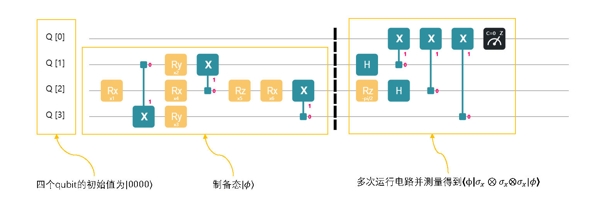

## 变分量子基态求解器 (VQE)

> 基于 QCompute 2.0 版本，我们开发了 QuantumAPP 模块，丰富并完善了 VQE 的相关功能。详见 [VQE_CN.md](../../../QAPP/tutorials/VQE_CN.md) 文件。


考虑这样一个数学问题：给定一个埃尔米特矩阵 $H$, 如何找到它的最小特征值？这一问题在物理和量子化学中有直接的应用。对于一个我们感兴趣的原子级别的系统，存在着描述该系统物理性质和行为的哈密顿量，这个哈密顿量正是一个埃尔米特矩阵。通过求解最小特征值及其特征向量，我们可以找到这个量子系统的基态。变分量子基态求解器 (VQE) 就是这样一个量子算法，其原理并不复杂。假设哈密顿量 $H$ 是一个埃尔米特矩阵，其最小特征值是 $\lambda_\text{min}$，那么对于任意一个单位向量 $\lvert {\phi}\rangle$，我们有
$$
\langle{\phi} \lvert H\lvert {\phi}\rangle \ge \lambda_\text{min}
$$
VQE 算法的核心正是通过不断调节单位向量 $\lvert {\phi}\rangle$，使得 $\langle{\phi} \lvert H\lvert {\phi}\rangle$ 越来越接近 $\lambda_\text{min}$。接下来让我们了解一下 VQE 的具体实现方法，包括 $\lvert {\phi}\rangle$ 的调节和 $\langle{\phi} \lvert H\lvert {\phi}\rangle$ 的计算。

### 参数化量子电路
为了调节一个单位向量 $\lvert {\phi}\rangle$，我们需要建立一个参数化的量子电路。


上图展示了一个适用于 2 个量子比特的参数化电路，这个电路由 4 个参数 (旋转门角度 $x_i$) 控制，在给定一个输入量子态的情况下，通过调节这 4 个参数，我们可以改变电路输出的量子态。当然，我们也可以构造更复杂的参数化电路。


上图是一个适用于 5 个量子比特且含有 12 个参数的电路，同样地，通过调节这 12 个参数，我们可以得到不同的输出量子态。细心的读者可能会问:"在给定一个输入量子态时，一个参数化电路能生成任意的一个量子态吗？" 这取决于这个参数化电路的构造。对于只有两个量子比特的情形，我们可以构造出一个如下图所示的含 15 个参数的量子电路。


通过调节电路中的这 15 个参数， 我们可以输出两个量子比特的任意一个量子态 。对于任意多个的量子比特，构造一个泛化能力很强的参数化电路现今依旧是一个开放问题。从实践上来说， 只要求参数化电路输出的态 $|\phi\rangle$ 很接近真实的特征量子态 $|\phi_{\lambda_\text{min}}\rangle$， 我们就能近似求得 $\lambda \approx \lambda_\text{min}$。

现在我们知道了如何利用参数化电路调节量子态 $\lvert {\phi}\rangle$，下面我们介绍怎样利用量子电路计算 $\langle{\phi} \lvert H\lvert {\phi}\rangle$，它在物理学中被称为哈密顿量 $H$ 在量子态 $|\phi\rangle$ 下的期望值。

### 泡利测量
我们通常把 $H$ 分解成多个结构更为简单的局部哈密顿量 $H_i$ 的线性组合：
$$
H = \sum_i c_iH_i
$$
复数 $c_i$ 表示每一项的系数。其中，每一个局部哈密顿量 $H_i$ 的期望值 $\langle{\phi} \lvert H_i\lvert {\phi}\rangle$ 更容易计算，最后把所有计算结果线性组合就行了。
$$
\langle{\phi} \lvert H\lvert {\phi}\rangle = \sum_i c_i\langle{\phi} \lvert H_i\lvert {\phi}\rangle
$$
一般来说，$H$ 可以被分解成 $O(\text{poly}(n))$ 项 $H_i$ ，其中 $n$ 是系统中量子比特的个数。每一项 $H_i$ 都是泡利矩阵的张量积，例如 $\sigma_x\otimes I\otimes\sigma_z\otimes\cdots\otimes \sigma_y$。严格来说，
$$
H_i \in \{I, \sigma_x, \sigma_y, \sigma_z\}^{\otimes n}
$$
其中 $I$ 是单位矩阵， $\sigma_x, \sigma_y, \sigma_z$ 则是 Pauli 矩阵。理论上， 任何一个 $2^n \times 2^n$ 的埃尔米特矩阵 $H$ 都可以被这样分解，也就是说 ，$\{I, \sigma_x, \sigma_y, \sigma_z\}^{\otimes n}$ 是一组埃尔米特矩阵基。既然得到 $\langle{\phi} \lvert H\lvert {\phi}\rangle$ 需要计算每一项 $\langle{\phi} \lvert H_i\lvert {\phi}\rangle$，那我们如何计算现在我们需要完成最后一个拼图，也就是如何计算 $\langle{\phi} \lvert H_i\lvert {\phi}\rangle$ 呢？一种被称为**泡利测量**的技术可以帮助我们解决这个问题。我们接下来看一个简单的例子。

首先利用如下的参数化电路制备出 3 个量子比特的一个量子态 $\lvert {\phi}\rangle$。

假设我们想得到 $\langle{\phi} \lvert \sigma_x\otimes \sigma_y\otimes\sigma_z\lvert {\phi}\rangle$，那么只需要搭建下图中的电路，反复进行测量。

虽然 $\lvert {\phi}\rangle$ 是 3 个量子比特的量子态，但我们需要一个额外的辅助量子比特 $q_0$ 帮助我们计算 $\langle{\phi} \lvert \sigma_x\otimes \sigma_y\otimes\sigma_z\lvert {\phi}\rangle$。注意到新增加的第二部分电路，它含有阿达玛门 $H$ (**注意**：这里的 $H$ 指阿达玛门，而不是前面讨论的哈密顿量) 和 $R_z(-\pi/2)$ 门，这一部分电路是为 $\sigma_x\otimes \sigma_y\otimes\sigma_z$ 量身打造的。不同的 $H_i$ 会对应不同的测量电路，我们下面会详细介绍。多次测量辅助量子比特后，统计出测量结果为 0 和为 1 的概率，用测量得到 0 的概率减去测量得到 1 的概率，得到的数值便是 $\langle{\phi} \lvert \sigma_x\otimes \sigma_y\otimes\sigma_z\lvert {\phi}\rangle$ 的近似值。测量次数越多，计算的结果就越精确。我们说到不同的 $H_i$ 会对应不同的电路构造，现在来看一下当 $H_i = \sigma_z\otimes \sigma_x\otimes I$ 的时候， 测量电路会变成什么样。

注意到只有电路的第二部分变化了，电路其它的部分则保持不变。 我们仍然是让这个电路在初始态 $\lvert {0000}\rangle$ 上跑好多好多次，统计出 $q_0$ 测得 0 的概率减去测得 1 的概率，得到的数值便是 $\langle{\phi} \lvert \sigma_z\otimes \sigma_x\otimes I\lvert {\phi}\rangle$ 的近似值。其实这里有个重要的规律：

* $\sigma_x$ 对应构造 阿达玛门 $H$ + $CNOT$ 测量
* $\sigma_y$ 对应构造 $R_z(-\pi/2)$ 门 + 阿达玛门 $H$ + $CNOT$ 测量
* $\sigma_z$ 对应构造 $CNOT$ 测量
* $I$ 单位阵对应什么也不加

回顾一下 $\sigma_x\otimes \sigma_y\otimes\sigma_z$ 所对应的电路，你发现了吗？$q_1$ 添加的是阿达玛门 + $CNOT$, 对应的是$\sigma_x\otimes \sigma_y\otimes\sigma_z$ 的第一项 $\sigma_x$; $q_2$ 添加的是 $R_z(-\pi/2)$门 + 阿达玛门 + $CNOT$， 对应的是 $\sigma_x\otimes \sigma_y\otimes\sigma_z$ 的第二项 $\sigma_y$; $q_3$ 添加的是 $CNOT$, 对应的是 $\sigma_x\otimes \sigma_y\otimes\sigma_z$ 的第三项 $\sigma_z$。我猜你应该看出了些苗头，让我们再研究一下 $\sigma_z\otimes \sigma_x\otimes I$ 对应的电路。

$q_1$ 添加的是 $CNOT$门, 对应的是 $\sigma_z\otimes \sigma_x\otimes I$ 的第一项 $\sigma_z$; $q_2$ 添加的是阿达玛门 + $CNOT$门， 对应的是 $\sigma_z\otimes \sigma_x\otimes I$ 的第二项 $\sigma_x$; $q_3$ 什么也没加, 对应的是 $\sigma_z\otimes \sigma_x\otimes I$ 的第三项 $I$。让我考考你，测量 $\langle{\phi} \lvert \sigma_y\otimes I\otimes \sigma_y\lvert {\phi}\rangle$ 的电路会长什么样？答案见下图:


这样的话，我们已经可以得到 $H = 0.5*\sigma_x\otimes \sigma_y\otimes\sigma_z + 0.2*\sigma_z\otimes \sigma_x\otimes I + 0.8 * \sigma_y\otimes I\otimes \sigma_y$ 关于$\lvert {\phi}\rangle$的期望值$\langle{\phi} \lvert H\lvert {\phi}\rangle$ 了，只要我们让前三个设计的电路每个都独立运行好多好多次，统计并计算每一项的结果，结合系数进行线性相加就好了。我知道，第一次看起来会很复杂。但是不用怕，前面的部分多读几遍，原理其实并不深奥。

### 梯度下降
当你差不多弄懂了前面的细节，我们继续前进。 要注意到， 我们最后得到的数值其实是 $\langle{\phi} \lvert H\lvert {\phi}\rangle$ 的一个近似值，含有一定的统计误差。当你的测量次数越多，误差越小，你得到的结果会越精确。 其次，当你变化电路中的六个参数，你会得到新的 $\lvert {\phi}\rangle$。同理你会得到崭新的 $\langle{\phi} \lvert H\lvert {\phi}\rangle$。咦？这不就是一个多元函数？是的，在几乎所有关于 VQE 的学术论文中，学者们都会把 $\langle{\phi} \lvert H\lvert {\phi}\rangle$ 看成一个多元函数

$$
L(\theta_1, \theta_2,\cdots, \theta_m) \\=
\langle{\phi(\theta_1, \theta_2,\cdots, \theta_m)} \lvert H\lvert {\phi(\theta_1, \theta_2,\cdots, \theta_m)}\rangle \\ = 
\langle{00\cdots 0} \lvert U^\dagger(\theta_1, \theta_2,\cdots, \theta_m) HU(\theta_1, \theta_2,\cdots, \theta_m)\lvert {00\cdots 0}\rangle
$$

其中 $U(\theta_1, \theta_2,\cdots, \theta_m)$ 是含参数电路所代表的矩阵。如果你把它看成多元函数，那么寻找 $H$ 的最小特征值问题就转化成了寻找多元函数 $L(\theta_1, \theta_2, \cdots \theta_n)$ 的最小值问题。让我们梳理一下思路，我们想要找到埃尔米特矩阵 $H$ 的最小特征值 $\lambda_{min}$，首先构造一个含参数的电路并选定一组参数，然后把 $H$ 分解成 Pauli 矩阵张量积的线性组合并参考之前的规则在我们的参数化电路后面接入对应的测量电路，测量多次后计算得到每一个 $\langle{\phi} \lvert H_i\lvert {\phi}\rangle$ 的近似值并按照如下公式进行线性相加
$$
L(\theta_1, \theta_2, \cdots \theta_m) = \langle{\phi} \lvert H\lvert {\phi}\rangle = \sum_i c_i\langle{\phi} \lvert H_i\lvert {\phi}\rangle
$$
由此我们得到了 $\langle{\phi} \lvert H\lvert {\phi}\rangle$ 的近似值。这给了我们一个想法，我们可以计算 $L(\theta_1, \theta_2, \cdots \theta_n)$ 的梯度。利用经典的梯度下降，我们就可以更新参数。迭代多次以后，我们就能找到 $L(\theta_1, \theta_2, \cdots \theta_n)$ 的最小值了！选择一个足够小的 $\epsilon$，利用
$$
\frac{\partial L}{\partial \theta_i} \approx \frac{L(\cdots,\theta_i+\epsilon, \cdots) - L(\cdots,\theta_i, \cdots)}{\epsilon}
$$
我们就可以得到完整的梯度，这种方法被称为有限差分方法。由于 VQE 统计误差的存在，有限差分有严重的精度缺陷。因此我们倾向于使用解析梯度的方法获得 $L(\theta_1, \theta_2, \cdots \theta_n)$ 的梯度
$$
\frac{\partial L}{\partial \theta_i} = \frac{ L(\cdots,\theta_i+\pi/2, \cdots) - L(\cdots,\theta_i-\pi/2, \cdots)}{2}
$$
注意，我们算出的是精确的梯度而不是有限差分的近似梯度！解析梯度精度不会被严重干扰，因此成了 VQE 进行梯度计算的首选工具。下面就让我们在量易伏上实战演练一下！

### 量易伏实现VQE
首先调用需要的包
```python
from copy import copy
import multiprocessing as mp
import pickle
import random
from functools import reduce
from os import path

import numpy as np
import scipy
import scipy.linalg
from matplotlib import pyplot as plt
import time
import os

import sys
sys.path.append('../../..')  # "from QCompute import *" requires this
from QCompute import *
```
然后我们进行各种参数及超参数的设置
```python
# Hyper-parameter setting
shots = 1024
n = 4  # n must be larger than or equal to 2; n is the size of our quantum system
assert n >= 2
L = 2  # L is the number of layers
iteration_num = 20
experiment_num = 4  # That's the number of parallel experiments we will run;
# it indicates the number of processes we will use.
# Don't stress your computer too much.
learning_rate = 0.3
delta = np.pi / 2  # Calculate analytical derivative
SEED = 36  # This number will determine what the final Hamiltonian is. It is also
# used to make sure Mac and Windows behave the same using multiprocessing module.
K = 3  # K is the number of local Hamiltonian in H
N = 3 * n * L # N is the number of parameters needed for the circuit
random.seed(SEED)
```
定义可以随机生成哈密顿量的函数
```python
def random_pauli_generator(l):
    """
    The following functions are used to generate random Hamiltonian
    """

    s = ''
    for i in range(l):
        s = s + random.choice(['i', 'x', 'y', 'z'])
    return s

def random_H_generator(n, k):
    """
    n is the number of qubits, k is the number of local Hamiltonian in H
    """

    H = []
    for i in range(k):
        H.append([random.random(), random_pauli_generator(n)])
    return H


Hamiltonian = random_H_generator(n, K)  # Our Hamiltonian H
```
借用 [Paddle Quantum](https://github.com/PaddlePaddle/Quantum/blob/master/paddle_quantum/utils.py) 中计算多个矩阵张量积的函数
```python
# From Paddle_quantum package
def NKron(AMatrix, BMatrix, *args):
    """
    Recursively execute kron n times. This function at least has two matrices.
    :param AMatrix: First matrix
    :param BMatrix: Second matrix
    :param args: If have more matrix, they are delivered by this matrix
    :return: The result of tensor product.
    """

    return reduce(
        lambda result, index: np.kron(result, index),
        args,
        np.kron(AMatrix, BMatrix), )
```
定义计算一个哈密顿量最小特征值的函数
```python
def ground_energy(Ha):
    """
    It returns the ground energy of Hamiltonian Ha,
    which looks like [[12, 'xyiz'], [21, 'zzxz'], [10, 'iixy']].
    """

    # It is a local function
    def my_f(s):
        s = s.lower()

        I = np.eye(2) + 0j
        X = np.array([[0, 1], [1, 0]]) + 0j
        Y = np.array([[0, -1j], [1j, 0]])
        Z = np.array([[1, 0], [0, -1]]) + 0j

        if s == 'x':
            return X
        elif s == 'y':
            return Y
        elif s == 'z':
            return Z
        else:
            return I

    # It is a local function
    def my_g(s_string):
        H = []
        for ele in s_string:
            H.append(my_f(ele))
        return NKron(*H)

    sum = 0
    for ele in Ha:
        sum += ele[0] * my_g(ele[1])

    eigen_vector = np.sort(scipy.linalg.eig(sum)[0])
    return eigen_vector[0].real
```
这两个函数帮助我们对实验结果进行可视化并保存
```python
def fig_name():
    """
    Generate a title of figure with time.
    """
    return os.path.dirname(__file__) + '/VQE' + time.strftime("%Y%m%d%H%M%S", time.localtime(time.time())) + '.png'


def eigen_plot(eigenv_list, actual_eigenv):
    """
    This is the plot function of actual loss over iterations.
    """

    for ele in eigenv_list:
        plt.plot(list(range(1, len(ele) + 1)), ele, linewidth=4)

    plt.axhline(y=actual_eigenv, color='black', linestyle='-.')
    plt.xlabel('iteration')
    plt.ylabel('loss')
    plt.title('Actual Loss Over Iteration')
    plt.savefig(fig_name())
    # plt.show()
```


接下来的这个函数用来处理实验的测量结果，近似估计出那个多余的 qubit 测量得到 0 的概率减去得到 1 的概率
```python
def prob_calc(data_dic):
    """
    Measure the first (ancillary) qubit. Returns the value
    of 'the probability of getting 0' minus 'the probability of getting 1'.
    """

    sum_0 = 0
    sum_1 = 0
    for key, value in data_dic.items():
        if int(list(key)[-1], 16) % 2 == 0:
            sum_0 += value
        else:
            sum_1 += value
    return (sum_0 - sum_1) / shots
```
下面的函数用帮助生成参数化电路
```python
def add_block(q, loc, para):
    """
    Add a RzRyRz gate block. Each block has 3 parameters.
    """

    RZ(para[0])(q[loc])
    RY(para[1])(q[loc])
    RZ(para[2])(q[loc])


def add_layer(para, q):
    """
    Add a layer, each layer has 3*n parameters. para is a 2-D numpy array
    """

    for i in range(1, n + 1):
        add_block(q, i, para[i-1])
    for i in range(1, n):
        CX(q[i], q[i+1])
    CX(q[n], q[1])
```
然后我们根据线性分解后的哈密顿量，针对性的设计相应的测量电路
```python
def self_defined_circuit(para, hamiltonian):
    """
    H is a list, for example, if H = 12*X*Y*I*Z + 21*Z*Z*X*Z + 10* I*I*X*Y,
    then parameter Hamiltonian is [[12, 'xyiz'], [21, 'zzxz'], [10, 'iixy']](upper case or lower case are all fine).
    It returns the expectation value of H.
    """

    env = QEnv()
    env.backend(BackendName.LocalBaiduSim2)

    # the first qubit is ancilla
    q = env.Q.createList(n + 1)

    hamiltonian = [symbol.lower() for symbol in hamiltonian]
    high_D_para = para.reshape(L, n, 3) # Change 1-D numpy array to a 3-D numpy array

    # Set up our parameterized circuit
    for i in range(1, n + 1):
        H(q[i])

    # Add parameterized circuit
    for i in range(L):
        add_layer(high_D_para[i], q)

    for i in range(n):
        # Set up Pauli measurement circuit
        if hamiltonian[i] == 'x':
            H(q[i + 1])
            CX(q[i + 1], q[0])

        elif hamiltonian[i] == 'z':
            CX(q[i + 1], q[0])

        elif hamiltonian[i] == 'y':
            RZ(-np.pi / 2)(q[i + 1])
            H(q[i + 1])
            CX(q[i + 1], q[0])

    # Measurement result
    MeasureZ(*env.Q.toListPair())
    taskResult = env.commit(shots, fetchMeasure=True)
    return prob_calc(taskResult['counts'])
```
接下来是一个计算梯度，并更新参数的函数
```python
def diff_fun(f, para):
    """
    It calculates the gradient of f on para,
    update parameters according to the gradient, and return the updated parameters.
    'para' is a np.array.
    """

    para_length = len(para)
    gradient = np.zeros(para_length)

    for i in range(para_length):
        para_copy_plus = copy(para)
        para_copy_minus = copy(para)
        para_copy_plus[i] += delta
        para_copy_minus[i] -= delta

        gradient[i] = (f(para_copy_plus) - f(para_copy_minus)) / 2

    new_para = copy(para)
    res = new_para - learning_rate * gradient
    return res
```
计算 $\langle{\phi} \lvert H\lvert {\phi}\rangle$
```python
def loss_fun(para):
    """
    This is the loss function.
    """

    res = sum([ele[0] * self_defined_circuit(para, ele[1]) for ele in Hamiltonian])
    return res
```
由于要用到 multiprocessing 这个包，我们要将进行一些封装
```python
def multi_process_fun(j):
    """
    This function runs one experiment, parameter j indicates it is the j-th experiment.
    """

    np.random.seed()
    para = np.random.rand(N) * np.pi
    para_list = [para]

    for i in range(iteration_num):
        para_list.append(diff_fun(loss_fun, para_list[i]))

    with open(path.join(outputDirPath, f"para{j}.pickle"), "wb") as fp:
        pickle.dump(para_list, fp)
```
最后我们可以运行主程序了
```python
def main():
    """
    main
    """

    pool = mp.Pool(experiment_num)
    pool.map(multi_process_fun, range(experiment_num))
    loss_list = []

    for _ in range(experiment_num):
        actual_loss = []
        with open(path.join(outputDirPath, f"para{_}.pickle"), "rb") as fp:
            new_para_list = pickle.load(fp)

        for j in range(iteration_num):
            actual_loss.append(loss_fun(new_para_list[j]))

        loss_list.append(actual_loss)

    eigen_plot(loss_list, ground_energy(Hamiltonian))


if __name__ == '__main__':
    main()
```
下面这张图是由上述代码运行出的实验结果， 每一根线都是一个不同的 process 独立进行的 20 次梯度下降优化，可以看到效果还不错。


---
## 参考文献：
[Peruzzo, Alberto, et al. "A variational eigenvalue solver on a photonic quantum processor." Nature communications 5 (2014): 4213.](https://www.nature.com/articles/ncomms5213)