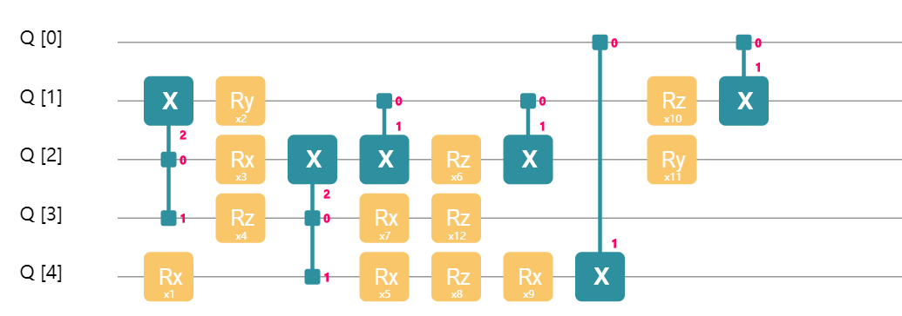
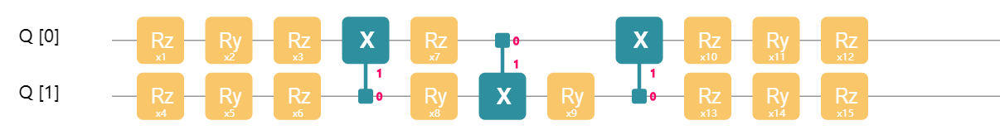
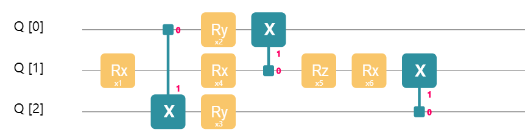
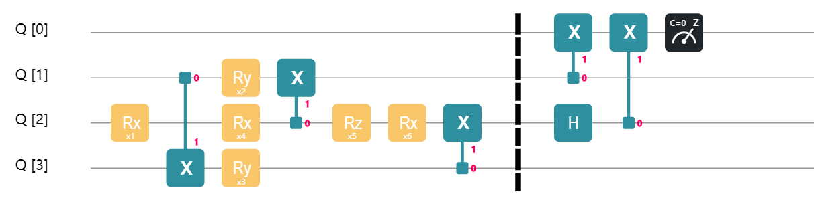
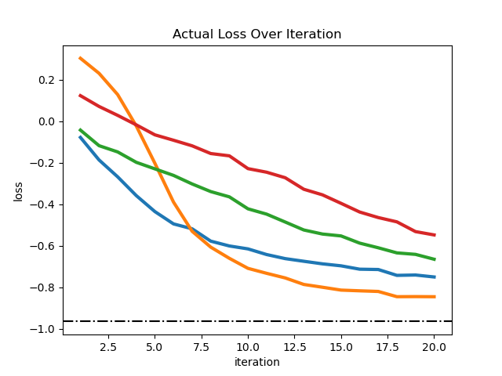

## Variational Quantum Eigensolver (VQE)

> Based on QCompute version 2.0, we have developed QuantumAPP module to enrich and improve the VQE related functions. See [VQE_EN.md](../../../QAPP/tutorials/VQE_EN.md) for details.

Consider the following question: how to find the smallest eigenvalue of a Hermitian matrix $H$? This question is important for physics and quantum chemistry. For an atomic level system, there is a Hamiltonian $H$, which is a Hermitian matrix, that describes the system's characteristics and behaviors. By finding the smallest eigenvalue of $H$ and its corresponding eigenvectors, we can find the ground energy and state of this system. VQE is a quantum technique designed to handle this task. The idea behind VQE is amazingly simple and easy to understand. Suppose $\lambda_\text{min}$ is the smallest eigenvalue of a Hamiltonian $H$. Then for every quantum state $\lvert {\phi}\rangle$,
$$
\langle{\phi} \lvert H\lvert {\phi}\rangle \ge \lambda_\text{min}.
$$
The core of VQE is to minimize $\langle{\phi} \lvert H\lvert {\phi}\rangle$ by adjusting $\lvert {\phi}\rangle$, and thus to estimate $\lambda_\text{min}$ the ground energy of the system. Now, let's learn more about details about VQE, including how to adjust $|\phi\rangle$ and how to compute $\langle{\phi} \lvert H\lvert {\phi}\rangle$.

### Parameterized Quantum Circuit
To adjust a quantum state $\lvert {\phi}\rangle$, we need to build a parameterized quantum circuit.


The figure above shows a 2-qubit quantum circuit controlled by 4 parameters. By adjusting the 4 parameters, we can change the output state of the circuit given a fixed input state. Certainly, you can build a more complex parameterized quantum circuit.



The figure above shows a 5-qubit quantum circuit with 12 parameters. Still, by adjusting those parameters, we can change the output state. Some readers may wonder that, given a fixed input state, whether a parameterized circuit can output an arbitrary quantum state. That depends on the structre of a parameterized circuit. For a 2-qubit system, we can build a parameterized with 15 parameters, shown in the figure below.



By adjusting those 15 parameters, we can generate an arbitrary 2-qubit state. Generally, it is not only hard, but impractical to design a parameterized quantum circuit that can generate any possible quantum state. In practice, we only need a quantum state $|\phi\rangle$ close enough to the ground state $|\phi_{\lambda_\text{min}}\rangle$ to make a good estimation of $\lambda_{min}$.

Now that we understand how to adjust $\lvert {\phi}\rangle$ with a parameterized quantum circuit, let's keep on and learn to use quantum circuits to compute $\langle{\phi} \lvert H\lvert {\phi}\rangle$, the expectation value of $H$ under state $|\phi\rangle$.

### Pauli Measurement
Usually, we decompose $H$ into a linear combination of multiple Hamiltonians $H_i$ with simpler structures. That is,
$$
H = \sum_i c_iH_i,
$$
where $c_i$ is a complex coefficient. For each $H_i$, the expectation value $\langle\phi|H_i|\phi\rangle$ is easy to compute. After computing $\langle\phi|H_i|\phi\rangle$ for all $H_i$, we get $\langle\phi|H|\phi\rangle$ through
$$
\langle{\phi} \lvert H\lvert {\phi}\rangle = \sum_i c_i\langle{\phi} \lvert H_i\lvert {\phi}\rangle.
$$

In many cases, $H$ can be decomposed into $O(\text{poly}(n))$ number of $H_i$, where n is the number of qubit. Each $H_i$ is a tensor product of Pauli matrices, e.g., $\sigma_x\otimes I\otimes\sigma_z\otimes\cdots\otimes \sigma_y$. To be precise,
$$
H_i \in \{I, \sigma_x, \sigma_y, \sigma_z\}^{\otimes n}.
$$
where $I$ is the identity matrix, and $\sigma_x, \sigma_y, \sigma_z$ are the Pauli matrices. In theory, any Hermitian $H$ can be written as a linear combination of tensor products of Pauli matrices. Since to get $\langle{\phi} \lvert H\lvert {\phi}\rangle$ we need to compute every $\langle\phi|H_i|\phi\rangle$, how do we compute $\langle\phi|H_i|\phi\rangle$ in practice? This computation can be done with a technique called Pauli measurement. Let's go through a simple example.

To begin with, we use the following circuit to prepare a 3-qubit quantum state $\lvert {\phi}\rangle$.


Suppose we want to get the value $\langle{\phi} \lvert \sigma_x\otimes \sigma_y\otimes\sigma_z\lvert {\phi}\rangle$, so we build a circuit like the one in the figure below and run it for several times.

Notice that we add an ancilla qubit $q_0$ to our circuit. The purpose of this extra qubit is to help us compute the value of $\langle{\phi} \lvert \sigma_x\otimes \sigma_y\otimes\sigma_z\lvert {\phi}\rangle$. Also notice that we append a new part to the circuit which contains gates including Hadamard​ gates and a $R_z(-\pi/2)$ gate. This new part of circuit is another trick to get $\langle{\phi} \lvert \sigma_x\otimes \sigma_y\otimes\sigma_z\lvert {\phi}\rangle$. For different $H_i$ we need to build different circuits, which we will discuss later. We run the circuit, measure the ancilla, records the result (0 or 1), and repeat the process multiple times. By recording the **frequency** of 0 and 1, we can calculate the **probability** of getting 0 and 1:
$$
\text{The value of }\langle{\phi} \lvert \sigma_x\otimes \sigma_y\otimes\sigma_z\lvert {\phi}\rangle \approx \\ \text{The probability of getting 0} - \text{The probability of getting 1}
$$
The more you repeat, the more accurate your result will be. We have just learned how different $H_i$ have different circuits associate with them. Let me show you what the circuit look like if $H_i = \sigma_z\otimes \sigma_x\otimes I$:

See? The second part of the circuit changed and the rest remains the same. We still run the circuit multiple times, measure the ancilla each time, record the result, and repeat the same procedure to calculate the probability of getting 0 minus the probability of getting 1, which is very close to $\langle{\phi} \lvert \sigma_z\otimes \sigma_x\otimes I\lvert {\phi}\rangle$. Of course, the more it repeats, the closer the result gets. There are some rules you need to follow:

* $\sigma_x\to$ $Hadamard$ gate + $CNOT$ gate
* $\sigma_y\to$ $R_z(-\pi/2)$gate + $Hadamard$ gate + $CNOT$ gate
* $\sigma_z\to$ $CNOT$ gate
* $I \to$ add nothing

Have you seen patterns from the circuit that corresponds with $\sigma_x\otimes \sigma_y\otimes\sigma_z$? We add a $Hadamard$ gate on $q_1$ and a $CNOT$ gate, because the first item in $\sigma_x\otimes \sigma_y\otimes\sigma_z$ is $\sigma_x$; we add a $R_z(-\pi/2)$ gate, $Hadamard$ gate on $q_2$ and a $CNOT$ gate. That is because the second part of $\sigma_x\otimes \sigma_y\otimes\sigma_z$ is $\sigma_y$. We only add a $CNOT$ gate on $q_3$ because the third part is $\sigma_z$. Now, let's figure out the circuit associated with$\sigma_z\otimes \sigma_x\otimes I$:

Apply $CNOT$ gate onto $q_1$, because the first part of $\sigma_z\otimes \sigma_x\otimes I$ is $\sigma_z$; $Hadamard$ gate and $CNOT$ gate are applied onto $q_2$, because the second part is $\sigma_x$; add nothing on $q_3$, because the third part is $I$. Let's take a quiz, what is the circuit that measures $\langle{\phi} \lvert \sigma_y\otimes I\otimes \sigma_y\lvert {\phi}\rangle$ ? The answer is in the figure below:


Not surprisingly, we get all gradients to get the value $\langle{\phi} \lvert H\lvert {\phi}\rangle$, where
$$H = 0.5*\sigma_x\otimes \sigma_y\otimes\sigma_z + 0.2*\sigma_z\otimes \sigma_x\otimes I + 0.8 * \sigma_y\otimes I\otimes \sigma_y$$
Just run the three circuit independently multiple times and record the measurement records on the ancilla. Calculate$\langle{\phi} \lvert H_i\lvert {\phi}\rangle$, times the coefficient, add them up and we are done. I know it looks intimidating and complicated the first time you read this. Just read the previous part a few more times, and you will get it through. There is nothing incomprehensible in VQE.


### Gradient Descent
After understanding the details of previous sections, we keep moving. Notice that the value you get is actually an approximation of $\langle{\phi} \lvert H\lvert {\phi}\rangle$. The more measurements, the more precise the result will be. Second of all, by adjusting the six parameters in the circuit, you get new values for $\langle{\phi} \lvert H\lvert {\phi}\rangle$ every time. Isn't that interesting, it is a multivariate function! In fact, in almost all papers related to VQE, scholars unanimously view$\langle{\phi} \lvert H\lvert {\phi}\rangle$ as a multivariate function.

$$
L(\theta_1, \theta_2,\cdots, \theta_m) \\=
\langle{\phi(\theta_1, \theta_2,\cdots, \theta_m)} \lvert H\lvert {\phi(\theta_1, \theta_2,\cdots, \theta_m)}\rangle \\ = 
\langle{00\cdots 0} \lvert U^\dagger(\theta_1, \theta_2,\cdots, \theta_m) HU(\theta_1, \theta_2,\cdots, \theta_m)\lvert {00\cdots 0}\rangle
$$

where $U(\theta_1, \theta_2,\cdots, \theta_m)$ is the matrix representation of the parameterized circuit. If you do view it as a multivariate function, the problem of finding the smallest eigenvalue of $H$ is equivalent to finding the minimum value of $L(\theta_1, \theta_2,\cdots, \theta_m)$. Let's do a brief recap. We want to find the smallest eigenvalue of a Hermitian $H$, so we decompose it to a linear summation of $H_i$, tensor product of Pauli matrices and identity matrices. We build a parameterized circuit and apply appropriate gates in the end according to the rules for each $H_i$, measure the ancilla multiple times for each circuit, calculate $\langle{\phi} \lvert H_i\lvert {\phi}\rangle$ and add them back to get an approximation of $\langle{\phi} \lvert H\lvert {\phi}\rangle$
$$
L(\theta_1, \theta_2, \cdots \theta_m) = \langle{\phi} \lvert H\lvert {\phi}\rangle = \sum_i c_i\langle{\phi} \lvert H_i\lvert {\phi}\rangle
$$
You might realize that we can use Gradient Descend method to help us find the minimum value of $L(x_1, x_2, \cdots x_n)$. Find a small number $\epsilon$, and we can calculate the gradient of function $L$ by the following rule:
$$
\frac{\partial L}{\partial \theta_i} \approx \frac{L(\cdots,\theta_i+\epsilon, \cdots) - L(\cdots,\theta_i, \cdots)}{\epsilon}
$$
This is called finite-difference methods. Since it can yield extremely unstable result due to statistical error, we use a different way to get the gradient instead, and that is called analytical gradient method
$$
\frac{\partial L}{\partial \theta_i} = \frac{ L(\cdots,\theta_i+\pi/2, \cdots) - L(\cdots,\theta_i-\pi/2, \cdots)}{2}
$$
Thanks to the exotic structure of VQE, we get an equation instead of an approximate equation! Analytical gradient method is relatively stable. It became a basic method for VQE. After reading, get our hand dirty by coding on Quantum Leaf, shall we?

### Implement VQE with QCompute
Import the packages we need:
```python
from copy import copy
import multiprocessing as mp
import pickle
import random
from functools import reduce
from os import path

import numpy as np
import scipy
import scipy.linalg
from matplotlib import pyplot as plt
import time
import os

import sys
sys.path.append('../../..')  # "from QCompute import *" requires this
from QCompute import *
```
Set up parameters and hyper parameters:
```python
# Hyper-parameter setting
shots = 1024
n = 4  # n must be larger than or equal to 2; n is the size of our quantum system
assert n >= 2
L = 2  # L is the number of layers
iteration_num = 20
experiment_num = 4  # That's the number of parallel experiments we will run;
# it indicates the number of processes we will use.
# Don't stress your computer too much.
learning_rate = 0.3
delta = np.pi / 2  # Calculate analytical derivative
SEED = 36  # This number will determine what the final Hamiltonian is. It is also
# used to make sure Mac and Windows behave the same using multiprocessing module.
K = 3  # K is the number of local Hamiltonian in H
N = 3 * n * L # N is the number of parameters needed for the circuit
random.seed(SEED)
```
It is a function that can generate random Hamiltonian:
```python
def random_pauli_generator(l):
    """
    The following functions are used to generate random Hamiltonian
    """

    s = ''
    for i in range(l):
        s = s + random.choice(['i', 'x', 'y', 'z'])
    return s

def random_H_generator(n, k):
    """
    n is the number of qubits, k is the number of local Hamiltonian in H
    """

    H = []
    for i in range(k):
        H.append([random.random(), random_pauli_generator(n)])
    return H


Hamiltonian = random_H_generator(n, K)  # our hamiltonian H
```
It is a function that can calculate tensor product of multiple matrices. It is borrowed from [Paddle Quantum](https://github.com/PaddlePaddle/Quantum/blob/master/paddle_quantum/utils.py).
```python
# From Paddle_quantum package
def NKron(AMatrix, BMatrix, *args):
    """
    Recursively execute kron n times. This function at least has two matrices.
    :param AMatrix: First matrix
    :param BMatrix: Second matrix
    :param args: If have more matrix, they are delivered by this matrix
    :return: The result of tensor product.
    """

    return reduce(
        lambda result, index: np.kron(result, index),
        args,
        np.kron(AMatrix, BMatrix), )
```
This a function that calculates the smallest eigenvalue of a Hermitian matrix:
```python
def ground_energy(Ha):
    """
    It returns the ground energy of Hamiltonian Ha,
    which looks like [[12, 'xyiz'], [21, 'zzxz'], [10, 'iixy']].
    """

    # It is a local function
    def my_f(s):
        s = s.lower()

        I = np.eye(2) + 0j
        X = np.array([[0, 1], [1, 0]]) + 0j
        Y = np.array([[0, -1j], [1j, 0]])
        Z = np.array([[1, 0], [0, -1]]) + 0j

        if s == 'x':
            return X
        elif s == 'y':
            return Y
        elif s == 'z':
            return Z
        else:
            return I

    # It is a local function
    def my_g(s_string):
        H = []
        for ele in s_string:
            H.append(my_f(ele))
        return NKron(*H)

    sum = 0
    for ele in Ha:
        sum += ele[0] * my_g(ele[1])

    eigen_vector = np.sort(scipy.linalg.eig(sum)[0])
    return eigen_vector[0].real
```

These two functions are used to visualize our results and save as figure:
```python
def fig_name():
    """
    Generate a title of figure with time.
    """
    return os.path.dirname(__file__) + '/VQE' + time.strftime("%Y%m%d%H%M%S", time.localtime(time.time())) + '.png'


def eigen_plot(eigenv_list, actual_eigenv):
    """
    This is the plot function of actual loss over iterations.
    """

    for ele in eigenv_list:
        plt.plot(list(range(1, len(ele) + 1)), ele, linewidth=4)

    plt.axhline(y=actual_eigenv, color='black', linestyle='-.')
    plt.xlabel('iteration')
    plt.ylabel('loss')
    plt.title('Actual Loss Over Iteration')
    plt.savefig(fig_name())
    # plt.show()
```
This function processes the experiment results, calculates the probability of getting 0 minus the probability of getting 0 with the ancillary qubit:
```python
def prob_calc(data_dic):
    """
    Measure the first (ancilla) qubit. Returns the value
    of 'the probability of getting 0' minus 'the probability of getting 1'.
    """

    sum_0 = 0
    sum_1 = 0
    for key, value in data_dic.items():
        if int(list(key)[-1], 16) % 2 == 0:
            sum_0 += value
        else:
            sum_1 += value
    return (sum_0 - sum_1) / shots
```
The flowing functions helps build a parameterized circuit:
```python
def add_block(q, loc, para):
    """
    Add a RzRyRz gate block. Each block has 3 parameters.
    """

    RZ(para[0])(q[loc])
    RY(para[1])(q[loc])
    RZ(para[2])(q[loc])

def add_layer(para, q):
    """
    Add a layer, each layer has 3*n parameters. para is a 2-D numpy array
    """

    for i in range(1, n + 1):
        add_block(q, i, para[i-1])
    for i in range(1, n):
        CX(q[i], q[i+1])
    CX(q[n], q[1])
```
Decompose $H$ into a linear summation of $H_i$, implement corresponding circuit according to the rules:
```python
def self_defined_circuit(para, hamiltonian):
    """
    H is a list, for example, if H = 12*X*Y*I*Z + 21*Z*Z*X*Z + 10* I*I*X*Y,
    then parameter Hamiltonian is [[12, 'xyiz'], [21, 'zzxz'], [10, 'iixy']](upper case or lower case are all fine).
    It returns the expectation value of H.
    """

    env = QEnv()
    env.backend(BackendName.LocalBaiduSim2)

    # the first qubit is ancilla
    q = env.Q.createList(n + 1)

    hamiltonian = [symbol.lower() for symbol in hamiltonian]
    high_D_para = para.reshape(L, n, 3) # Change 1-D numpy array to a 3-D numpy array

    # Set up our parameterized circuit
    for i in range(1, n + 1):
        H(q[i])

    # Add parameterized circuit
    for i in range(L):
        add_layer(high_D_para[i], q)

    for i in range(n):
        # Set up Pauli measurement circuit
        if hamiltonian[i] == 'x':
            H(q[i + 1])
            CX(q[i + 1], q[0])

        elif hamiltonian[i] == 'z':
            CX(q[i + 1], q[0])

        elif hamiltonian[i] == 'y':
            RZ(-np.pi / 2)(q[i + 1])
            H(q[i + 1])
            CX(q[i + 1], q[0])

    # Measurement result
    MeasureZ(*env.Q.toListPair())
    taskResult = env.commit(shots, fetchMeasure=True)
    return prob_calc(taskResult['counts'])
```

This function calculates the gradient and updates parameters each time you call it:
```python
def diff_fun(f, para):
    """
    It calculates the gradient of f on para,
    update parameters according to the gradient, and return the updated parameters.
    'para' is a np.array.
    """

    para_length = len(para)
    gradient = np.zeros(para_length)

    for i in range(para_length):
        para_copy_plus = copy(para)
        para_copy_minus = copy(para)
        para_copy_plus[i] += delta
        para_copy_minus[i] -= delta

        gradient[i] = (f(para_copy_plus) - f(para_copy_minus)) / 2

    new_para = copy(para)
    res = new_para - learning_rate * gradient
    return res
```
Calculate$\langle{\phi} \lvert H\lvert {\phi}\rangle$:
```python
def loss_fun(para):
    """
    This is the loss function.
    """

    res = sum([ele[0] * self_defined_circuit(para, ele[1]) for ele in Hamiltonian])
    return res
```
Because we need to use multiprocessing package, we need some wrap up:
```python
def multi_process_fun(j):
    """
    This function runs one experiment, parameter j indicates it is the j-th experiment.
    """

    np.random.seed()
    para = np.random.rand(N) * np.pi
    para_list = [para]

    for i in range(iteration_num):
        para_list.append(diff_fun(loss_fun, para_list[i]))

    with open(path.join(outputDirPath, f"para{j}.pickle"), "wb") as fp:
        pickle.dump(para_list, fp)
```
Finally we can run our main program:
```python
def main():
    """
    main
    """

    pool = mp.Pool(experiment_num)
    pool.map(multi_process_fun, range(experiment_num))
    loss_list = []

    for _ in range(experiment_num):
        actual_loss = []
        with open(path.join(outputDirPath, f"para{_}.pickle"), "rb") as fp:
            new_para_list = pickle.load(fp)

        for j in range(iteration_num):
            actual_loss.append(loss_fun(new_para_list[j]))

        loss_list.append(actual_loss)

    eigen_plot(loss_list, ground_energy(Hamiltonian))


if __name__ == '__main__':
    main()
```
Here is the figure that generated by one test of the whole program. Each thread is an independent process that makes 20 gradient descend iterations. Not so bad, eh?


---
## Reference
[Peruzzo, Alberto, et al. "A variational eigenvalue solver on a photonic quantum processor." Nature communications 5 (2014): 4213.](https://www.nature.com/articles/ncomms5213)