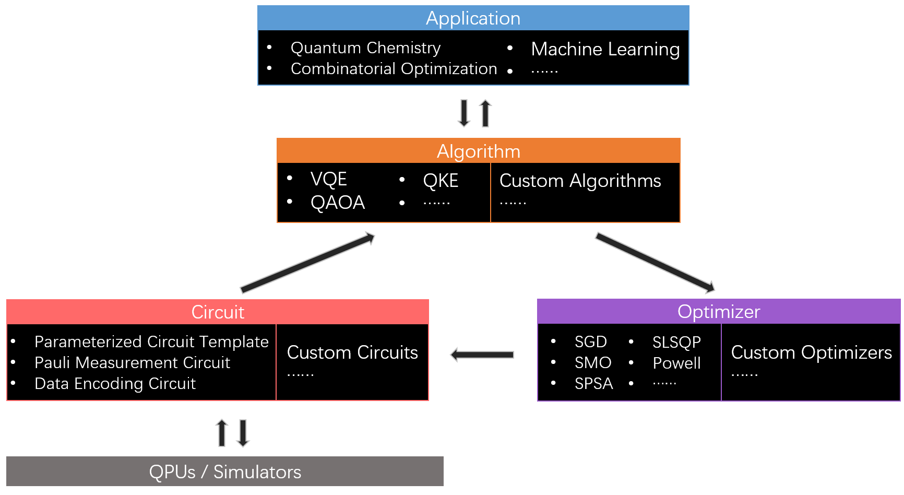

English | [简体中文](README_CN.md)

# QCompute-QAPP User's Guide

<em> Copyright (c) 2022 Institute for Quantum Computing, Baidu Inc. All Rights Reserved. </em>

## QAPP Introduction

QAPP is a quantum computing toolbox based on the [QCompute](https://quantum-hub.baidu.com/opensource) component of [Quantum Leaf](https://quantum-hub.baidu.com/), which provides quantum computing services for solving problems in many fields including quantum chemistry, combinatorial optimization, machine learning, etc. QAPP provides users with a one-stop quantum computing application development function, which directly connects to users' real needs in artificial intelligence, financial technology, education and research.

## QAPP Architecture

QAPP architecture follows the complete development logic from application to real machine, including four modules: Application, Algorithm, Circuit, and Optimizer. The Application module converts the user requirements into the corresponding mathematical problem; the Algorithm module selects a suitable quantum algorithm to solve the mathematical problem; during the solution process, the user can specify the optimizer provided in the Optimizer module or design a custom optimizer; the quantum circuit required for the solution process is supported by the Circuit module. The Circuit module directly calls the [QCompute](https://quantum-hub.baidu.com/opensource) platform, and supports calls to the [Quantum Leaf](https://quantum-hub.baidu.com/services) simulators or QPUs.

QAPP architecture

## QAPP Case Primer

We provide three QAPP practical cases for solving [molecular ground state energy](tutorials/VQE_EN.md), solving [combinatorial optimization problem](tutorials/Max_Cut_EN.md), and solving [classification problem](tutorials/Kernel_Classifier_EN.md). These use cases are designed to help users quickly get started with calling QAPP modules and developing custom algorithms.

## API

We provide QAPP's [API](API_Documentation.pdf) documentation for developers to review.
