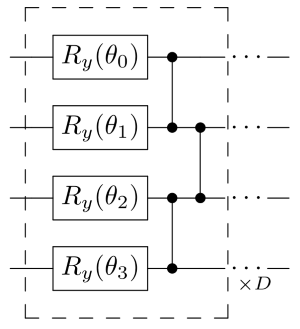

# 变分量子本征求解器

<em> 版权所有 (c) 2021 百度量子计算研究所，保留所有权利。 </em>

> 若使用云端算力运行本教程，将消耗约 300 Quantum-hub 点数。

## 概览

目前普遍认为，量子计算在近期很有前景的一个应用是处理量子化学问题 [1-2]。**变分量子本征求解器** （VQE）作为这个研究方向的核心应用之一，为研究者们提供了可以在目前含噪的中等规模量子设备（NISQ device）上研究量子化学的可能 [1-4]。其核心任务是求解一个量子尺度上封闭物理系统的哈密顿量 $\hat{H}$ 的基态能量及其对应的量子态。主要的实现方法是通过在量子设备上准备一个参数化的试探波函数 $|\Psi(\boldsymbol\theta)\rangle$ 然后结合经典机器学习中的优化算法（例如梯度下降法）去不断地调整、优化参数 $\boldsymbol\theta$ 使得期望值  $\langle \Psi(\boldsymbol\theta)|\hat{H}|\Psi(\boldsymbol\theta)\rangle$ 最小化。这套方案的基本原理是基于 **Rayleigh-Ritz 变分原理**。 

$$
E_0 = \min_{\boldsymbol\theta} \langle \Psi(\boldsymbol\theta)|\hat{H}|\Psi(\boldsymbol\theta)\rangle.
\tag{1}
$$

其中 $E_0$ 表示该系统的基态能量。从数值分析的角度来看，该问题可以被理解为求解一个**离散化**哈密顿量 $H$（厄米矩阵）的最小本征值 $\lambda_{\min}$ 和其对应的本征向量 $|\Psi_0\rangle$。具体的离散化过程是如何通过建立模型实现的，这属于量子化学的专业领域范畴。精确地解释该过程需要很长的篇幅，这超过了本教程所能处理的范围，感兴趣的读者可以参考《量子化学: 基本原理和从头计算法》系列丛书 [5]。通常来说，为了能在量子设备上处理量子化学问题，哈密顿量 $H$ 会被表示成为泡利算符 $\{X,Y,Z\}$ 的加权求和形式。

$$
H = \sum_k c_k ~ \bigg( \bigotimes_{j=0}^{M-1} \sigma_j^{(k)} \bigg),
\tag{2}
$$

其中 $c_k$ 表示权重系数, $\sigma_j^{(k)} \in \{I,X,Y,Z\}$ 并且 $M$ 表示所需的量子比特个数。这样一种哈密顿量的表示形式被称为 **泡利字符串**。以下为一个2量子比特的具体例子，

$$
H= 0.12~Y_0 \otimes I_1-0.04~X_0\otimes Z_1.
\tag{3}
$$

下面我们以氢化锂（LiH）分子为例展示如何使用 QCompute 以及 QAPP 估算其基态能量。

## 氢化锂基态能量

首先，让我们通过下面几行代码引入必要的 library 和 package。

```python
import numpy as np
from QCompute import Define
from QCompute.QPlatform import BackendName
from qapp.application.chemistry import LiH_HAMILTONIAN, MolecularGroundStateEnergy
from qapp.algorithm import VQE
from qapp.circuit import RealEntangledCircuit
from qapp.optimizer import SMO
```

我们预置了一些包含常用分子基态信息的哈密顿量，其中包括 LiH 分子的哈密顿量，加载后即可使用。

```python
lih = MolecularGroundStateEnergy(num_qubits=LiH_HAMILTONIAN[0], hamiltonian=LiH_HAMILTONIAN[1])
```

### 搭建量子神经网络（QNN）和试探波函数

在实现 VQE 的过程中，我们首先需要设计量子神经网络 QNN（也可以理解为参数化量子电路）来准备试探波函数 $|\Psi(\boldsymbol\theta)\rangle$。这里，我们提供一个预设好的的深度为 $D$ 层的 4-量子比特的量子电路模板，图中的虚线框内为一层：



接下来我们根据上图中的电路设计，通过 QAPP 的 `RealEntangledCircuit` 类来高效搭建量子神经网络。

```python
DEPTH = 1
iteration = 3
# 初始化量子神经网络参数
parameters = 2 * np.pi * np.random.rand(lih.num_qubits * DEPTH) - np.pi
ansatz = RealEntangledCircuit(lih.num_qubits, DEPTH, parameters)
```

### 进行训练

搭建完量子神经网络，就可以开始训练了。在训练之前，还需要选择训练过程中用到的优化方法，这里我们使用 Sequential Minimal Optimization [6]，即 QAPP 中提供的 `SMO` 类。

```python
# 初始化优化器
opt = SMO(iteration, ansatz)
# 选择泡利测量方法
measurement = 'SimMeasure'
```

调用 QAPP 提供的 VQE 算法，可以轻松地估计出 LiH 分子的基态能量。我们预设的用于运行量子电路的后端是 `LocalBaiduSim2` ，它是 QCompute 提供的本地模拟器，读者可以在量易伏的网站上找到更多的后端。特别地，我们也提供真实量子设备的接口 `CloudIoPCAS`。

```python
# 使用云端模拟器或真实量子设备是，须填入你的量易伏 token
Define.hubToken = ""
backend = BackendName.LocalBaiduSim2
# 取消对下一行代码的注释以调用云端模拟器
# backend = BackendName.CloudBaiduSim2Water
# 取消对下一行代码的注释以调用真实量子设备
# backend = BackendName.CloudIoPCAS
vqe = VQE(lih.num_qubits, lih.hamiltonian, ansatz, opt, backend, measurement=measurement)
vqe.run(shots=4096)
print("estimated ground state energy: {} Hartree".format(vqe.minimum_eigenvalue))
print("theoretical ground state energy: {} Hartree".format(lih.compute_ground_state_energy()))
```
```
estimated ground state energy: -7.863157194497863 Hartree
theoretical ground state energy: -7.863353035768483 Hartree
```


_______

## 参考文献

[1] Cao, Yudong, et al. "Quantum chemistry in the age of quantum computing." [Chemical Reviews 119.19 (2019): 10856-10915](https://pubs.acs.org/doi/10.1021/acs.chemrev.8b00803).

[2] McArdle, Sam, et al. "Quantum computational chemistry." [Reviews of Modern Physics 92.1 (2020): 015003](https://journals.aps.org/rmp/abstract/10.1103/RevModPhys.92.015003).

[3] Peruzzo, Alberto, et al. "A variational eigenvalue solver on a photonic quantum processor." [Nature Communications 5.1 (2014): 1-7](https://www.nature.com/articles/ncomms5213).

[4] Moll, Nikolaj, et al. "Quantum optimization using variational algorithms on near-term quantum devices." [Quantum Science and Technology 3.3 (2018): 030503](https://iopscience.iop.org/article/10.1088/2058-9565/aab822).

[5] 徐光宪, 黎乐民, 王德民. 量子化学: 基本原理和从头计算法(上)[M], 第二版. 北京: 科学出版社, 2012

[6] Nakanishi, Ken M., Keisuke Fujii, and Synge Todo. "Sequential minimal optimization for quantum-classical hybrid algorithms." [Physical Review Research 2.4 (2020): 043158](https://journals.aps.org/prresearch/abstract/10.1103/PhysRevResearch.2.043158).
