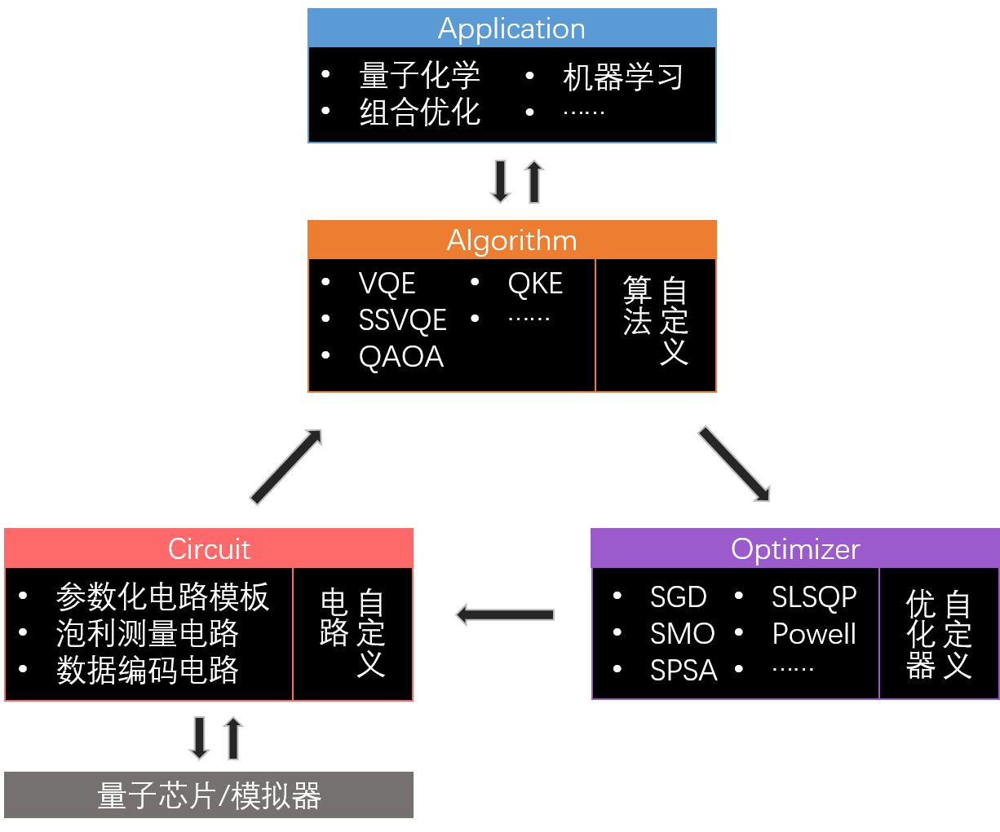

简体中文 | [English](README.md)

# QCompute-QAPP 使用指南

*版权所有 (c) 2021 百度量子计算研究所，保留所有权利。*

<p align="center">
  <!-- docs -->
  <a href="https://quantum-hub.baidu.com/docs/qapp/">
    
  </a>
  <!-- PyPI -->
  <a href="https://pypi.org/project/qcompute-qapp/">
    
  </a>
  <!-- Python -->
  <a href="https://www.python.org/">
    
  </a>
  <!-- License -->
  <a href="./LICENSE">
    
  </a>
  <!-- Platform -->
  <a href="https://github.com/baidu/QCompute/tree/master/Extensions/QuantumApplication">
    
  </a>
</p>

## QAPP 简介

QAPP 是基于[量易伏](https://quantum-hub.baidu.com/)组件 [QCompute](https://quantum-hub.baidu.com/opensource) 开发的量子计算解决方案工具集，提供包括量子化学、组合优化、机器学习在内的诸多领域问题的量子计算求解服务。QAPP 为用户提供了一站式的量子计算应用开发功能，直接对接用户在人工智能、金融科技、教育科研等方面的真实需求。

## QAPP 架构

QAPP 架构遵循从应用到真机的完整开发逻辑，包含 Application, Algorithm, Circuit, Optimizer 四个模块。其中 Application 模块将用户需求转换成相应的数学问题；Algorithm 模块选择合适的量子算法对该数学问题进行求解；在求解过程中，用户可以指定 Optimizer 模块中提供的优化器，也可自行设计自定义优化器；求解过程中所需的量子电路由 Circuit 模块支持，Circuit 模块直接调用 [QCompute](https://quantum-hub.baidu.com/opensource) 平台，支持对[量易伏](https://quantum-hub.baidu.com/services)模拟器/量子芯片的调用。



## QAPP 案例入门

我们提供 QAPP 求解[分子基态能量](tutorials/VQE_CN.md)、求解[组合优化问题](tutorials/Max_Cut_CN.md)、以及求解[分类问题](tutorials/Kernel_Classifier_CN.md)等实用案例。这些用例旨在帮助用户快速上手 QAPP 各模块功能的调用以及自定义算法的开发。在能够运行用例之前，我们还需要做一些准备工作。

### 环境准备

这里，我们使用 [Anaconda](https://www.anaconda.com/download) 作为 Python 的开发环境管理工具，Anaconda 支持多种主流操作系统（Windows、MacOS、Linux）。这里我们提供一个例子来学习使用 conda 创建和管理环境：

1. 首先进入命令行 (Terminal) 界面：Windows 用户通过搜索 `Anaconda Prompt` 进入/ Mac用户可以使用组合键 `command⌘ + 空格` 再输入 `Terminal`。

2. 进入 Terminal 后输入

   ```bash
   conda create --name qapp_env python=3.8
   ```

   以创建名为 `qapp_env` 的 Python 3.8 环境。然后在 Terminal 内可以通过以下命令进入我们新建立的环境。

   ```bash
   conda activate qapp_env
   ```

关于 conda 更多的本地指令请参考 [官方教程](https://docs.conda.io/projects/conda/en/latest/user-guide/getting-started.html) 。

### 点数获取

用户若使用云服务器运行,将会消耗一定的量易伏点数。如果点数用完了，请通过 [Quantum Hub](https://quantum-hub.baidu.com) 联系我们。首先，登录 [Quantum Hub](https://quantum-hub.baidu.com)，然后进入“意见反馈”页面，点击“获取点数”，然后输入必要的信息。提交您的反馈并等待回复，我们将会第一时间联系您。

### 安装 QAPP

通过 `pip` 安装 QAPP：

```bash
pip install qcompute-qapp
```

> 部分案例可能会用到额外的依赖包，这在案例对应的教程中进行了说明。

### 运行

用户可以从 GitHub 中 下载 `tutorials` 文件夹，并在 Terminal 中将路径切换至案例所在的 `tutorials` 文件夹中，并用 Python 运行。例如，

```bash
python vqe_example.py
```

## API 文档

我们提供 QAPP 的 [API](API_Document.pdf) 文档以供用户查阅。用户也可以在[量易伏网站](https://quantum-hub.baidu.com/docs/qapp/)上查看 API 文档。

## 引用

我们热诚欢迎科研工作者使用 QAPP 进行量子应用的相关研究工作，请通过如下 BibTeX 引用 QAPP：

```bibtex
@misc{QAPP, 
  title = {{Quantum Application Python Package}}, 
  year = {2022}, 
  url = {https://quantum-hub-test.baidu.com/qapp/}, 
}
```

## 版权和许可证

QAPP 使用 [Apache-2.0 license](https://www.apache.org/licenses/LICENSE-2.0) 作为许可证。
