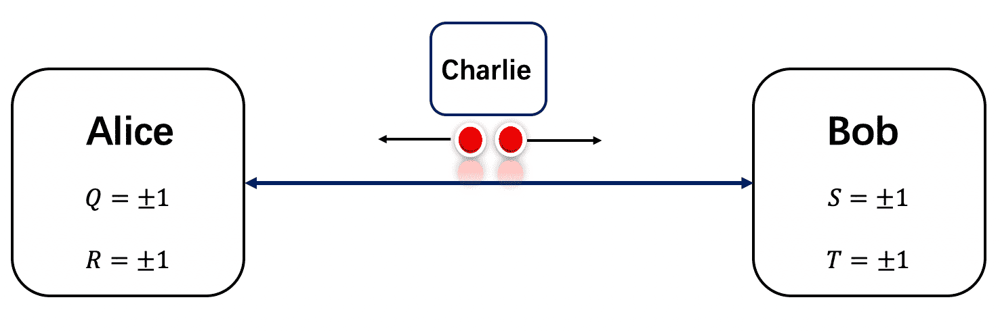

# Bell's Inequality

*Copyright (c) 2021 Institute for Quantum Computing, Baidu Inc. All Rights Reserved.*

> If you run this tutorial with cloud computing power, you will consume about 200 Quantum-hub points.

## Background

Since the birth of quantum mechanics, it has made important progress in describing the structure of atoms and physical phenomena of smaller sizes. On the microscopic scale, the prediction results of quantum mechanics are in good agreement with experiments, and people gradually accept quantum mechanics as a suitable theory to describe the laws of the real world. However, quantum mechanics' probabilistic interpretation of the wave function $|\psi\rangle$ triggered a protracted debate between Einstein and Bohr [1]--Is quantum mechanics complete? In 1935, Einstein, Podolsky, and Rosen published an article titled *Can Quantum-Mechanical Description of Physical Reality Be Considered Complete?*[2], trying to prove the incompleteness of quantum mechanics through the idea of reality and locality. This is the EPR (Einstein-Podolsky-Rosen) paradox.

The purpose of the EPR paradox is to demonstrate that quantum mechanics is not a complete theory by showing that quantum mechanics lacks certain essential reality. Many years after the EPR paradox article was published, Bell proposed a class of inequalities in 1964, called Bell's inequalities [3]. This class of inequality says that if the two assumptions in the EPR paradox are true, then there is a type of experimental result that must satisfy a certain inequality, so that we can construct related experimental devices in the real physical world to verify whether the natural world follow the assumptions of EPR paradox, and then judge whether quantum mechanics is complete. Let the experimental results determine which theory is a more appropriate theoretical description of nature.

The first thing to be clear is that Bell's inequality refers to a type of inequality, rather than a specific inequality. Here we take a commonly used Bell's inequality--CHSH (Clauser-Horne-Shimony-Holt) inequality as an example to illustrate the similarities and differences between the classical world and the quantum world. Because Bell's inequality is not the result of quantum mechanics, we can temporarily forget about the background knowledge about quantum mechanics, assuming the experiment shown in the following figure:



1. Charlie prepares two particles and distributes them to Alice and Bob respectively.
2. Alice has two measuring devices. After each particle is received, a certain device is randomly selected for measurement. The measurement results of the two devices $Q,R$ only take the value of $\pm 1$.
3. Bob also has two measuring devices. Each time he receives particles, he randomly selects a certain device for measurement. The measurement results of the two devices $S,T$ are only valued at $\pm 1$.
4. Repeat the steps 1-3, record the experimental results and calculate the mean value $\mathbf{E}(QS)$, $\mathbf{E}(QT)$, $\mathbf{E}(RS)$, $ \mathbf{E}(RT)$.

Note that in the first step, Charlie is required to prepare the same particle state each time. In order to ensure that the measurements between Alice and Bob do not affect each other, we can assume that Alice and Bob are far enough away and are at the same distance from Charlie. The two particles prepared by Charlie move towards Alice and Bob at the same speed. The measurement is performed immediately after receiving the particles. This absolutely accurate simultaneous measurement and a sufficiently long distance ensure that there is no mutual interference between the measurements made by Alice and Bob. It is found that after Alice and Bob perform a joint measurement, the average of the above four items always satisfies the inequality.

$$
\mathbf{E}(QS)+\mathbf{E}(RS)+\mathbf{E}(RT)-\mathbf{E}(QT) \le 2.
\tag{4}
$$

This inequality is called the CHSH inequality, which is a common type of Bell's inequality. This shows that the assumptions of reality and locality in EPR are not applicable to quantum mechanics, and this is also the difference between quantum mechanics and classical mechanics.

## Predict results through quantum mechanics

If we introduce the relevant knowledge of quantum mechanics and conduct the following experiments:
Charlie can prepare two entangled particles. For convenience, we assume that the two particles are in an entangled Bell state

$$
|\psi\rangle = \frac{(|01\rangle-|10\rangle)}{\sqrt{2}}.
\tag{5}
$$

where Dirac symbol $|ab\rangle$ represents the states $a, b$  of particles 1 and 2, respectively. Charlie prepares the Bell state and sends the first particle to Alice, and the second particle to Bob. Alice and Bob can measure two particles as follows

$$
\begin{align}
Q=Z_1&, R = X_1, \\
T = \frac{Z_2-X_2}{\sqrt{2}}&, S=\frac{-Z_2-X_2}{\sqrt{2}},
\end{align}
\tag{6}
$$

where $Z_1,Z_2$ stand for the operator Pauli $Z$ on particle 1 and 2, $X_1, X_2$ represent the operator Pauli $X$ on particle 1 and 2. These four operators all have two eigenvalues of $\pm 1$. In quantum mechanics, the expected value of state $|\psi\rangle$ with observable is $\mathbf{E}(W)=\langle\psi|W|\psi\rangle$. Due to the property of Pauli operators $Z|0\rangle=|0\rangle, Z|1\rangle=-|1\rangle$ and $X|0\rangle=|1\rangle, X|1\rangle=|0\rangle$, we have

$$
\begin{align}
\mathbf{E}(QS)&=\langle\psi|Z_1\otimes (\frac{-Z_2-X_2}{\sqrt{2}})|\psi\rangle \\
&= \frac{1}{2\sqrt{2}}(\langle 01|-\langle 10|)[Z_1\otimes(-Z_2-X_2)](|01\rangle-|10\rangle)\\
&= \frac{1}{2\sqrt{2}}(\langle 01|-\langle 10|)(|01\rangle-|10\rangle-|00\rangle-|11\rangle)\\
&= \frac{1}{2\sqrt{2}}(\langle 01|01\rangle + \langle 10|10\rangle)\\
&= \frac{1}{\sqrt{2}}.
\end{align}
\tag{7}
$$

Similarly, we could achieve

$$
\mathbf{E}(RS) = \frac{1}{\sqrt{2}}, \mathbf{E}(RT) = \frac{1}{\sqrt{2}}, \mathbf{E}(QT) = -\frac{1}{\sqrt{2}}.
\tag{8}
$$

Then, we can find

$$
\mathbf{E}(QS) + \mathbf{E}(RS) +\mathbf{E}(RT)-\mathbf{E}(QT)=2\sqrt{2}>2,
\tag{9}
$$

The CHSH inequality was violated! This illustrates the two assumptions in the EPR paradox: 1) the principle of reality; 2) the principle of locality, at least one of which is wrong. Since Bell's inequality was put forward, people have carried out a large number of confirmatory physical experiments. These quantum-level experiments have shown that the hypothesis of local realism is not tenable in quantum mechanics. We can experimentally judge the rationality of the EPR hypothesis.

## Bell's inequality with Quantum Leaf

From Eq. 7, we have

$$
\begin{align}
\mathbf{E}(QS)&=\langle\psi|Z_1\otimes (\frac{-Z_2-X_2}{\sqrt{2}})|\psi\rangle \\
&= -\frac{1}{\sqrt{2}}\langle\psi|Z_1\otimes Z_2|\psi\rangle - \frac{1}{\sqrt{2}}\langle\psi|Z_1\otimes X_2|\psi\rangle,
\end{align}
\tag{10}
$$

The expected value $\mathbf(E)(QS)$ consists of two parts, One part is the expected value measured by $Z\otimes Z$, and the other part is the expected value measured by $Z\otimes X$. Similarly, we can get that $\mathbf{E}(RS)$, $\mathbf{E}(RT)$, and $\mathbf{E}(QT)$ also contain two terms.

$$
\begin{align}
\mathbf{E}(RS)&=-\frac{1}{\sqrt{2}}\langle\psi|X_1\otimes Z_2|\psi\rangle - \frac{1}{\sqrt{2}}\langle\psi|X_1\otimes X_2|\psi\rangle \\
\mathbf{E}(RT)&=\frac{1}{\sqrt{2}}\langle\psi|X_1\otimes Z_2|\psi\rangle - \frac{1}{\sqrt{2}}\langle\psi|X_1\otimes X_2|\psi\rangle \\
\mathbf{E}(QT)&=\frac{1}{\sqrt{2}}\langle\psi|Z_1\otimes Z_2|\psi\rangle - \frac{1}{\sqrt{2}}\langle\psi|Z_1\otimes X_2|\psi\rangle. \\
\end{align}
\tag{11}
$$

```python
from QCompute import *
import numpy as np
from collections import Counter
from random import choice

# Please input you Token here
# Define.hubToken= 'your token'


def choose_backend():
    # You can choose backend here. When choose 'Quantum Device' or 'Cloud Simulator',
    # Please input your Token of QUANTUM LEAF first, otherwise, the code cannot excute.

    # Using Local Simulator
    backend = BackendName.LocalBaiduSim2
    # Using Quantum Device
    # backend = BackendName.CloudIoPCAS
    # Using Cloud Simulator
    # backend = BackendName.CloudBaiduSim2Water
    return backend


# Create a dictionary to record the measurement results of the first term
result1 = {'QS': [],
           'QT': [],
           'RS': [],
           'RT': []}

# Create a dictionary to record the measurement results of the second term
result2 = {'QS': [],
           'QT': [],
           'RS': [],
           'RT': []}

# run 100 times
times = 100
for i in range(times):
    # Alice randomly chooses between 'Q' and 'R' for measurement
    ranA = choice(['Q', 'R'])
    # Bob randomly chooses between 'S' and 'T' for measurement
    ranB = choice(['S', 'T'])
    ran = str(ranA)+str(ranB)
    
    # Every measurement only has one shot
    shots = 1
    env = QEnv()
    env.backend(choose_backend())

    q = [env.Q[0], env.Q[1]]
    # Prepare Bell state
    X(q[0])
    X(q[1])
    H(q[0])
    CX(q[0], q[1])
    
    if ran[0] == 'R':
        H(q[0])
        
    MeasureZ(q, range(2))
    taskResult = env.commit(shots, fetchMeasure=True)['counts']
    # Record the measurement result of the first term
    for key, value in taskResult.items():
        if value == 1:
            result1[ran].append(key)
    
    # Measure the second term
    shots = 1
    env = QEnv()
    env.backend(choose_backend())
    
    q = [env.Q[0], env.Q[1]]
    # Prepare Bell state
    X(q[0])
    X(q[1])
    H(q[0])
    CX(q[0], q[1])
    H(q[1])
    
    if ran[0] == 'R':
        H(q[0])
        
    MeasureZ(q, range(2))
    taskResult = env.commit(shots, fetchMeasure=True)['counts']
    # Record the measurement result of the second term
    for key, value in taskResult.items():
        if value == 1:
            result2[ran].append(key)
```

```python
# Post-process experiment results
QS1 = Counter(result1['QS'])
QS2 = Counter(result2['QS'])
RS1 = Counter(result1['RS'])
RS2 = Counter(result2['RS'])
RT1 = Counter(result1['RT'])
RT2 = Counter(result2['RT'])
QT1 = Counter(result1['QT'])
QT2 = Counter(result2['QT'])


def exp(Measure):
    # Calculate the expected value of measurement
    summary = Measure["00"]-Measure["01"]-Measure["10"]+Measure["11"]
    total = Measure["00"]+Measure["01"]+Measure["10"]+Measure["11"]
    return 1/np.sqrt(2)*summary/total


a_list = [QS1, QS2, RS1, RS2, RT1, RT2, QT1, QT2]
```

```python
# Combine two sub-terms to get the expected value
QS = -exp(QS1)-exp(QS2)
RS = -exp(RS1)-exp(RS2)
RT = exp(RT1)-exp(RT2)
QT = exp(QT1)-exp(QT2)
```

```python
print('E(QS)=',QS)
print('E(RS)=',RS)
print('E(RT)=',RT)
print('E(QT)=',QT)

print('Expected value: E(QS)+E(RS)+E(RT)-E(QT)=', QS+RS+RT-QT)
```

```
E(QS)= 0.7062619702173879
E(RS)= 0.7205346675363526
E(RT)= 0.6879803563421798
E(QT)= -0.7280106079855191
Expected value: E(QS)+E(RS)+E(RT)-E(QT)= 2.8427876020814393
```

The simulated results $\mathbf{E}(QS)\approx \frac{1}{\sqrt{2}}, \mathbf{E}(RS)\approx \frac{1}{\sqrt{2}}, \mathbf{E}(RT)\approx \frac{1}{\sqrt{2}}, \mathbf{E}(QT)\approx -\frac{1}{\sqrt{2}}$, satisfy the theory (Eq. 7 and Eq. 8). The simulated expected value is $\mathbf{E}(QS)+\mathbf{E}(RS)+\mathbf{E}(RT)-\mathbf{E}(QT) \approx 2\sqrt{2}>2$, violate the Bell's inequality.

---

## Reference

[1] Skibba, Ramin. "Einstein, Bohr and the war over quantum theory." [Nature 555.7698 (2018).](https://www.nature.com/articles/d41586-018-03793-2)

[2] Einstein, Albert, Boris Podolsky, and Nathan Rosen. "Can quantum-mechanical description of physical reality be considered complete?." [Physical Review 47.10 (1935): 777.](https://journals.aps.org/pr/abstract/10.1103/PhysRev.47.777)

[3] Bell, John S. "On the Einstein-Podolsky-Rosen paradox." [Physics 1.3 (1964): 195.](https://journals.aps.org/ppf/pdf/10.1103/PhysicsPhysiqueFizika.1.195)
