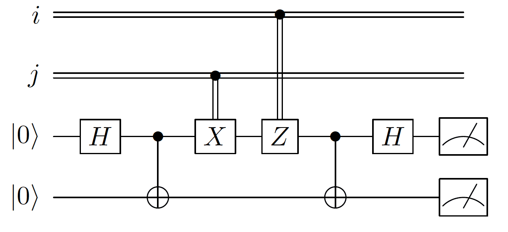

# 量子密集编码

*版权所有 (c) 2021 百度量子计算研究所，保留所有权利。*

> 若使用云端算力运行本教程，将消耗约 1 Quantum-hub 点数。

## 背景介绍

经典计算机的编码和运算都建立在布尔逻辑代数上，采用的是二进制编码，单个比特是 0 和 1 的二进制数。也就是说一个经典比特最多能编码一个比特的信息。然而，随着量子纠缠的发现和 Bell 态的提出，1992年 Bennett 和 Wiesner 提出了一个量子编码方案 [1] 。这个方案利用量子比特的纠缠性质，通过一个量子比特传递两个经典比特的信息，从而实现容量更大、效率更高的通讯方式。这种利用量子纠缠实现高容量编码的方式被称之为量子密集编码（Quantum superdense coding），它是量子力学在编码上的一个重要应用。

需要注意的是，切勿混淆量子密集编码和量子隐形传态这两个协议，这里我们将两者作一个简单的对比：

- 量子密集编码通过一个量子比特传输两个经典比特信息。
- 量子隐形传态通过两个经典比特信息传输一个量子比特信息。

同时这两种协议都用到了量子纠缠作为资源。

## 量子密集编码协议

与量子隐形传态一样，量子密集编码的基本假设是 Alice 和 Bob共享一对 Bell 态。不同的是，他们之间共享一条量子信道而不是经典信道。对于最简单的两量子比特系统，如何实现量子密集编码？即只通过一个量子比特传递 $00,01,10,11$ 两个经典比特的信息，我们可以采用如下方式实现： Alice 和 Bob 共享事先准备好的一对 Bell 态，根据需要传输的经典信息 Alice 对其所持有量子比特做出相应的编码操作，然后将操作后的量子比特通过量子信道传递给 Bob，Bob 对收到的量子比特和原先持有的量子比特进行测量，从而解码 Alice 想要传输的经典信息。实验上，量子密集编码协议在1996年被 Mattle et al. 通过光子的偏振实验验证 [2]。

密集编码协议详细的步骤分析如下：

**步骤1：实验准备**

首先 Alice 和 Bob 分开前需要制备一对 Bell 态 $|\Phi^+\rangle=\frac{1}{\sqrt{2}}(|00\rangle+|11\rangle)$，然后各取其中的一个量子比特。

**步骤2：Alice 施加编码操作并传送量子比特**

取决于 Alice 想发送给 Bob 的经典比特信息, Alice 对照下表对其持有的比特进行操作。

| 信息 | Alice 执行的操作|
| :------: | :------: |
| 00 | I |
| 01 | Z |
| 10 | X |
| 11 | ZX |

<div style="text-align:center">表 1:  量子密集编码表。 </div>

假设 Alice 想发送经典比特 $11$，她只需要在自己的量子比特上先作用 $X$ 门，再作用 $Z$ 门：

$$
|\Phi^+\rangle_{AB} \stackrel{X_A}{\longrightarrow} \frac{1}{\sqrt{2}}(|10\rangle_{AB}+|01\rangle_{AB}) \stackrel{Z_A}{\longrightarrow} \frac{1}{\sqrt{2}}(|01\rangle_{AB}-|10\rangle_{AB}) = |\psi\rangle_{AB}, \tag{1}
$$

之后 Alice 将自己操作后的量子比特通过共享的量子信道传送给 Bob。

**步骤3：Bob 进行解码操作**

Bob 收到 Alice 传输过来的量子比特后，就得到了描述整个系统的量子态 |\psi\rangle_{AB}。Bob 以 $A$ 为控制比特作用 CNOT 门，然后再对量子比特 $A$ 做 $H$ 门操作。最后对两个系统进行计算基 $\{|00\rangle,|01\rangle,|10\rangle,|11\rangle\}$ 测量，从而解码 Alice 想传输的经典信息：

$$
|\psi\rangle_{AB} \stackrel{\text{CNOT}}{\longrightarrow} \frac{1}{\sqrt{2}}(|01\rangle_{AB}-|11\rangle_{AB}) \stackrel{H_A}{\longrightarrow} |11\rangle \tag{2}
$$

注意此时 Bob 的测量结果只可能是 $11$。从而完全解码 Alice 想要传输的信息。同理，如果 Alice 在步骤2中的编码是其他情况，相同的操作可以帮助 Bob 完全解码。我们可以对照以下表格进行验证。

| 信息 | Alice 执行的操作 | Bob 接受到的态 | Bob 的操作后 | Bob 解码 |
| :-----: | :----: | :----: | :----: | :----: |
| 00 | $I$ | $\frac{1}{\sqrt{2}}$ (&#124;00$\rangle$ + &#124;11$\rangle$) | &#124;00$\rangle$ | 00 |
| 01 | $Z$ | $\frac{1}{\sqrt{2}}$ (&#124;00$\rangle$ - &#124;11$\rangle)$ | &#124;01$\rangle$ | 01 |
| 10 | $X$ | $\frac{1}{\sqrt{2}}$ (&#124;01$\rangle$ + &#124;10$\rangle)$ | &#124;10$\rangle$ | 10 |
| 11 | $ZX$ | $\frac{1}{\sqrt{2}}$ (&#124;01$\rangle$ - &#124;10$\rangle)$ | &#124;11$\rangle$ | 11 |

<div style="text-align:center">表 2:  量子密集编码和解码表。 </div>

最后，量子密集编码完整的电路图如下:



## 量易伏平台演示

在熟悉了以上的量子力学推导后，我们可以在量易伏平台上模拟量子密集编码协议，具体示例代码如下：

```python
from QCompute import *

# 设置测量的次数
shots = 4096

# 请输入您的 Token
# Define.hubToken= 'Your Token'

# 设置 Alice 想要发送给 Bob 的经典信息
message = '11'

# 创建环境
env = QEnv()

# 您可以在这里选择您想要使用的后端，在选择‘量子真机’和‘云端模拟器’时
# 请先输入您 量易伏 平台的 Token，否则无法正常运行

# 使用本地模拟器
env.backend(BackendName.LocalBaiduSim2)
# 使用量子设备
# env.backend(BackendName.CloudIoPCAS)
# 使用云端模拟器
# env.backend(BackendName.CloudBaiduSim2Water)

# 初始化全部量子比特
q = [env.Q[0], env.Q[1]]
# 制备 Bell 态
H(q[0])
CX(q[0], q[1])

# Alice 根据需要传输的信息对其量子比特进行操作
if message == '01':
    X(q[0])
elif message == '10':
    Z(q[0])
elif message == '11':
    Z(q[0])
    X(q[0])

# Bob 进行解码
CX(q[0], q[1])
H(q[0])

# Bob 进行测量
MeasureZ(q, range(2))
taskResult = env.commit(shots, fetchMeasure=True)
```

```
Shots 4096
Counts {'11': 4096}
State None
Seed 1513315693
```

得到的结果显示 Alice 想要传输的信息 $'11'$ 被 Bob 正确地解码了。

---

## 参考资料

[1] Bennett, Charles H., and Stephen J. Wiesner. "Communication via one-and two-particle operators on Einstein-Podolsky-Rosen states." [Physical Review Letters 69.20 (1992): 2881.](https://journals.aps.org/prl/abstract/10.1103/PhysRevLett.69.2881)

[2] Mattle, Klaus, et al. "Dense coding in experimental quantum communication." [Physical Review Letters 76.25 (1996): 4656.](https://journals.aps.org/prl/abstract/10.1103/PhysRevLett.76.4656)
