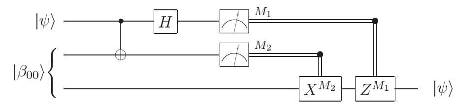

# Quantum Teleportation

*Copyright (c) 2021 Institute for Quantum Computing, Baidu Inc. All Rights Reserved.*

> If you run this tutorial with cloud computing power, you will consume about 1 Quantum-hub points.

## Background

This tutorial will introduce you the most classic quantum protocol--Quantum Teleportation. It will tell us how to 'transmit' a quantum state over long distances. Suppose Alice generates a special single qubit state $|\psi\rangle$, and she wishes to share the qubit state with Bob, a colleague who is far away. If there is an ideal quantum channel between them, the most direct way is to send $|\psi\rangle$ to Bob through the quantum channel. But what if there is no established quantum channel between them? It is known that the quantum state can be represented as: $|\psi\rangle=\alpha|0\rangle+\beta|1\rangle$. Alice could measure the two probability density $\alpha, \beta\in\mathbb{C}$, and then tell the results to Bob via a classical channel. After classical communication, Bob needs to build a circuit to prepare the quantum state $|\psi\rangle$. However, Alice's measurement will destroy the quantum state. If we wish to get the accurate values of $\alpha,\beta$, a large number of copies of quantum state $|\psi\rangle$ are required to measure. This method is often very inefficient. Besides, in most cases, Alice only has one copy of the quantum state, which means it is impossible to get the accurate values for both $\alpha$ and $\beta$. Is there any other way to transfer the quantum state from Alice to Bob?

## Quantum teleportation protocol

In 1993, Bennett et al. proposed to introduce quantum entanglement as resources to realize communication protocols [1], which is the most important part of this tutorial. Before the protocol, Alice and Bob have to prepare a shared Bell state $|\Phi^+\rangle$,

$$
|\Phi^+\rangle_{AB} = \frac{1}{\sqrt{2}}(|0\rangle_A|0\rangle_B + |1\rangle_A|1\rangle_B), \tag{1}
$$

where $A$ and $B$ refer to Alice and Bob respectively. On top of the pre-shared Bell state, they also need a classical channel to transmit classic information. Next, we denote the qubit state that needs to be teleported as $|\psi\rangle_C$. Alice holds two qubits $C,A$. She needs to act a CNOT gate on the two qubits (qubit $C$ is the control, and qubit $A$ is the target), then operates a $H$ gate on the qubit $C$. By finishing the gate operations, Alice measures the qubits to get classical information $z,x\in\{0,1\}$. Alice sends this information to Bob via a classical channel. Lastly, Bob operates $Z^z X^x$ on his qubit. For example,if Alice's measurement is $x=1,z=1$, Bob needs to operate a $X$ gate, followed by a $Z$ gate. By finishing all the processes, the state of qubit $B$ becomes $|\psi\rangle$, and Alice succeed in teleporting a quantum state $|\psi\rangle$ to Bob. The teleportation protocol was verified by Bouwmeester et al. in 1997 [2].



**Note:**

- In teleportation protocol, only quantum state is teleported, rather than quantum bit. 
- The non-cloning theorem is valid for teleportation protocol. Alice's measurement destroys the quantum state, which is recovered by Bob on his side later on, so the quantum state is not copied.
- There is no information transmission beyond the speed of light in this teleportation protocol. When Bob recovers the quantum state, he must first obtain Alice's measurement result, and then make the corresponding recovery operation. Therefore, the transmission process of the quantum state in the protocol will be limited by the classical communication speed.
- When the quantum teleportation is completed, the entanglement resources shared by Alice and Bob will be consumed. Therefore, before each teleportation, entanglement resources need to be re-established.
- During the teleportation process, we don't need to know any information about the transmitted quantum state $|\psi\rangle$.

For more information, please refer to [3].

**Step 1: Preparation**

To begin with, Alice and Bob need to share a Bell state $|\Phi^+\rangle_{AB}$. Because the system is symmetric, it does not matter who gets which. Let's denote the qubit, which needs to be teleported, as $|\psi\rangle_C$. Without loss generality， we could define $|\psi\rangle_C=\alpha|0\rangle_C+\beta|1\rangle_C$. Now the whole system could be described as: 

$$
\begin{align}
|\phi_0\rangle_{CAB} &= |\psi\rangle_C\otimes|\Phi^+\rangle_{AB} \tag{2}\\
&= (\alpha|0\rangle_C + \beta|1\rangle_C)\otimes\frac{1}{\sqrt{2}}(|0\rangle_A|0\rangle_B+|1\rangle_A|1\rangle_B) \tag{3}\\
&= \frac{1}{\sqrt{2}}(\alpha|000\rangle+\alpha|011\rangle + \beta|100\rangle +\beta|111\rangle),\tag{4}
\end{align}
$$

**Step 2: Alice's operation**

Alice operates CNOT gate on her qubits and get $|\phi_1\rangle$,

$$
\begin{align}
|\phi_1\rangle_{CAB} &= (\text{CNOT}\otimes I)|\phi_0\rangle_{CAB} \tag{5}\\
&= (\text{CNOT}\otimes I)\frac{1}{\sqrt{2}}(\alpha|000\rangle+\alpha|011\rangle + \beta|100\rangle +\beta|111\rangle) \tag{6}\\
&= \frac{1}{\sqrt{2}}(\alpha|000\rangle+\alpha|011\rangle + \beta|110\rangle +\beta|101\rangle), \tag{7}
\end{align}
$$

Alice acts $H$ gate on the first qubit and the system becomes $|\phi_2\rangle$,

$$
\begin{align}
|\phi_2\rangle_{CAB} &= (H \otimes I \otimes I)|\phi_1\rangle_{CAB} \tag{8}\\
&= (H\otimes I\otimes I)\frac{1}{\sqrt{2}}(\alpha|000\rangle+\alpha|011\rangle + \beta|110\rangle +\beta|101\rangle) \tag{9}\\
&= \frac{1}{2}(\alpha|000\rangle+\alpha|100\rangle+\alpha|011\rangle+\alpha|111\rangle + \beta|010\rangle -\beta|110\rangle+\beta|001\rangle-\beta|101\rangle). \tag{10}
\end{align}
$$

**Step 3: Alice's measurement and classical communication**

We could rewrite the state $|\phi_2\rangle_{CAB}$, and get

$$
\begin{align}
|\phi_2\rangle_{CAB} =\frac{1}{2}(&|00\rangle_{CA}\otimes(\alpha|0\rangle_B+\beta|1\rangle_B) \tag{11}\\
+&|01\rangle_{CA}\otimes(\alpha|1\rangle_B+\beta|0\rangle_B) \tag{12}\\
+&|10\rangle_{CA}\otimes(\alpha|0\rangle_B-\beta|1\rangle_B) \tag{13}\\
+&|11\rangle_{CA}\otimes(\alpha|1\rangle_B-\beta|0\rangle_B)). \tag{14}
\end{align}
$$

Next, Alice measures the qubits on the computational basis $\{|00\rangle,|01\rangle,|10\rangle,|11\rangle\}$. The results are shown as below:

| Alice's measurement | Probability | Bob's state after measurement | Bob's operations |
| :-----:| :----: | :----: | :----: |
| 00 | 1/4 | $\alpha$  &#124; 0 $\rangle+\beta$ &#124; 1 $\rangle$ | $I$|
| 01 | 1/4 | $\alpha$  &#124; 1 $\rangle+\beta$ &#124; 0 $\rangle$ | $X$|
| 10 | 1/4 | $\alpha$  &#124; 0 $\rangle-\beta$ &#124; 1 $\rangle$ | $Z$|
| 11 | 1/4 | $\alpha$  &#124; 1 $\rangle-\beta$ &#124; 0 $\rangle$ | $ZX$|

**Step 4: Bob's Operations**

After Alice's measurement, the qubit state of qubit $B$ is very close to $|\psi\rangle$. He only needs to perform the corresponding quantum gate operation according to the information of Bitcoin 00, 01, 10, 11 sent by Alice, and then he can get $|\psi\rangle = \alpha|0\rangle+\beta|1\rangle$.

## Teleportation with Quantum Leaf

To help readers understand the teleportation protocol better, we could simulate the protocol on Quantum Leaf.

Firstly, we use a single qubit universal gate, 

$$
U_3(\theta,\phi,\psi) = \left[
\begin{matrix}
   cos(\frac{\theta}{2}) & -e^{i\psi}sin(\frac{\theta}{2}) \\
   e^{i\phi}sin(\frac{\theta}{2}) & e^{i(\psi+\phi)}cos(\frac{\theta}{2}) \tag{15}
\end{matrix}\right]
$$

to generate a random quantum state $|\psi\rangle$, as the quantum state we wish to teleport. The code displays as below:

```python
from QCompute import *
import numpy as np

# Set number of qubits
qubit_num = 3        
# Set shots     
shots = 10000       
# Fix randim number seed 
np.random.seed(14)        

# Generate 3 random angles
angle = 2*np.pi*np.random.randn(3)

# Please input you Token here
# Define.hubToken= 'Your Token'


def choose_backend():
    # You can choose backend here. When choose 'Quantum Device' or 'Cloud Simulator',
    # Please input your Token of QUANTUM LEAF first, otherwise, the code cannot excute.

    # Using Local Simulator
    backend = BackendName.LocalBaiduSim2
    # Using Quantum Device
    # backend = BackendName.CloudIoPCAS
    # Using Cloud Simulator
    # backend = BackendName.CloudBaiduSim2Earth
    return backend


def main():
    """
    main
    """
    # Set up environment
    env = QEnv()
    env.backend(choose_backend())

    # Initialize all qubits
    q = [env.Q[i] for i in range(qubit_num)]

    # Prepare quantum state |psi> 
    U(angle[0], angle[1], angle[2])(q[0])

    # Measurements
    MeasureZ([q[0]],[0])
    
    taskResult = env.commit(shots, fetchMeasure=True)
    return taskResult['counts']


if __name__ == '__main__':
    main()
```

```
Shots 10000
Counts {'1': 9747, '0': 253}
State None
Seed 56335848
```

The generated quantum state is $|\psi\rangle=\alpha|0\rangle+\beta|1\rangle$, where $|\alpha|^2\approx0.0253$ and $|\beta|^2\approx 0.9747$, Then, we try to teleport this state to Bob. We need to pay attention that we use control gate $CZ$ and $CX$ get to simulate Bob's operations. The code is shown as below:

```python
def main():
    """
    main
    """
    # Set up environment
    env = QEnv()
    env.backend(choose_backend())
    
    # Initialize all qubits
    q = [env.Q[i] for i in range(qubit_num)]

    # Prepare entangled state between Alice and Bob.
    H(q[1])
    CX(q[1], q[2])
    
    # Prepare quantum state |psi> 
    U(angle[0], angle[1], angle[2])(q[0])
    
    # Alice acts gates on her qubits
    CX(q[0], q[1])
    H(q[0])
    
    # Bob acts gate to recover |psi> 
    CZ(q[0], q[2]) 
    CX(q[1], q[2])

    # Bob makes measurements on qubit q2
    MeasureZ([q[2]],[2])
    
    taskResult = env.commit(shots, fetchMeasure=True)
    return taskResult['counts']


if __name__ == '__main__':
    main()
```

```
Shots 10000
Counts {'1': 9718, '0': 282}
State None
Seed 695386758
```

The teleported state is $\alpha'|0\rangle+\beta'|1\rangle$, where $|\alpha'|^2\approx0.0282$ and $|\beta'|^2\approx 0.9718$. This state is very close to the generated state $|\psi\rangle = \alpha|0\rangle+\beta|1\rangle$. The slight error between the two states comes from the limited number of measurements we have made when testing the quantum state (ie shots = 10000). Increasing the setting of this value can reduce the error.

---

## Reference

[1] Bennett, Charles H., et al. "Teleporting an unknown quantum state via dual classical and Einstein-Podolsky-Rosen channels." [Physical Review Letters 70.13 (1993): 1895.](https://journals.aps.org/prl/abstract/10.1103/PhysRevLett.70.1895)

[2] Bouwmeester, Dik, et al. "Experimental quantum teleportation." [Nature 390.6660 (1997): 575-579.](https://www.nature.com/articles/37539)

[3] Peres, Asher. "What is actually teleported?." [IBM Journal of Research and Development 48.1 (2004): 63-69.](https://arxiv.org/pdf/quant-ph/0304158.pdf)
