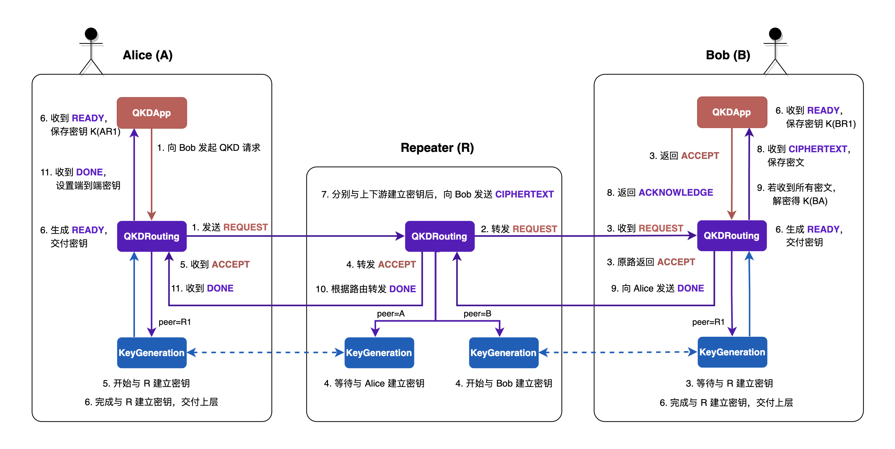

# 量子网络架构模拟

*版权所有 (c) 2022 百度量子计算研究所，保留所有权利。*

经过前面教程的介绍，我们了解了离散事件仿真的原理以及使用 QNET 搭建量子网络并运行仿真模拟的方法。在本教程中，我们将着重介绍如何借助 QNET 实现更复杂的量子网络架构的模拟仿真。

首先，我们将介绍量子密钥分发 (Quantum Key Distribution, QKD) 的相关背景；然后，介绍我们自定义的一种量子密钥分发网络架构；最后，我们将在 QNET 上对该架构进行代码实现，并对京沪干线量子网络中北京市内两名用户之间通过量子密钥分发获得端到端密钥的过程进行模拟仿真。

## 量子密钥分发

### 1. 背景介绍

在现代通信中，通信双方通常采用对称加密的方式来对传输数据进行加密，即双方使用相同的密钥来对消息进行加密或者对密文进行解密。密钥分发的任务就是将密钥分发给双方以供通信加密使用。如何实现密钥分发，保证密钥的安全性是密码学中特别重要的一个研究方向。

在经典密码学中，通常采用非对称加密算法来实现密钥分发。目前最常用的非对称加密算法是 RSA 算法，其安全性依赖于大数分解的计算复杂度。然而随着 1994 年 Shor 算法的提出，RSA 算法的安全性开始受到威胁。

相比于经典加密，量子密钥分发则提供了一种安全传输密钥的方式，该安全性由量子力学的基本原理保证。一般来说，QKD 利用光子作为信息传输的载体。根据量子不可克隆定理，我们不可能完美克隆一个未知的量子态，因此禁止了窃听者对未知量子态的复制。此外，任何对 QKD 过程的窃听都可能引起量子态的改变，从而导致误码率上升，使得窃听检测成为可能。

现阶段，量子密钥分发技术已经相对成熟，以京沪干线为代表的量子密钥分发网络的基础设施建设也正在逐步完成。可以预期的是，大规模的量子密钥分发网络将会很快接入千家万户。因此，如何设计高效稳定的量子密钥分发网络协议是一个亟待解决的问题。下面，我们将对我们所设计的 QKD 量子网络架构进行介绍并逐步讲解其实现用户之间密钥建立的完整流程。

### 2. 网络架构

参考东京 QKD 量子网络 [1] 和京沪干线量子通信网络 [2]，我们自行设计了一个简单的 QKD 网络架构，该架构的逻辑示意图如图 1 所示。

其中，端节点各自装载了包含三层协议的协议栈，通过 `QKDApp` 协议可以发起或处理 QKD 请求，根据 `QKDRouting` 协议确定密钥分发的路径，通过 `BB84` 协议可以与相邻节点建立密钥。可信中继节点则装载了包含两层协议的协议栈，分别完成与上下游完成密钥建立后，建立的密钥将以密文形式传送给接收方，由接收方统一对密文进行解密处理得到交换密钥，从而实现端到端的密钥建立。

实现端到端密钥建立的具体流程如下：

1. Alice 想要与 Bob 建立密钥，她将发起一个 QKD 请求，生成 `REQUEST` 消息并发送给直连的中继节点（若与 Bob 之间存在直连信道则直接发送）；
2. 中继节点收到 Alice 的请求后，查询本地路由表以获知下一跳节点信息，继续转发 `REQUEST` 消息；
3. Bob 收到 `REQUEST` 消息后，生成 `ACCEPT` 消息，并原路返回 `ACCEPT` 消息，同时启动本地的 BB84 协议，等待与上游节点建立密钥；
4. 沿途中继节点收到 `ACCEPT` 消息后继续向上游转发，同时启动 BB84 协议，开始与下游节点建立密钥，同时等待与上游节点建立密钥；
5. Alice 收到 `ACCEPT` 消息后，启动本地的 BB84 协议，与下游节点建立密钥；
6. Alice 与下游节点、Bob 与上游节点建立密钥后，各自将密钥保存在本地；
7. 当中继节点分别与上、下游节点都建立好密钥后，进行密钥交换并发送 `CIPHERTEXT` 给 Bob；
8. Bob 在收到密文后，将其保存在本地密文列表中，同时向消息发送者返回 `ACKNOWLEDGE` 以确认接收密钥；
9. 若 Bob 已经收到所有中继节点的密文，则用本地保存的密钥对密文进行解密，得到与 Alice 之间的密钥，并向 Alice 返回 `DONE` 消息完成密钥请求；
10. 中继节点收到 `DONE` 消息则直接转发；
11. Alice 收到 `DONE` 消息并设置密钥，协议结束。



## 仿真实现

为了更好地仿真模拟上述量子密钥分发网络，我们在 QNET 中提供了节点模板 `EndNode` 和 `TrustedRepeaterNode`，分别用于对端节点和可信中继节点的仿真。在这两类节点中，我们分别预置了一个装有 `QKDRouting` 协议的协议栈，该协议主要负责为远程端节点提供路由功能。接下来，我们将结合相关代码实现，对上述网络架构的流程进行更为详细的讲解。（以下讲解只涉及相关核心代码，完整代码实现请参见源文件。）

### 1. Alice：发起请求 `REQUEST`

Alice 希望能够与 Bob 建立端到端的密钥，于是她会向 Bob 发起一个 QKD 请求。通过 `EndNode` 的 `key_request` 方法，调用 `set_qkd_app` 方法在本地协议栈中添加一个 `QKDApp` 协议实例，并将该协议设置为 `QKDRouting` 的上层，同时调用 `QKDApp` 的 `start` 方法。


```python
def key_request(self, **kwargs) -> None:
    qkd_app = self.set_qkd_app()
    qkd_app.start(**kwargs)
```

在 `QKDApp` 的 `start` 方法中，将安排一个向 Bob 发起密钥建立请求的事件，该事件将触发 `send_request` 方法，由 `QKDApp` 生成一则类型为 `REQUEST` 的 `QKDMessage`，其中包含密钥请求的分发路径、密钥数量及长度等。随后，`QKDApp` 将调用 `Protocol` 类的 `send_lower` 方法将该消息送往下层协议交由 `QKDRouting` 进行处理。


```python
def send_request(self) -> None:
    ...
    request_msg = QKDMessage(src=self.node,
                             dst=self.request_to,
                             protocol=QKDRouting,
                             data={'type': QKDMessage.Type.REQUEST,
                                   'path': [self.node],
                                   'key_num': self.key_num,
                                   'key_length': self.key_length}
                            )
    self.send_lower(QKDRouting, msg=request_msg)
```

`Protocol` 类的 `send_lower` 方法将直接调用下层协议的 `receive_upper` 方法，并以关键字参数的形式传入相关参数。对于所有用户自定义的协议当中，应当对协议的 `receive_upper` 和 `receive_lower` 方法进行重写来设定该协议与其上下层协议之间的通信规则。

在 `QKDRouting` 中，当收到来自上层 `QKDApp` 的消息时，它将首先对消息类型进行判断。当消息类型为 `REQUEST`时，若请求节点与目的节点直连，则直接通过直连信道发送请求消息；反之，则通过与其直连的中继节点发送。


```python
def receive_upper(self, upper_protocol: type, **kwargs) -> None:
    msg = kwargs['msg']

    # Alice: 发送 'REQUEST' 消息
    if msg.data['type'] == QKDMessage.Type.REQUEST:
        # 判断目的节点是否与当前节点直连
        if msg.dst in self.node.direct_nodes:
            self.node.send_classical_msg(dst=msg.dst, msg=msg)
        else:
            self.node.send_classical_msg(dst=self.node.direct_repeater, msg=msg)
```

### 2. 中继节点：转发请求 `REQUEST`

中继节点在收到 `QKDMessage` 后，在其 `QKDRouting` 中，同样需要判断消息类型。若收到端节点的 `REQUEST` 消息，则查询本地路由表以获知下一跳节点的信息，对消息进行转发，同时在密钥转发路径中添加自身节点信息。


```python
def receive_classical_msg(self, msg: "QKDMessage", **kwargs) -> None:
    ...
    if msg.data['type'] == QKDMessage.Type.REQUEST:
        self.node.env.logger.info(f"{self.node.name} received 'REQUEST' of QKDApp with"
                                  f"{msg.dst.name} from {msg.src.name}")

        # 中继节点：收到来自 Alice 的 'REQUEST' 消息
        if isinstance(self.node, TrustedRepeaterNode):
            msg.data['path'].append(self.node)  # 将自身节点添加到路径中

            # 查询下一跳节点并转发 'REQUEST' 消息
            next_hop = self.node.quantum_routing_table[msg.dst]
            self.node.send_classical_msg(dst=next_hop, msg=msg)

        # Bob: 收到来自 Alice 的 'REQUEST' 消息
        elif isinstance(self.node, EndNode):
            # 创建 QKDApp 实例并交付上层
            self.node.set_qkd_app()
            self.send_upper(QKDApp, msg=msg)
```

### 3. Bob：收到请求 `REQUEST` 并返回接受消息 `ACCEPT`

Bob 在收到 `QKDMessage` 后，同样在其 `QKDRouting` 中对消息类型进行判断。收到 `REQUEST` 消息，他将在本地协议栈中动态添加 `QKDApp` 协议实例并通过调用 `Protocol` 类的 `send_upper` 方法将该请求消息交付上层 `QKDApp` 协议。

`QKDApp` 协议收到来自 `QKDRouting` 发来的 `QKDMessage`，同样根据消息类型来作出不同操作。当消息类型为 `REQUEST` 时，其将保存发起密钥建立请求的节点信息，并完善路径信息，同时保存请求的密钥长度和数量信息。当他与 Alice 不存在直连信道，需要经过中继节点路由时，此后需要进行密钥交换操作，因此在他将设置一组空的密文列表用以后续密钥交换操作。最后，他将通过路由向 Alice 返回一个 `ACCEPT` 消息告知自己同意建立端到端的密钥。


```python
def receive_lower(self, lower_protocol: type, **kwargs) -> None:
    msg = kwargs['msg']

    # Bob: 收到 Alice 的 'REQUEST' 消息
    if msg.data['type'] == QKDMessage.Type.REQUEST:
        # 设置请求节点信息
        self.request_from = msg.src
        # 添加路径信息，保存密钥长度和数量
        path = msg.data['path']
        path.append(self.node)
        self.key_num = msg.data['key_num']
        self.key_length = msg.data['key_length']

        # 设置一组空的密文列表等待密钥交换
        if len(path) > 2:
            for node in path[1:-1]:
                self.ciphertext_lists[node] = None

        # Bob: 返回 'ACCEPT' 消息
        accept_msg = QKDMessage(src=self.node,
                                dst=self.request_from,
                                protocol=QKDRouting,
                                data={'type': QKDMessage.Type.ACCEPT,
                                      'path': path,
                                      'key_num': self.key_num,
                                      'key_length': self.key_length}
                                )
        self.send_lower(QKDRouting, msg=accept_msg)
```

下层 `QKDRouting` 收到上层返回 `ACCEPT` 消息，保存路径信息和上游节点信息，同时在本地协议栈中 `QKDRouting` 创建一个 `PrepareAndMeasure` 实例，用于与上游节点之间生成密钥，并传入相关参数，等待建立密钥。

**提醒**：在我们设计的量子网络架构中，假定相邻节点间的密钥生成均由上游节点充当光子的发送方，由下游节点充当接收方。


```python
def receive_upper(self, upper_protocol: type, **kwargs) -> None:
    msg = kwargs['msg']
    ...
    # Bob: 返回 'ACCEPT' 消息
    elif msg.data['type'] == QKDMessage.Type.ACCEPT:
        self.path = msg.data['path']  # 保存密钥交换的路径
        self.node.env.logger.info(f"Path of the QKD request: {[node.name for node in self.path]}")

        self.upstream_node = self.path[-2]  # 设置上游节点
        key_num = msg.data['key_num']
        key_length = msg.data['key_length']

        self.node.send_classical_msg(dst=self.upstream_node, msg=msg)  # 向上游节点转发 'ACCEPT' 消息

        # 创建密钥生成协议实例，等待与上游节点建立密钥
        self.node.set_key_generation(self.upstream_node)
        self.send_lower(PrepareAndMeasure, 
                        peer=self.upstream_node, 
                        role=PrepareAndMeasure.Role.RECEIVER, 
                        key_num=key_num, 
                        key_length=key_length
                        )
```

### 4. 中继节点：转发接受消息 `ACCEPT` 并建立密钥

沿途中继节点收到 `ACCEPT` 消息，保存密钥交换路径、密钥长度、密钥数量、上下游节点等信息，同时设置下层协议，与上下游节点之间建立密钥。


```python
def receive_classical_msg(self, msg: "QKDMessage", **kwargs) -> None:
    ...
    elif msg.data['type'] == QKDMessage.Type.ACCEPT:
        self.node.env.logger.info(f"{self.node.name} received 'ACCEPT' of QKDApp from {msg.src.name}")
        
        # 保存密钥交换路径、密钥长度和数量
        self.path = msg.data['path']
        key_num = msg.data['key_num']
        key_length = msg.data['key_length']

        # 中继节点：收到 Bob 的 'ACCEPT' 消息
        if isinstance(self.node, TrustedRepeaterNode):
            # 保存上下游节点信息
            index = msg.data['path'].index(self.node)
            self.upstream_node, self.downstream_node = msg.data['path'][index - 1], msg.data['path'][index + 1]
            # 继续向上游节点转发 'ACCEPT' 消息
            self.node.send_classical_msg(self.upstream_node, msg=msg)  

            # 设置下层协议用以与上下游节点建立密钥
            self.node.set_key_generation(self.upstream_node)
            self.send_lower(PrepareAndMeasure, 
                            peer=self.upstream_node, 
                            role=PrepareAndMeasure.Role.RECEIVER, 
                            key_num=key_num, 
                            key_length=key_length
                            )

            self.node.set_key_generation(self.downstream_node)
            self.send_lower(PrepareAndMeasure, 
                            peer=self.downstream_node, 
                            role=PrepareAndMeasure.Role.TRANSMITTER, 
                            key_num=key_num, 
                            key_length=key_length
                            )
```

### 5. Alice：收到接受消息 `ACCEPT` 并建立密钥

Alice 在收到 Bob 的 `ACCEPT` 消息后，她将直接开始与下游节点开始建立密钥。


```python
def receive_classical_msg(self, msg: "QKDMessage", **kwargs) -> None:
    ...
    elif msg.data['type'] == QKDMessage.Type.ACCEPT:
        self.node.env.logger.info(f"{self.node.name} received 'ACCEPT' of QKDApp from {msg.src.name}")

        # 保存密钥交换路径、密钥长度和数量
        self.path = msg.data['path']
        key_num = msg.data['key_num']
        key_length = msg.data['key_length']
        ...
        # Alice: 收到来自 Bob 的 'ACCEPT' 消息
        elif isinstance(self.node, EndNode):
            self.downstream_node = self.path[1]  # 设置下游节点

            # 与下游节点建立密钥
            self.node.set_key_generation(self.downstream_node)
            self.send_lower(PrepareAndMeasure, 
                            peer=self.downstream_node, 
                            role=PrepareAndMeasure.Role.TRANSMITTER, 
                            key_num=key_num, 
                            key_length=key_length
                            )
```

### 6. 端节点：保存与上/下游生成的密钥

当底层密钥生成协议完成密钥生成，其将通过 `send_upper` 将密钥交付给上层 `QKDRouting`，`QKDRouting` 将判断是否需要进一步通过路由交换密钥，向 `QKDApp` 发送 `READY` 消息告知成功生成密钥并交付。


```python
def receive_lower(self, lower_protocol: type, **kwargs) -> None:
    peer = kwargs['peer']
    self.keys[peer] = kwargs['sifted_keys']

    # 端节点：将生成的密钥交付上层协议
    if isinstance(self.node, EndNode):
        # 若端节点直连，则无需进行后续的密钥交换操作，结束协议
        finish = True if len(self.path) == 2 else False
        ready_msg = QKDMessage(src=None,
                               dst=None,
                               protocol=QKDApp,
                               data={'type': QKDMessage.Type.READY,
                                     'sifted_keys': self.keys[peer],
                                     'finish': finish}
                                )
        self.send_upper(QKDApp, msg=ready_msg)
```

`QKDApp` 收到来自 `QKDRouting` 的 `READY` 消息后，将密钥保存在该层协议中，并根据 `finish` 参数的布尔值判断是否结束协议。


```python
def receive_lower(self, lower_protocol: type, **kwargs) -> None:
    msg = kwargs['msg']
    ...
    # 收到来自下层协议的 'READY' 消息
    elif msg.data['type'] == QKDMessage.Type.READY:
        # 将生成的密钥保存在本地
        self.keys = msg.data['sifted_keys']
        finish = msg.data['finish']

        if finish:
            self.finish()
```

### 7. 中继节点：进行密钥交换

当中继节点 $R_m$ 完成与上下游节点之间的密钥生成后，它将对密钥进行交换。在密钥交换过程中，中继节点对其与上游节点生成的密钥 $k_{R_{m-1}R_m}$ 和与下游节点生成的密钥 $k_{R_mR_{m+1}}$ 执行异或操作，生成加密密文 $c_m = k_{R_{m-1}R_m} \oplus k_{R_mR_{m+1}}$，并将该密文消息（`CIPHERTEXT`）通过路由发送给 Bob。

**注意**：在我们设计的量子密钥分发网络架构中，统一设定对发起密钥请求的节点（即本例中的 Alice）与其下游节点生成的密钥向下游交换。


```python
def receive_lower(self, lower_protocol: type, **kwargs) -> None:
    peer = kwargs['peer']
    self.keys[peer] = kwargs['sifted_keys']

    # 中继节点：进行密钥交换操作
    elif isinstance(self.node, TrustedRepeaterNode):
        # 判断是否成功与上下游节点生成密钥
        if self.upstream_node in self.keys.keys() and self.downstream_node in self.keys.keys():
            ciphertext_list = []
            # 对每对密钥执行异或操作，生成密文列表
            for key_down, key_up in zip(self.keys[self.downstream_node], self.keys[self.upstream_node]):
                ciphertext_list.append(key_down ^ key_up)

            # 将密文列表转发给 Bob
            cipher_msg = QKDMessage(src=self.node,
                                    dst=self.path[-1],
                                    protocol=QKDRouting,
                                    data={'type': QKDMessage.Type.CIPHERTEXT,
                                            'ciphertext_list': ciphertext_list}
                                    )
            next_hop = self.node.classical_routing_table[cipher_msg.dst]
            self.node.send_classical_msg(dst=next_hop, msg=cipher_msg)
```

网络中的其他中继节点在收到 `CIPHERTEXT` 消息后，同样从自己的路由表中查询下一跳继续发送消息而不作其他任何操作。


```python
def receive_classical_msg(self, msg: "QKDMessage", **kwargs) -> None:
    ...
    elif msg.data['type'] == QKDMessage.Type.CIPHERTEXT:
        if msg.dst == self.node:
            ...
        # 中继节点：收到其他中继节点发来的 'CIPHERTEXT' 消息，继续向 Bob 转发
        else:
            next_hop = self.node.classical_routing_table[msg.dst]
            self.node.send_classical_msg(dst=next_hop, msg=msg)
```

### 8. Bob：收到密文并确认

当来自中继节点的密文列表抵达 Bob 处，其 `QKDRouting` 将直接交付 `QKDApp` 进行处理。


```python
def receive_classical_msg(self, msg: "QKDMessage", **kwargs) -> None:
    ...
    elif msg.data['type'] == QKDMessage.Type.CIPHERTEXT:
        # Bob：收到来自中继节点的密文列表
        if msg.dst == self.node:
            self.node.env.logger.info(f"{self.node.name}"
                                      f"received 'CIPHERTEXT' of QKDApp from {msg.src.name}")
            self.send_upper(QKDApp, msg=msg)
```

对于抵达的密文，Bob 将其存储在本地，并向发出密文的中继节点返回 `ACKNOWLEDGE` 消息，确认收到其密文。


```python
def receive_lower(self, lower_protocol: type, **kwargs) -> None:
    msg = kwargs['msg']
    ...
    # Bob：收到来自中继节点的密文列表
    elif msg.data['type'] == QKDMessage.Type.CIPHERTEXT:
        self.ciphertext_lists[msg.src] = msg.data['ciphertext_list']  # 保存密文列表

        # 返回确认消息
        ack_msg = QKDMessage(src=self.node,
                             dst=msg.src,
                             protocol=QKDRouting,
                             data={'type': QKDMessage.Type.ACKNOWLEDGE}
                            )
        self.send_lower(QKDRouting, msg=ack_msg)

        # 若收到所有密文列表，对交换密钥进行解密
        if all(ciphertext_list is not None for ciphertext_list in self.ciphertext_lists.values()):
            swapped_keys = self.keys
            for ciphertext_list in self.ciphertext_lists.values():
                # 进行异或操作实现解密
                swapped_keys = [key ^ ciphertext for key, ciphertext in zip(swapped_keys, ciphertext_list)]
            self.keys = swapped_keys

            # 告知 Alice 完成端到端的密钥建立并结束协议
            done_msg = QKDMessage(src=self.node,
                                  dst=self.request_from,
                                  protocol=QKDRouting,
                                  data={'type': QKDMessage.Type.DONE}
                                  )
            self.send_lower(QKDRouting, msg=done_msg)
            self.finish()
```

### 9. Bob：解密获得端到端密钥

每当收到一份密文列表，Bob 都会判断是否收到所有中继节点的密文。若条件满足，则使用本地保存的密钥 $k_{BR_n}$ 对所有密文进行联合解密，从而得到与 Alice 之间共享的密钥 $k_{AB} = k_{BR_n} \oplus (k_{AR_1} \oplus k_{R_1R_2}) \oplus \ldots \oplus (k_{R_{n-1}R_n} \oplus k_{R_nB}) = k_{AR_1}$。同时，他将向 Alice 返回一个 `DONE` 消息以告知其成功建立端到端密钥。


```python
def receive_upper(self, upper_protocol: type, **kwargs) -> None:
    ...
    # Bob：向 Alice 返回 'DONE' 消息
    elif msg.data['type'] == QKDMessage.Type.DONE:
        if msg.dst in self.node.direct_nodes:
            self.node.send_classical_msg(dst=msg.dst, msg=msg)
        else:
            self.node.send_classical_msg(dst=self.node.direct_repeater, msg=msg)

        self.reset()
```

随后，他将调用 `QKDApp` 的 `finish`，将成功建立的端到端密钥交付给节点并结束协议。


```python
def finish(self) -> None:
    if self.request_to is not None:
        ...
    # Bob：结束协议
    elif self.request_from is not None:
        self.node.keys[self.request_from] = self.keys  # 将密钥交付给节点
        ...
```

### 10. 中继节点：转发 `DONE` 消息

中继节点收到 `DONE` 消息后，将直接根据路由对消息进行转发。


```python
def receive_classical_msg(self, msg: "QKDMessage", **kwargs) -> None:
    ...
    elif msg.data['type'] == QKDMessage.Type.DONE:
        if msg.dst == self.node:
        # 中继节点：直接转发 'DONE' 消息
        else:
            next_hop = self.node.classical_routing_table[msg.dst]
            self.node.send_classical_msg(dst=next_hop, msg=msg)
```

### 11. Alice：收到 `DONE` 消息

收到 `DONE` 消息，Alice 的 `QKDRouting` 协议将直接交付给 `QKDApp` 协议，`QKDApp` 调用 `finish` 方法，将其协议中保存的密钥信息交付给节点，结束协议。


```python
def finish(self) -> None:
    # Alice：结束协议
    if self.request_to is not None:
        self.node.keys[self.request_to] = self.keys  # 将密钥交付给节点
        ...
```

### 代码示例 

接下来，我们将采用上述架构，对京沪干线量子网络中北京市内两名用户之间建立端到端密钥的过程进行仿真模拟（京沪干线网络拓扑数据请参考文献 [2]）。协议的完整代码实现请参见 QNET 源文件。

首先，创建仿真环境并设置为默认环境，同时创建网络用以搭建拓扑结构。


```python
from qcompute_qnet.core.des import DESEnv
from qcompute_qnet.topology.network import Network

env = DESEnv("QKD Network Simulation", default=True)  # 创建用以模拟的仿真环境
network = Network("Beijing QMAN")  # 创建北京城域网

filename = "data/beijing_qman_topology.json"  # 设置 JSON 配置文件的路径
network.load_topology_from(filename)  # 从 JSON 标准文件加载网络中的节点和链路
network.print_quantum_topology(geo=True)  # 根据节点地理位置打印量子网络拓扑结构
```

通过调用 `Network` 的 `load_topology_from` 方法，根据 JSON 配置文件中的内容，自动生成网络中的节点和链路。通过设置 `print_quantum_topology` 的参数 `geo=True`，我们可以根据节点的地理位置来打印网络拓扑结构。装入节点和链路后的北京市网络拓扑结构如图 2 所示。本教材中的网络拓扑数据来源文献 [2]，与真实数据可能有所出入，仅做演示参考。

![图 2：北京市量子网络拓扑图（部分数据参考文献 [2]）](./figures/qkd_architecture-quantum_topology.png "图 2：北京市量子网络拓扑图（部分数据参考文献 [2]）")

接下来，我们让端节点用户 EN13 向 EN15 发起 QKD 请求，申请建立 10 对长度为 256 位的密钥。


```python
# 根据节点名字找到想要建立密钥的两位端节点用户
en13 = env.get_node("EN13")
en15 = env.get_node("EN15")

# EN13 发起 QKD 请求，指定请求的密钥数量和长度
en13.key_request(dst=en15, key_num=10, key_length=256)  
```

然后，我们对模拟环境进行初始化并运行，同时开启仿真环境的日志功能，在本地打印一份日志以便对仿真运行中记录的相关信息进行分析。


```python
# 对仿真环境进行初始化并运行
env.init()
env.run(logging=True)
```

## 结论

本教程中的示例是我们对自行设计的一个 QKD 量子网络架构进行的简单实现。读者可以根据需要从我们预制的模板中选择相关组件，或重新自行设计网络协议来实现想要测试的网络架构。希望通过对 QNET 量子网络工具集的使用，能够帮助读者对量子网络实验进行模拟验证，加速量子网络协议的设计研发。

---

## 参考文献

[1] Sasaki, Masahide, et al. "Field test of quantum key distribution in the Tokyo QKD Network." [Optics Express 19.11 (2011): 10387-10409.](https://opg.optica.org/oe/fulltext.cfm?uri=oe-19-11-10387)

[2] Chen, Yu-Ao, et al. "An integrated space-to-ground quantum communication network over 4,600 kilometres." [Nature 589.7841 (2021): 214-219.](https://www.nature.com/articles/s41586-020-03093-8)
