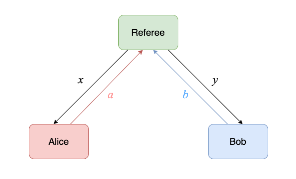

# CHSH 游戏

*版权所有 (c) 2022 百度量子计算研究所，保留所有权利。*

CHSH 游戏是由 Clauser, Horne, Shimony 和 Holt 于 1969 年提出的 CHSH 不等式发展而来[1]。通过对 CHSH 游戏的经典最优策略和量子最优策略的胜率比对，我们可以说明量子计算在某些问题的处理上相比经典计算具有一定优越性。此外，CHSH 游戏还可以被用于构建可验证的量子委托计算协议和设备无关的量子密码协议等量子网络应用 [2, 3]。

本教程中，我们将首先介绍 CHSH 游戏的游戏规则，并分别对该游戏的经典最优策略和量子最优策略进行介绍，最后我们将使用 QNET 对 CHSH 游戏的量子最优策略进行仿真验证，从而说明在该游戏中量子计算相比经典计算所体现出的优势。

## 游戏介绍

### 1. 游戏规则

如图 1 所示，CHSH 游戏中共有三位角色：两位属于合作关系的玩家 Alice 和 Bob，以及一名裁判 Referee。

该游戏的游戏规则如下：

1. 游戏开始时，裁判将随机抽取 2 个问题 $x, y \in \{0, 1\}$ 并分别向两位玩家发起提问；
2. Alice 和 Bob 需要分别对问题 $x$ 和问题 $y$ 进行作答并分别将他们的作答结果 $a, b \in \{0, 1\}$ 告诉裁判；
3. 裁判将根据这两份回答判断等式 $x \cdotp y = a \oplus b$ 是否成立。若等式成立，则判定玩家取得游戏胜利；反之，则判定玩家失败。

**注意**：在游戏开始前，两位玩家之间可以共同建立一个合理的游戏策略，以此来提高他们的获胜概率。但是一旦游戏开始，则玩家之间不允许进行任何通信。



### 2. 经典最优策略

一种最简单的经典策略是无论收到的问题是什么，Alice 和 Bob 都统一返回 0 作为他们的回答。
在该策略下，游戏中可能出现的不同情形及对应的游戏结果如下表所示。不难发现，通过采用上述经典策略，玩家的获胜概率为 $p_{win}=75\%$，只有当裁判给出的两个问题 $x$ 和 $y$ 都为 1 时才会失败。另一方面，我们也可以验证任何经典策略的获胜概率都不会超过 75%。

| $x$ | $y$ | $x\cdotp y$ | $a \oplus b$ | 结果  |
|:---:|:---:|:-----------:|:------------:|:---:|
| $0$ | $0$ | $0$         | $0$          | 胜利  |
| $0$ | $1$ | $0$         | $0$          | 胜利  |
| $1$ | $0$ | $0$         | $0$          | 胜利  |
| $1$ | $1$ | $1$         | $0$          | 失败  |

### 3. 量子最优策略

接下来我们将对 CHSH 游戏的一种量子最优策略进行介绍。通过引入量子纠缠，双方能够实现比经典策略更优的获胜方案。该游戏的量子最优策略如下：

1. 在游戏开始前，两位玩家 Alice 和 Bob 需要提前共享一对贝尔态 $|\Phi^+\rangle_{AB}=\tfrac{1}{\sqrt{2}}(|00\rangle+|11\rangle)$；
2. 当裁判分别向 Alice 和 Bob 提问，他们将根据裁判给出的问题分别对他们所持有的粒子 $A$ 和 $B$ 进行不同的量子测量操作；
3. 若 Alice 收到问题 $x=0$，她使用 $Z$ 基对她的粒子 $A$ 进行测量；若她收到 $x=1$，则使用 $X$ 基对粒子 $A$ 进行测量。完成测量后，将测量结果 $a$ 作为回答返回给裁判；
4. 若 Bob 收到问题 $y=0$，他使用 $\tfrac{1}{\sqrt{2}} (Z + X)$ 基对粒子 $B$ 进行测量；若他收到 $y=1$，则使用 $\tfrac{1}{\sqrt{2}} (Z - X)$ 基对粒子 $B$ 进行测量。完成测量后，将测量结果 $b$ 作为回答返回给裁判。

在这种策略下，玩家的获胜几率将提升到 $p_{win}\approx 85\%$，关于该量子最优策略更为详细的讨论和证明可参见文献 [4]。

接下来，我们将使用 QNET 对采用上述量子最优策略的 CHSH 游戏进行仿真。


## 协议实现

我们在 QPU 模块中提供了 CHSH 游戏协议 —— ``CHSHGame`` 类，其中包含 4 个子协议，分别对应描述 CHSH 游戏中四种不同角色的行为：负责制备和分发纠缠的纠缠源（``Source``），回答不同问题的玩家 1（``Player1``）和玩家 2（``Player2``），以及向玩家分发问题并回收答案、最后判断游戏胜负的裁判（``Referee``）。

**注意**：由于需要统计游戏胜率，该游戏将重复实验多轮。每一轮游戏中各方的操作都对应着网络中的一个量子电路上的相应操作，对应地，每当协议中开始新一轮的游戏，需要生成一个新的量子电路。为了同步网络中各节点对应行为在量子电路上的操作，需要由创建电路的一方在传输量子消息的同时告知接收方对应的量子电路索引。


```python
class CHSHGame(Protocol):

    def __init__(self, name=None):
        super().__init__(name)
        self.role = None

    class Message(ClassicalMessage):
        def __init__(self, src: "Node", dst: "Node", protocol: type, data: Dict):
            super().__init__(src, dst, protocol, data)

        @unique
        class Type(Enum):

            ENT_REQUEST = "Entanglement request"
            READY = "Ready"
            QUESTION = "Question from the referee"
            ANSWER = "Answer from the player"

    def start(self, **kwargs) -> None:
        role = kwargs['role']
        # 根据角色来实例化对应子协议
        self.role = getattr(CHSHGame, role)(self)  
        # 启动子协议
        self.role.start(**kwargs)  

    def receive_classical_msg(self, msg: "ClassicalMessage", **kwargs) -> None:
        # 由对应的子协议接收经典消息
        self.role.receive_classical_msg(msg)  

    def receive_quantum_msg(self, msg: "QuantumMsg", **kwargs) -> None:
        # 存储接收到的量子比特
        self.node.qreg.store_qubit(msg.data, kwargs['src'])  
        # 同步对应的量子电路
        self.node.qreg.circuit_index = msg.index  
        # 由对应的子协议做进一步的操作
        self.role.receive_quantum_msg()  

    def estimate_statistics(self, results: List[Dict]) -> None:
        # 确保该方法只能由裁判进行调用
        assert type(self.role).__name__ == "Referee", \
            f"The role of {type(self.role).__name__} has no right to calculate the winning probability of the game!"
        # 调用相应子协议中的该方法
        self.role.estimate_statistics(results)  
```

### 1. 纠缠源（``Source``）

纠缠源负责在游戏开始前为两位玩家分发纠缠。当收到 Alice 从经典信道发来的纠缠请求信息时，此时意味着新一轮的游戏即将开始，它将通过量子寄存器的 ``create_circuit`` 方法，生成一个新的量子电路并添加到 ``Network`` 的 ``circuits`` 列表中，随后所涉及的量子门操作都将作用在该电路上。然后，它在本地制备一对贝尔态 $| \Phi^+ \rangle = \tfrac{1}{\sqrt{2}} (|00 \rangle + |11 \rangle)$，并通过量子信道分别将两个纠缠粒子发送给 Alice 和 Bob。


```python
class CHSHGame(Protocol):
    ...
    class Source(SubProtocol):

        def __init__(self, super_protocol: Protocol):
            super().__init__(super_protocol)

        def start(self, **kwargs) -> None:
            pass

        def receive_classical_msg(self, msg: "ClassicalMessage") -> None:
            if msg.data['type'] == CHSHGame.Message.Type.ENT_REQUEST:
                # 生成一个新的量子电路
                self.node.qreg.create_circuit(f"CHSHGame_")  
                # 在本地生成一对纠缠粒子
                self.node.qreg.h(0)
                self.node.qreg.cnot([0, 1])

                # 对生成的纠缠粒子进行分发
                # 将本地寄存器地址为 0 的量子比特发送给请求纠缠的节点
                self.node.send_quantum_msg(dst=msg.src, qreg_address=0) 
                # 将本地寄存器地址为 1 的量子比特发送给另一个共享纠缠的节点 
                self.node.send_quantum_msg(dst=msg.data['peer'], qreg_address=1)  
```

### 2. 玩家 1（``Player1``）

在该协议中，玩家 1 的行为包括：

1. 游戏正式开始前，通过 ``prepare_for_game`` 方法，向纠缠源发送纠缠请求消息，请求与另一位玩家共享纠缠；
2. 收到纠缠粒子后，向裁判发送 ``READY`` 信息，开始 CHSH 游戏；
3. 收到裁判的问题 $x$ 后，选取不同的测量基对所持纠缠粒子进行测量（$x=0$：$Z$ 基；$x=1$：$X$ 基）；
4. 将测量结果作为问题的解答 $a$ 返回给裁判。


```python
class CHSHGame(Protocol):
    ...
    class Player1(SubProtocol):

        def __init__(self, super_protocol: Protocol):
            super().__init__(super_protocol)
            self.peer = None
            self.ent_source = None
            self.referee = None
            self.rounds = None
            self.current_round = 0

        def start(self, **kwargs) -> None:
            # 另一位游戏玩家
            self.peer = kwargs['peer']  
            # 纠缠源
            self.ent_source = kwargs['ent_source']  
            # 游戏裁判
            self.referee = kwargs['referee']  
            # 游戏总轮数
            self.rounds = kwargs['rounds']  
            # 请求纠缠资源，准备开始游戏
            self.prepare_for_game()  

        def prepare_for_game(self) -> None:
            # 即将开始的游戏的轮数
            self.current_round += 1  
            # 向纠缠源发起纠缠请求
            self.request_entanglement()  

        def request_entanglement(self) -> None:
            # 生成一则纠缠请求消息
            ent_request_msg = CHSHGame.Message(
                src=self.node, dst=self.ent_source, protocol=CHSHGame,
                data={'type': CHSHGame.Message.Type.ENT_REQUEST, 'peer': self.peer}
            )
            # 向纠缠源发送纠缠请求
            self.node.send_classical_msg(dst=self.ent_source, msg=ent_request_msg)  

        def receive_classical_msg(self, msg: "ClassicalMessage") -> None:
            if msg.data['type'] == CHSHGame.Message.Type.QUESTION:
                # 记录裁判的提问
                x = msg.data['question']  

                # 若 x 的值为 0，使用 Z 基测量
                if x == 0:
                    self.node.qreg.measure(0, basis="z")
                    self.node.qreg.circuit.name += "x0"  # 记录玩家 1 收到的问题

                # 若 x 的值为 1，使用 X 基测量
                elif x == 1:
                    self.node.qreg.measure(0, basis="x")
                    self.node.qreg.circuit.name += "x1"  # 记录玩家 1 收到的问题

                # 生成一则答复消息
                answer_msg = CHSHGame.Message(
                    src=self.node, dst=self.referee, protocol=CHSHGame,
                    data={'type': CHSHGame.Message.Type.ANSWER,
                          'answer': self.node.qreg.units[0]['outcome']}
                )
                # 将作答返回给裁判
                self.node.send_classical_msg(dst=self.referee, msg=answer_msg)  

                # 继续准备下一轮的游戏
                if self.current_round < self.rounds:
                    self.prepare_for_game()

        def receive_quantum_msg(self) -> None:
            # 收到纠缠粒子后，开始 CHSH 游戏
            self.play_game()  

        def play_game(self) -> None:
            # 向裁判发送消息，示意自己准备就绪，可以开始游戏
            ready_msg = CHSHGame.Message(
                src=self.node, dst=self.referee, protocol=CHSHGame,
                data={'type': CHSHGame.Message.Type.READY}
            )
            self.node.send_classical_msg(dst=self.referee, msg=ready_msg)
```

### 3. 玩家 2（``Player2``）

在该协议中，玩家 2 的行为包括：

1. 收到纠缠粒子后，向裁判发送 ``READY`` 信息，开始 CHSH 游戏；
2. 收到裁判的问题 $y$ 后，采用不同的测量方式对所持纠缠粒子进行测量（$y=0$：$\tfrac{1}{\sqrt{2}} (Z + X)$ 基；$y=1$：$\tfrac{1}{\sqrt{2}} (Z - X)$ 基）；
3. 将测量结果作为问题的解答 $b$ 返回给裁判。


```python
class CHSHGame(Protocol):
    ...
    class Player2(SubProtocol):

        def __init__(self, super_protocol: Protocol):
            super().__init__(super_protocol)
            self.peer = None
            self.ent_source = None
            self.referee = None

        def start(self, **kwargs) -> None:
            # 另一位游戏玩家
            self.peer = kwargs['peer']  
            # 纠缠源
            self.ent_source = kwargs['ent_source']  
            # 游戏裁判
            self.referee = kwargs['referee']  

        def receive_classical_msg(self, msg: "ClassicalMessage", **kwargs) -> None:
            if msg.data['type'] == CHSHGame.Message.Type.QUESTION:
                # 记录裁判的提问
                y = msg.data['question']  

                # 若 y 的值为 0，先作用旋转门绕 y 轴旋转 - pi / 4，再使用 Z 基测量
                if y == 0:
                    self.node.qreg.ry(0, - numpy.pi / 4)
                    self.node.qreg.measure(0, basis="z")
                    self.node.qreg.circuit.name += "y0"  # 记录玩家 2 收到的问题

                # 若 y 的值为 1，先作用旋转门绕 y 轴旋转 pi / 4，再使用 Z 基测量
                elif y == 1:
                    self.node.qreg.ry(0, numpy.pi / 4)
                    self.node.qreg.measure(0, basis="z")
                    self.node.qreg.circuit.name += "y1"  # 记录玩家 2 收到的问题

                # 生成一则答复消息
                answer_msg = CHSHGame.Message(
                    src=self.node, dst=self.referee, protocol=CHSHGame,
                    data={'type': CHSHGame.Message.Type.ANSWER,
                          'answer': self.node.qreg.units[0]['outcome']}
                )
                # 将作答返回给裁判
                self.node.send_classical_msg(dst=self.referee, msg=answer_msg)  

        def receive_quantum_msg(self) -> None:
            # 收到纠缠粒子后，开始 CHSH 游戏
            self.play_game()  

        def play_game(self) -> None:
            # 向裁判发送消息，示意自己准备就绪，可以开始游戏
            ready_msg = CHSHGame.Message(
                src=self.node, dst=self.referee, protocol=CHSHGame,
                data={'type': CHSHGame.Message.Type.READY}
            )
            self.node.send_classical_msg(dst=self.referee, msg=ready_msg)
```

### 4. 裁判（``Referee``）

在该协议中，裁判的行为包括：

1. 游戏开始前，等待由玩家发来的准备就绪的消息，当所有玩家准备就绪，正式开始游戏；
2. 游戏开始时，随机生成两个问题 $x, y \in \{0, 1\}$ 并记录，随后分别将 $x$ 和 $y$ 发送给玩家 1 和玩家 2；
3. 等待玩家 1 返回作答结果 $a$、玩家 2 返回作答结果 $b$ 并保存；
4. 获得电路运行的结果后，对游戏各轮次中玩家的胜负进行判断并统计获胜概率。


```python
class CHSHGame(Protocol):
    ...
    class Referee(SubProtocol):

        def __init__(self, super_protocol: Protocol):
            super().__init__(super_protocol)
            # 参与游戏的玩家
            self.players = None  
            # 判断玩家是否准备就绪
            self.players_ready = [False, False]  
            # 保存每一轮游戏的提问
            self.questions = []  
            # 保存每一轮游戏中玩家 1 的回答
            self.answers_p1 = []  
            # 保存每一轮游戏中玩家 2 的回答
            self.answers_p2 = []  

        def start(self, **kwargs):
            self.players = kwargs['players']

        def receive_classical_msg(self, msg: "ClassicalMessage") -> None:
            if msg.data['type'] == CHSHGame.Message.Type.READY:
                # 更改准备就绪的玩家的状态
                self.players_ready[self.players.index(msg.src)] = True  

                # 若两位玩家都准备就绪，开始提问
                if all(self.players_ready):
                    self.send_questions()
                    # 重置玩家状态，为下一次游戏做准备
                    self.players_ready = [False, False]  

            elif msg.data['type'] == CHSHGame.Message.Type.ANSWER:
                # 将玩家的回答存入对应的列表中
                if msg.src == self.players[0]:
                    self.answers_p1.append(msg.data['answer'])
                elif msg.src == self.players[1]:
                    self.answers_p2.append(msg.data['answer'])

        def send_questions(self):
            # 随机生成两个比特 x, y ∈ {0, 1} 作为向玩家提出的问题
            questions = numpy.random.choice([0, 1], size=2)  
            self.questions.append(questions)

            # 分别将两个问题发送给两位玩家
            for i, player in enumerate(self.players):
                question_msg = CHSHGame.Message(
                    src=self.node, dst=player, protocol=CHSHGame,
                    data={'type': CHSHGame.Message.Type.QUESTION, 'question': questions[i]}
                )
                self.node.send_classical_msg(dst=player, msg=question_msg)

        def estimate_statistics(self, results: List[Dict]) -> None:
            num_wins = 0  # 用于统计玩家的获胜轮数

            for result in results:
                cir_name = result['circuit_name']
                counts = result['counts']
                # 玩家 1 和玩家 2 收到的问题的值均为 1，即 x * y = 1
                if "x1" in cir_name and "y1" in cir_name:  
                    for count in counts:
                        answer_p1, answer_p2 = self.answers_p1[0], self.answers_p2[0]
                        # 当玩家 1 和 玩家 2 的回答不同时取得胜利，即 a ^ b = 1
                        if int(count[answer_p1]) ^ int(count[answer_p2]) == 1:
                            num_wins += counts[count]
                else:  # 玩家 1 和玩家 2 收到的问题中至少有一个为 0，即 x * y = 0
                    for count in counts:
                        answer_p1, answer_p2 = self.answers_p1[0], self.answers_p2[0]
                        # 当玩家 1 和 玩家 2 的回答相同时取得胜利，即 a ^ b = 0
                        if int(count[answer_p1]) ^ int(count[answer_p2]) == 0:
                            num_wins += counts[count]  # 统计所有获胜的游戏轮数
            # 计算获胜概率
            winning_prob = num_wins / sum(result['shots'] for result in results)  
            print(f"\n{'-' * 55}\nThe winning probability of the CHSH game is {winning_prob:.4f}.\n{'-' * 55}")
```

## 代码示例

接下来我们使用 QNET 对量子最优策略下的 CHSH 游戏进行仿真。

首先，创建一个仿真环境 ``QuantumEnv``。


```python
from qcompute_qnet.models.qpu.env import QuantumEnv

# 创建一个仿真环境
env = QuantumEnv("CHSH game", default=True)
```

随后，分别创建该游戏中四种角色所对应的量子节点，设定这些节点的协议栈中预装的协议为 ``CHSHGame``，并配置这些节点之间必要的通信链路。


```python
from qcompute_qnet.models.qpu.node import QuantumNode
from qcompute_qnet.models.qpu.protocol import CHSHGame
from qcompute_qnet.topology.link import Link

# 创建装有量子寄存器的量子节点并指定其中预装的协议类型
alice = QuantumNode("Alice", qreg_size=1, protocol=CHSHGame)
bob = QuantumNode("Bob", qreg_size=1, protocol=CHSHGame)
source = QuantumNode("Source", qreg_size=2, protocol=CHSHGame)
referee = QuantumNode("Referee", qreg_size=0, protocol=CHSHGame)

# 创建通信链路
link_as = Link("link_as", ends=(alice, source), distance=1e3)
link_bs = Link("link_bs", ends=(bob, source), distance=1e3)
link_ar = Link("link_ar", ends=(alice, referee), distance=1e3)
link_br = Link("link_br", ends=(bob, referee), distance=1e3)
```

然后，创建一个量子网络，并将配置好的节点和通信链路装入量子网络中。


```python
from qcompute_qnet.topology.network import Network

# 创建一个量子网络并将各节点和各链路装入量子网络中
network = Network("CHSH game network")
network.install([alice, bob, referee, source, link_as, link_bs, link_ar, link_br])
```

现在我们完成了对仿真环境的创建和量子网络的搭建，接下来可以通过节点的 ``start`` 方法，启动节点协议栈中装载的 ``CHSHGame`` 协议。在这里，我们设置游戏总轮数为 1024 次。


```python
# 游戏总轮数
game_rounds = 1024

# 启动 CHSH 游戏协议
alice.start(role="Player1", peer=bob, ent_source=source, referee=referee, rounds=game_rounds)
bob.start(role="Player2", peer=alice, ent_source=source, referee=referee)
source.start(role="Source")
referee.start(role="Referee", players=[alice, bob])
```

最后，对仿真环境进行初始化并运行，并获得输出结果。

为了验证在量子最优策略下，玩家确实能够获得相比经典策略更高的获胜概率，我们可以通过量子节点的 ``protocol`` 属性，找到协议栈中装载的 ``CHSHGame`` 协议，调用 ``Referee`` 角色的 ``estimate_statistics`` 方法对电路运行结果进行分析，判断游戏各轮次中玩家的胜负情况并打印最终的胜率。

**注意**: 由于每一轮游戏都对应着量子网络中所保存的一个量子电路，因此每种电路所运行的次数将由游戏总轮数决定，所以在调用 ``QuantumEnv`` 的 ``run`` 方法时无需指定 ``shots`` 参数的值。


```python
from qcompute_qnet.quantum.backends import Backend

# 初始化仿真环境并运行仿真
env.init()
results = env.run(backend=Backend.QCompute.LocalBaiduSim2, summary=False)

# 统计量子最优策略下玩家的获胜概率
referee.protocol.estimate_statistics(results)
```

仿真运行后，我们将在终端上看到以下图 2 中的 4 种不同量子电路的打印结果，分别对应着玩家 1 和玩家 2 根据不同问题作出不同回答的组合结果。

其中，电路中蓝色的部分代表纠缠源的操作，绿色代表玩家 1 的操作，红色代表玩家 2 的操作。


统计所得的获胜概率如下所示：

```
The winning probability of the CHSH game is 0.8516.
```

根据运行结果，我们成功地对采用量子最优策略下的 CHSH 游戏进行了仿真验证，并且说明了通过采取量子策略，我们确实可以获得优于经典策略的获胜概率。

---

## 参考文献

[1] Clauser, John F., et al. "Proposed experiment to test local hidden-variable theories." [Physical Review Letters 23.15 (1969): 880.](https://journals.aps.org/prl/abstract/10.1103/PhysRevLett.23.880)

[2] Coladangelo, Andrea, Alex Bredariol Grilo, Stacey Jeffery and Thomas Vidick. “Verifier-on-a-Leash: new schemes for verifiable delegated quantum computation, with quasilinear resources.” [arXiv preprint arXiv:1708.07359 (2017).](https://arxiv.org/abs/1708.07359)

[3] Vazirani, Umesh, and Thomas Vidick. "Fully device-independent quantum key distribution." [Physical Review Letters 113.14 (2014): 140501.](https://journals.aps.org/prl/abstract/10.1103/PhysRevLett.113.140501)

[4] Montanaro, Ashley, and Ronald de Wolf. "A survey of quantum property testing." [arXiv preprint arXiv:1310.2035 (2013).](https://arxiv.org/abs/1310.2035)
