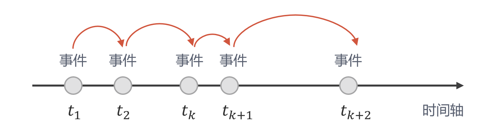

# 离散事件仿真简介

*版权所有 (c) 2022 百度量子计算研究所，保留所有权利。*

离散事件仿真（Discrete-Event Simulation, DES）是一种对系统模型进行仿真的常用方法，被广泛应用于调度、资源分配、容量规划等问题。特别地，DES 在计算机网络仿真技术中占据主导地位 [1]。由于 DES 能够对复杂系统的状态进行高效准确的跟踪模拟，经典网络中常用的 ns-3, OMNeT++ 等网络模拟软件均是基于 DES 技术进行设计的。同样地，我们的量子网络工具集 QNET 也内置了 DES 模拟引擎，以帮助我们对量子网络进行高效模拟。

本教程将会介绍离散事件仿真技术的基本原理和仿真逻辑。希望通过对具体案例及其在 QNET 中的实现方式进行讲解，读者能够掌握 QNET 中离散事件仿真模块的使用方法，为后续的量子网络模拟打好基础。

## 离散事件仿真的核心元素

DES 将系统随时间的变化抽象成一系列发生在离散时间点上的事件，然后按时间顺序依次对事件进行处理来完成仿真的推进（图 1）。在仿真过程中，系统状态的任何变化都通过与之相应的事件来实现。一般来说，DES 具有如下特性：
* **随机性**：仿真系统的状态变量中包含随机元素。
* **动态性**：时间演化对系统的状态变量有重要影响，事件处理过程中可能会创建新的未来事件。
* **离散性**：系统状态只在离散时间点上随该时刻的事件发生而改变，而在下一事件发生前，系统将保持当前状态不变。



离散事件仿真主要包含以下核心元素。

* **实体 (entity)**：即待仿真的系统中的主要研究对象。例如一个网络系统中的用户节点、具体物理装置等。
* **事件 (event)**：即在给定时间节点上发生的系统状态的变化。系统状态的任何变化都由一个事件来定义。例如网络中一个用户给另一个用户发送数据，用户接收数据并进行处理等。注意，每一个事件都需要指定该事件发生的时间。
* **事件处理器 (event handler)**：指事件的具体处理方式，可以是实体或者是协议的某个方法。例如光子源发射光子等具体行为。
* **事件调度器 (event scheduler)**：指将定义好的事件安排到模拟环境的时间轴上。所有的事件都会被加入到一个未来事件列表（future event list）中进行统一调度管理。相同时间点上，处理优先级高的事件排在前面。
* **模拟环境 (simulation environment)**：指整个模拟仿真环境。环境中包含一条虚拟的时间轴，通过从未来事件列表中取出事件进行处理，然后推进时间的演化至下一个事件，模拟直至未来事件列表中的所有事件都处理完毕或者达到用户指定的模拟时间。

在量子网络工具集 QNET 中，我们开发了一套完整的离散事件仿真引擎。我们可以通过 `Entity` 类创建实体，通过 `EventHandler` 类来定义事件的具体行为，通过 `Event` 类来定义事件发生的时间和优先级，通过调度器 `Scheduler` 来安排事件，最后通过 `DESEnv` 模拟环境进行整个仿真的运行和管理。

|  DES 核心元素   | QNET 仿真引擎  | 描述 |
|  :----:  | :----:  |:---:|
| 实体  | ``Entity`` | 待仿真系统中的实体|
| 事件  | ``Event`` | 在给定时间节点上发生的事件 |
| 事件处理器 | ``EventHandler`` | 具体事件的行为方式 |
| 事件调度器 | ``Scheduler`` | 对事件进行排期 |
| 模拟环境 | ``DESEnv`` | 驱动整个系统的仿真运行和数据收集 |


为方便理解，我们将通过一个常见的排队模型的例子，对离散事件仿真的工作原理和对应 QNET 仿真引擎的使用方式进行讲解。


## 一个简单的例子：排队模型

我们考虑如下常见的排队场景。假设有一个服务台为顾客进行服务。该服务台有一个工作人员，平均每 30 秒为一个顾客进行服务，服务后会进行 5 秒钟的准备，然后为队列中的下一位顾客服务。该服务台只有一条队列，遵从先到先服务的原则，来访顾客到达队列后，如果是队列中唯一一位顾客，并且工作人员空闲，则可上前接受服务，否则需要进行排队等候。服务台从模拟时间的 0 时刻开始工作，每 20 秒会有一个顾客加入到队列中。在这个模型中，我们最常关心的一个问题是，在服务台的工作时间内（假设为 1 个小时），平均每个顾客完成一次服务需要排队多长时间（即从加入队列到工作人员开始为其服务的时间）？对于此类问题，我们可以很容易的使用离散事件仿真进行模拟求解。

在进行模拟之前，我们需要从 `qcompute_qnet.core` 导入必要的模块。


```python
from qcompute_qnet.core.des import DESEnv, EventHandler, Entity
```

然后，我们创建一个 `Customer` 类用于模拟顾客，该类包含两个属性：顾客到达队列的序号（相当于一个服务编号）和顾客到达队列的时间。


```python
class Customer:

    def __init__(self, service_no, arrival_time):
        self.service_no = service_no  # 顾客的服务编号
        self.arrival_time = arrival_time  # 顾客到达采集点队列的时间
```

接着，我们定义一个 `ServiceCounter` 类用于模拟服务台。由于该类是我们模拟的核心对象，我们让其继承 `Entity` 类，便于使用其中内置的事件调度器。


```python
class ServiceCounter(Entity):

    def __init__(self, name, env=None):
        super().__init__(name, env)
        self.status = 0  # 工作人员状态，0 为空闲，1 为忙碌
        self.service_no = 1  # 服务编号
        self.queue = []  # 排队队列
        self.waiting_time = []  # 记录等待时间

    def init(self):
        # 第一位顾客到达
        self.scheduler.schedule_now(EventHandler(self, "customer_arrive"))
```

服务台有几个重要的操作：1. 顾客到达并加入队列；2. 工作人员开始服务；3. 工作人员完成服务。因此我们在 `ServiceCounter` 类中分别定义三个方法以对这些操作进行模拟。

### 顾客到达并加入队列

首先，我们实例化一个 `Customer` 对象，并通过当前的服务编号和达到时间对其进行初始化（当前模拟时间可以通过模拟环境中的 `now` 方法进行获取）。然后将其加入到队列中。如果当前顾客为队列中的第一位，并且工作人员空闲，则可以上前接受服务。注意，离散事件仿真中所有改变仿真系统状态的行为都是通过安排一个相应的事件进行的。所以对顾客进行服务不是直接调用 `begin_service` 方法（下面会定义），而是在当前时间通过事件调度器安排一个事件，并且指定该事件对应的事件处理方式为 `begin_service`。注意，安排事件的时候我们不需要手动创建一个 `Event`，只需要通过调度器的 `schedule_now` 或者 `schedule_after` 等方法指定事件发生的时间和具体处理方式即可，模拟器内部会自动根据这些信息创建事件 `Event`。同理，该顾客到达后，按模型假设，20 秒之后会有下一个顾客到达，所以我们通过事件调度器安排一个 20 秒之后顾客到达的事件，并且指定该事件的具体处理方式为 `customer_arrive`。 


```python
def customer_arrive(self):
    # 创建一个顾客并加入到队列中，记录服务编号和到达时间
    self.queue.append(Customer(self.service_no, self.env.now))
    self.env.logger.debug(f"Customer {self.service_no} arrives at {self.env.now}")
    # 如果当前顾客为队列中的第一位，并且工作人员空闲，则上前接受服务
    if len(self.queue) == 1 and self.status == 0:
        self.scheduler.schedule_now(EventHandler(self, "begin_service"))
    self.service_no += 1
    # 安排 20 秒之后下一个顾客到达的事件
    self.scheduler.schedule_after(20, EventHandler(self, "customer_arrive"))
```

### 工作人员开始服务

如果工作人员发现队列中有人，则变更其工作状态为忙碌，并且呼叫队列中排在第一位的顾客为其服务。按照模型假设，工作人员为每位顾客的服务时间为 30 秒。所以我们需要使用调度器，在开始服务后的 30 秒安排一个结束服务 `end_service` 的事件并设定 `end_service` 执行所需要的参数。


```python
def begin_service(self):
    # 如果队列中有人排队，工作人员则开始服务；否则保持原有状态不变
    if len(self.queue) >= 1:
        # 变更工作状态为忙碌
        self.status = 1
        # 呼叫队列中排在第一位的顾客
        customer = self.queue.pop(0)
        self.env.logger.debug(f"Customer {customer.service_no} served at {self.env.now}")
        # 计算顾客排队等待的时间
        self.waiting_time.append(self.env.now - customer.arrival_time)
        # 安排 30 秒后服务结束的事件
        self.scheduler.schedule_after(30, EventHandler(self, "end_service", [customer]))
    else:
        pass
```

### 工作人员结束服务

工作人员结束服务时，将自己的状态变更为空闲。按照模型假设，结束服务后会进行 5 秒钟的准备，然后继续为下一个顾客进行服务。所以我们需要在结束服务的 5 秒之后，安排一个事件，并指定事件的执行方式为 `begin_service`。


```python
def end_service(self, customer):
    # 结束服务，将状态变更为空闲状态
    self.status = 0
    self.env.logger.debug(f"Customer {customer.service_no} leaves at {self.env.now}")
    # 5 秒之后为下一个顾客进行服务
    self.scheduler.schedule_after(5, EventHandler(self, "begin_service"))
```

以上，我们完成了 `Customer` 和 `ServiceCounter` 的模型创建。下面，我们就可以真正开始运行模拟了。

### 仿真运行

我们规定在任何仿真模拟之前，都需要创建一个 DES 模拟环境 `DESEnv` ，指定模拟环境的名称并将该环境设为默认环境。这个步骤相当于为我们的仿真创建了一个沙盒，之后所有的实体都会被默认加载到这个沙盒之中。在创建好模拟环境之后，我们实例化一个 `ServiceCounter` 对象。然后调用 `DESEnv` 的 `init` 对模拟环境进行初始化，并调用 `run` 方法来启动整个模拟过程。`run` 方法可以接收一个 `end_time` 参数来控制模拟的时间。这里我们指定模拟的时间为 3600 秒（注意该时间为模拟时间，不是 CPU 时间；另外，QNET 内置默认时间单位为皮秒，但是对此示例的结果不会造成影响）。此外，`run` 方法还可以传入一个 `logging` 参数来决定是否输出日志文件，该参数默认为 `False`。注意到我们在对 `ServiceCounter` 进行建模的时候，反复使用到了模拟环境中的日志记录器 `logger` 用来记录仿真过程中的关键信息。因此，为了获取这些关键信息，需要在启动仿真运行时通过传入关键字参数 `logging=True` 来开启日志功能。至此，我们就完成了排队模型的仿真模拟并且可以计算输出我们需要的数据。


```python
# 创建离散事件仿真的模拟环境并设为默认环境
env = DESEnv("Queuing Model Simulation", default=True)

# 创建一个服务模型的实例
counter = ServiceCounter("Counter")

# 对仿真环境进行初始化
env.init()
# 启动仿真运行，设置结束时间并开启日志记录
env.run(end_time=3600, logging=True)

# 计算并打印平均等待时间
print("The number of served customers is", len(counter.waiting_time))
print("Average waiting time is:", sum(counter.waiting_time) / len(counter.waiting_time))
```

## 从排队模型到网络模拟

通过上面的排队模型的例子，相信大家对离散事件仿真技术和我们的仿真引擎有了一个基本的认识。其实，任何离散事件仿真的流程都与上述的排队模型类似。我们首先需要创建待模拟的实体，比如说网络中的用户、中继站、具体的传输和数据处理装置等，并且定义这些实体的行为。所有改变仿真系统状态的行为都由相应的事件进行触发，我们需要做的是在相应的实体或者协议中通过事件调度器进行事件安排。比如说网络中节点 A 给节点 B 传输一个数据包，那么 A 发送数据包之后，需要安排一个事件并指定事件的处理方式为 B 接收数据包，事件的延迟时间即为数据从 A 发送到 B 的时间（往往通过他们之间的信道长度等信息进行估算）。我们在 QNET 中预制了多种常用的实体，用户可以直接调用这些预制模型或者通过继承的方式自定义模型。模型创建好之后，我们就可以创建仿真环境并启动运行啦。

---

## 参考文献

[1] Wehrle, Klaus, et al. "Modeling and Tools for Network Simulation." [Springer-Verlag Berlin Heidelberg (2010).](https://link.springer.com/book/10.1007/978-3-642-12331-3)
