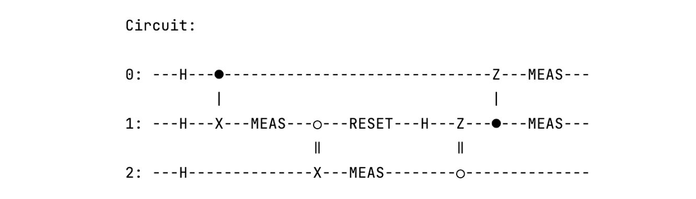
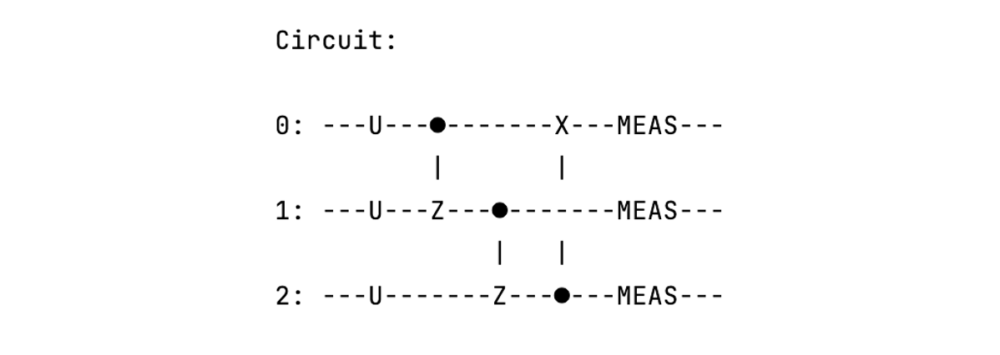
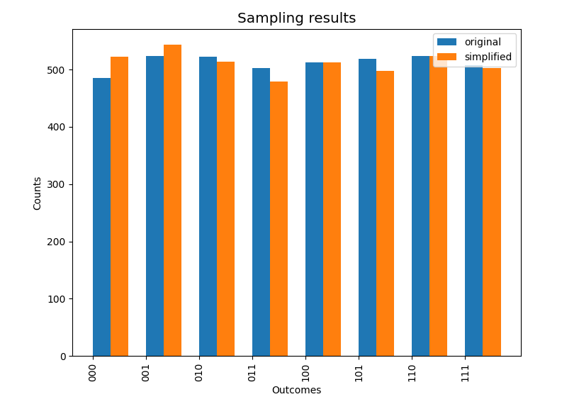

# 动态量子电路

*版权所有 (c) 2022 百度量子计算研究所，保留所有权利。*

## 概述

目前主流的量子计算实现方式基于静态量子电路模型。在静态量子电路中，所有的测量操作均位于电路的最末端。随着近期硬件方向的快速发展 [[1]](#参考文献)，包含电路中间测量以及重置操作的动态量子电路越来越受到业界的关注。 利用动态量子电路，我们可以在电路运行过程中对一部分量子比特进行测量，并在获得测量结果后，我们可以将被测量的量子比特重置到基态，以供后续的计算使用。

相较于静态量子电路，动态量子电路的主要优势有两点：首先由于引入电路的中间测量，动态量子电路可以将量子计算与实时的经典计算有效地结合起来，适用于更多的应用场景。此外，由于被重置的量子比特可以继续被用于后续的计算过程中，因此在运行相同量子算法的情况下，利用动态电路可以有效降低静态量子电路的电路宽度（即所需的量子比特数）。这些优势使得动态电路在未来将会成为许多量子算法及应用（如量子纠错、量子网络协议等）的重要组成部分，同时也可以作为一种有效降低电路宽度的电路优化方案。

除了量子电路模型之外，量子计算还可以通过基于测量的量子计算（Measurement-Based Quantum Computation, MBQC）模型来实现。在之前的教程中，我们曾介绍过 MBQC 模型和量子电路模型之间具有一一对应的关系，一个量子电路对应的 MBQC 模型被称为该电路的测量模式（measurement pattern）。类似地，在盲量子计算（Blind Quantum Computation, BQC）中，一个量子电路也可以对应于一个具有砖块结构的测量模式，称为该量子电路的砖块测量模式（brickwork pattern）。关于盲量子计算的更多内容，感兴趣的用户可以参考[量易伏：盲量子计算](https://quantum-hub.baidu.com/bqc/tutorial-bqc)教程。

特别地，当前版本的 QNET 已支持动态量子电路及其相关功能实现，用户可以自由地搭建动态量子电路，并利用 QNET 自研的量子后端对其进行模拟运行。同时，我们也在 QNET 中提供了量子电路与上述两种测量模式之间相互编译的功能。本教程中，我们将对以下一些主要功能进行说明与演示：

1. 动态量子电路模拟；
2. 动态量子电路到静态量子电路的编译；
3. 通过动态量子电路降低量子电路宽度；
4. 通过量子门合并降低量子电路深度；
5. 静态量子电路到测量模式以及砖块测量模式的编译；
6. 测量模式以及砖块测量模式到动态量子电路的编译。


## 动态量子电路

在该部分中，我们将对 QNET 目前可以实现的与动态量子电路相关的一些功能进行介绍。
 


### 1. 动态量子电路模拟

目前版本的 QNET 支持动态量子电路的模拟，用户可以根据实际需求搭建相应的动态量子电路，并通过调用 QNET 自研的量子后端对动态量子电路进行模拟运行。接下来，我们将通过一个简单的示例来展示如何通过 QNET 实现动态量子电路的模拟：

```python
from Extensions.QuantumNetwork.qcompute_qnet.quantum.circuit import Circuit
from Extensions.QuantumNetwork.qcompute_qnet.quantum.backends import Backend

# 创建一个量子电路
cir = Circuit("Dynamic circuit")

# 通过量子门调控量子态演化
cir.h(0)
cir.h(1)
cir.h(2)
cir.cnot([0, 1])
cir.cnot([0, 2])

# 对量子比特 0 进行电路中间测量
cir.measure(0, mid='a')

# 将测量后的量子比特重置到基态
cir.reset(0)

# 继续通过量子门调控量子态演化
cir.h(0)
cir.h(2)
cir.cnot([1, 2])
cir.cnot([2, 0])

# 电路末端对所有量子比特进行测量
cir.measure(0, mid='b')
cir.measure(1, mid='c')
cir.measure(2, mid='d')

# 设置最终采样结果包含哪些测量结果以及其输出顺序
cir.output_ids = ['a', 'b', 'c', 'd']

# 打印动态量子电路
cir.print_circuit()

# 调用 QNET 的态矢量后端模拟运行并输出电路采样结果
results = cir.run(shots=1024, backend=Backend.QNET.StateVector)
print(f"\nCircuit results:\n", results)
```

该动态量子电路图以及电路的采样结果如下：


```shell
Circuit results:
 {'backend': 'StateVector', 'circuit_name': 'Dynamic circuit', 'shots': 1024, 'counts': {'0000': 133, '0011': 114, '0100': 134, '0111': 133, '1000': 117, '1011': 134, '1100': 123, '1111': 136}}
```

上述示例中，我们生成了一个动态量子电路，并对其进行模拟运行获得了电路采样结果。用户在自行搭建动态量子电路并模拟运行时，需要注意的是：对于电路中的每一次测量，需要赋予该次测量一个唯一的标识符 `mid` 用以标记该测量操作（推荐传入字符串）。若用户未指定该测量的 `mid`，则其将自动被设置为一个元组 `(qubit, measurement_number)` ，其中 `qubit` 表示被测量的量子比特，`measurement_number` 表示该次测量为当前量子比特上的第几次测量。此外，若用户希望获取指定的某几次测量（包括中间测量）结果，则可以在运行电路模拟之前，通过 `Circuit` 类的 `output_ids` 属性设置希望获取到的电路测量结果所对应的 `mid` 及其输出顺序。若用户未指定该属性，则默认输出每个量子比特位上的最后一次测量的电路采样结果。

### 2. 动态量子电路到静态量子电路的编译

在 QNET 中，我们提供了将动态量子电路编译为等效的静态量子电路的功能，可以通过调用 `Circuit` 类的 `to_static` 方法实现。`to_static` 方法为输入动态电路中的每一个重置操作都分配一个新的量子比特，并将重置操作后该量子比特上的所有量子操作移至新的量子比特上进行，同时还会将电路中的所有测量操作移动至电路的最末端，从而达到将动态量子电路转化为静态量子电路的目的。下面通过一个具体电路示例进行说明：

```python
from Extensions.QuantumNetwork.qcompute_qnet.quantum.circuit import Circuit
from Extensions.QuantumNetwork.qcompute_qnet.quantum.backends import Backend
from Extensions.QuantumNetwork.qcompute_qnet.quantum.utils import plot_results

# 创建一个量子电路
cir = Circuit()

# 作用一系列量子门进行态演化
cir.h(0)
cir.h(1)
cir.h(2)
cir.cnot([0, 1])

# 电路中间测量
cir.measure(1, mid='a')

# 经典控制量子操作，根据电路中间测量结果 'a' 决定是否在量子比特 2 上作用 Pauli X 门
cir.x(2, condition='a')

# 重置操作
cir.reset(1)

# 继续进行量子态演化并进行测量
cir.h(1)
cir.measure(2, mid='b')
cir.z(1, condition='b')
cir.cz([1, 0])
cir.measure(0, mid='c')
cir.measure(1, mid='d')

# 设置最终采样结果包含哪些测量结果以及其输出顺序
cir.output_ids = ['a', 'b', 'c', 'd']

# 打印动态量子电路
cir.print_circuit()
# 调用 QNET 的态矢量后端模拟电路运行
counts1 = cir.run(shots=8192, backend=Backend.QNET.StateVector)['counts']

# 将动态电路编译为静态量子电路
cir.to_static()
cir.print_circuit()

# 模拟运行转化后的静态量子电路
counts2 = cir.run(shots=8192, backend=Backend.QNET.StateVector)['counts']

# 模拟运行结果可视化
plot_results([counts1, counts2], ['dynamic circuit', 'static circuit'])
```

本示例中创建的动态量子电路图和编译后的静态量子电路图如下图所示：




对比图 2 和图 3 可以看出，`to_static` 方法为量子比特 1 上的重置操作分配了新的量子比特 3，并将量子比特 1 上的重置操作后的所有操作移至量子比特 3 上进行。同时还根据推迟测量原理，将所有的经典控制量子操作转化为受控量子门，并将各量子比特上的测量操作移动到电路的末端。图 2 和图 3 所示电路模拟运行的结果对比如下：


可以看出，编译出的静态电路与动态电路的模拟运行结果是基本一致的。

### 3. 通过动态量子电路降低量子电路宽度

在概述部分曾经提到，动态量子电路可以作为一种降低静态量子电路宽度的优化编译方案。为此，我们在 `Circuit` 类中提供了 `is_reducible` 方法，用以判断当前电路是否可以通过优化编译降低电路宽度。此外，用户还可以通过调用 `reduce` 方法，实现将当前静态量子电路编译为等效的动态量子电路，以达到降低电路宽度的目的。下面将通过一个示例来介绍如何使用这两个方法：

```python
from Extensions.QuantumNetwork.qcompute_qnet.quantum.circuit import Circuit

# 创建一个量子电路
cir = Circuit()

# 作用一系列量子门进行态演化
cir.h(0)
cir.h(1)
cir.h(2)
cir.h(3)
cir.h(4)
cir.h(5)
cir.cnot([0, 1])
cir.cnot([1, 2])
cir.cnot([2, 3])
cir.cnot([3, 4])
cir.cnot([4, 5])
cir.cnot([5, 0])

# 设置测量操作的 mid 以获取对应采样结果
cir.measure(0, mid='a')
cir.measure(1, mid='b')
cir.measure(2, mid='c')
cir.measure(3, mid='d')
cir.measure(4, mid='e')
cir.measure(5, mid='f')
# 设置最终采样结果包含哪些次测量结果以及其输出顺序
cir.output_ids = ['a', 'b', 'c', 'd', 'e', 'f']

# 打印静态量子电路
cir.print_circuit()

# 检查当前电路是否可以通过编译降低电路宽度
if cir.is_reducible():
    # 通过 minimum_remaining_values 算法进行编译
    cir.reduce("minimum_remaining_values")

# 打印编译后的动态量子电路
cir.print_circuit()
```

目前 `reduce` 方法支持三种电路编译算法：`"minimum_remaining_values"`（默认值）、`"row_order_first"` 以及 `"brute_force"`。这三种算法的核心思想是类似的：即在不影响电路运行结果的前提下，对输入电路中量子操作的执行顺序进行重排，使得某个量子比特上的所有操作优先执行完，然后将该量子比特回收并重置。随后我们便可以用这个量子比特来执行另一个量子比特上的操作，从而降低电路宽度。具体来说，`"minimum_remaining_values"` 算法会首先计算电路中的每个量子比特被重置后，可用于执行哪些其它量子比特上的操作，并记录其它量子比特候选者的数目，随后优先执行候选者数非零且最少的量子比特上的操作并将其回收重置；`"row_order_first"` 算法则会优先执行行序最小的量子比特上的所有操作，随后将其回收重置；而 `"brute_force"` 算法则是通过暴力搜索寻找所有可行的电路编译方式，并从中挑选最优解（编译后的电路宽度最小）。需要说明的是，`"minimum_remaining_values"` 以及 `"row_order_first"` 均属于启发式算法，并且相较于 `"brute_force"` 更适合用于编译规模较大的电路。在实际使用过程中，用户可以自行尝试不同的编译算法，以获取更好的电路编译效果。上述代码生成的静态量子电路与编译后的动态量子电路如下图所示：


由上图可以看出，通过 `"minimum_remaining_values"` 算法的优化编译，使得初始静态量子电路的量子比特数减少了3个。用户还可以通过调用 QNET 的量子后端，对编译前后的电路进行模拟运行并对比运行结果，以检验编译前后的量子电路是否等效。特别地，对于[谷歌量子霸权电路示例库](https://github.com/sboixo/GRCS)中的电路，也可以通过 `reduce` 方法来实现电路简化，感兴趣的用户可以自行尝试。

### 4. 通过量子门合并降低量子电路深度

以上介绍的 `reduce` 方法可以在保证运行结果不受影响的条件下，降低量子电路的电路宽度。此外，在 `Circuit` 类中还内置了 `simplify` 方法，该方法通过将作用在相同量子比特上的连续的单、双量子比特门合并为等效的量子门，从而可以在不影响电路功能的情况下，降低量子电路的电路深度。一个具体的代码示例如下：

```python
from Extensions.QuantumNetwork.qcompute_qnet.quantum.circuit import Circuit
from Extensions.QuantumNetwork.qcompute_qnet.quantum.backends import Backend
from Extensions.QuantumNetwork.qcompute_qnet.quantum.utils import plot_results

# 创建一个量子电路
cir = Circuit()

# 通过量子门调控量子态演化
cir.h(0)
cir.x(0)
cir.h(1)
cir.y(1)
cir.h(2)
cir.z(2)
cir.cnot([1, 2])
cir.cnot([1, 2])
cir.cz([0, 1])
cir.cz([1, 2])
cir.cnot([2, 0])

# 对所有量子比特进行测量
cir.measure()

# 打印量子电路
cir.print_circuit()
# 调用 QNET 的态矢量后端模拟运行原始电路
counts1 = cir.run(shots=4096, backend=Backend.QNET.StateVector)['counts']

# 对电路进行简化以降低电路深度
cir.simplify()

# 打印简化后的量子电路
cir.print_circuit()
# 调用 QNET 的态矢量后端模拟运行简化后的电路
counts2 = cir.run(shots=4096, backend=Backend.QNET.StateVector)['counts']

# 模拟运行结果可视化
plot_results([counts1, counts2], ['original', 'simplified'])
```

原始的量子电路及简化后的量子电路如下图所示：




下图为电路简化前后运行结果的对比：



从图 7 和图 8 可以看出，`simplify` 方法将初始电路中每个量子比特位上的前两个单量子比特门合并为一个等效的 U 门，同时将量子比特 1 和 2 上的两个连续的 CNOT 门合并，使得简化后的电路深度有所降低。同时从图 9 可以看出，简化前后的电路运行结果没有受到影响。此外，用户还可以通过 `Circuit` 类的 `print_list` 方法打印电路指令列表，以查看合并后等效量子门的相关参数。

## 测量模式

在接下来的部分中，我们将对当前版本的 QNET 可以实现的测量模式的相关功能进行介绍。

### 1. 静态量子电路到测量模式以及砖块测量模式的编译

在概述部分曾经提到，用户可以分别通过 `Circuit` 类中的 `to_pattern` 和 `to_brickwork_pattern` 方法来将量子电路转化为对应的测量模式以及砖块测量模式。这两个方法均会返回一个 `Pattern` 类的实例。为方便用户理解，下面我们通过一个包含两个量子比特的格罗弗算法的电路示例（对应解为 $| 11 \rangle$ 的情况）对这两个方法进行说明展示。关于格罗弗算法的具体内容，感兴趣的用户可以参考[量易简-格罗弗搜索算法](https://qulearn.baidu.com/textbook/chapter3/%E6%A0%BC%E7%BD%97%E5%BC%97%E7%AE%97%E6%B3%95.html)教程。

```python
from Extensions.QuantumNetwork.qcompute_qnet.quantum.circuit import Circuit

# 创建一个量子电路
cir = Circuit()

# 作用 2 量子比特格罗弗算法所需的量子门
cir.h(0)
cir.h(1)
cir.cz([0, 1])
cir.h(0)
cir.h(1)
cir.z(0)
cir.z(1)
cir.cz([0, 1])
cir.h(0)
cir.h(1)

# 设置测量操作的 mid 以获取对应采样结果
cir.measure(0, mid='a')
cir.measure(1, mid='b')
cir.output_ids = ['a', 'b']

# 打印静态量子电路图
cir.print_circuit()
```

该 2 量子比特 Grover 算法对应的电路图如下图所示：


通过调用 `to_pattern` 方法，可以将上述电路转化为对应的 MBQC 测量模式，具体代码如下：

```python
# 将静态量子电路转化为对应的测量模式
pattern = cir.to_pattern()

# 打印测量模式指令列表
pattern.print()
```

代码运行结果如下（为方便展示，隐藏了指令列表中的部分指令）：

```shell
------------------------------------------------------------
                    Current Command List                    
------------------------------------------------------------
Command:        E
which_qubit:    [(0, 0), (0, 0.25)]
-----------------------------------------------------------

                            ...

-----------------------------------------------------------
Command:        E
which_qubit:    [(1, 2.75), (1, 3)]
-----------------------------------------------------------
Command:        M
which_qubit:    (0, 0)
plane:          XY
angle:          -1.5707963267948966
domain_s:       []
domain_t:       []
-----------------------------------------------------------

                            ...

-----------------------------------------------------------
Command:        M
which_qubit:    (1, 3)
plane:          YZ
angle:          0
domain_s:       []
domain_t:       [(1, 2.75)]
-----------------------------------------------------------
```

从运行结果可以看出，该电路对应的测量模式共包含 26 个节点（${(0, 0), (0, 0.25), ..., (1, 3)}$），即需要 26 个量子比特来完成该测量模式的计算。

类似地，通过调用 `to_brickwork_pattern` 方法，也可以将上述静态电路转化为对应的砖块测量模式，具体代码以及运行结果如下（为方便展示，隐藏了砖块测量模式指令列表中的部分指令）：

```python
# 将电路转化为对应的砖块测量模式
brickwork_pattern = cir.to_brickwork_pattern()

# 打印砖块测量模式指令列表
brickwork_pattern.print()
```

```shell
------------------------------------------------------------
                    Current Command List                    
------------------------------------------------------------
Command:        E
which_qubit:    [(0, 0), (0, 1)]
-----------------------------------------------------------

                            ...

-----------------------------------------------------------
Command:        E
which_qubit:    [(0, 36), (1, 36)]
-----------------------------------------------------------
Command:        M
which_qubit:    (0, 0)
plane:          XY
angle:          -1.5707963267948966
domain_s:       []
domain_t:       []
-----------------------------------------------------------

                            ...

-----------------------------------------------------------
Command:        M
which_qubit:    (1, 36)
plane:          YZ
angle:          0
domain_s:       []
domain_t:       [(1, 35)]
-----------------------------------------------------------
``` 

### 2. 测量模式以及砖块测量模式到动态量子电路的编译

在上一部分中，我们将一个 2 量子比特的格罗弗算法的量子电路分别转化为对应的 MBQC 测量模式以及盲量子计算的砖块测量模式。除此之外，QNET 中还内置了可以将这两种测量模式转化为动态量子电路的功能，通过 `Pattern` 类中的 `to_dynamic_circuit` 方法实现。在下面的例子中，我们将上述获得的 MBQC 测量模式转化为对应的动态量子电路：

```python
# 将测量模式转化为动态量子电路
pat_dyn_cir = pattern.to_dynamic_circuit()

# 打印转化后的动态量子电路
pat_dyn_cir.print_circuit()
```

测量模式对应的动态量子电路图如下图所示：


可以看出，通过将 MBQC 测量模式编译成动态量子电路，使得完成相同计算任务所需的量子比特数由 26 个降低到了 3 个（由于编译后的动态电路深度较大，在图 11 中我们对编译后的动态量子电路进行分行展示）。同时，编译后的动态量子电路中仅包含重置、测量（对应 MBQC 中对单节点的测量命令）以及 CZ 门（对应于 MBQC 中两个节点间的纠缠命令）这三类操作。

类似地，也可以通过如下代码将上述砖块测量模式编译为等效的动态量子电路，感兴趣的用户可以自行尝试来查看结果。

```python
# 将砖块测量模式转化为动态量子电路
bw_pat_dyn_cir = brickwork_pattern.to_dynamic_circuit()

# 打印砖块量子电路对应的动态量子电路图
bw_pat_dyn_cir.print_circuit()
```

## 总结

通过引入中间测量和对量子比特的重置操作，动态量子电路可以使得经典计算与量子计算有效地结合起来，从而丰富了通过量子电路模型可以完成的计算任务种类。而且对于某些量子算法，动态电路可以有效降低其所需的量子比特数，使得这些量子算法在经典计算机上的模拟以及真实量子计算机上的运行所需的资源更少。可以预见的是，动态量子电路在未来具有极佳的研究意义和广阔的应用前景。

---

## 参考文献

[1] A. D. Córcoles, Maika Takita, Ken Inoue, Scott Lekuch, Zlatko K. Minev, Jerry M. Chow, and Jay M. Gambetta, "Exploiting dynamic quantum circuits in a quantum algorithm with superconducting qubits", [Physical Review Letters **127**, 100501](https://doi.org/10.1103/PhysRevLett.127.100501). 
