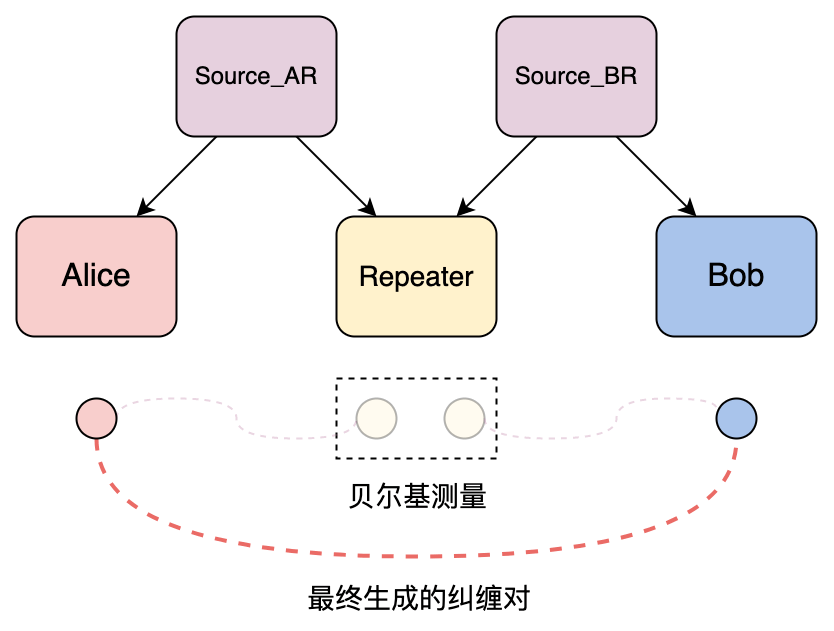
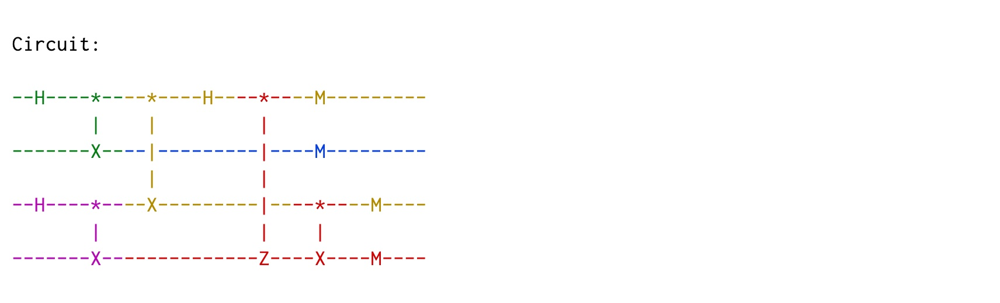

# 量子纠缠交换

*版权所有 (c) 2022 百度量子计算研究所，保留所有权利。*

在量子隐形传态协议的相关教程中，我们介绍了如何利用量子隐形传态协议实现对一个量子态的远距离传输。本教程中，我们将介绍一个在量子网络中有着广泛应用背景的协议——量子纠缠交换协议。

我们同样将首先对该协议的背景和实现原理进行介绍，随后，我们将结合 QNET 对该协议进行仿真实现，并对协议流程展开进一步的介绍。最后，我们将该协议置于一个简单的量子网络场景中进行仿真模拟及验证。

## 1. 背景介绍

在量子网络中，量子纠缠是非常重要的通信资源。通过共享量子纠缠，通信双方可以实现如量子隐形传态等多种协议。对于量子网络中两个互相之间存在直连信道的节点而言，可以通过其中一方制备纠缠并通过直连信道发送纠缠粒子的方式来共享纠缠。此外，也可以由中间节点进行纠缠制备，并通过直连信道分别将纠缠粒子发送给通信方。然而，光子在传输过程中有一定概率会被光纤信道吸收，从而导致信号丢失，且这种损耗会随着传输距离的增加而呈指数级上升，由此限制了光子在信道中直接传输的距离。在这种情况下，通过引入纠缠交换的方法，可以对通信双方之间共享纠缠的距离进行延长。纠缠交换的原理是将多对短距离的纠缠转换成一对长距离的纠缠，从而成功实现通信双方之间的纠缠资源共享 [1]。

## 2. 协议流程

在这里我们假定一个简单的量子网络场景：Alice 希望与 Bob 之间共享一对纠缠，但是他们之间没有直连的信道，因此需要由量子中继器来帮助他们完成纠缠交换协议，以实现长距离的纠缠资源共享。该协议的流程大致如下（如图 1 所示）：

1. 由上游节点 Alice 向中继节点 Repeater 发起纠缠交换请求，并指定希望共享纠缠的下游节点为 Bob；
2. 中继节点在收到纠缠交换请求之后，分别向纠缠源请求分发纠缠，并指定其希望共享纠缠的节点；
3. 纠缠源在收到来自中继节点的纠缠请求后，在本地制备一对贝尔态 $| \Phi^+ \rangle = \tfrac{1}{\sqrt{2}} (|00 \rangle + |11 \rangle)$，并分别将两个纠缠粒子发送给中继节点及其上游（下游）节点；
4. 通信双方在接收到来自纠缠源的量子比特后，将其保存在本地量子寄存器中；
5. 中继节点确认分别收到来自两个纠缠源的粒子后，对这两个粒子执行贝尔测量，并将测量结果通过经典信道发给 Bob；
6. Bob 确认同时收到量子比特和经典测量结果后，将根据经典测量结果对其本地寄存器中保存的粒子执行相应的操作，从而成功与 Alice 共享贝尔态 $ |\Phi^+ \rangle_{AB} $。

**注意**：为了验证协议的正确性，我们在该示例协议中规定：完成纠缠交换后，通信双方分别对其所持有的粒子进行测量。



接下来，我们使用 QNET 对上述协议进行仿真。

## 3. 协议实现

我们在 QPU 模块中提供了 ``EntanglementSwapping`` 类用以对该协议进行仿真，并分别定义了四个子协议来描述该协议中四种角色的行为：负责分发纠缠的纠缠源（``Source``）、发起纠缠交换请求的上游节点（``UpstreamNode``）、根据经典测量结果恢复特定纠缠态的下游节点（``DownstreamNode``）、负责纠缠交换的中继节点（``Repeater``）。

```python
class EntanglementSwapping(Protocol):

    def __init__(self, name=None):
        super().__init__(name)
        self.role = None

    class Message(ClassicalMessage):

        def __init__(self, src: "Node", dst: "Node", protocol: type, data: Dict):
            super().__init__(src, dst, protocol, data)

        @unique
        class Type(Enum):

            SWAP_REQUEST = "Swapping request"
            ENT_REQUEST = "Entanglement request"
            OUTCOME_FROM_REPEATER = "Measurement outcome from the repeater"

    def start(self, **kwargs) -> None:
        role = kwargs['role']
        # 根据角色来实例化对应子协议
        self.role = getattr(EntanglementSwapping, role)(self)  
        # 启动子协议
        self.role.start(**kwargs)  

    def receive_classical_msg(self, msg: "ClassicalMessage", **kwargs) -> None:
        # 由对应的子协议接收经典消息
        self.role.receive_classical_msg(msg)  

    def receive_quantum_msg(self, msg: "QuantumMsg", **kwargs) -> None:
        # 存储接收到的量子比特
        self.node.qreg.store_qubit(msg.data, kwargs['src'])  
        # 由对应的子协议做进一步的操作
        self.role.receive_quantum_msg()  
```

### 1. 纠缠源（``Source``）

纠缠源负责纠缠分发，在收到来自中继节点的纠缠请求消息 ``ENT_REQUEST`` 后，在本地制备一对贝尔态 $| \Phi^+ \rangle = \tfrac{1}{\sqrt{2}} (|00 \rangle + |11 \rangle)$，并分别将两个纠缠粒子发送给中继节点及其请求共享纠缠的上游（下游）节点。

```python
class EntanglementSwapping(Protocol):
    ...
    class Source(SubProtocol):

        def __init__(self, super_protocol: Protocol):
            super().__init__(super_protocol)

        def start(self, **kwargs) -> None:
            pass

        def receive_classical_msg(self, msg: "ClassicalMessage") -> None:
            if msg.data['type'] == EntanglementSwapping.Message.Type.ENT_REQUEST:
                # 在本地生成一对纠缠粒子
                self.node.qreg.h(0)
                self.node.qreg.cnot([0, 1])

                # 对生成的纠缠粒子进行分发
                # 将本地寄存器地址为 0 的量子比特发送给中继节点
                self.node.send_quantum_msg(dst=msg.src, qreg_address=0)  
                # 将本地寄存器地址为 1 的量子比特发送给中继节点的上（下）游节点
                self.node.send_quantum_msg(dst=msg.data['peer'], qreg_address=1)  
```

### 2. 上游节点（``UpstreamNode``）

发起纠缠交换请求的角色称为上游节点。作为上游节点，在其协议开始时，Alice 会向中继节点发送一则 ``SWAP_REQUEST`` 消息以请求执行纠缠交换协议。

为了验证通过纠缠交换协议我们成功实现了 Alice 和 Bob 之间共享的纠缠，我们在协议中规定，Alice 在收到来自纠缠源的量子比特后，接着进行测量，用以后续与 Bob 的测量结果进行比对，来对协议进行验证。

```python
class EntanglementSwapping(Protocol):
    ...
    class UpstreamNode(SubProtocol):

        def __init__(self, super_protocol: Protocol):
            super().__init__(super_protocol)
            self.repeater = None
            self.peer = None

        def start(self, **kwargs) -> None:
            # 共享纠缠的节点
            self.peer = kwargs['peer']  
            # 负责执行纠缠交换的中继节点
            self.repeater = kwargs['repeater']  
            # 向中继节点发起纠缠交换请求
            self.request_swapping()  

        def request_swapping(self) -> None:
            # 生成一则纠缠交换请求消息
            swap_request_msg = EntanglementSwapping.Message(
                src=self.node, dst=self.repeater, protocol=EntanglementSwapping,
                data={'type': EntanglementSwapping.Message.Type.SWAP_REQUEST, 'peer': self.peer}
            )
            # 向中继节点发送纠缠交换请求
            self.node.send_classical_msg(dst=self.repeater, msg=swap_request_msg)  

        def receive_quantum_msg(self) -> None:
            # 对收到的量子比特进行测量以验证协议的正确性
            self.node.qreg.measure(0)  
```

### 3. 下游节点（``DownstreamNode``）

根据经典测量结果恢复特定纠缠态的角色称为下游节点。作为下游节点，Bob 将分别收到纠缠源发来的纠缠粒子以及由中继节点执行本地测量后发来的经典测量结果。确认同时收到量子比特和经典测量结果后，Bob 将根据经典测量结果对其本地寄存器中保存的量子比特执行相应的操作，从而成功与 Alice 共享贝尔态 $ |\Phi^+ \rangle_{AB} $。

为了验证协议的正确性，我们规定，Bob 完成对特定纠缠态的恢复后，接着进行测量，用以与 Alice 的测量结果进行比对，来对协议进行验证。

```python
class EntanglementSwapping(Protocol):
    ...
    class DownstreamNode(SubProtocol):

        def __init__(self, super_protocol: Protocol):
            super().__init__(super_protocol)
            self.peer = None
            self.outcome_from_repeater = None

        def start(self, **kwargs) -> None:
            self.peer = kwargs['peer']

        def receive_classical_msg(self, msg: "ClassicalMessage") -> None:
            if msg.data['type'] == EntanglementSwapping.Message.Type.OUTCOME_FROM_REPEATER:
                # 保存由中继节点发来的经典测量结果
                self.outcome_from_repeater = msg.data['outcome_from_repeater']  

                # 若已经接收到来自纠缠源的量子比特，对其进行对应的操作来恢复与上游节点共享的纠缠态
                if self.node.qreg.units[0]['qubit'] is not None:
                    self.correct_state()

        def receive_quantum_msg(self) -> None:
            # 若已经接收到来自中继节点的测量结果，进行对应的操作来恢复与上游节点共享的纠缠态
            if self.outcome_from_repeater is not None:
                self.correct_state()

        def correct_state(self) -> None:
            # 根据经典测量结果执行相应的泡利操作
            self.node.qreg.z(0, condition=self.outcome_from_repeater[0])
            self.node.qreg.x(0, condition=self.outcome_from_repeater[1])
            # 对收到的量子比特进行测量以验证协议的正确性
            self.node.qreg.measure(0)  
```

### 4. 中继节点（``Repeater``）

中继节点负责实现纠缠中继，在收到上游节点 Alice 发来的 ``SWAP_REQUEST`` 消息后，中继节点将分别向上下游纠缠源发送一则 ``ENT_REQUEST`` 消息以请求分发纠缠。在确认分别收到两个纠缠源发来的粒子后，中继节点对这两个粒子执行贝尔测量，并将测量结果通过经典信道发送给其下游节点 Bob。

```python
class EntanglementSwapping(Protocol):
    ...
    class Repeater(SubProtocol):

        def __init__(self, super_protocol: Protocol):
            super().__init__(super_protocol)
            self.ent_sources = None
            self.upstream_node = None
            self.downstream_node = None

        def start(self, **kwargs) -> None:
            # 对应的纠缠源节点
            self.ent_sources = kwargs['ent_source']  

        def request_entanglement(self, source: "Node", peer: "Node") -> None:
            # 生成一则纠缠请求消息
            ent_request_msg = EntanglementSwapping.Message(
                src=self.node, dst=source, protocol=EntanglementSwapping,
                data={'type': EntanglementSwapping.Message.Type.ENT_REQUEST, 'peer': peer}
            )
            # 向纠缠源发送纠缠请求
            self.node.send_classical_msg(dst=source, msg=ent_request_msg)  

        def receive_classical_msg(self, msg: "ClassicalMessage") -> None:
            if msg.data['type'] == EntanglementSwapping.Message.Type.SWAP_REQUEST:
                # 分别记录上游节点和下游节点
                self.upstream_node, self.downstream_node = msg.src, msg.data['peer']  
                # 请求为自身与上（下）游节点分发纠缠
                self.request_entanglement(self.ent_sources[0], self.upstream_node)
                self.request_entanglement(self.ent_sources[1], self.downstream_node)

        def receive_quantum_msg(self) -> None:
            if self.node.qreg.units[0]['qubit'] is not None and self.node.qreg.units[1]['qubit'] is not None:
                # 获取由上游纠缠源发来的量子比特在寄存器中的地址
                address_0 = self.node.qreg.get_address(self.ent_sources[0])  
                # 获取由下游纠缠源发来的量子比特在寄存器中的地址
                address_1 = self.node.qreg.get_address(self.ent_sources[1])  
                # 在本地执行贝尔测量
                self.node.qreg.bsm([address_0, address_1])  

                # 将测量结果通过经典信道发送给下游节点
                outcome_msg = EntanglementSwapping.Message(
                    src=self.node, dst=self.downstream_node, protocol=EntanglementSwapping,
                    data={'type': EntanglementSwapping.Message.Type.OUTCOME_FROM_REPEATER,
                          'outcome_from_repeater': [self.node.qreg.units[address_0]['outcome'],
                                                    self.node.qreg.units[address_1]['outcome']]
                          }
                )
                self.node.send_classical_msg(dst=self.downstream_node, msg=outcome_msg)
```

## 4. 代码示例

接下来，我们使用 QNET 构建上述场景，对纠缠交换协议进行模拟。

首先，创建一个仿真环境 ``QuantumEnv``。

```python
from qcompute_qnet.models.qpu.env import QuantumEnv

# 创建一个仿真环境
env = QuantumEnv("Repeater", default=True)
```

随后，分别创建协议中四种角色所对应的量子节点，设定这些节点的协议栈中预装的协议为 ``EntanglementSwapping``，并配置这些节点之间必要的通信链路。

```python
from qcompute_qnet.models.qpu.node import QuantumNode
from qcompute_qnet.models.qpu.protocol import EntanglementSwapping
from qcompute_qnet.topology.link import Link

# 创建装有量子寄存器的量子节点并指定其中预装的协议类型
alice = QuantumNode("Alice", qreg_size=1, protocol=EntanglementSwapping)
repeater = QuantumNode("Repeater", qreg_size=2, protocol=EntanglementSwapping)
bob = QuantumNode("Bob", qreg_size=1, protocol=EntanglementSwapping)
source_ar = QuantumNode("Source_AR", qreg_size=2, protocol=EntanglementSwapping)
source_br = QuantumNode("Source_BR", qreg_size=2, protocol=EntanglementSwapping)

# 创建通信链路
link_ar = Link("Link_ar", ends=(alice, repeater), distance=1e3)
link_br = Link("Link_br", ends=(bob, repeater), distance=1e3)
link_alice_source_ar = Link("Link_alice_source_ar", ends=(alice, source_ar), distance=1e3)
link_repeater_source_ar = Link("Link_repeater_source_ar", ends=(repeater, source_ar), distance=1e3)
link_bob_source_br = Link("Link_bob_source_ar", ends=(bob, source_br), distance=1e3)
link_repeater_source_br = Link("Link_repeater_source_br", ends=(repeater, source_br), distance=1e3)
```

然后，创建一个量子网络，并将配置好的节点和通信链路装入量子网络中。

```python
from qcompute_qnet.topology.network import Network

# 创建一个量子网络并将各节点和各链路装入量子网络中
network = Network("Repeater network")
network.install([alice, bob, repeater, source_ar, source_br, 
                 link_ar, link_br, link_alice_source_ar, link_repeater_source_ar, 
                 link_bob_source_br, link_repeater_source_br])
```

现在我们完成了对仿真环境的创建和量子网络的搭建，接下来可以通过节点的 ``start`` 方法，启动节点协议栈中装载的 ``EntanglementSwapping`` 协议。

```python
# 启动纠缠交换协议
alice.start(role="UpstreamNode", peer=bob, repeater=repeater)
bob.start(role="DownstreamNode", peer=alice)
source_ar.start(role="Source")
source_br.start(role="Source")
repeater.start(role="Repeater", ent_sources=[source_ar, source_br])
```

最后，对仿真环境进行初始化并运行，并查看输出结果。

```python
from qcompute_qnet.quantum.backends import Backend

# 初始化仿真环境并运行仿真
env.init()
results = env.run(shots=1024, backend=Backend.QCompute.LocalBaiduSim2, summary=False)
# 查看电路运行结果
print(f"\nCircuit results:\n", results)
```

仿真的运行结果如下所示。



```
Colors: {'Bob': 'red', 'Alice': 'blue', 'Source_AR': 'green', 'Repeater': 'yellow', 'Source_BR': 'purple'}

Circuit results:
 {'circuit_name': 'Circuit', 'shots': 1024, 'counts': {'0000': 124, '0010': 137, '0101': 119, '0111': 122, '1000': 120, '1010': 137, '1101': 133, '1111': 132}}
```

为了对纠缠交换协议的结果进行验证，我们可以调用 ``Circuit`` 的 ``reduce_results`` 方法，分别打印 Alice 和 Bob 所持有粒子的测量结果。

```python
# 核对 Alice 和 Bob 的测量结果
reduced_indices = [1, 3]
reduced_results = network.default_circuit.reduce_results(results['counts'], indices=reduced_indices)
print(f"\nMeasurement results of Alice, Bob:\n", reduced_results)
```

运行结果如下：

```
Measurement results of Alice, Bob:
 {'00': 505, '11': 519}
```

---

## 参考文献

[1] Briegel, H-J., et al. "Quantum repeaters: the role of imperfect local operations in quantum communication." [Physical Review Letters 81.26 (1998): 5932.](https://journals.aps.org/prl/abstract/10.1103/PhysRevLett.81.5932)
