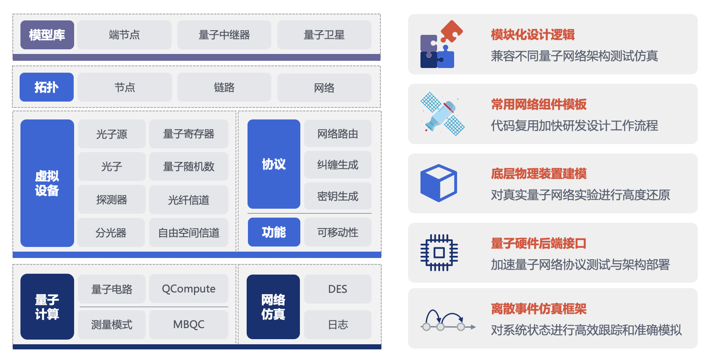

# 简介

*版权所有 (c) 2022 百度量子计算研究所，保留所有权利。*

## 关于 QNET

QNET (Quantum NETwork) 是由百度研究院[量子计算研究所](https://quantum.baidu.com/)研发的量子网络工具集，旨在加速量子网络协议设计，量子网络架构测试以及量子网络标准制定与部署。QNET 提供完备的离散事件仿真框架，帮助对量子网络系统状态进行高效跟踪和准确模拟，模块化设计可为不同量子网络架构提供测试环境。



## 特色

QNET 量子网络工具集正在持续研发中，当前版本包含如下特色：

* 离散事件仿真框架，对系统状态进行高效跟踪和准确模拟；
* 量子硬件后端接口，加速量子网络协议测试与架构部署；
* 底层物理装置建模，对真实量子网络实验进行高度还原；
* 常用网络组件模板，代码复用加快研发设计工作流程；
* 模块化设计逻辑，兼容不同量子网络架构测试仿真。

## 教程

为方便用户快速上手 QNET，我们提供了如下[教学文档](https://quantum-hub.baidu.com/qnet/tutorial-introduction)：

* 离散事件仿真简介
* 量子网络的搭建与模拟
* 墨子号量子卫星实验
* 量子网络架构模拟
* 量子网络协议的真机部署
* 量子隐形传态
* 量子纠缠交换
* CHSH 游戏
* 量子魔方游戏

更多丰富的教程和演示案例将会在后续版本中进行持续更新，敬请期待。

## 用户反馈

我们热诚欢迎用户通过邮件方式对工具集的各种相关问题，未解决的 bug 和可能的改善方向进行反馈。相关问题请邮件至 quantum@baidu.com

## 引用参考

我们热诚欢迎科研工作者使用 QNET 进行量子网络相关问题的研发与探索。如果您的工作使用了 QNET，请通过如下 BibTeX 进行引用：

```latex
@misc{QNET,
      title = {{Quantum NETwork in Baidu Quantum Platform}},
      year = {2022},
      url = {https://quantum-hub.baidu.com/qnet/}
}
```

## 版权和许可证

QNET 使用 [Apache-2.0 license](https://github.com/baidu/QCompute/blob/master/LICENSE) 作为许可证。
