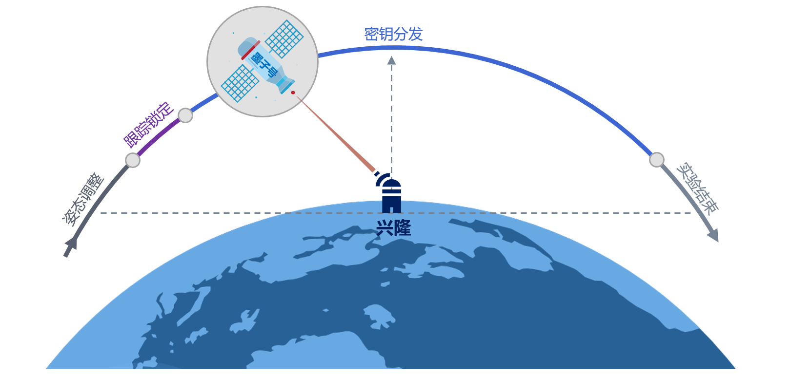
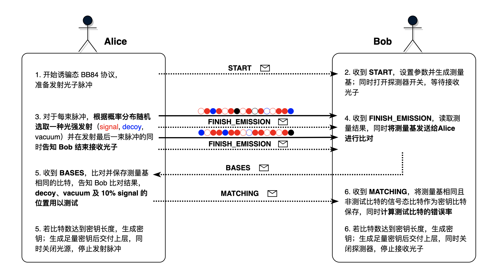
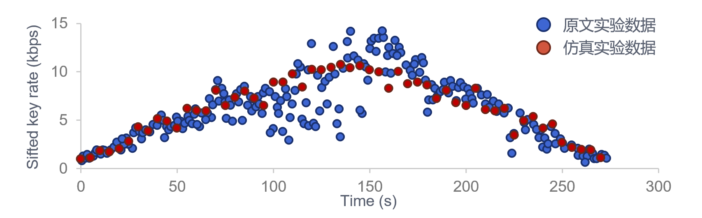

# 墨子号量子卫星实验

*版权所有 (c) 2022 百度量子计算研究所，保留所有权利。*

通过前面几个教程的讲解，我们介绍了如何借助 QNET 来自行构建想要实现的量子网络，并对其进行仿真模拟。本教程中，我们将使用 QNET 对 2017 年墨子号量子科学实验卫星所做的星地量子密钥分发实验进行仿真验证。关于该实验的详细细节，可参见原始文献 [1]。

下面，我们将从墨子号量子卫星的实验背景，量子卫星实验的大致流程，诱骗态 BB84 的协议步骤，QNET 实验仿真的具体实现，仿真结果与真实实验结果对比等几个方面展开该教程的介绍。


## 量子卫星实验介绍

### 1. 背景介绍
受地面条件限制，许多地方无法铺设量子通信专用光纤。而采用量子通信卫星进行中继，则能够克服障碍物及地面曲率等诸多因素的影响，更容易实现远距离的量子通信，帮助建立一个全球规模的量子网络。

墨子号量子科学实验卫星是世界首颗量子科学实验卫星，于2016年8月16日成功发射升空，此后在国际上率先实现了千公里级的星地双向量子纠缠分发、高速星地量子密钥分发、地星量子隐形传态等实验，为我国在未来引领世界量子通信技术发展奠定了坚实的科学与技术基础。

### 2. 实验流程

作为光子的发送方，量子卫星内置有分别用于发射信号态和诱骗态的发射器。激光脉冲经过 BB84 编码后，与用于系统跟踪和时间同步的激光脉冲共同对准并发出。

作为接收方，地面站将接收到的激光通过双色镜分为两条路径分别实现跟踪和时间同步，并通过 BB84 解码器接收光子。

如图 1 所示，卫星从当地时间 00:50 左右开始，每晚沿太阳同步轨道经过兴隆地面观测站一次，经过时间约5分钟。卫星进入阴影区前首先进行姿态调整并指向地面站，随后跟踪定向系统开始双向跟踪和指向，以确保发射器和接收器在整个轨道上牢固锁定。大约 15° 的仰角开始，搭载在卫星上的 QKD 发射器发送随机调制的信号态和诱骗态光子，由地面站进行接收并检测。当卫星再次达到 10° 仰角时，实验结束。



与地面实验不同，在星地 QKD 实验中，随着量子卫星轨迹的实时变动，自由空间信道的**距离实时发生改变**，同时会影响信息传输的时延和量子信道的损耗。因此，在整个星地 QKD 实验过程中，密钥率（sifted key rate）实时发生变化。

1. 星地距离较近时：信息传输时延较小，光子丢失率较低，密钥率较高；

2. 星地距离较远时：信息传输时延较大，光子丢失率较高，密钥率较低。

### 3. 诱骗态 BB84 协议

传统的 BB84 协议由于单光子源仪器的缺陷，容易遭到光子数分离（PNS）攻击，窃听者可以冒充信道损耗，截取分离多光子脉冲中的部分光子进行测量，并将剩余的光子继续发送，以这种方式来窃听密钥信息。在量子卫星实验中，为保证密钥的安全性，采用了诱骗态 BB84 协议来作为密钥生成协议（参见文献 [2, 3]）。与 BB84 协议不同，在诱骗态 BB84 协议中，发送方采用三种不同强度随机切换的诱骗信号方法，随机选取一种相干光强度发射脉冲，通信双方通过参数估计，就可以判断信道中是否存在窃听者，以保证密钥分发的安全性。

在我们的仿真中，诱骗态 BB84 协议的操作流程如下（图 2）：
1. Alice 向 Bob 发送 ``START`` 消息同步相关参数和开始时间，并安排发送光子脉冲的事件。
2. Bob 提取 Alice 发来的 ``START`` 消息中的相关信息，设置测量基并对探测器装置进行参数设置，等待接收从 Alice 处发来的光子。
3. Alice 开始发送光子脉冲，对于每一束脉冲，她根据给定的概率分布 `intensities` 随机选取三种不同强度的相干光（signal, decoy, vacuum）中的一种进行发射，不同强度的脉冲分别对应不同的平均光子数。在发送每轮最后一束脉冲的同时，Alice 将发送一则经典消息 ``FINISH_EMISSION``，告知 Bob 本轮光子发送结束。（在量子卫星实验仿真中，由于经典自由空间信道和量子自由空间信道等长，这两个消息将同时到达 Bob 处。）
4. Bob 在接收到 ``FINISH_EMISSION`` 后，读取本地探测器的测量结果，随后将无效的测量结果（未接收到光子或者两个探测器同时探测到光子）对应的测量基信息设置为无效，并将更新后的测量基发送给 Alice 进行比对。
5. Alice 收到 Bob 的测量基后，比对并筛选制备基与测量基匹配的比特，随后从这些有效的比特中提取诱骗态（decoy）、真空态（vacuum）并随机选取 10% 的信号态（signal）光子用以测试和参数估计，而将剩余 90% 的信号态（signal）比特设置为密钥比特。然后，Alice 将告知 Bob 比对结果以及测试比特的位置和初值。若其手中的密钥比特数达到指定的密钥长度，则生成密钥并保存；若生成了足量密钥，则交付上层并停止协议。
6. Bob 收到 Alice 的比对结果和测试比特后，将测量基相同且非测试比特的信号态比特加入密钥比特列表中，同时对测试比特的错误率进行计算以进行参数估计，来判断信道中是否有窃听者 Eve 的存在。同样地，若其手中的密钥比特数达到指定的密钥长度，则生成密钥并保存；若生成了足量密钥，则交付上层并停止协议。



## 仿真实现

### 1. 卫星节点
在量子卫星实验仿真中，为了更好地对量子卫星进行建模，我们添加了 `Satellite` 类。作为一个可移动节点，卫星节点拥有 `mobility` 属性，表征了节点的可移动性。


```python
class Satellite(Node, ABC):
    def __init__(self, name: str, env=None):
        super().__init__(name, env)
        self.mobility = Mobility()
        self.assign_functionality(self.mobility)
```

此外，我们还提供了可以实现量子密钥分发的卫星模型 `QKDSatellite` 类。`QKDSatellite` 类分别继承自 `QKDNode` 和 `Satellite` 类，用于模拟可实现量子密钥分发的可移动节点。


```python
class QKDSatellite(QKDNode, Satellite):
    def __init__(self, name: str, env=None, location=None):
        super().__init__(name, env, location)
```

通过 `Mobility` 类的 `set_track` 方法，我们可以对这些可移动节点的运动轨迹进行设置。


```python
def set_track(self, track: "Track") -> None:
    self.track = track
```

在这里，我们还提供了可移动节点的运动轨迹模型 `Track` 类，可用于刻画可移动节点相对于参考点的运动轨迹。通过传入 `ref_node` 和 `ref_time` 参数，可以设置运动节点对应的参考点和参照时间。注意该参照时间指的是从仿真开始到节点开始运动所经过的时间。通过 `Track` 类的 `time2distance` 方法和 `distance2loss` 方法，我们可以分别计算得到卫星与参考点之间随时间实时变化的距离和随距离长短变化的信道损耗。


```python
class Track(ABC):
    ...
    def time2distance(self, current_time: int) -> float:
        pass

    def distance2loss(self, distance: float) -> float:
        pass
```

### 2. 自由空间信道

此外，我们还提供了自由空间信道模型 `ClassicalFreeSpaceChannel` 和 `QuantumFreeSpaceChannel` 类，可分别模拟用于传输经典信息和量子信息的自由空间信道。

在 QNET 中，一条自由空间信道可以连接一个移动节点和一个固定节点或两个固定节点。当自由空间信道其中一端连接了移动节点时，其初始距离将通过访问移动节点的 `mobility` 属性，查询当前时间节点轨迹所对应的节点位置与参考点之间的距离来设置。倘若信道连接的节点均为固定节点，则需要手动设置其初始距离。

在量子卫星实验仿真中，卫星和地面站之间每次通过自由空间信道的 `transmit` 方法进行信息传输时，都需要首先根据卫星的运动轨迹 `track` 的相关方法 `time2distance` 和 `distance2loss` 来实时获取当前卫星与地面站之间的距离和信道损耗，从而计算消息传输的时延和光子的丢失率。以量子自由空间信道 `QuantumFreeSpaceChannel` 的 `transmit` 方法为例：


```python
def transmit(self, msg: "QuantumMessage", priority=None) -> None:
    # 根据当前时间实时获取信道距离和信道损耗
    distance = self.mobile_node.mobility.track.time2distance(self.env.now)
    loss = self.mobile_node.mobility.track.distance2loss(distance)
    self.update_params(distance, loss)

    # 如果信息没有丢失，安排接收事件
    if random.random_sample() > self.lossy_prob:
        handler = EventHandler(self.receiver, "receive_quantum_msg", [self.sender, msg])
        self.scheduler.schedule_after(self.delay, handler, priority)
```

### 3. 示例代码

接下来，我们将借助以上这些模块，使用 QNET 对墨子号量子卫星实验进行仿真。

**1. 创建量子卫星轨道模型**

首先，我们收集了墨子号运动轨迹相关的数据，并创建其轨道模型，以方便实时查询连接卫星和地面的自由空间信道的相关参数（如：距离、信道损耗等）。


```python
import pandas as pd
from qcompute_qnet.functionalities.mobility import Track

# 导入量子卫星相关数据
micius_track = pd.read_csv("data/micius2017_track.csv")
micius_link_efficiency = pd.read_csv("data/micius2017_link_efficiency.csv")


# 设置卫星的轨道模型
class MiciusOrbit(Track):
    def __init__(self, ref_node: "Node", ref_time=0):
        super().__init__(ref_node, ref_time)

    def time2distance(self, current_time: int) -> float:
        micius_time = round((current_time - self.ref_time) * 1e-12, 1)

        global micius_track
        index = micius_track.loc[micius_track['time'] == micius_time].index[0]

        return micius_track.loc[index].distance

    def distance2loss(self, distance: float) -> float:
        distance = round(distance, 1)

        global micius_link_efficiency
        index = micius_link_efficiency.loc[micius_link_efficiency['distance'] == distance].index[0]

        return micius_link_efficiency.loc[index].loss
```

**2. 创建仿真环境和网络**

随后，我们开始创建仿真环境并构建该示例中的量子网络，对卫星-地面之间通过诱骗态 BB84 协议分发密钥的过程进行仿真。


```python
from qcompute_qnet.core.des import DESEnv
from qcompute_qnet.topology.network import Network

# 创建仿真环境
env = DESEnv("Micius Satellite Experiment Simulation", default=True)

# 创建星地量子密钥分发网络
network = Network("Satellite-to-ground QKD Network")
```

**3. 搭建 QKD 网络节点**

我们分别创建卫星节点和地面站节点，并对量子卫星的轨道进行设置。将卫星对应的地面站作为参考点，并设置想要其轨道的参考时间（当前仿真时间直至卫星节点出现的时刻）。同时，根据墨子号 2017 年实验中的真实物理实验参数对仿真物理装置的参数进行设置。

接下来，对诱骗态 BB84 协议进行设置，采用 `DecoyBB84` 协议作为卫星实验的密钥生成协议。此外，由于卫星实验采用下行链路协议，因此对于卫星节点，需要设置其制备基的选择概率 `tx_bases_ratio` 和并通过 `intensities` 对脉冲随机选择不同光强（脉冲平均光子数）的概率进行设置。而对于地面站节点，需要设置其测量基的选择概率 `rx_bases_ratio`。最后，将 `DecoyBB84` 协议实例装入节点协议栈中。


```python
from qcompute_qnet.models.qkd.node import QKDSatellite, QKDNode

# 创建 QKD 网络节点
micius = QKDSatellite("Micius")
xinglong = QKDNode("Xinglong")

# 设置量子卫星的轨道，从卫星开始运动的第 100 秒开始仿真
micius.mobility.set_track(MiciusOrbit(ref_node=xinglong, ref_time=-round(100e12)))  

# 设置光子源和光子探测器的参数
source_options = {"frequency": 100e6, "wavelength": 848.62, "bandwidth": 0.1}
detector_options = {"efficiency": 0.5}
micius.photon_source.set(**source_options)
xinglong.polar_detector.set_detectors(**detector_options)

# 密钥生成协议相关参数
intensities = {"prob": [0.5, 0.25, 0.25], "mean_photon_num": [0.8, 0.1, 0]}
transmitter_options = {"protocol": "DecoyBB84", "tx_bases_ratio": [0.5, 0.5], "intensities": intensities}
receiver_options = {"protocol": "DecoyBB84", "rx_bases_ratio": [0.5, 0.5]}

# 设置诱骗态 BB84 协议并载入协议栈
decoy_bb84_micius = micius.set_key_generation(xinglong, **transmitter_options)
micius.protocol_stack.build(decoy_bb84_micius)
decoy_bb84_xinglong = xinglong.set_key_generation(micius, **receiver_options)
xinglong.protocol_stack.build(decoy_bb84_xinglong)
```

**4. 搭建链路和信道，并将信道加载到链路中**


```python
from qcompute_qnet.topology.link import Link
from qcompute_qnet.devices.channel import ClassicalFreeSpaceChannel, QuantumFreeSpaceChannel

# 创建卫星和地面站之间的链路并连接节点
link_micius_xinglong = Link("Micius_Xinglong", ends=(micius, xinglong))

# 创建通信信道并连接节点
cchannel1 = ClassicalFreeSpaceChannel("c_Micius2Xinglong", sender=micius, receiver=xinglong, is_mobile=True)
cchannel2 = ClassicalFreeSpaceChannel("c_Xinglong2Micius", sender=xinglong, receiver=micius, is_mobile=True)
qchannel = QuantumFreeSpaceChannel("q_Micius2Xinglong", sender=micius, receiver=xinglong, is_mobile=True)

# 将信道装入链路中
link_micius_xinglong.install([cchannel1, cchannel2, qchannel])
```

**5. 将节点和链路加载到网络中**


```python
# 将节点和链路加载到网络中
network.install([micius, xinglong, link_micius_xinglong])
```

**6. 启动协议并运行仿真**

分别启动卫星节点和地面站节点的协议栈，由于其协议栈中只装载了一层 `DecoyBB84` 协议，因此 `ProtocolStack` 的 `start` 方法将直接调用 `DecoyBB84` 的 `start` 方法运行诱骗态 BB84 协议。

这里，我们设置仿真环境的运行时间为 0.1s，即仿真量子卫星从 100s 至 100.1s 之间与地面站进行的量子密钥分发过程（感兴趣的读者可以自行调节仿真参数）。仿真的最后，我们对协议运行过程中的密钥率进行计算。


```python
from qcompute_qnet.models.qkd.key_generation import PrepareAndMeasure

# 启动协议栈
micius.protocol_stack.start(role=PrepareAndMeasure.Role.TRANSMITTER, key_num=float("inf"), key_length=256)
xinglong.protocol_stack.start(role=PrepareAndMeasure.Role.RECEIVER, key_num=float("inf"), key_length=256)

# 仿真环境初始化
env.init()

# 运行仿真环境并保存日志记录
env.set_log(level="INFO")
env.run(end_time=1e11, logging=True)

# 对密钥率进行计算
key_rate = decoy_bb84_micius.key_rate_estimation()
print(f"Sifted key rate: {key_rate:.4f} kbit/s")
```

### 4. 仿真结果

QNET 仿真数据与真实物理实验数据的对比图如下图所示。可以发现，仿真结果与真实实验数据高度吻合，从而完成了对墨子号量子卫星实验的仿真验证。该示例很好的展现了量子网络仿真工具在协议验证上的优势，即使在没有真实硬件设备的情况下也能快速分析协议性能，进而优化协议参数，降低试错成本；特别是对于量子网络架构标准制定以及量子卫星等大型工程，更需要适当的仿真工具进行辅助。



---

## 参考文献

[1] Liao, Sheng-Kai, et al. "Satellite-to-ground quantum key distribution." [Nature 549.7670 (2017): 43-47.](https://www.nature.com/articles/nature23655)

[2] Wang, Xiang-Bin. "Beating the photon-number-splitting attack in practical quantum cryptography." [Physical Review Letters 94.23 (2005): 230503.](https://journals.aps.org/prl/abstract/10.1103/PhysRevLett.94.230503)

[3] Lo, Hoi-Kwong, Xiongfeng Ma, and Kai Chen. "Decoy state quantum key distribution." [Physical Review Letters 94.23 (2005): 230504.](https://journals.aps.org/prl/abstract/10.1103/PhysRevLett.94.230504)
