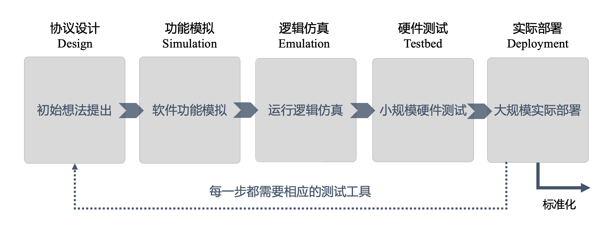

# 量子网络协议的真机部署

*版权所有 (c) 2022 百度量子计算研究所，保留所有权利。*

## 概述

对于一个网络协议而言，其演化通常需要经历协议设计-功能模拟-逻辑仿真-硬件测试等一系列发展阶段，最后方能在真实网络环境中进行部署，实现协议的标准化落地 [1]，如图 1 所示。

在一个量子网络协议中，除了本地量子操作，通常还包含网络中各通信节点之间的经典和量子通信。考虑到量子网络中各种复杂的交互行为，量子网络协议在当前的量子计算机上难以直接实现，导致具备软硬件结合的逻辑仿真难以完成。另一方面，若跳过逻辑仿真，直接由功能模拟进入硬件测试，则会大大增加了实验测试的时间成本和经费代价。

针对上述问题，在 QNET 中，我们开发了 QPU 模块，旨在提供一种能够将量子网络协议编译为标准量子电路，从而能够连接量子真机进行仿真运行的解决方案。通过调用 QPU 模块，用户可以对设计好的网络协议进行仿真测试。量子网络协议中复杂的网络行为（包括本地操作和网络通信）将自动被映射到量子电路上，用户可以选择本地和云端模拟器运行量子电路，或连接真机运行以获得真实的实验数据。

在量子计算机上对量子网络协议展开仿真测试，能够对量子网络协议的各方面性能进行检测，从而帮助用户对协议进行优化，促推量子网络协议从最初的设计提出到最终标准化部署的发展。与此同时，使用量子计算机对量子网络协议仿真也可以有效避免经典仿真方式的计算瓶颈。

## 实现原理

对于量子网络协议中涉及经典受控操作和量子比特传输等复杂的交互过程，当前量子计算机无法直接实现，在此我们给出了一种等效替代的方案：

- 对于量子比特的空间传输，我们将其等效为量子比特操作权的转换。我们将量子比特的持有权视为对其在全局量子电路上进行操作的权限。Alice 通过量子信道向 Bob 发送一个量子比特的过程，可以等效为 Alice 将其对于该量子比特在全局量子电路上的操作权限移交给了 Bob。
- 关于经典受控操作的实现，节点首先在本地保存所收到的经典信息，随后通过推迟测量原理将经典受控操作替换为量子控制操作。

完整的实现思路如下：

1. 首先，通过上述技巧对量子网络协议中的操作依次进行编译，我们将量子网络协议转化为带有中间测量的广义量子电路；
2. 然后，利用推迟测量原理 [2]，将经典受控操作替换为量子操作，并将所有测量操作推迟到量子电路的最后，从而将广义量子电路转化为标准量子电路；
3. 最后，将标准量子电路交由量子计算机运行并获得运行结果，以此完成量子网络协议的真机部署。

## 功能简介

下面，我们将对 QPU 模块中的主要功能进行介绍。

- 在 QPU 模块中，我们提供了 ``QuantumNode`` 类节点模板。``QuantumNode`` 中装有量子寄存器 ``QuantumRegister``，可用于存储和处理量子比特，对寄存器中的量子比特进行的量子门操作或测量操作将会被自动映射到量子网络中的全局量子电路上；
- 此外，我们还提供了 ``QuantumEnv`` 类仿真环境。通过传入指定后端，``QuantumEnv`` 可以连接模拟器或真实量子硬件对量子网络中所保存的量子电路进行运行并返回运行结果；
- 最后，我们在 QPU 模块中提供了一些基本的量子网络协议模板，以供用户参考，帮助用户更好地理解该模块的使用方式。

## 教程示例

接下来，我们将通过几个常用的量子网络协议对 QPU 模块展开进一步的介绍，欢迎大家继续阅读以下[教学文档](https://quantum-hub.baidu.com/qnet/tutorial-introduction)来学习 QPU 模块的具体使用方法。

- 量子隐形传态
- 量子纠缠交换
- CHSH 游戏
- 量子魔方游戏

---

## 参考文献

[1] Wehrle, Klaus, et al. "Modeling and Tools for Network Simulation." [Springer-Verlag Berlin Heidelberg (2010).](https://link.springer.com/book/10.1007/978-3-642-12331-3)

[2] Nielsen, Michael A., and Isaac L. Chuang. Quantum Computation and Quantum Information. [Cambridge University Press, 2010.](https://books.google.com.hk/books?hl=en&lr=&id=-s4DEy7o-a0C&oi=fnd&pg=PR17&ots=NI1LdntvYs&sig=-UIwemSt5CMQ8GGRZE-WIIVAKKo&redir_esc=y&hl=zh-CN&sourceid=cndr#v=onepage&q&f=false)
