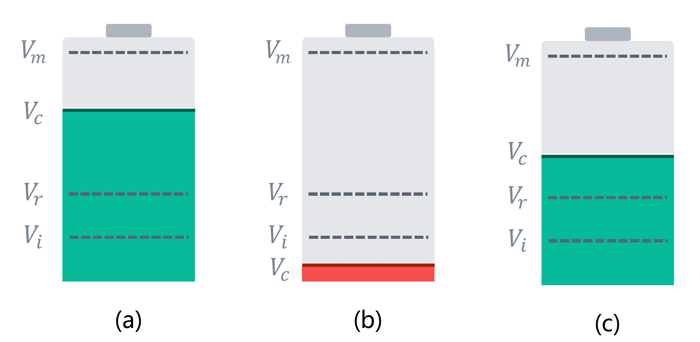
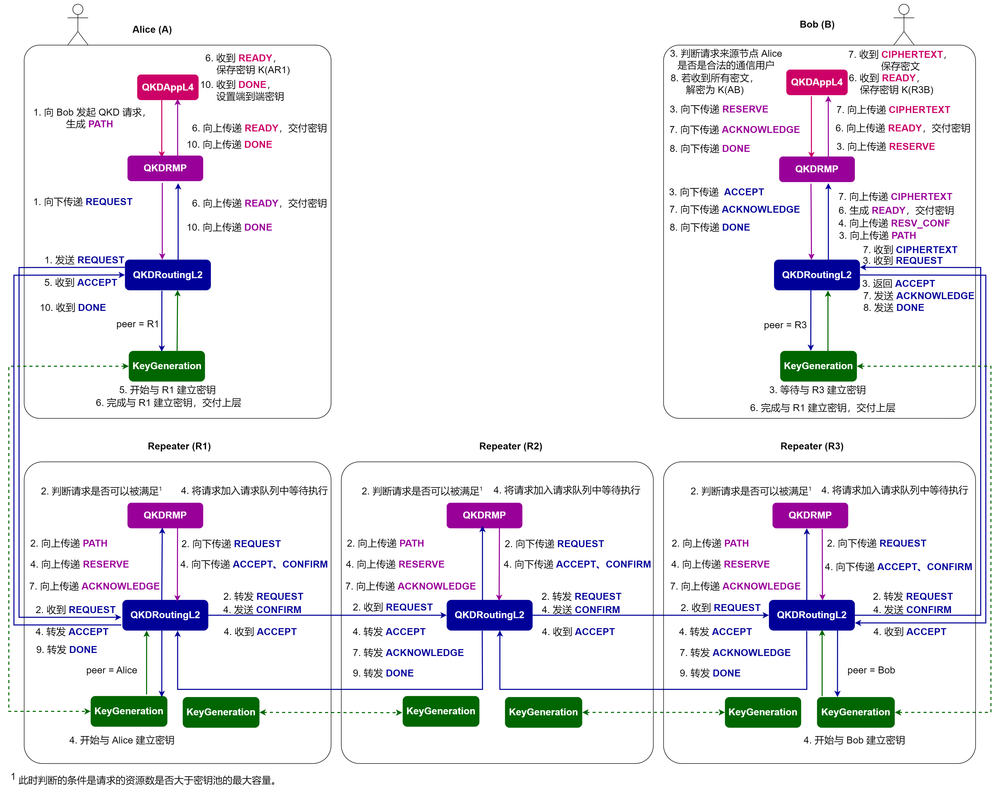

# 量子网络资源管理架构

*版权所有 (c) 2022 百度量子计算研究所，保留所有权利。*

在量子网络架构模拟的教程中，我们介绍了如何通过 QNET 来模拟一个自行设计的简单的量子密钥分发网络架构，并对北京量子城域网中的端到端请求进行了模拟实现 [1]。作为简单的演示，这种网络架构没有考虑到需要为网络中大量用户提供服务的场景。在本教程中，我们提出了一种具有资源管理能力的量子密钥分发网络架构。在该架构中，中继节点可以预先与相邻中继节点生成共享密钥并存储在各自的密钥池中，等待为用户请求分配密钥。通过对网络资源进行管理，该架构能够对大量用户并发请求的网络场景进行模拟，还原真实的网络情境。值得一提的是，本教程中的网络架构以密钥分发进行讲解展示，但也可以直接拓展并应用至量子纠缠分发网络中。

接下来，我们将首先介绍该资源管理架构中基于量子密钥分发背景所提出的密钥池结构，随后对网络架构中的通信过程和请求调度机制展开进一步详细说明。最后，我们以京沪干线中的北京量子城域网为背景，对多位用户随机生成密钥请求的场景对该架构进行模拟分析。

## 资源管理架构

### 1. 密钥池（``KeyPool``）

鉴于网络资源的有限性，当某一个特定请求占用对应资源生成密钥时，网络中其他请求的处理必然会受到阻碍。为了能够应对网络中多个用户请求，我们在量子密钥分发网络的中继节点中引入了密钥池的结构。密钥池是一种类似电池的结构，用以存储和管理两个相邻的中继节点之间所生成的密钥。如图 1 (a) 所示，密钥池的最大容量 $V_m$ 表示其所能容纳的密钥的最大数量；现有容量 $V_c$ 则代表它当前所持有的可用密钥数量；服务中断容量 $V_i$ 表示其停止提供服务的阈值；服务恢复容量 $V_r$ 则代表其重新恢复服务的密钥数量的阈值。每当密钥池成功地向用户提供密钥，密钥池将对它的现有容量 $V_c$ 进行检查，若发现其小于 $V_i$（如图 1 (b) 所示），则将停止对后续请求的处理，并触发密钥生成协议生成新的密钥来补充密钥池，直到它达到 $V_r$ 后重新提供服务（如图 1 (c) 所示）。



对于任意中继节点 $R_i$，关于每个与其相邻的中继节点 $R_p$，$R_i$ 中都设有 2 个对应的密钥池，分别用以存储当满足密钥请求时 $R_i$ 在路径中作为 $R_p$ 上游节点和下游节点时所生成的密钥。此外，在为端到端请求提供密钥分发服务时，只有对应请求路径方向的密钥池会响应请求，为其提供密钥分配服务，对应相反方向的密钥池将不会对该请求作出响应。

### 2. 网络架构
我们所提出的四层量子网络架构如图 2 所示。其中，每个端节点都配备一个搭载了四层协议的协议栈，从上到下依次是： 
1. `QKDAppL4` 协议：负责发起或接收密钥请求；
2. `QKDRMP` 协议：负责实现资源管理的功能；
3. `QKDRoutingL2` 协议：根据请求信息确定密钥分发路径；
4. `KeyGeneration` 协议：负责与相邻节点建立密钥。

每个中继节点中则配备有搭载了三层协议的协议栈，除应用层协议以外，其余结构均与端节点相同。与量子网络架构模拟教程中的三层架构相比，该四层架构主要在其基础上补充了资源管理协议（`QKDRMP`），以实现对节点的密钥资源管理及用户请求的调度处理。`QKDRMP` 协议的原理与经典网络中的 RSVP 协议类似，采取类似的资源预留方式，根据收到的消息类型对请求进行评估、暂存、调度、执行等一系列对应操作，最终实现对多个密钥请求的有序调度和处理。

用户端到端密钥请求从生成到调度以及最终被处理的完整流程如下：

1. Alice 发起一个密钥请求，生成 `REQUEST` 消息并发送给直连的中继节点（若与 Bob 之间存在直连信道则直接将消息发送给 Bob）；
2. 中继节点收到 `REQUEST` 消息，根据资源需求选择继续转发或拒绝该消息；
3. Bob 收到 `REQUEST` 消息，启动本地的 `KeyGeneration` 协议准备与上游节点建立密钥，并返回一则 `ACCEPT` 消息；
4. 沿途的中继节点收到 `ACCEPT` 消息，根据节点当前状态决定执行请求或者将请求暂存到请求队列中，当请求顺利被执行，中继节点在执行密钥交换操作后，继续向上游转发该 `ACCEPT` 消息，并生成一则 `CIPHERTEXT` 消息发送给 Bob；
5. Alice 收到 `ACCEPT` 消息，启动本地的 `KeyGeneration` 协议与下游节点建立密钥；
6. Alice 与其上游节点、Bob 与其下游节点完成密钥生成后，各自将密钥保存在本地；
7. Bob 在收到 `CIPHERTEXT` 消息后，记录并向中继节点返回确认消息 `ACKNOWLEDGE`；
8. Bob 确认收到请求路径上所有中继节点的密文后，对密文进行联合解密，与 Alice 获得端到端的密钥，并向 Alice 发送 `DONE` 消息以最终完成密钥请求；
9. 中继节点收到 `DONE` 消息，直接转发；
10. Alice 收到 `DONE` 消息，设置端到端密钥并结束密钥请求。

值得注意的是，该端到端的密钥请求可以在不同用户之间同时进行。特别地，在步骤 4 中，当中继节点接受了一则密钥请求而当前无法处理该请求时，它将其暂存至一个请求队列（`RequestQueue`）中。这个请求队列将与密钥池进行协作，依次为队列中的密钥请求提供服务。倘若当前请求队列已满，则该请求被拒绝并告知对应节点。



## 仿真实现

为了对上述网络架构进行更好的模拟，在 QNET 中，我们分别提供了节点模板 `RMPEndNode` 和 `RMPRepeaterNode` 来模拟该架构中的端节点和中继节点，并为其预置了装有 `QKDRMP` 和 `QKDRoutingL2` 协议的协议栈。

### 1. Alice: 发起请求 `REQUEST`

Alice 试图与 Bob 建立端到端的密钥，于是她向 Bob 发送一个 QKD 请求，通过 `RMPEndNode` 的 `key_request` 方法，将请求的双方节点的状态设置为繁忙，并调用 `set_qkd_app` 方法在本地协议栈中生成一个 `QKDAppL4` 协议实例，置于 `QKDRMP` 协议的上层，随后调用 `QKDAppL4` 的 `start` 方法向 Bob 发起密钥请求。

```python
def key_request(self, **kwargs) -> None:
    if self.idle and kwargs['dst'].idle:
        # 设置请求双方节点状态为繁忙
        self.set_busy()
        kwargs['dst'].set_busy()
        qkd_app = self.set_qkd_app()
        qkd_app.start(**kwargs)
    ...
```

`QKDAppL4` 的 `start` 方法将触发 `send_request` 方法，首先为该请求创建一个唯一标识 `req_id`，并生成一则类型为 `PATH` 的 `QKDMessage`，其中包含请求标识、请求路径、密钥数量和密钥长度等。随后，该消息被发送给下层协议 `QKDRMP` 进行后续处理。

```python
def send_request(self) -> None:
    request_id = self.create_request_id()   # 为请求创建唯一标识
    request_msg = QKDMessage(src=self.node,
                             dst=self.request_to,
                             protocol=QKDRMP,
                             data={'type': QKDMessage.Type.PATH,
                                   'req_id': request_id,
                                   'path': [self.node],
                                   'key_num': self.key_num,
                                   'key_length': self.key_length})
    self.send_lower(QKDRMP, msg=request_msg)
```

`QKDRMP` 协议收到消息之后，对消息类型进行判断。如果为 `PATH` 消息，则生成一则与其消息内容相同，类型为 `REQUEST` 的 `QKDMessage` 消息，并调用 `send_lower` 方法将其传给下层的 `QKDRoutingL2` 协议。

```python
def receive_upper(self, upper_protocol: type, **kwargs) -> None:
    msg = kwargs['msg']

    if msg.data['type'] == QKDMessage.Type.PATH:
        # 生成 'REQUEST' 消息并传给 QKDRoutingL2 协议
        request_msg = QKDMessage(src=self.node,
                                 dst=msg.dst,
                                 protocol=QKDRoutingL2,
                                 data={'type': QKDMessage.Type.REQUEST,
                                       'req_id': msg.data['req_id'],
                                       'path': msg.data['path'],
                                       'key_num': msg.data['key_num'],
                                       'key_length': msg.data['key_length']})
        self.send_lower(QKDRoutingL2, msg=request_msg)
```

当 `QKDRoutingL2` 协议收到来自上层 `QKDRMP` 协议的消息时，同样首先对消息类型进行判断。当收到 `REQUEST` 消息，若目的端节点与当前节点直连，则通过直连信道发送请求消息；否则通过与当前节点直连的中继节点发送 `REQUEST` 消息。若当前节点与目的节点之间不存在可执行资源管理的中继节点时，请求将被拒绝。

```python
def receive_upper(self, upper_protocol: "type", **kwargs) -> None:
    msg = kwargs['msg']

    if msg.data['type'] == QKDMessage.Type.REQUEST:
        if isinstance(self.node, RMPEndNode):
            # 判断目的节点是否与当前节点直连
            if msg.dst in self.node.direct_nodes:
                self.node.send_classical_msg(dst=msg.dst, msg=msg)
            elif isinstance(self.node.direct_repeater, RMPRepeaterNode):
                self.node.send_classical_msg(dst=self.node.direct_repeater, msg=msg)
            else:
                reject_msg = QKDMessage(src=msg.src,
                                        dst=msg.dst,
                                        protocol=QKDRMP,
                                        data={'type': QKDMessage.Type.REJECT,
                                              'req_id': msg.data['req_id'],
                                              'path': msg.data['path'],
                                              'err_type': 1,
                                              'key_num': msg.data['key_num'],
                                              'key_length': msg.data['key_length']})
                self.send_upper(upper_protocol=QKDRMP, msg=reject_msg)
        ...
```

### 2. 中继节点：收到请求并转发 `REQUEST`

中继节点收到 `QKDMessage` 之后，`QKDRoutingL2` 协议同样需要对接收到的消息类型进行判断。若收到 `REQUEST` 消息则生成一则消息内容与其相同的 `PATH` 消息，发送给上层的 `QKDRMP` 协议。

```python
def receive_classical_msg(self, msg: "QKDMessage", **kwargs) -> None:
    if msg.data['type'] == QKDMessage.Type.REQUEST:
        # 生成 'PATH' 消息并传给 QKDRMP 协议
        request_msg = QKDMessage(src=msg.src,
                                 dst=msg.dst,
                                 protocol=QKDRMP,
                                 data={'type': QKDMessage.Type.PATH,
                                       'req_id': msg.data['req_id'],
                                       'path': msg.data['path'],
                                       'key_num': msg.data['key_num'],
                                       'key_length': msg.data['key_length']})
        self.send_upper(QKDRMP, msg=request_msg)
```

位于上层的 `QKDRMP` 协议收到来自 `QKDRoutingL2` 的 `PATH` 消息后，对其资源需求进行评估。当下一跳为中继节点时，该过程将调用本地密钥池的 `fulfill` 方法将请求的密钥数量与密钥池的最大容量进行比对，若请求密钥数量未超出密钥池服务能力则继续转发该请求，否则拒绝该请求，并生成一则 `REJECT` 消息，设置其错误类型 `err_type = 1` 代表该请求的 `PATH` 消息被拒绝，并通过 `QKDRoutingL2` 协议将该 `REJECT` 消息发回给请求发起方 Alice。当下一跳为端节点时，同样直接转发该请求。

```python
def receive_lower(self, lower_protocol: "type", **kwargs) -> None:
    msg = kwargs['msg']

    if msg.data['type'] == QKDMessage.Type.PATH:
        if isinstance(self.node, RMPRepeaterNode):
            # 将 'PATH' 消息转发给下一跳
            next_hop = self.node.quantum_routing_table[msg.dst]
            if self.node not in msg.data['path']:
                msg.data['path'].append(self.node)

            if isinstance(next_hop, RMPRepeaterNode):
                # 若当前请求能被满足，继续转发 'REQUEST' 消息
                if self.node.key_pools[next_hop][0].fulfill(msg):
                    request_msg = QKDMessage(src=msg.src,
                                             dst=msg.dst,
                                             protocol=QKDRoutingL2,
                                             data={'type': QKDMessage.Type.REQUEST,
                                                   'req_id': msg.data['req_id'],
                                                   'path': msg.data['path'],
                                                   'key_num': msg.data['key_num'],
                                                   'key_length': msg.data['key_length']})
                    self.send_lower(QKDRoutingL2, msg=request_msg)
                else:
                    reject_msg = QKDMessage(src=self.node,
                                            dst=msg.src,
                                            protocol=QKDRoutingL2,
                                            data={'type': QKDMessage.Type.REJECT,
                                                  'req_id': msg.data['req_id'],
                                                  'path': msg.data['path'],
                                                  'err_type': 1,
                                                  'key_num': msg.data['key_num'],
                                                  'key_length': msg.data['key_length']})
                    self.send_lower(QKDRoutingL2, msg=reject_msg)

            elif isinstance(next_hop, RMPEndNode):
                request_msg = QKDMessage(src=msg.src,
                                         dst=msg.dst,
                                         protocol=QKDRoutingL2,
                                         data={'type': QKDMessage.Type.REQUEST,
                                               'req_id': msg.data['req_id'],
                                               'path': msg.data['path'],
                                               'key_num': msg.data['key_num'],
                                               'key_length': msg.data['key_length']})
                self.send_lower(QKDRoutingL2, msg=request_msg)
        ...
```

位于下层的 `QKDRoutingL2` 协议收到来自 `QKDRMP` 协议的消息时，对消息类型进行判断。若消息类型为 `REQUST`，则继续向下游节点转发密钥请求；若消息类型为 `REJECT` 且错误类型 `err_type = 1`，则向其上游节点转发该消息。

```python
def receive_upper(self, upper_protocol: "type", **kwargs) -> None:
    msg = kwargs['msg']

    if msg.data['type'] == QKDMessage.Type.REQUEST:
        if isinstance(self.node, RMPEndNode):
            ...
        elif isinstance(self.node, RMPRepeaterNode):
            next_hop = self.node.quantum_routing_table[msg.dst]
            self.node.send_classical_msg(dst=next_hop, msg=msg)

    elif msg.data['type'] == QKDMessage.Type.REJECT:
        err_type = msg.data['err_type']

        if err_type == 1:
            # 向上游节点转发 'REJECT' 消息
            upstream_node = msg.data['path'][-2]
            self.node.send_classical_msg(upstream_node, msg=msg)
        ...
```

### 3. Bob：收到请求并返回接收消息 `ACCEPT`

Bob 在收到 `QKDMessage` 后，其 `QKDRoutingL2` 协议同样对消息类型进行判断。收到 `REQUEST` 消息时，生成一则内容相同的 `PATH` 消息传给上层的 `QKDRMP` 协议。`QKDRMP` 协议在收到 `PATH` 消息后，调用 `RMPEndNode` 的 `set_qkd_app` 方法在协议栈中动态添加 `QKDAppL4` 协议实例并将其装入协议栈中。随后 `QKDRMP` 协议生成一则资源预留消息 `RESERVE`，设置源节点为 Bob、目标节点为 Alice，并将该消息向上发送给 `QKDAppL4` 协议。

```python
def receive_lower(self, lower_protocol: "type", **kwargs) -> None:
    msg = kwargs['msg']

    if msg.data['type'] == QKDMessage.Type.PATH:
        if isinstance(self.node, RMPRepeaterNode):
            ...
        elif isinstance(self.node, RMPEndNode):
            if msg.dst == self.node:
                self.node.set_qkd_app()
                # 创建 'RESERVE' 消息并发送给 QKDAppL4
                reserve_msg = QKDMessage(src=self.node,
                                         dst=msg.src,
                                         protocol=QKDAppL4,
                                         data={'type': QKDMessage.Type.RESERVE,
                                               'req_id': msg.data['req_id'],
                                               'path': msg.data['path'],
                                               'key_num': msg.data['key_num'],
                                               'key_length': msg.data['key_length']})
                self.send_upper(QKDAppL4, msg=reserve_msg, towards='down')
            ...
        ...
```

`QKDAppL4` 协议根据收到来自 `QKDRMP` 协议的 `QKDMessage` 消息后，根据消息类型采取不同的操作。当消息类型为 `RESERVE` 时，`QKDAppL4` 协议将保存该请求的请求 id、请求路径、密钥数量及密钥长度等消息，并判断是否需要为后续的密钥交换操作生成密文列表。最后，`QKDAppL4` 协议将 `RESERVE` 消息回传给下层的 `QKDRMP` 协议。

```python
def receive_lower(self, lower_protocol: type, **kwargs) -> None:
    ...
    if msg.data['type'] == QKDMessage.Type.RESERVE:
        if self.node == msg.src:
            # 设置对应参数
            req_id = msg.data.get('req_id')
            if self.req_id is None and req_id is not None:
                self.req_id = req_id

            self.request_from = msg.dst
            self.key_num = msg.data['key_num']
            self.key_length = msg.data['key_length']

            path = msg.data['path']
            # 设置一组空的密文列表用以密钥交换
            if len(path) > 2:
                for node in path[1: -1]:
                    self.ciphertext_lists[node] = None
            msg.data['path'].append(self.node)

            self.send_lower(QKDRMP, msg=msg)
        ...
```

下层的 `QKDRMP` 协议在收到 `QKDAppL4` 协议返回的 `RESERVE` 消息后，首先根据请求路径设置一组空列表用以存储中继节点对于资源预留所返回的确认信号，随后生成一则 `ACCEPT` 消息并通过路由沿途返回，通知路径上各节点进行资源预留。其中，设置参数 `option='forward'` 以指示下层路由协议在收到该消息后直接进行转发操作。

```python
def receive_upper(self, upper_protocol: type, **kwargs) -> None:
    ...
    elif msg.data['type'] == QKDMessage.Type.RESERVE:
        # 设置一组空列表用以记录确认信号
        for node in msg.data['path'][1: -1]:
            self.confirm_records[node] = None

        accept_msg = QKDMessage(src=msg.src,
                                dst=msg.dst,
                                protocol=QKDRoutingL2,
                                data={'type': QKDMessage.Type.ACCEPT,
                                      'req_id': msg.data['req_id'],
                                      'path': msg.data['path'],
                                      'key_num': msg.data['key_num'],
                                      'key_length': msg.data['key_length']})
        self.send_lower(QKDRoutingL2, msg=accept_msg, option='forward')
```

`QKDRoutingL2` 协议在收到 `ACCEPT` 消息之后，保存请求路径，密钥数量和密钥长度并向上游节点转发，随后创建一个 `PrepareAndMeasure` 实例用于与上游节点生成密钥，并传入相关参数，等待建立密钥。

**提醒**：在我们所设计的量子网络架构中，假设相邻节点间的密钥建立均由上游节点充当光子的发送方，由下游节点充当接收方。

```python
def receive_upper(self, upper_protocol: "type", **kwargs) -> None:
    ...
    elif msg.data['type'] == QKDMessage.Type.ACCEPT:
        option = kwargs['option']

        if option == 'forward':
            # 向上游节点转发 'ACCEPT' 消息
            self.path = msg.data['path']
            index = msg.data['path'].index(self.node)
            upstream_node = msg.data['path'][index - 1]
            self.node.send_classical_msg(upstream_node, msg=msg)

            if self.node == msg.src:
                key_num = msg.data['key_num']
                key_length = msg.data['key_length']
                # 设置密钥生成协议，等待与上游节点建立密钥
                self.node.set_key_generation(upstream_node)
                self.send_lower(PrepareAndMeasure,
                                peer=upstream_node,
                                role=PrepareAndMeasure.Role.RECEIVER,
                                key_num=key_num,
                                key_length=key_length)
        ...
```

### 4. 中继节点：收到 `ACCEPT`，执行请求或将请求加入请求队列

当沿途的中继节点 $R_m$ 收到 `ACCEPT` 消息时，`QKDRoutingL2` 协议生成一则 `RESERVE` 消息，发送给上层的 `QKDRMP` 协议。

```python
def receive_classical_msg(self, msg: "QKDMessage", **kwargs) -> None:
    ...
    elif msg.data['type'] == QKDMessage.Type.ACCEPT:
        reserve_msg = QKDMessage(src=msg.src,
                                 dst=msg.dst,
                                 protocol=QKDRMP,
                                 data={'type': QKDMessage.Type.RESERVE,
                                       'req_id': msg.data['req_id'],
                                       'path': msg.data['path'],
                                       'key_num': msg.data['key_num'],
                                       'key_length': msg.data['key_length']})
        self.send_upper(QKDRMP, msg=reserve_msg)
        ...
```

`QKDRMP` 协议在收到来自 `QKDRoutingL2` 协议的 `RESERVE` 消息时，需要根据其上下游节点的类型来执行后续操作。在此，我们根据该中继节点上下游节点中端节点的个数分为三种情况进行讨论，分别对应三种不同的 `pattern` 取值。1）`pattern = 0`：两侧均为中继节点；2）`pattern = 1`：一侧为端节点，另一侧为中继节点；3）`pattern = 2`：两侧均为端节点。

```python
def receive_lower(self, lower_protocol: "type", **kwargs) -> None:
    ...
    elif msg.data['type'] == QKDMessage.Type.RESERVE:
        if self.node == msg.dst:
            ...
        else:
            pattern = 0
            push_flag = None

            index = msg.data['path'].index(self.node)
            upstream_node, downstream_node = msg.data['path'][index - 1], msg.data['path'][index + 1]
            for neighbor_node in [downstream_node, upstream_node]:
                if isinstance(neighbor_node, RMPEndNode):
                    pattern += 1
            ...
```

#### 1）`pattern = 0`：两侧均为中继节点

当 `pattern = 0` 时，`QKDRMP` 协议查询对应的密钥池状态并判断其现有容量是否能够满足当前请求。该过程将调用对应密钥池的 `fulfill` 方法，分别判断当前节点与其上、下游中继节点所对应密钥池中当前存储的密钥容量是否足以交付请求的密钥数量。若对应密钥池都处于空闲状态且其现有容量足以满足密钥请求，则该请求被执行，同时，`QKDRMP` 生成一则 `ACCEPT` 消息传给下层的 `QKDRoutingL2`，并设置参数 `option = operate` 以告知其执行对应操作；若此时对应密钥池并非空闲或当前没有足够的密钥容量来执行该请求，则代表该请求的 `RESERVE` 消息连同其所对应的 `pattern` 值被一起存入一个请求队列（`RequestQueue`）中。该请求队列将与密钥池进行协作，等待资源充足后为队列中的密钥请求提供服务。储存密钥请求的行为通过调用请求队列的 `push` 方法实现，该方法将判断当前请求队列是否能够容纳新的请求，并由 `push_flag` 保存返回对应的真值以便进行后续判断。

```python
        ...
        if pattern == 0:
            # 查询对应上下游的密钥池是否空闲，判断其现有容量能否满足密钥请求
            if self.node.key_pools[upstream_node][1].idle is True \
                    and self.node.key_pools[upstream_node][1].fulfill(msg) is True \
                    and self.node.key_pools[downstream_node][0].idle is True \
                    and self.node.key_pools[downstream_node][0].fulfill(msg) is True:
                # 将对应密钥池的状态设置为繁忙
                self.node.key_pools[upstream_node][1].idle = False
                self.node.key_pools[downstream_node][0].idle = False
                # 生成一则 'ACCEPT' 消息并告知下层 QKDRoutingL2 执行对应操作
                accept_msg = QKDMessage(src=msg.src,
                                        dst=msg.dst,
                                        protocol=QKDRoutingL2,
                                        data={'type': QKDMessage.Type.ACCEPT,
                                              'req_id': msg.data['req_id'],
                                              'path': msg.data['path'],
                                              'key_num': msg.data['key_num'],
                                              'key_length': msg.data['key_length']})
                self.send_lower(QKDRoutingL2, msg=accept_msg, option='operate', pattern=pattern)
                # 重置对应密钥池的状态
                self.node.key_pools[upstream_node][1].idle = True
                self.node.key_pools[downstream_node][0].idle = True

            else:
                # 将请求加入到请求队列中等待
                msg.data['pattern'] = pattern
                push_flag = self.request_queue.push(msg)
        ...
```

位于 `QKDRMP` 协议下层的 `QKDRoutingL2` 协议在收到来自上层 `QKDRMP` 协议的消息时，首先对消息类型进行判断。如果是 `ACCEPT` 消息则首先判断操作类型 `option` 字段的值，当 `option = operate` 时，进一步检查 `pattern` 字段的值。当 `pattern = 0` 时，`QKDRoutingL2` 直接从其本地分别对应于上、下游的密钥池中取出所需密钥，执行异或操作生成用于密钥交换的密文：$c_m = k_{R_{m-1} R_{m}} \oplus k_{R_{m} R_{m+1}}$，随后将密文存入 `CIPHERTEXT` 消息中并沿请求路径向下游发送给 Bob，同时生成一则 `POP` 消息传给 `QKDRMP` 协议从请求队列中抛出下一个请求进行处理。

```python
def receive_upper(self, upper_protocol: type, **kwargs) -> None:
    ...
    elif msg.data['type'] == QKDMessage.Type.ACCEPT:
        option = kwargs['option']

        if option == 'forward':
            ...
        elif option == 'operate':   
            pattern = kwargs['pattern']

            if pattern == 0:
                self.path = msg.data['path']
                index = self.path.index(self.node)
                upstream_node, downstream_node = msg.data['path'][index - 1], msg.data['path'][index + 1]

                key_num = msg.data['key_num']
                key_length = msg.data['key_length']
                
                # 从两侧对应密钥池中取出密钥并计算密文
                ciphertext_list = []
                keys_up = self.node.key_pools[upstream_node][1].allocate(key_num, key_length, towards='up')
                keys_down = self.node.key_pools[downstream_node][0].allocate(key_num, key_length, towards='down')
                for key_up, key_down in zip(keys_up, keys_down):
                    ciphertext_list.append(key_up ^ key_down)
                
                # 生成 'CIPHERTEXT' 消息并发送给下游节点
                cipher_msg = QKDMessage(src=self.node,
                                        dst=self.path[-1],
                                        protocol=QKDRoutingL2,
                                        data={'type': QKDMessage.Type.CIPHERTEXT,
                                              'req_id': msg.data['req_id'],
                                              'path': msg.data['path'],
                                              'ciphertext_list': ciphertext_list,
                                              'key_num': msg.data['key_num'],
                                              'key_length': msg.data['key_length']})
                self.node.send_classical_msg(dst=downstream_node, msg=cipher_msg)
                ...
                # 生成 'POP' 消息并发给 QKDRMP 协议以抛出另一个请求
                pop_msg = QKDMessage(src=self.node,
                                     dst=self.node,
                                     protocol=QKDRMP,
                                     data={'type': QKDMessage.Type.POP})
                self.send_upper(QKDRMP, msg=pop_msg)
            ...
```

沿途的中继节点在收到 `CIPHERTEXT` 消息时，将直接转发该消息，直至 Bob 收到该密文消息。

```python
def receive_classical_msg(self, msg: "QKDMessage", **kwargs) -> None:
    ...
    elif msg.data['type'] == QKDMessage.Type.CIPHERTEXT:
        if msg.dst == self.node:
            ...
        else:
            # 继续向下游节点转发密文消息
            if isinstance(self.node, RMPRepeaterNode):
                path = msg.data['path']
                index = path.index(self.node)
                next_hop = path[index + 1]
                self.node.send_classical_msg(dst=next_hop, msg=msg)
```

而上层 `QKDRMP` 在收到 `QKDRoutingL2` 的 `POP` 消息后，将从其请求队列中取出下一个请求。当 `pattern = 0` 时，若密钥池中的现有密钥容量能够满足当前请求，则执行与上述相同的流程；反之，则将请求重新加入队列等候调度，并重新从请求队列中取出一个新的请求执行操作。

```python
def receive_lower(self, lower_protocol: "type", **kwargs) -> None:
    ...
    elif msg.data['type'] == QKDMessage.Type.POP:
        pop_counter = 0  # 设置一个计数器
        while pop_counter < self.request_queue.max_volume:
            if self.request_queue.current_volume == 0:
                ...
            else:
                pop_msg = self.request_queue.pop()
                pattern = pop_msg.data['pattern']
                index = pop_msg.data['path'].index(self.node)
                upstream_node, downstream_node = pop_msg.data['path'][index - 1], pop_msg.data['path'][index + 1]

                if pattern == 0:
                    # 查询对应上下游的密钥池是否空闲，判断其现有容量能否满足密钥请求
                    if self.node.key_pools[upstream_node][1].idle is True \
                            and self.node.key_pools[upstream_node][1].fulfill(msg) is True \
                            and self.node.key_pools[downstream_node][0].idle is True \
                            and self.node.key_pools[downstream_node][0].fulfill(msg) is True:
                        # 将对应密钥池的状态设置为繁忙
                        self.node.key_pools[upstream_node][1].idle = False
                        self.node.key_pools[downstream_node][0].idle = False
                        # 生成一则 'ACCEPT' 消息并告知下层 QKDRoutingL2 执行对应操作
                        accept_msg = QKDMessage(src=pop_msg.src,
                                                dst=pop_msg.dst,
                                                protocol=QKDRoutingL2,
                                                data={'type': QKDMessage.Type.ACCEPT,
                                                      'req_id': pop_msg.data['req_id'],
                                                      'path': pop_msg.data['path'],
                                                      'key_num': pop_msg.data['key_num'],
                                                      'key_length': pop_msg.data['key_length']})
                        self.send_lower(QKDRoutingL2, msg=accept_msg, option='operate', pattern=pattern)
                        # 重置对应密钥池的状态
                        self.node.key_pools[upstream_node][1].idle = True
                        self.node.key_pools[downstream_node][0].idle = True
                        break

                    else:
                        self.request_queue.push(pop_msg)  # 将请求重新推入请求队列
                        pop_counter += 1
```

#### 2）`pattern = 1`：两侧分别是端节点和中继节点 

当 `pattern = 1` 时，`QKDRMP` 协议生成一则 `GENERATE`  消息，通知 `QKDRoutingL2` 协议准备启动下层的 `KeyGeneration` 协议与端节点一侧建立密钥。同时，`QKDRMP` 协议查询另一侧中继节点对应密钥池是否空闲且其现有容量是否足以交付请求的密钥数量，若对应密钥池处于空闲状态且其现有容量足以满足密钥请求，则该请求被执行，同时，`QKDRMP` 生成一则 `ACCEPT` 消息传给下层的 `QKDRoutingL2`，并设置参数 `option = operate` 以告知其执行对应操作；若此时对应密钥池并非空闲或当前没有足够的密钥容量来执行该请求，则同样将该 `RESERVE` 消息连同 `pattern` 值共同存入请求队列中等待调度。

```python
        ...
        elif pattern == 1:
            if isinstance(upstream_node, RMPEndNode):
                end_peer, repeater_peer, towards, key_pool_index = upstream_node, downstream_node, 'down', 0
            else:
                end_peer, repeater_peer, towards, key_pool_index = downstream_node, upstream_node, 'up', 1
            
            # 准备与端节点一侧建立密钥
            generate_msg = QKDMessage(src=self.node,
                                      dst=end_peer,
                                      protocol=QKDRoutingL2,
                                      data={'type': QKDMessage.Type.GENERATE,
                                            'req_id': msg.data['req_id'],
                                            'path': msg.data['path'],
                                            'key_num': msg.data['key_num'],
                                            'key_length': msg.data['key_length']})
            self.send_lower(QKDRoutingL2, msg=generate_msg, towards=towards)
            # 查询对应密钥池状态及可用容量
            if self.node.key_pools[repeater_peer][keypool_index].idle is True \
                    and self.node.key_pools[repeater_peer][keypool_index].fulfill(msg) is True:
                self.node.key_pools[repeater_peer][keypool_index].idle = False
                
                # 生成一则 'ACCEPT' 消息并告知下层 QKDRoutingL2 执行对应操作
                accept_msg = QKDMessage(src=msg.src,
                                        dst=msg.dst,
                                        protocol=QKDRoutingL2,
                                        data={'type': QKDMessage.Type.ACCEPT,
                                              'req_id': msg.data['req_id'],
                                              'path': msg.data['path'],
                                              'key_num': msg.data['key_num'],
                                              'key_length': msg.data['key_length']})
                # 通知 QKDRoutingL2 协议取出对应密钥
                self.send_lower(QKDRoutingL2, msg=accept_msg, option='operate',
                                towards=towards, pattern=pattern)
                # 重置对应密钥池的状态
                self.node.key_pools[repeater_peer][keypool_index].idle = True
                
            else:
                # 将请求加入到请求队列中等待
                msg.data['pattern'] = pattern
                push_flag = self.request_queue.push(msg)
        ...
```

`QKDRoutingL2` 协议收到来自上层 `QKDRMP` 协议的 `GENERATE` 消息时，创建一个 `KeyGeneration` 协议实例用于与对应节点建立密钥。

```python
def receive_upper(self, upper_protocol: "type", **kwargs) -> None:
    ...
    elif msg.data['type'] == QKDMessage.Type.GENERATE:
        towards = kwargs['towards']
        # 保存请求的路径信息
        if isinstance(msg.dst, RMPEndNode):
            if towards == 'up':
                self.keys_up[msg.dst] = {'path': msg.data['path'], 'keys': None}
            elif towards == 'down':
                self.keys_down[msg.dst] = {'path': msg.data['path'], 'keys': None}

        # 创建一个 KeyGeneration 协议实例，准备开始建立密钥
        self.node.set_key_generation(msg.dst, towards=towards)
        role = PrepareAndMeasure.Role.TRANSMITTER if towards == 'up' else PrepareAndMeasure.Role.RECEIVER
        self.send_lower(PrepareAndMeasure,
                        peer=msg.dst,
                        role=role,
                        key_num=msg.data['key_num'],
                        key_length=msg.data['key_length'])
```

当收到来自上层 `QKDRMP` 协议的 `ACCEPT` 消息时，若 `option = operate`，进一步检查 `pattern` 字段的值。当 `pattern = 1` 时，`QKDRoutingL2` 协议从对应密钥池中取出密钥，并查询当前节点与另一侧端节点的密钥建立是否完成，如果当前节点尚未与端节点一侧完成密钥建立，那么 `QKDRoutingL2` 将从密钥池中取出的密钥暂存起来，等待另一侧的密钥建立完成；若其完成密钥建立则将交付的密钥取出与密钥池交付的密钥一起执行异或操作生成密文，并通过 `CIPHERTEXT` 消息将密文列表发送给 Bob。随后，`QKDRoutingL2` 协议生成一则 `POP` 消息向上层传递，以告知 `QKDRMP` 协议从请求队列中取出下一个等待处理的请求。

```python
def receive_upper(self, upper_protocol: type, **kwargs) -> None:
    ...
    elif msg.data['type'] == QKDMessage.Type.ACCEPT:
        ...
        elif option == 'operate':
            pattern = kwargs['pattern']
            ...
            if pattern == 1:
                ...
                # 从对应密钥池中取出密钥
                ciphertext_list = []
                keys_repeater = self.node.key_pools[repeater_peer][key_pool_index].allocate(key_num, key_length, towards=towards)

                # 检查另一侧的密钥建立是否完成
                if key_end_dict[end_peer]['keys'] is None:
                    # 保存交付的密钥并等待
                    if key_pool_index == 0:
                        self.keys_up[tuple([repeater_peer, end_peer])] = {'path': self.path, 'keys': keys_repeater}
                    else:
                        self.keys_down[tuple([repeater_peer, end_peer])] = {'path': self.path, 'keys': keys_repeater}

                else:
                    # 计算密文并生成 'CIPHERTEXT' 消息返回给接收方
                    for key_repeater, key_end in zip(keys_repeater, key_end_dict[end_peer]['keys']):
                        ciphertext_list.append(key_repeater ^ key_end)
                    key_end_dict.pop(end_peer)

                    cipher_msg = QKDMessage(src=self.node,
                                            dst=self.path[-1],
                                            protocol=QKDRoutingL2,
                                            data={'type': QKDMessage.Type.CIPHERTEXT,
                                                  'req_id': msg.data['req_id'],
                                                  'path': msg.data['path'],
                                                  'ciphertext_list': ciphertext_list,
                                                  'key_num': msg.data['key_num'],
                                                  'key_length': msg.data['key_length'],})
                    self.node.send_classical_msg(dst=downstream_node, msg=cipher_msg)
                    ...
                    # 生成 'POP' 消息并发给 QKDRMP 协议以抛出另一个请求
                    pop_msg = QKDMessage(src=self.node,
                                         dst=self.node,
                                         protocol=QKDRMP,
                                         data={'type': QKDMessage.Type.POP})
                    self.send_upper(QKDRMP, msg=pop_msg)
            ...
```

#### 3）`pattern = 2`：节点两侧都是端节点 

当 `pattern = 2` 时，该请求不需要密钥池参与密钥分配工作，则 `QKDRMP` 协议则直接生成两则 `GENERATE` 消息告知下层的 `QKDRoutingL2` 协议启动底层的 `KeyGeneration` 协议准备与两侧的端节点分别建立密钥。

```python
        ...
        elif pattern == 2:
            # 准备与上游端节点建立密钥
            generate_msg = QKDMessage(src=self.node,
                                      dst=upstream_node,
                                      protocol=QKDRoutingL2,
                                      data={'type': QKDMessage.Type.GENERATE,
                                            'req_id': msg.data['req_id'],
                                            'path': msg.data['path'],
                                            'key_num': msg.data['key_num'],
                                            'key_length': msg.data['key_length']})
            self.send_lower(QKDRoutingL2, msg=generate_msg, towards='down')

            # 准备与下游端节点建立密钥
            generate_msg = QKDMessage(src=self.node,
                                      dst=downstream_node,
                                      protocol=QKDRoutingL2,
                                      data={'type': QKDMessage.Type.GENERATE,
                                            'req_id': msg.data['req_id'],
                                            'path': msg.data['path'],
                                            'key_num': msg.data['key_num'],
                                            'key_length': msg.data['key_length']})
            self.send_lower(QKDRoutingL2, msg=generate_msg, towards='up')
        ...
```

#### `QKDRMP` 的后续操作

当 `QKDRMP` 收到来自 `QKDRoutingL2` 的 `RESERVE` 消息时，它将首先计算 `pattern` 的取值，并根据上述三种不同情形执行不同操作。随后，它将根据 `push_flag` 的取值来进一步执行后续操作。当请求成功加入队列或请求被执行时，`QKDRMP` 协议将重新生成一则 `ACCEPT` 消息交由下层的路由协议继续向上游转发消息。同时生成一则 `CONFIRM` 消息，通过下层路由协议将其发送给 Bob 作为接受资源预留的凭证，中继节点收到该 `CONFIRM` 消息后将直接进行转发。

```python
        ...
        if push_flag in [True, None]:
            # 生成 'ACCEPT' 消息并传给 QKDRoutingL2 协议
            accept_msg = QKDMessage(src=msg.src,
                                    dst=msg.dst,
                                    protocol=QKDRoutingL2,
                                    data={'type': QKDMessage.Type.ACCEPT,
                                          'req_id': msg.data['req_id'],
                                          'path': msg.data['path'],
                                          'key_num': msg.data['key_num'],
                                          'key_length': msg.data['key_length']})
            self.send_lower(QKDRoutingL2, msg=accept_msg, option='forward')

            # 生成 'CONFIRM' 消息并传给 QKDRoutingL2 协议
            confirm_msg = QKDMessage(src=self.node,
                                     dst=msg.src,
                                     protocol=QKDRoutingL2,
                                     data={'type': QKDMessage.Type.CONFIRM,
                                           'req_id': msg.data['req_id'],
                                           'path': msg.data['path'],
                                           'key_num': msg.data['key_num'],
                                           'key_length': msg.data['key_length']})
            self.send_lower(QKDRoutingL2, msg=confirm_msg)
        ...
```

此外，在 `pattern = 0` 和 `pattern = 1` 的情形下，若将请求压入队列时发现请求队列已满，该请求将被拒绝服务，此时 `QKDRMP` 协议分别生成一则错误类型 `err_type` 为 2 的 `REJECT` 消息和一则错误类型 `err_type` 为 3 的 `REJECT` 消息并分别沿请求路径向上/下游转发。其中，`err_type` 为 2 的 `REJECT` 消息将由 Alice 接收并获知该请求被拒绝；`err_type` 为 3 的 `REJECT` 消息则将沿路径下游沿途返回并依次告知其途径节点本次请求资源预留失败，直至返回 Bob 处。

```python
        ...
        elif push_flag is False:
            # 生成 'REJECT' 消息并传给 QKDRoutingL2 协议
            reject_msg = QKDMessage(src=self.node,
                                    dst=msg.dst,
                                    protocol=QKDRoutingL2,
                                    data={'type': QKDMessage.Type.REJECT,
                                          'req_id': msg.data['req_id'],
                                          'path': msg.data['path'],
                                          'key_num': msg.data['key_num'],
                                          'key_length': msg.data['key_length'],
                                          'err_type': 2})
            self.send_lower(QKDRoutingL2, msg=reject_msg)

            # 生成另一则 'REJECT' 消息告知下游节点取消预留资源预留
            cancel_msg = QKDMessage(src=self.node,
                                    dst=msg.src,
                                    protocol=QKDRoutingL2,
                                    data={'type': QKDMessage.Type.REJECT,
                                          'req_id': msg.data['req_id'],
                                          'path': list(reversed(msg.data['path'])),
                                          'key_num': msg.data['key_num'],
                                          'key_length': msg.data['key_length'],
                                          'err_type': 3})
            self.send_lower(QKDRoutingL2, msg=cancel_msg)
        ...
```

当收到 `REJECT` 消息时，`QKDRoutingL2` 协议根据消息的错误类型 `err_type`，分别将消息向上/下游发送。

```python
def receive_upper(self, upper_protocol: "type", **kwargs) -> None:
    ...  
    elif msg.data['type'] == QKDMessage.Type.REJECT:
        err_type = msg.data['err_type']
        if err_type == 1:
            ...
        elif err_type == 2:
            # 将 'REJECT' 消息向上游节点转发
            self.path = msg.data['path']
            index = msg.data['path'].index(self.node)
            upstream_node = msg.data['path'][index - 1]
            self.node.send_classical_msg(upstream_node, msg=msg)

        elif err_type == 3:
            # 将 'REJECT' 消息向下游节点转发，取消资源预留
            self.path = msg.data['path']
            index = msg.data['path'].index(self.node)
            downstream_node = msg.data['path'][index + 1]
            self.node.send_classical_msg(downstream_node, msg=msg)
    ...
```

沿途的中继节点在收到 `REJECT` 消息后将根据其错误类型 `err_type` 采取不同的操作。当 `err_type = 2` 时，节点选择直接向上游节点转发 `REJECT` 消息，直至其返回请求接收端 Alice 处；当 `err_type = 3` 时，中继节点继续将该消息向下游转发，同时 `QKDRMP` 协议根据该消息中携带的请求标识符 `req_id` 查询本地请求队列中是否存在相同请求，若存在则将对应请求从请求队列中删除；反之则说明该请求已被执行，`QKDRMP` 协议将其对应已交付的密钥记录为无效密钥。

### 5. Alice：收到 `ACCPET`，开始与下游节点建立密钥

Alice 的 `QKDRoutingL2` 协议在收到 `ACCEPT` 消息时，直接启动本地的密钥生成协议开始与下游节点建立密钥，同时生成一则与 `ACCEPT` 内容相同，类型为 `RESERVE` 的 `QKDMessage` 消息传给上层的 `QKDRMP` 协议。

```python
def receive_classical_msg(self, msg: "QKDMessage", **kwargs) -> None:
    ...  
    elif msg.data['type'] == QKDMessage.Type.ACCEPT:
        if isinstance(self.node, RMPEndNode):
            self.path = msg.data['path']
            downstream_node = self.path[1]
            key_num = msg.data['key_num']
            key_length = msg.data['key_length']

            # 创建 KeyGeneration 协议实例用于与上游节点建立密钥
            self.node.set_key_generation(downstream_node)
            self.send_lower(PrepareAndMeasure,
                            peer=downstream_node,
                            role=PrepareAndMeasure.Role.TRANSMITTER,
                            key_num=key_num,
                            key_length=key_length)
        
        reserve_msg = QKDMessage(src=msg.src,
                                 dst=msg.dst,
                                 protocol=QKDRMP,
                                 data={'type': QKDMessage.Type.RESERVE,
                                       'req_id': msg.data['req_id'],
                                       'path': msg.data['path'],
                                       'key_num': msg.data['key_num'],
                                       'key_length': msg.data['key_length']})
        self.send_upper(QKDRMP, msg=reserve_msg)
```

位于上层的 `QKDRMP` 协议直接将 `RESERVE` 消息传给它上层的 `QKDAppL4` 协议。`QKDAppL4` 协议收到 `RESERVE` 消息后对其进行记录。

### 6. 端节点：将与上/下游生成的密钥保存在本地

端节点 Alice 和 Bob 完成与其下/上游的密钥建立后，`QKDRoutingL2` 协议会根据请求的路径信息判断是否需要进一步的密钥交换操作，并生成一则类型为 `READY` 的 `QKDMessage` 消息传给上层的 `QKDRMP` 协议。

```python
def receive_lower(self, lower_protocol: "type", **kwargs) -> None:
    ...
    if isinstance(self.node, RMPRepeaterNode):
        ...
    elif isinstance(self.node, RMPEndNode):
        # 若通信双方直接连接，结束 QKD 请求
        finish = True if len(self.path) == 2 else False

        # 生成 'READY' 消息并传给 QKDRMP 协议
        ready_msg = QKDMessage(src=None,
                               dst=None,
                               protocol=QKDRMP,
                               data={'type': QKDMessage.Type.READY,
                                     'sifted_keys': self.keys[peer],
                                     'finish': finish})
        self.send_upper(QKDRMP, msg=ready_msg, peer=peer, towards=towards)
    ...
```

位于上层的 `QKDRMP` 协议将收到的 `READY` 消息直接向上传给 `QKDAppL4` 协议。

```python
def receive_lower(self, lower_protocol: "type", **kwargs) -> None:
    ...
    elif msg.data['type'] == QKDMessage.Type.READY:
        # 将 'READY' 消息发给 QKDAppL4 协议
        self.send_upper(QKDAppL4, **kwargs)
    ...
```

`QKDAppL4` 协议收到 `READY` 消息时将密钥保存在本地，然后根据 `finish` 参数的值判断是否结束协议。

```python
def receive_lower(self, lower_protocol: type, **kwargs) -> None:
    ...
    elif msg.data['type'] == QKDMessage.Type.READY:
        # 将生成的密钥保存在本地
        self.keys = msg.data['sifted_keys']
        finish = msg.data['finish']

        if finish:
            self.node.keys_delivered += len(self.keys)
            self.finish()
```

### 7. Bob：收到中继节点的密文之后记录并返回确认消息 `ACKNOWLEDGE`

Bob 收到来自中继节点的 `CONFIRM` 消息后在本地保存该确认信号，继续等待密文消息的到达。当其收到对应的 `CIPHERTEXT` 消息时，`QKDRoutingL2` 协议直接生成一则内容相同的 `CIPHERTEXT` 消息传给 `QKDRMP` 协议。

```python
def receive_classical_msg(self, msg: "QKDMessage", **kwargs) -> None:
    ...
    elif msg.data['type'] == QKDMessage.Type.CIPHERTEXT:
        if msg.dst == self.node:
            # 生成 'CIPHERTEXT' 消息并传给 QKDRMP 协议
            cipher_msg = QKDMessage(src=msg.src,
                                    dst=msg.dst,
                                    protocol=QKDRMP,
                                    data={'type': QKDMessage.Type.CIPHERTEXT,
                                          'req_id': msg.data['req_id'],
                                          'path': msg.data['path'],
                                          'ciphertext_list': msg.data['ciphertext_list'],
                                          'key_num': msg.data['key_num'],
                                          'key_length': msg.data['key_length']})
            self.send_upper(QKDRMP, msg=cipher_msg)
    ...
```

`QKDRMP` 协议收到 `CIPHERTEXT` 消息后将该消息继续向上传给 `QKDAppL4` 协议。

```python
def receive_lower(self, lower_protocol: type, **kwargs) -> None:
    ...
    elif msg.data['type'] == QKDMessage.Type.CIPHERTEXT:
        # 将 'CIPHERTEXT' 消息传给 QKDAppL4 协议
        self.send_upper(QKDAppL4, msg=msg, towards='down')
    ...
```

Bob 将抵达的密文保存在本地，同时生成一则 `ACKNOWLEDGE` 消息作为对该中继节点密文的接收确认，将其返回给对应中继节点。

```python
def receive_lower(self, lower_protocol: type, **kwargs) -> None:
    ...
    elif msg.data['type'] == QKDMessage.Type.CIPHERTEXT:
        # 将收到的密文保存在本地
        self.ciphertext_lists[msg.src] = msg.data['ciphertext_list']
        # 生成 'ACKNOWLEDGE' 消息并传给 QKDRMP 协议
        ack_msg = QKDMessage(src=self.node,
                             dst=msg.src,
                             protocol=QKDRMP,
                             data={'type': QKDMessage.Type.ACKNOWLEDGE,
                                   'req_id': msg.data['req_id'],
                                   'path': msg.data['path'],
                                   'key_num': msg.data['key_num'],
                                   'key_length': msg.data['key_length']})
        self.send_lower(QKDRMP, msg=ack_msg)
    ...
```

`QKDRMP` 协议收到 `ACKNOWLEDGE` 消息之后生成一则内容相同的 `ACKNOWLEDGE` 消息，交由下层 `QKDRoutingL2` 协议发送。

```python
def receive_upper(self, upper_protocol: type, **kwargs) -> None:
    ...
    elif msg.data['type'] == QKDMessage.Type.ACKNOWLEDGE:
        # 生成 'ACKNOWLEDGE' 消息并传给 QKDRoutingL2 协议
        ack_msg = QKDMessage(src=msg.src,
                             dst=msg.dst,
                             protocol=QKDRoutingL2,
                             data={'type': QKDMessage.Type.ACKNOWLEDGE,
                                   'req_id': msg.data['req_id'],
                                   'path': msg.data['path'],
                                   'key_num': msg.data['key_num'],
                                   'key_length': msg.data['key_length']})
        self.send_lower(QKDRoutingL2, msg=ack_msg)
    ...
```

### 8. Bob：解密获得端到端密钥，并向 Alice 发送 `DONE` 消息

每当收到一份密文列表，Bob 都会检查是否收到所有来自中继节点的密文。如果确认收到全部密文，则使用本地保存的密钥 $k_{BR_{n}}$ 将收到的密文解密，得到端到端的密钥：$k_{AB} = k_{BR_{n}} \oplus c_n \oplus c_{n-1} \oplus ... \oplus c_{1} = k_{B R_{n}} \oplus ( k_{B R_{n}} \oplus k_{R_{n} R_{n-1}} ) \oplus (k_{R_{n} R_{n-1}} \oplus k_{R_{n-1} R{n-2}}) \oplus ... \oplus (k_{R_{3} R_{2}} \oplus k_{R_{2} R_{1}}) \oplus (k_{R_{2} R_{1}} \oplus k_{R_{1} A}) = k_{R_{1} A}$。同时，他将向 Alice 返回一则 `DONE` 消息以结束本次密钥请求。

```python
def receive_lower(self, lower_protocol: type, **kwargs) -> None:
    ...      
    elif msg.data['type'] == QKDMessage.Type.CIPHERTEXT:
        ...
        # 若收到所有密文列表，使用本地保存的密钥进行解密
        if all(ciphertext_list is not None for ciphertext_list in self.ciphertext_lists.values()):
            swapped_keys = self.keys

            for ciphertext_list in self.ciphertext_lists.values():
                swapped_keys = [key ^ ciphertext for key, ciphertext in zip(swapped_keys, ciphertext_list)]
                self.keys = swapped_keys
            ...
            # 生成 'DONE' 消息并传给 QKDRMP 协议
            done_msg = QKDMessage(src=self.node,
                                  dst=self.request_from,
                                  protocol=QKDRMP,
                                  data={'type': QKDMessage.Type.DONE,
                                        'req_id': msg.data['req_id'],
                                        'path': msg.data['path'],
                                        'key_num': msg.data['key_num'],
                                        'key_length': msg.data['key_length']})
            self.send_lower(QKDRMP, msg=done_msg)
            self.finish()
```

位于下层的 `QKDRMP` 协议收到 `DONE` 消息后，生成一则内容相同，类型为 `DONE` 的 `QKDMessage` 消息，传给下层的 `QKDRoutingL2` 协议。

```python
def receive_upper(self, upper_protocol: type, **kwargs) -> None:
    ...
    elif msg.data['type'] == QKDMessage.Type.DONE:
        # 生成 'DONE' 消息并传给 QKDRoutingL2 协议
        done_msg = QKDMessage(src=msg.src,
                              dst=msg.dst,
                              protocol=QKDRoutingL2,
                              data={'type': QKDMessage.Type.DONE,
                                    'req_id': msg.data['req_id'],
                                    'path': msg.data['path'],
                                    'key_num': msg.data['key_num'],
                                    'key_length': msg.data['key_length']})
        self.send_lower(QKDRoutingL2, msg=done_msg)
    ...
```

`QKDRoutingL2` 协议收到来自 `QKDRMP` 的 `DONE` 消息，根据路径向上游节点发送该消息。

```python
def receive_upper(self, upper_protocol: type, **kwargs) -> None:
    ...      
    elif msg.data['type'] == QKDMessage.Type.DONE:
        # 将 'DONE' 消息发送给上游节点
        upstream_node = msg.data['path'][-2]
        self.node.send_classical_msg(upstream_node, msg=msg)
    ...
```

### 9. 中继节点：转发 `DONE` 消息

沿途的中继节点在收到来自 Bob 的 `DONE` 消息时，直接将消息向上游转发。

```python
def receive_classical_msg(self, msg: "QKDMessage", **kwargs) -> None:
    ...
    elif msg.data['type'] == QKDMessage.Type.DONE:
        if msg.dst == self.node:
            ...
        else:
            # 将 'DONE' 消息向上游转发
            if self.node in msg.data['path']:
                index = msg.data['path'].index(self.node)
                next_hop = msg.data['path'][index - 1]
                self.node.send_classical_msg(dst=next_hop, msg=msg)
    ...
```

### 10. Alice：收到 `DONE` 消息，完成端到端的密钥建立

Alice 收到 `DONE` 消息后，`QKDRoutingL2` 协议根据该消息生成一则内容相同，类型为 `DONE` 的 `QKDMessage` 消息，并传给上层的 `QKDRMP` 协议，`QKDRMP` 协议将消息继续向上传给 `QKDAppL4` 协议。后者将本地保存的密钥交付给节点，结束整个协议，完成端到端密钥的建立。

```python
def receive_lower(self, lower_protocol: type, **kwargs) -> None:
    ...  
    elif msg.data['type'] == QKDMessage.Type.DONE:
        # 记录请求信息并结束请求
        self.node.keys_delivered += len(self.keys)
        self.finish()
```

### 代码示例

接下来，我们将采用上述的资源管理架构，来研究不同密钥池容量对于北京量子城域网 [1] 请求处理能力的影响。

在仿真实现中，我们从网络中随机选择密钥请求的发起方和接收方。其中，我们固定请求的密钥数量和密钥长度分别为 $10$ 和 $32$。对于量子网络中各中继节点的密钥池，我们设定参数为 $V_i = V_m/4 = V_r/4$。密钥池最大容量由 $20$ 变化至 $80$，步长为 $10$，密钥池所存储的每个密钥长度为 $32$ 位。重复多次试验，设置仿真时间从 $0.1$ 至 $0.6$ 秒，步长为 $0.1$ 秒。

具体代码实现如下例所示。首先，创建仿真环境和网络。随后，我们通过 `Network` 类的 `load_topology_from` 方法从 JSON 配置文件中加载网络拓扑结构。（在本例中，密钥池的最大容量为默认值 $20$，用户可根据自己的需求自行对 JSON 文件进行修改。）然后，通过设置端节点的属性 `random_request = True`，允许端节点发起随机的端到端密钥请求。随后，对仿真环境进行初始化并启动仿真运行（此例中设置仿真时间为 $0.5$ 秒），同时开启日志功能记录关键信息。最后，通过 `summary` 函数，可以统计本次仿真中总共交付的请求数量及密钥数量；并且可以调用 `print_traffic` 函数查看网络中的流量情况，该函数将根据实际交付的密钥数量判断网络中各节点的繁忙程度并为其着色。

```python
import os
from Extensions.QuantumNetwork.qcompute_qnet.core.des import DESEnv
from Extensions.QuantumNetwork.qcompute_qnet.topology.network import Network
from Extensions.QuantumNetwork.qcompute_qnet.models.qkd.node import RMPEndNode
from Extensions.QuantumNetwork.qcompute_qnet.models.qkd.utils import summary, print_traffic

# 创建仿真环境和量子网络
env = DESEnv("QKD Resource Management", default=True)
network = Network("Beijing QMAN")

# 从 JSON 标准文件加载网络拓扑
filename = "data/beijing_qman_topology_rmp.json"
filename = os.path.abspath(filename)
network.load_topology_from(filename)

# 开启端节点的随机请求
for node in network.nodes:
    if isinstance(node, RMPEndNode):
        node.random_request = True

# 初始化仿真环境，启动模拟仿真
env.init()
env.run(end_time=5e11, logging=True)

# 查看网络交付的请求和密钥数
summary(network)
# 查看网络流量情况
print_traffic(network, num_color=10)
```

 被处理请求数量与密钥池容量的关系；(b) 网络流量示意图")

经过多次实验，我们可以获得如图 3(a) 所示的被处理请求的平均数量与密钥池容量之间的关系。可以观察到，在一定程度上，提升密钥池容量可以增加被处理的请求数量，从而增加网络吞吐量。然而，当密钥池的最大容量达到约为 $40$ 的阈值后，即使进一步增加密钥池容量，网络的吞吐量也几乎没有改善。这是因为当密钥池的容量较小时，提升密钥池的最大容量，其所能缓存的密钥就越多，因此它所能处理的请求也就越多。然而，当密钥池容量达到一定程度，其所能处理的请求数量达到饱和，当密钥池继续增大容量，网络中的吞吐量基本保持不变。这个示例展示了 QNET 在网络架构性能评估中的应用场景，并且可以用于快速确定更优的网络性能设置。此外，我们还可以对网络状态进行直观的监控。在图 3(b) 中，彩色的节点是网络中的中继节点，不同着色分别代表其不同繁忙程度，越接近红色的节点网络负载越大。从图中可以观察到网络中有一些节点明显比其他节点更加繁忙，从而可能成为制约网络吞吐量的瓶颈。这意味着也许我们可以通过为这些节点分配更多的资源来平衡网络负载，并进一步提升网络的整体性能。

## 参考文献

[1] Chen, Yu-Ao, et al. "An integrated space-to-ground quantum communication network over 4,600 kilometres." [Nature 589.7841 (2021): 214-219.](https://www.nature.com/articles/s41586-020-03093-8)