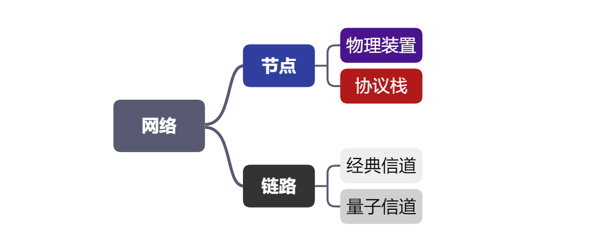
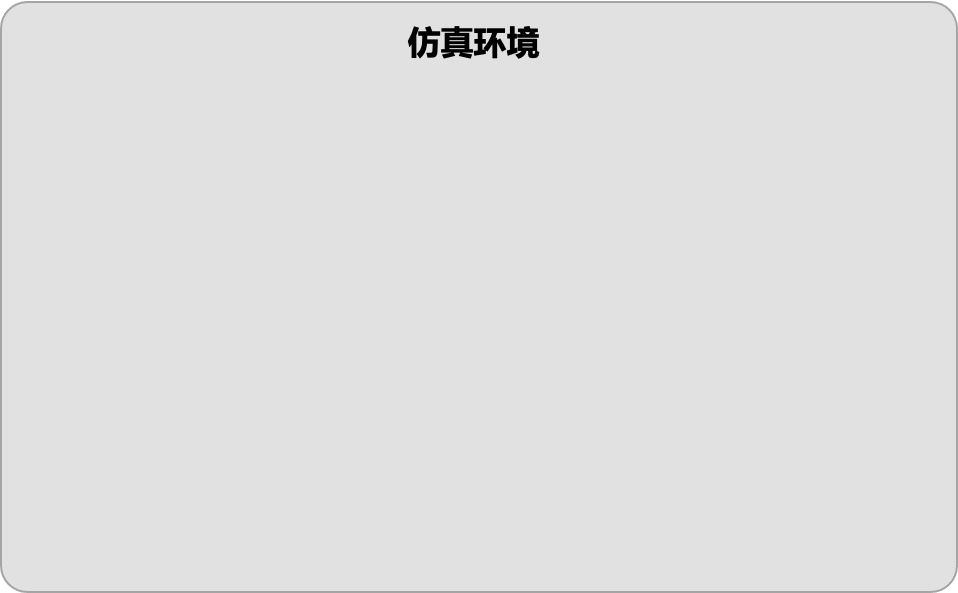
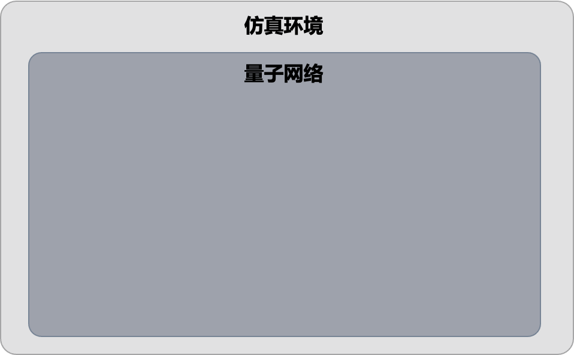
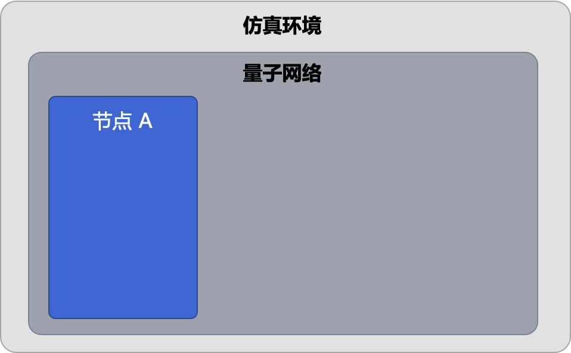
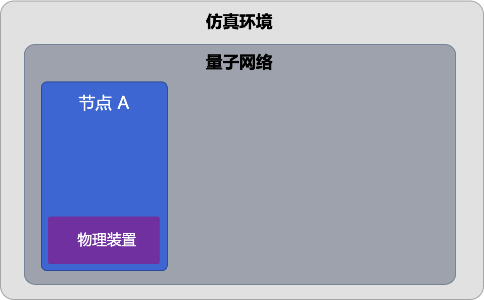
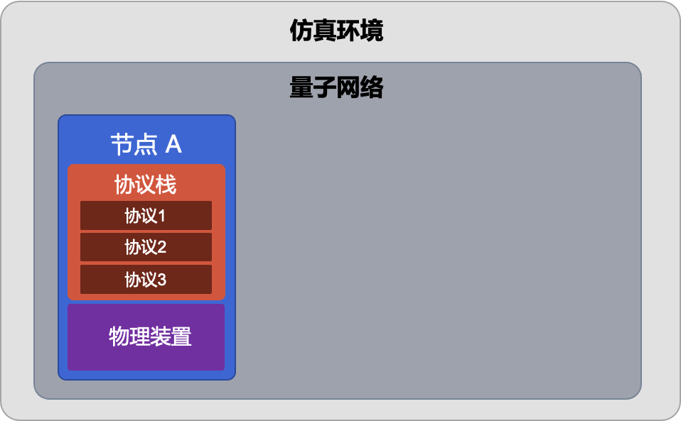
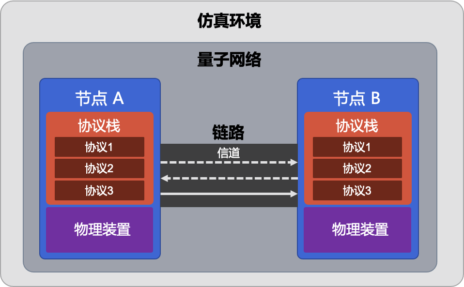

# 量子网络的搭建与模拟

*版权所有 (c) 2022 百度量子计算研究所，保留所有权利。*

在离散事件仿真教程中，我们简单介绍了用以实现仿真模拟的仿真环境 `DESEnv` 及其运行机制。通过排队模型示例讲解，相信大家已经掌握了创建仿真环境和启动模拟运行的基本规则。而想要对一个量子网络展开模拟仿真，除了需要创建一个仿真环境以外，在开始网络模拟之前，我们还需要完成对量子网络的搭建和配置，将所有仿真模拟相关的实体添加到仿真环境中，从而模拟它们之间的交互行为。

本教程中，我们将介绍量子网络的基本组成元素以及 QNET 中对应的量子网络搭建方式。

## 量子网络的基本元素

首先，我们将简单介绍一下组成量子网络的基本元素（图 1）。量子网络和经典网络类似，主要由节点和链路构成。通信节点中可以配置具体的物理装置，并加载协议栈进行运行；而网络中的一条链路中则通常会包含节点之间存在的经典信道或者量子信道。关于量子网络的基本内容，可以参见综述文献 [1,2]。

我们规定，QNET 中的量子网络及其组成部件都属于离散事件仿真中的实体，继承 `Entity` 类，包括网络（`Network`）、节点（`Node`）、链路（`Link`）、信道（`Channel`）及其他各种物理装置。网络中所有实体都内置了一个事件调度器（`Scheduler`），在创建实体实例的时候需要同时指定其所属的仿真环境，以便调度器找到对应的仿真环境并在其时间轴上安排事件。若未明确指定仿真环境，则实体对象会将自己添加到默认环境中。此外，所有实体都可以通过 `Entity` 的 `install` 方法来添加其组件。

**注意**：协议栈作为一组网络协议的集合，相当于节点中的软件，不属于网络中的实体，只作为节点之间及各层协议间共同遵守的通信规则装载在节点上运行。

以上就是搭建量子网络所需的基本元素。接下来，我们将对上述所涉及的各个模块进行串讲，告诉大家如何利用这些基本模块来搭建量子网络。



### 1. 仿真环境

首先，在进行任何仿真之前，我们都需要先生成一个离散事件仿真环境（`DESEnv`），用以驱动整个量子网络的仿真。

同时，我们需要将该环境设置为默认环境（即设置参数 `default=True`），以便后续创建的实体对象自动将自己添加到默认环境中。该过程也可以通过调用 `set_default_env` 方法来实现。


```python
from qcompute_qnet.core.des import DESEnv

env = DESEnv("Simulation Env", default=True)
```



每个网络仿真环境中都自带日志功能，用以记录仿真过程中的关键信息。通过 `set_log` 方法，我们可以对日志的相关参数（如：输出文件路径 `path`、日志级别 `level` 等）进行配置。


```python
env.set_log(path="./filename.log", level="INFO")
```

在完成环境的创建和网络的搭建之后（参见该教程后续部分），开始运行仿真之前，需要调用 `init` 方法对仿真环境进行初始化，该方法将同时触发仿真环境中所有实体（`Entity`）的 `init` 方法对每个实体进行初始化操作。

完成环境的初始化后，就可以通过调用 `DESEnv` 的 `run` 方法来启动网络模拟。通过传入 `end_time` 参数可以设定仿真运行的模拟时间（默认时间单位为皮秒，注意此处为虚拟时间而非真实 CPU 时间），若未传入该参数则默认为无穷，即仿真将一直运行下去，直至仿真环境中未来事件列表为空，仿真才会结束。此外，还可以通过设定 `logging` 参数的布尔值来决定是否输出仿真运行的日志文件，该参数默认为 `False`。


```python
env.init()  # 对仿真环境进行初始化
env.run(end_time=8e9, logging=True)  # 设定仿真运行的虚拟时间和日志
```

现在我们已经成功创建了仿真环境，下一步，则需要开始在该环境中搭建我们想要模拟的量子网络。

### 2. 网络

接下来，我们需要创建网络（`Network`）来帮助我们管理网络中的节点和链路。

`Network` 属于仿真环境中的实体，仿真环境初始化时将会调用网络的 `init` 方法对网络进行初始化，确认网络配置是否正常，同时计算并存储静态路由等。


```python
from qcompute_qnet.topology.network import Network

network = Network("Simple Network")  # 创建量子网络
```



关于量子网络的搭建方法，QNET 提供了两种网络拓扑结构的构建方式。

1. 手动创建节点和链路对象，并通过 `Network` 的 `install` 方法分别装载到量子网络中；
2. 通过 `Network` 的 `load_topology_from` 方法，直接从 JSON 标准文件加载网络拓扑结构。该方法将根据 JSON 配置文件中的内容自动创建网络中的各个节点和各条链路。


```python
network.install([node1, node2, link])  # 方式 1：通过 install 方法向网络中添加节点和链路

filename = "./network_topology.json"
network.load_topology_from(filename)  # 方式 2：从 JSON 文件加载网络拓扑
```

此外，为方便用户使用，我们提供了打印网络拓扑结构的功能。用户在构建好网络拓扑结构后，可以随时调用 `Network` 的 `print_classical_topology` 和 `print_quantum_topology` 来查看网络的经典拓扑图和量子拓扑图。

**提醒**：调用这些方法前应首先通过 `install` 或 `load_topology_from` 方法将节点和链路装载到网络当中。


```python
network.print_classical_topology()  # 打印经典网络拓扑图
network.print_quantum_topology()  # 打印量子网络拓扑图
```

以下是调用 `print_quantum_topology` 打印的一个量子网络拓扑的示意图。该网络中包含两个用户节点 Alice 和 Bob，以及他们之间的一个中继节点 Repeater。Alice 和 Bob 分别有两条量子信道与中继节点进行连接。


现在，我们成功地在模拟环境中搭建了一个量子网络的骨架，接下来则需要向网络中继续添加节点和链路来填充其内容。

### 3. 节点

节点（`Node`）是网络中具有通信功能的实体，是量子网络的核心元素之一，可以表示网络中的用户、路由器等。

创建节点后，我们可以通过 `Network` 的 `install` 方法将节点加载到网络中。


```python
from qcompute_qnet.topology.node import Node

alice = Node("Alice")  # 创建节点
network.install(alice)  # 将节点加载到网络中
```



节点具备与其他节点进行通信的能力，通过调用 `send_classical_msg` 方法或 `send_quantum_msg` 方法，并指定目的节点 `dst`，则可以通过对应信道向接收方发送经典或者量子消息。从离散事件仿真的角度，该方法实际上会安排相应事件并指定目的节点的 `receive_classical_msg` 或 `receive_quantum_msg` 来接收消息。


```python
alice.send_classical_msg(dst=bob, msg=cmsg)  # 发送经典消息
alice.send_quantum_msg(dst=bob, msg=qmsg)  # 发送量子消息
```

#### 3.1 配置物理装置

在成功创建网络中的节点后，用户还可以为其配置与其功能实现相关的物理装置。例如，一个 QKD 节点中通常会包含光源（`PhotonSource`）和探测器（`PolarizationDetector`）等。为节点配置物理装置的方法也很简单，通过节点的 `install` 方法就可以将物理装置安装到节点之中。


```python
from qcompute_qnet.devices.source import PhotonSource
from qcompute_qnet.devices.detector import PolarizationDetector

source = PhotonSource("Photon source")  # 创建一个光子源
detector = PolarizationDetector("Polarization detector")  # 创建一个光子探测器

alice.install([source, detector])  # 将相关物理装置配置到节点中
```

关于更多物理装置及其详细使用方式，请参见 API 文档。



#### 3.2 加载协议栈

除了硬件物理装置外，节点中还需要装配相关软件——协议栈。协议栈（`ProtocolStack`）是一组网络协议（`Protocol`）构成的套件。与经典网络类似，协议栈中的每层协议都对应着某一特定的功能，这些功能决定了经典和量子数据在网络中传输的规则，协议栈中各协议需要与其上下层协议之间进行通信协作，以实现一个完整的任务。

通过拼接不同协议，我们可以自行构建想要模拟的协议栈。在创建好对应的协议实例并定义好它们的层级关系后，通过 `ProtocolStack` 的 `build` 方法来构建协议栈。随后，通过节点的 `load_protocol` 方法可以将协议栈加载到节点之中。（注意：由于协议栈并非实体，因此不能直接通过 `install` 方法来装载。）


```python
from qcompute_qnet.models.qkd.key_generation import BB84
from qcompute_qnet.models.qkd.routing import QKDRouting
from qcompute_qnet.protocols.protocol import ProtocolStack

bb84 = BB84("BB84")
routing = QKDRouting("QKD Routing")
stack = ProtocolStack("QKD Network Stack")

# 根据上下层协议关系构建协议栈，此处将路由协议作为 BB84 的上层协议
stack.build([(routing, bb84)])  

# 将搭建好的协议栈加载到节点上
alice.load_protocol(stack)
```

有关更多协议及其使用请参见 API 文档。



#### 3.3 常用节点模板

通过上述方式，用户可以手动创建自己的节点并装配相应的物理硬件和协议栈。此外，为方便使用，我们在 QNET 中还提供了一些常用的节点模板，用户可以直接使用或者通过继承的方式自定义网络节点。

例如：我们提供了可用于量子密钥分发的 QKD 节点 `QKDNode`。在 `QKDNode` 中，我们为其预装了一个光子源和一个光子探测器，可以分别通过其属性 `photon_source` 和 `polar_detector` 来访问这些物理装置。此外，我们还为 `QKDNode` 预装了一个空的协议栈，并允许用户在创建 `QKDNode` 时便通过传入参数设定密钥生成协议。

为提供更大的自由空间，在 `QKDNode` 的 `set_key_generation` 方法中，我们支持用户通过传入 `peer` 及关键字参数来完成对密钥生成协议相关参数的设定，该方法将返回一个配置好相关参数的密钥生成协议（若用户未传入任何关键字参数，则将采用配置了默认参数的 `BB84` 协议作为 `QKDNode` 的密钥生成协议），随后用户可以手动将返回的密钥生成协议添加到该节点的协议栈中。

接下来，我们将简单介绍该节点模板的使用和配置方法。由于 `QKDNode` 中已经预先装有一个光子源和一个光子探测器，因此我们不需要重复 3.1 中配置物理装置的步骤，而只需对其协议栈进行设置即可。


```python
from qcompute_qnet.models.qkd.node import QKDNode

# 创建 QKD 节点
alice = QKDNode("Alice")
bob = QKDNode("Bob")

# 设置协议并添加到协议栈中
bb84_alice = alice.set_key_generation(bob)
alice.protocol_stack.build(bb84_alice)

bb84_bob = bob.set_ket_generation(alice)
bob.protocol_stack.build(bb84_bob)
```

有关更多节点模板及其使用请参见 API 文档。

现在，我们已经成功地向网络中添加了一系列配置好物理装置、装载了协议栈的节点。最后一步，需要我们将网络中不同节点通过链路连接起来，以使得它们之间能够相互通信。

### 4. 链路

链路（`Link`）是网络中节点之间的连接，标示着节点之间的连通性。链路是一种拓扑概念，一条链路中通常包含连接节点的具体的经典信道或者量子信道。

创建链路后，同样可以调用 `Network` 的 `install` 方法将其装入量子网络中。

除此之外，还需要通过调用链路的 `connect` 方法，将网络中的节点连接起来，以实现量子网络中边与点的连接（注意：节点和链路之间并非包含关系，因而不能直接通过`install` 方法构建连接。）


```python
from qcompute_qnet.topology.link import Link

link_ab = Link("A_B")  # 创建一条链路
network.install(link_ab)  # 将链路装入网络中
link_ab.connect(alice, bob)  # 通过链路连接网络中的两个节点
```

我们也可以在创建链路时直接传入 `ends` 参数来指定所连接的节点。


```python
from qcompute_qnet.topology.link import Link

link_ab = Link("A_B", ends=(alice, bob))  # 创建一条链路并指定两端节点
network.install(link_ab)  # 将链路装入网络中
```

#### 4.1 配置通信信道

连接两个节点的链路中需要包含实际的物理通信信道（`Channel`），两个节点之间既可能存在经典信道，也可能存在量子信道。通过分别对继承了 `ClassicalChannel` 类的 `ClassicalFiberChannel` 和继承了 `QuantumChannel` 类的 `QuantumFiberChannel` 进行对象实例化，我们可获得一条经典光纤信道和一条量子光纤信道。同样地，通过链路的 `install` 方法，可以将信道加载到链路中。

在创建好信道实例后，我们需要通过 `connect` 方法，将一条信道的两端与节点连接起来，以保证节点之间可以找到对应的实际物理信道进行通信。

**提醒**：上文提到的 `ClassicalFiberChannel` 和 `QuantumFiberChannel` 都是单向的通信信道。因此在连接节点时需要留意，`connect` 方法传入的两个位置参数分别代表了该信道的发送方 `sender` 和接收方 `receiver`。或者我们也可以在创建信道实例时直接指定这两方对应的节点。

除了单向的通信信道外，QNET 还提供了双工的通信信道（`DuplexChannel`）模板以及自由空间信道（`FreeSpaceChannel`），更多详情请参见 API 文档。


```python
from qcompute_qnet.devices.channel import ClassicalFiberChannel, QuantumFiberChannel

# 创建通信信道并通过 connect 方法连接节点
c1 = ClassicalFiberChannel("c_A2B", distance=1e3)
c1.connect(alice, bob)
c2 = ClassicalFiberChannel("c_B2A", distance=1e3)
c2.connect(bob, alice)

# 通过直接指定 sender 和 receiver 的方式创建信道并连接节点
q1 = QuantumFiberChannel("q_A2B", sender=alice, receiver=bob, distance=1e3)
q2 = QuantumFiberChannel("q_B2A", sender=bob, receiver=alice, distance=1e3)

link_ab.install([c1, c2, q1, q2])  # 将通信信道装入链路中
```

至此，我们已经介绍了搭建量子网络所需的所有基本模块，并依次介绍了搭建量子网络的逻辑与规则，完成量子网络搭建后的架构如下图所示。



## 完整代码示例

接下来，我们通过一个简单的例子来进一步帮助理解量子网络的构建和运行仿真的完整流程。

不妨假设我们现在想要模拟两位用户 Alice 和 Bob 之间通过 BB84 协议建立一对共享密钥的流程。这里我们将借助 3.3 中介绍的节点模板中所提供的 `QKDNode` 来完成对该应用场景的仿真，完整的仿真流程如下：

1. 创建仿真环境；
2. 创建网络；
3. 创建 QKD 节点，（配置物理装置）并加载协议栈；
4. 创建链路和通信信道，并连接节点；
5. 将通信节点和链路装入网络；
6. 启动协议并分别设置双方角色（**提醒**：`BB84` 协议为 `PrepareAndMeasure` 类协议，其节点角色可以为制备方 `TRANSMITTER` 或测量方 `RECEIVER`）；
7. 完成环境初始化并运行（为获取仿真运行中的详细信息，可以选择输出日志记录以便分析）。

完整的代码实现如下所示。


```python
from qcompute_qnet.core.des import DESEnv
from qcompute_qnet.topology.network import Network
from qcompute_qnet.models.qkd.node import QKDNode
from qcompute_qnet.topology.link import Link
from qcompute_qnet.devices.channel import ClassicalFiberChannel, QuantumFiberChannel
from qcompute_qnet.models.qkd.key_generation import PrepareAndMeasure

# 1. 创建环境并设置其为默认环境
env = DESEnv("BB84", default=True)

# 2. 创建量子网络
network = Network("BB84 Network")

# 3. 创建 QKD 节点并加载协议栈
alice = QKDNode("Alice")
bob = QKDNode("Bob")

# 设置协议并添加到协议栈中
bb84_alice = alice.set_key_generation(bob)
alice.protocol_stack.build(bb84_alice)

bb84_bob = bob.set_ket_generation(alice)
bob.protocol_stack.build(bb84_bob)

# 4. 创建并连接通信链路
link_ab = Link("A_B", ends=(alice, bob))

# 4.1 创建通信信道并装入链路
cchannel1 = ClassicalFiberChannel("c_A2B", sender=alice, receiver=bob, distance=1e3)
cchannel2 = ClassicalFiberChannel("c_B2A", sender=bob, receiver=alice, distance=1e3)
qchannel = QuantumFiberChannel("q_A2B", sender=alice, receiver=bob, distance=1e3)

# 4.2 将物理信道装入通信链路中
link_ab.install([cchannel1, cchannel2, qchannel])

# 5. 将通信节点和链路都装入网络
network.install([alice, bob, link_ab])

# 6. 分别选定 Alice 与 Bob 在协议中的角色并指定密钥数量和长度，启动协议栈
alice.protocol_stack.start(role=PrepareAndMeasure.Role.TRANSMITTER, key_num=2, key_length=256)
bob.protocol_stack.start(role=PrepareAndMeasure.Role.RECEIVER, key_num=2, key_length=256)

# 7. 仿真环境初始化，运行并保存日志记录
env.init()
env.run(logging=True)
```

以上就是通过 QNET 搭建量子网络并实现网络模拟的完整步骤。希望通过以上理论和代码的讲解，大家能够掌握搭建量子网络和实现模拟仿真的基本思路，从而能进一步借助 QNET 量子网络工具集来设计实现新的协议，加速量子网络架构设计和协议开发。

---

## 参考文献

[1] Kimble, H. Jeff. "The quantum internet." [Nature 453.7198 (2008): 1023-1030.](https://www.nature.com/articles/nature07127)

[2] Wehner, Stephanie, David Elkouss, and Ronald Hanson. "Quantum internet: A vision for the road ahead." [Science 362.6412 (2018): eaam9288.](https://www.science.org/doi/abs/10.1126/science.aam9288)
