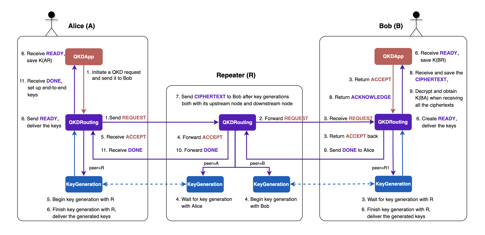

# Quantum network architecture simulation

*Copyright (c) 2022 Institute for Quantum Computing, Baidu Inc. All Rights Reserved.*

In previous tutorials, we have introduced the discrete-event simulation and the construction of a quantum network using QNET. In this tutorial, we will focus on the testing of a quantum network architecture.

First, we will give a brief introduction to the quantum key distribution (QKD). Then we will introduce a self-designed QKD network architecture. Finally, we will implement the network architecture using QNET and simulate a scenario where two users establish keys in Beijing quantum metropolitan area network.

## Quantum key distribution

### 1. Background   

In modern communications, symmetric encryption algorithms are universally used to encrypt the transmitted data between two parties. That is, two parties use the same key for the encryption of message and the decryption of ciphertext. The task of key distribution is to distribute keys to both parties and the security of distribution is one of the most important topic in cryptography.

The key distribution is usually accomplished by asymmetric encryption algorithms in classical cryptography. The most commonly used asymmetric encryption algorithm is the RSA algorithm, whose security depends on the computational complexity of factorization. However, such security has been threatened by Shor's algorithm since 1994.     

In comparison, quantum key distribution provides a new way of secure key distribution. Its security is guaranteed by the laws of quantum mechanics. In general, QKD uses photons as the information carrier so that an eavesdropper cannot make a perfect copy of the unknown quantum state by the no-cloning theorem. Moreover, any eavesdropping will change the quantum state, resulting in an increase in the bit error rate and making eavesdropping detection feasible.

The QKD technologies are getting mature at present, and the QKD network infrastructure represented by the Beijing-Shanghai Trunk Line is completing progressively. It is expected that large-scale QKD networks will be in service soon. Therefore, developing a stable and efficient QKD network architecture has become an important issue. In the following, we will introduce a self-designed QKD network architecture and demonstrate its QNET implementation step by step.

### 2. Network architecture

We develop a simple QKD network architecture according to the Tokyo quantum network [1] and the Beijing-Shanghai quantum network [2]. The detailed process is shown in Figure 1.

Each end node in the network has installed a 3-level protocol stack. This protocol stack sends or handles the key requests via the `QKDApp` protocol, determines the path of QKD via the `QKDRouting` protocol and generates sifted keys with its neighbors via the `BB84` protocol. The trusted repeater node has installed a 2-level protocol stack. Once it has finished the key generation with its upstream and downstream nodes, it will encrypt the sifted keys as a ciphertext  and send to the receiver. The receiver will receive all ciphertext from the repeater nodes, decrypt the ciphertexts and finally shares a key with the key requester.

The process of end-to-end key distribution is stated as follows:

1. Alice wants to generate end-to-end keys with Bob. She will then initiate a QKD request, which generates a `REQUEST` message and sends it to her directly connected repeater nodes (The `REQUEST` message will be directly sent to Bob if there is a direct channel between Alice and Bob);
2. When receiving the `REQUEST` message from Alice, the repeater nodes look up to their local routing tables for the next-hop node and forward the `REQUEST` message to it;
3. When Bob receives the `REQUEST` message, he generates an `ACCEPT` message and sends it back following the same path as the `REQUEST` message, and launches his BB84 protocol to generate keys with his upstream node;
4. When a repeater nodes on the path receive the `ACCEPT` message, it forwards the message to upstream and launches its local BB84 protocol to generate keys with its downstream node. Besides, it keeps waiting for the generation of keys with its upstream node at the same time;
5. Alice launches her local BB84 protocol when receiving the `ACCEPT` message to generate keys with her downstream node;
6. When Alice has generated sifted keys with her downstream node she saves the keys locally, the same operation as Bob after he generates the keys with his upstream node;
7. A repeater node performs encryption of the keys and sends the `CIPHERTEXT` to Bob as soon as it generates sifted keys with its upstream node and downstream node;
8. Bob saves the ciphertext in a local list when receiving one, and sends an `ACKNOWLEDGE` message back to the source node as the confirmation of message reception;
9. When Bob has received all ciphertexts, he decrypts the ciphertexts in the list with his locally saved keys and obtains the end-to-end keys with Alice. He then sends a `DONE` message to Alice to complete the key request;
10. The repeater nodes directly forward the `DONE` message when receiving it;
11. Alice receives the `DONE` message and sets the end-to-end keys, then finishes the protocol.



## Code implementation

To better simulate the above QKD network, we provide the classes `EndNode` and `TrustedRepeaterNode` to simulate the end nodes and trusted repeater nodes respectively. We have pre-installed a protocol stack that contains a `QKDRouting` protocol instance in both `EndNode` and `TrustedRepeaterNode`. The `QKDRouting` protocol is used to provide a routing function for the generation of end-to-end keys. Next, we will give a more detailed introduction to the above network architecture with related code implementation. (The introduction below only involves core parts of the codes, please refer to the source file for more details.)

### 1. Alice: Send a request

Alice wants to generate end-to-end keys with Bob, she sends a QKD request to Bob. The request is realized via the `key_request` method of class `EndNode`, which will call the method `set_qkd_app` to add a `QKDApp` protocol instance to the local protocol stack and set it to be the upper layer protocol of the `QKDRouting` protocol, and call the `start` method of class `QKDApp`.


```python
def key_request(self, **kwargs) -> None:
    qkd_app = self.set_qkd_app()
    qkd_app.start(**kwargs)
```

The method `start` of class `QKDApp` will schedule an event that sends a key generation request to Bob. This will call the `send_request` method and generate a `QKDMessage` of the type `REQUEST` by `QKDApp`, which contains the distribution path of generated keys, the number and length of the required keys. Then the `QKDApp` will call the `send_lower` method of class `Protocol` to send the message to the lower layer protocol `QKDRouting` for further processing.


```python
def send_request(self) -> None:
    ...
    request_msg = QKDMessage(src=self.node,
                             dst=self.request_to,
                             protocol=QKDRouting,
                             data={'type': QKDMessage.Type.REQUEST,
                                   'path': [self.node],
                                   'key_num': self.key_num,
                                   'key_length': self.key_length}
                            )
    self.send_lower(QKDRouting, msg=request_msg)
```

The `send_lower` method of class `Protocol` will directly call the `receive_upper` method of the lower layer protocol and pass the parameters. Whenever defining a protocol, users should rewrite the methods `receive_upper` and `receive_lower` to set the communication rules between the protocol and its upper and lower layer protocols.

The class `QKDRouting` will first identify the type of the message when it receives the message from its upper layer `QKDApp`. If the type of the message is `REQUEST` and the requested node is directly connected to the requester, it will send the message through the directly connected channel, or the message will be sent to the repeater node that is directly connected to it.


```python
def receive_upper(self, upper_protocol: type, **kwargs) -> None:
    msg = kwargs['msg']

# Alice: Send a 'REQUEST' message
if msg.data['type'] == QKDMessage.Type.REQUEST:
        # Check if the destination is directly connected to the node
        if msg.dst in self.node.direct_nodes:
            self.node.send_classical_msg(dst=msg.dst, msg=msg)
        else:
            self.node.send_classical_msg(dst=self.node.direct_repeater, msg=msg)
```

### 2. Repeater nodes: Forward the request

After receiving the `QKDMessage`, the `QKDRouting` in the repeater nodes also need to identify the type of the message. If it is a `REQUEST` message, `QKDRouting` will look up to the local routing table of the next-hop and forward the message. At the same time, the repeater nodes will add information about themselves to the path.


```python
def receive_classical_msg(self, msg: "QKDMessage", **kwargs) -> None:
    ...
    if msg.data['type'] == QKDMessage.Type.REQUEST:
        self.node.env.logger.info(f"{self.node.name} received"
                                  f"'REQUEST' of QKDApp with {msg.dst.name} from {msg.src.name}")

        # Repeater: Receive 'REQUEST' from Alice
        if isinstance(self.node, TrustedRepeaterNode):
            msg.data['path'].append(self.node)  # add itself to the path

            # Find the next hop node and forward the 'REQUEST' message
            next_hop = self.node.quantum_routing_table[msg.dst]
            self.node.send_classical_msg(dst=next_hop, msg=msg)

        # Bob: Receives the 'REQUEST' message from Alice
        elif isinstance(self.node, EndNode):
            # Define a QKDApp instance and send it to the upper
            self.node.set_qkd_app()
            self.send_upper(QKDApp, msg=msg)
```

### 3. Bob: Receive request and send back acceptance notice

Once receiving the `QKDMessage`, Bob will identify the type of the message in his `QKDRouting` protocol as well. If it is a `REQUEST` message, he will add a `QKDApp` instance to his local protocol stack and deliver the request to the upper protocol `QKDApp` via the `send_upper` method of class `Protocol`.

When the `QKDApp` protocol receives the `QKDMessage` from the `QKDRouting` protocol, it executes different operations by the type of message. When the message is a `REQUEST`, it will save the information of the node that initiates the key generation request, complete the information of the path and save the number and length of the requested keys. If there is no direct connections between Bob and Alice, the routing by repeater nodes is required for key swapping. Bob will set an empty list for saving the ciphertexts for the key swapping. At last, he will send an `ACCEPT` message to Alice to inform her of his agreement on the generation of end-to-end keys.


```python
def receive_lower(self, lower_protocol: type, **kwargs) -> None:
    msg = kwargs['msg']

    # Bob: Receive the 'REQUEST' message from Alice
    if msg.data['type'] == QKDMessage.Type.REQUEST:
        # Save sender of the QKD request
        self.request_from = msg.src
        # Add information to the path, save the number and length of the required keys
        path = msg.data['path']
        path.append(self.node)
        self.key_num = msg.data['key_num']
        self.key_length = msg.data['key_length']

        # If the request passed repeaters, set an empty list for storing ciphertexts
        if len(path) > 2:
            for node in path[1:-1]:
                self.ciphertext_lists[node] = None

        # Bob: Send back an 'ACCEPT' message
        accept_msg = QKDMessage(src=self.node,
                                dst=self.request_from,
                                protocol=QKDRouting,
                                data={'type': QKDMessage.Type.ACCEPT,
                                      'path': path,
                                      'key_num': self.key_num,
                                      'key_length': self.key_length}
                                )
        self.send_lower(QKDRouting, msg=accept_msg)
```

When the `QKDRouting` protocol receives the `ACCEPT` message from the upper layer protocol, it saves the information of its upstream node and the path, and creates a `PrepareAndMeasure` instance at the same time for the generation of keys with its upstream node.

**Note**: We assume in our quantum network architecture that the upstream nodes are always senders and the downstream nodes are always receivers in the key distribution of adjacent nodes.


```python
def receive_upper(self, upper_protocol: type, **kwargs) -> None:
    msg = kwargs['msg']
    ...
    # Bob: Send back an 'ACCEPT' message
    elif msg.data['type'] == QKDMessage.Type.ACCEPT:
        self.path = msg.data['path']  # save the path for key swapping
        self.node.env.logger.info(f"Path of the QKD request: {[node.name for node in self.path]}")

        self.upstream_node = self.path[-2]  # get the upstream node from the path
        key_num = msg.data['key_num']
        key_length = msg.data['key_length']
        # Forward the 'ACCEPT' message to the upstream node
        self.node.send_classical_msg(dst=self.upstream_node, msg=msg)  

        # Create an instance for key generation and wait for sifting keys with his upstream node
        self.node.set_key_generation(self.upstream_node)
        self.send_lower(PrepareAndMeasure, 
                        peer=self.upstream_node, 
                        role=PrepareAndMeasure.Role.RECEIVER, 
                        key_num=key_num, 
                        key_length=key_length
                        )
```

### 4. Repeater nodes: Forward `ACCEPT ` message and generate keys

When the repeater nodes along the path receive the `ACCEPT` message, they save the path for key swapping, the number and length of keys and their upstream and downstream nodes. They also set their key generation protocols to generate keys with their upstream and downstream nodes respectively.


```python
def receive_classical_msg(self, msg: "QKDMessage", **kwargs) -> None:
    ...
    elif msg.data['type'] == QKDMessage.Type.ACCEPT:
        self.node.env.logger.info(f"{self.node.name} received 'REQUEST' of QKDApp with"
                                  f"{msg.dst.name} from {msg.src.name}")
        
        # Save the path, the number and length of the requested keys
        self.path = msg.data['path']
        key_num = msg.data['key_num']
        key_length = msg.data['key_length']

        # Repeater nodes: Receive the 'ACCEPT' message from Bob
        if isinstance(self.node, TrustedRepeaterNode):
            # Save information about the upstream and downstream nodes
            index = msg.data['path'].index(self.node)
            self.upstream_node, self.downstream_node = msg.data['path'][index - 1], msg.data['path'][index + 1]
            # Forward the 'ACCEPT' message to the upstream node
            self.node.send_classical_msg(self.upstream_node, msg=msg)  

            # Set 'PrepareAndMeasure' protocols for the key generation with upstream and downstream nodes
            self.node.set_key_generation(self.upstream_node)
            self.send_lower(PrepareAndMeasure, 
                            peer=self.upstream_node, 
                            role=PrepareAndMeasure.Role.RECEIVER, 
                            key_num=key_num, 
                            key_length=key_length
                            )

            self.node.set_key_generation(self.downstream_node)
            self.send_lower(PrepareAndMeasure, 
                            peer=self.downstream_node, 
                            role=PrepareAndMeasure.Role.TRANSMITTER, 
                            key_num=key_num, 
                            key_length=key_length
                            )
```

### 5. Alice: Receive message and generate keys

When Alice receives the `ACCEPT` message, she directly begins to generate keys with her downstream node.


```python
def receive_classical_msg(self, msg: "QKDMessage", **kwargs) -> None:
    ...
    elif msg.data['type'] == QKDMessage.Type.ACCEPT:
        self.node.env.logger.info(f"{self.node.name} received 'ACCEPT' of QKDApp from {msg.src.name}")

        # Save the path, the number and length of the keys
        self.path = msg.data['path']
        key_num = msg.data['key_num']
        key_length = msg.data['key_length']
        ...
        # Alice: Receive the 'ACCEPT' message from Bob
        elif isinstance(self.node, EndNode):
            self.downstream_node = self.path[1]  # set her downstream node

            # Generate keys with the downstream node
            self.node.set_key_generation(self.downstream_node)
            self.send_lower(PrepareAndMeasure, 
                            peer=self.downstream_node, 
                            role=PrepareAndMeasure.Role.TRANSMITTER, 
                            key_num=key_num, 
                            key_length=key_length
                            )
```

### 6. End nodes: Save generated keys

When the key generation protocols on the bottom layer of end nodes finish their key generations, they deliver the keys to their upper layer protocol `QKDRouting` via the `send_upper` method. The `QKDRouting` will decide if there's a need for the key swapping by routing, and send the `READY` message to `QKDApp` to inform that the keys are successfully generated and delivered.


```python
def receive_lower(self, lower_protocol: type, **kwargs) -> None:
    peer = kwargs['peer']
    self.keys[peer] = kwargs['sifted_keys']

    # EndNode: Deliver the sifted keys to the upper protocol
    if isinstance(self.node, EndNode):
        # If the two users are directly connected, then finish the QKD
        finish = True if len(self.path) == 2 else False
        ready_msg = QKDMessage(src=None,
                               dst=None,
                               protocol=QKDApp,
                               data={'type': QKDMessage.Type.READY,
                                     'sifted_keys': self.keys[peer],
                                     'finish': finish}
                                )
        self.send_upper(QKDApp, msg=ready_msg)
```

After receiving the `READY` message from the `QKDRouting` protocol, `QKDApp` saves the keys in the protocol of this layer and checks whether to end the protocol by the bool value of the parameter `finish`.


```python
def receive_lower(self, lower_protocol: type, **kwargs) -> None:
    msg = kwargs['msg']
    ...
    # Receive the 'READY' message from the lower protocol
    elif msg.data['type'] == QKDMessage.Type.READY:
        # Save the sifted keys locally
        self.keys = msg.data['sifted_keys']
        finish = msg.data['finish']

        if finish:
            self.finish()
```

### 7. Repeater nodes: Swap the sifted keys 

When the repeater nodes $R_m$ finish the key generation with their upstream and downstream nodes, they start the key swapping. The repeater nodes generate the ciphertexts $c_m = k_{R_{m-1}R_m} \oplus k_{R_mR_{m+1}}$  by performing bitwise XOR operations on the keys generated with their upstream nodes $k_{R_{m-1}R_m}$ and the keys generated with their downstream nodes $k_{R_mR_{m+1}}$.

**Note**: In our network architecture, the sifted keys generated between the requester and his downstream node are swapped downstream to the receiver.


```python
def receive_lower(self, lower_protocol: type, **kwargs) -> None:
    peer = kwargs['peer']
    self.keys[peer] = kwargs['sifted_keys']

    # Trusted repeater node: Do key swapping
    elif isinstance(self.node, TrustedRepeaterNode):
    # Check if already generated keys for both directions
    if self.upstream_node in self.keys.keys() and self.downstream_node in self.keys.keys():
            ciphertext_list = []
            # Perform XOR operations to each pair of keys, generate a ciphertext list
            for key_down, key_up in zip(self.keys[self.downstream_node], self.keys[self.upstream_node]):
                ciphertext_list.append(key_down ^ key_up)

            # Send the ciphertext list to Bob
            cipher_msg = QKDMessage(src=self.node,
                                    dst=self.path[-1],
                                    protocol=QKDRouting,
                                    data={'type': QKDMessage.Type.CIPHERTEXT,
                                            'ciphertext_list': ciphertext_list}
                                    )
            next_hop = self.node.classical_routing_table[cipher_msg.dst]
            self.node.send_classical_msg(dst=next_hop, msg=cipher_msg)
```

When receiving the `CIPHERTEXT`, other repeater nodes in the network will also directly forward it to their next hop nodes.


```python
def receive_classical_msg(self, msg: "QKDMessage", **kwargs) -> None:
    ...
    elif msg.data['type'] == QKDMessage.Type.CIPHERTEXT:
        if msg.dst == self.node:
            ...
        # Repeater nodes: Receive the 'CIPHERTEXT' and directly forward the message
        else:
            next_hop = self.node.classical_routing_table[msg.dst]
            self.node.send_classical_msg(dst=next_hop, msg=msg)
```

### 8. Bob: Receive ciphertexts and confirm the reception

When the ciphertexts from repeater nodes arrive at Bob, they will be directly delivered from `QKDRouting` to `QKDApp` for processing.


```python
def receive_classical_msg(self, msg: "QKDMessage", **kwargs) -> None:
    ...
    elif msg.data['type'] == QKDMessage.Type.CIPHERTEXT:
        # Bob: Receive the ciphertexts from a repeater node
        if msg.dst == self.node:
            self.node.env.logger.info(f"{self.node.name}"
                                      f"received 'CIPHERTEXT' of QKDApp from {msg.src.name}")
            self.send_upper(QKDApp, msg=msg)
```

Bob saves the arrived ciphertexts locally and sends an `ACKNOWLEDGE` message to the repeater that sends the ciphertexts to confirm the reception of its ciphertexts.


```python
def receive_lower(self, lower_protocol: type, **kwargs) -> None:
    msg = kwargs['msg']
    ...
    # Bob: Receive the ciphertexts from a repeater node
    elif msg.data['type'] == QKDMessage.Type.CIPHERTEXT:
        self.ciphertext_lists[msg.src] = msg.data['ciphertext_list']  # save the ciphertext list

        # Send an 'ACKNOWLEDGE' message back
        ack_msg = QKDMessage(src=self.node,
                             dst=msg.src,
                             protocol=QKDRouting,
                             data={'type': QKDMessage.Type.ACKNOWLEDGE}
                            )
        self.send_lower(QKDRouting, msg=ack_msg)

        # Decrypt the swapped keys if all ciphertexts are received
        if all(ciphertext_list is not None for ciphertext_list in self.ciphertext_lists.values()):
            swapped_keys = self.keys
            for ciphertext_list in self.ciphertext_lists.values():
                # Perform XOR operations for decryption implementation
                swapped_keys = [key ^ ciphertext for key, ciphertext in zip(swapped_keys, ciphertext_list)]
            self.keys = swapped_keys

            # Send a 'DONE' message to Alice and end the protocol
            done_msg = QKDMessage(src=self.node,
                                  dst=self.request_from,
                                  protocol=QKDRouting,
                                  data={'type': QKDMessage.Type.DONE}
                                  )
            self.send_lower(QKDRouting, msg=done_msg)
            self.finish()
```

### 9. Bob: Decrypt and obtain end-to-end keys

Bob checks if he has received all the ciphertexts from the repeater nodes. If he has, he will use his locally saved key $k_{AB} = k_{BR_n}$ to jointly decrypt all the ciphertexts and obtain the shared keys with Alice $k_{AB} = k_{BR_n} \oplus (k_{AR_1} \oplus k_{R_1R_2}) \oplus \ldots \oplus (k_{R_{n-1}R_n} \oplus k_{R_nB}) = k_{AR_1}$. At the same time, he will send a `DONE` message back to Alice to inform her of generating the end-to-end keys successfully. 


```python
def receive_upper(self, upper_protocol: type, **kwargs) -> None:
    ...
    # Bob: Send a 'DONE' message back to Alice
    elif msg.data['type'] == QKDMessage.Type.DONE:
        if msg.dst in self.node.direct_nodes:
            self.node.send_classical_msg(dst=msg.dst, msg=msg)
        else:
            self.node.send_classical_msg(dst=self.node.direct_repeater, msg=msg)

        self.reset()
```

Then he calls the `finish` method of class `QKDApp` to deliver the generated end-to-end keys to the node and end the protocol.


```python
def finish(self) -> None:
    if self.request_to is not None:
        ...
    # Bob: Finish his protocol
    elif self.request_from is not None:
        self.node.keys[self.request_from] = self.keys  # deliver the keys to the node
        ...
```

### 10. Repeater nodes: Forward `DONE` message

When repeater nodes receive the `DONE` message, they directly forward the message according to the routing table.


```python
def receive_classical_msg(self, msg: "QKDMessage", **kwargs) -> None:
    ...
    elif msg.data['type'] == QKDMessage.Type.DONE:
        if msg.dst == self.node:
        # Repeater nodes: Forward the 'DONE' message
        else:
            next_hop = self.node.classical_routing_table[msg.dst]
            self.node.send_classical_msg(dst=next_hop, msg=msg)
```

### 11. Alice: Receive `DONE` message

When Alice receives the `DONE` message, her `QKDRouting` protocol will directly deliver the message to the `QKDApp` protocol. The `QKDApp` protocol will call the `finish` method to deliver the key information to the node and end the protocol.


```python
def finish(self) -> None:
    # Alice: Finish her protocol
    if self.request_to is not None:
        self.node.keys[self.request_to] = self.keys  # deliver the keys to the node
        ...
```

### Code example

Next, we will use the above architecture to simulate the process of generating end-to-end keys between two users in Beijing quantum metropolitan area network (details of the network topology can be found in Ref. [2]). The entire code can be found in the source code of QNET.

First, we create the simulation environment, set it to default and build the quantum network topology.


```python
from qcompute_qnet.core.des import DESEnv
from qcompute_qnet.topology.network import Network

# Create a simulation environment
env = DESEnv("QKD Network Architecture", default=True)  
# Create the network for Beijing quantum metropolitan area network
network = Network("Beijing QMAN")  
# Set the path of the JSON file for network topology configuration
filename = "data/beijing_qman_topology.json"  
# Load nodes and links from the JSON file
network.load_topology_from(filename)  
# Print the quantum network topology by the geographical locations of the nodes
network.print_quantum_topology(geo=True)  
```

We can generate the nodes and links of the network automatically according to the configuration JSON file via the method `load_topology_from` of class `Network`. By setting the parameter `geo=True` of the method `print_quantum_topology`, we can print the network topology according to the geographical locations of nodes. The network topology of the Beijing quantum network with nodes and links installed is shown in Figure 2. Note that the network topology is based on Ref. [2] and used for demonstration purposes only. The topology may differ from the realistic data.

![Figure 2：The topology of the Beijing quantun netowrk（part of the data are obtained from Ref. [2]）](figures/qkd_architecture-quantum_topology.png "Figure 2：The topology of the Beijing quantun netowrk（part of the data are obtained from Ref. [2]）")

Next, we let the end node EN13 to send a QKD request to the end node EN15 for generating ten pairs of end-to-end keys, with a length of 256 bits per pair.


```python
# Find the users by their names
en13 = env.get_node("EN13")
en15 = env.get_node("EN15")

# EN13 sends a QKD request to EN15, with the number and length of the keys specified
en13.key_request(dst=en15, key_num=10, key_length=256)  
```

Then, we initialize the environment and run the simulation with the `logging` turned on. A log file will be saved locally for the simulation analysis.


```python
# Initialize and run the simulation
env.init()
env.run(logging=True)
```

## Conclusion

The above example is just a simple demonstration of our QKD network architecture. Interested readers can design their own architectures and simulate with QNET in a similar way. We hope that QNET can help to speed up the designing and testing of quantum networks and also accelerate their standardization.

---

## References

[1] Sasaki, Masahide, et al. "Field test of quantum key distribution in the Tokyo QKD Network." [Optics Express 19.11 (2011): 10387-10409.](https://opg.optica.org/oe/fulltext.cfm?uri=oe-19-11-10387)

[2] Chen, Yu-Ao, et al. "An integrated space-to-ground quantum communication network over 4,600 kilometres." [Nature 589.7841 (2021): 214-219.](https://www.nature.com/articles/s41586-020-03093-8)
