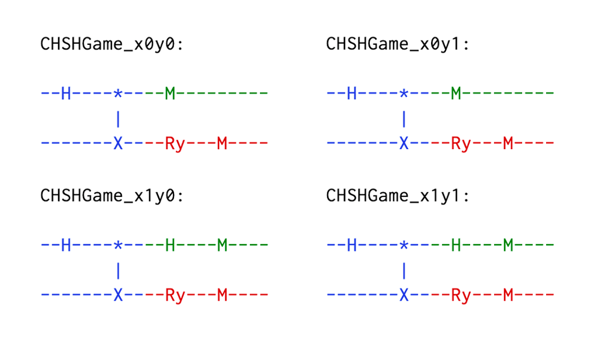

# CHSH game

*Copyright (c) 2022 Institute for Quantum Computing, Baidu Inc. All Rights Reserved.*

The CHSH game is derived from the CHSH inequality proposed by Clauser, Horne, Shimony and Holt in 1969 [1]. By comparing the winning probability of the CHSH game using the optimal classical strategy and the optimal quantum strategy, it can be found that quantum computing has advantages in coping with certain problems and can provide better performances. Besides, the CHSH game can be used to construct verifiable quantum delegation protocols and device-independent quantum cryptography protocols [2, 3].

In this tutorial, we will first introduce the rules of the CHSH game. Then, we will introduce the optimal classical strategy and the optimal quantum strategy of the CHSH game. Finally, we will simulate and verify the optimal quantum strategy of the CHSH game using QNET, to show the advantage of quantum computing over classical computing in this game.

## Introduction

### 1. Rules

As shown in Figure 1, there are three roles in the CHSH game: Two players in cooperation, Alice and Bob, and one referee.

The rules of the CHSH game are as follows:

1. At the start of the game, the referee randomly chooses 2 questions $x, y \in \{0, 1\}$ and sends the questions to the two players;
2. Alice and Bob need to answer the questions $x$ and $y$ separately, and send their answers $a, b \in \{0, 1\}$ back to the referee respectively;
3. The referee judges that if the equation $x \cdotp y = a \oplus b$ is satisfied according to the answers of the players. If so, he judges that the players win the game; otherwise, the players lose.

**Note**: The players are allowed to negotiate a proper strategy to increase their winning probability before the game starts. But no communication between them is allowed once the game starts.


### 2. Optimal classical strategy

An optimal classical strategy is that Alice and Bob both return 0 as their answers no matter what the questions they receive are.

Using this strategy, different scenarios and the corresponding results of the game are shown in the table below. It can be found that the winning probability of the game using this optimal classical strategy is $p_{win}=75\%$. The players lose when both $x$ and $y$ are $1$.

| $x$ | $y$ | $x\cdotp y$ | $a \oplus b$ | Result |
|:----:|:----:|:------------:|:-------------:|:------------:|
| $0$ | $0$ | $0$         | $0$          | win         |
| $0$ | $1$ | $0$         | $0$          | win         |
| $1$ | $0$ | $0$         | $0$          | win         |
| $1$ | $1$ | $1$         | $0$          | lose        |

### 3. Optimal quantum strategy

Next, we will introduce an optimal quantum strategy for the CHSH game, which can bring a higher winning probability than classical strategies by introducing quantum entanglement.

The optimal quantum strategy of the CHSH game is as follows:
1. Before the game starts, Alice and Bob need to share an EPR pair $|\Phi^+\rangle_{AB}=\tfrac{1}{\sqrt{2}}(|00\rangle+|11\rangle)$.
2. Once receiving the questions from the referee, Alice and Bob perform measurements on their qubits $A$ and $B$ respectively.
3. If the question is $x=0$, Alice measures her qubit $A$ in the $Z$-basis; if the question is $x=1$, Alice measures her qubit in the $X$-basis. Then she sends her measurement outcome as the answer $a$ back to the referee;
4. If the question is $y=0$, Bob measures his qubit $B$ in the $\frac{1}{\sqrt{2}} (Z + X)$-basis; if the question is $y=1$, Bob measures his qubit in the $\frac{1}{\sqrt{2}} (Z - X)$-basis. Then he sends his measurement outcome as the answer $b$ back to the referee.

Using this strategy, the winning probability of the players can be increased to $p_{win}\approx 85\%$. More details about the optimal quantum strategy can be found in Ref. [4].

Next, we will simulate the CHSH game using QNET, and verify the optimal quantum strategy.

## Protocol implementation

In the QPU module, we provide ``CHSHGame`` class for the CHSH game protocol. Four sub-protocols are defined to describe the behaviours of the four roles in the CHSH game: the entanglement source that generates and distributes entanglement pairs (``Source``), the two players Alice (``Player1``) and Bob (``Player2``) which answer different questions, and the referee (``Referee``) that sends questions to the players and receives their answers, then judges whether they win the game.

**Note**: To calculate the winning probability, the CHSH game will repeat multiple rounds. In each round, the operations in the game correspond to the corresponding operations on a quantum circuit in the quantum network. Once a new round is started, a new quantum circuit needs to be created. To synchronize the operations of the nodes in the quantum network to the corresponding operations on the quantum circuit, the party that creates the quantum circuit is required to send the index of the quantum circuit when he sends a quantum message.


```python
class CHSHGame(Protocol):

    def __init__(self, name=None):
        super().__init__(name)
        self.role = None

    class Message(ClassicalMessage):
        def __init__(self, src: "Node", dst: "Node", protocol: type, data: Dict):
            super().__init__(src, dst, protocol, data)

        @unique
        class Type(Enum):

            ENT_REQUEST = "Entanglement request"
            READY = "Ready"
            QUESTION = "Question from the referee"
            ANSWER = "Answer from the player"

    def start(self, **kwargs) -> None:
        role = kwargs['role']
        # Instantiate a sub-protocol by its role
        self.role = getattr(CHSHGame, role)(self)
        # Start the sub-protocol
        self.role.start(**kwargs)

    def receive_classical_msg(self, msg: "ClassicalMessage", **kwargs) -> None:
        # Call its sub-protocol to receive the classical message
        self.role.receive_classical_msg(msg)

    def receive_quantum_msg(self, msg: "QuantumMsg", **kwargs) -> None:
        # Store the received qubit
        self.node.qreg.store_qubit(msg.data, kwargs['src'])
        # Synchronize the corresponding quantum circuit
        self.node.qreg.circuit_index = msg.index
        # Call its sub-protocol for additional operations
        self.role.receive_quantum_msg()

    def estimate_statistics(self, results: List[Dict]) -> None:
        # Make sure this method can only be called by the referee
        assert type(self.role).__name__ == "Referee", \
            f"The role of {type(self.role).__name__} has no right to calculate the winning probability of the game!"
        # Call this method of the corresponding sub-protocol
        self.role.estimate_statistics(results)
```

### 1. Entanglement source (``Source``)

The entanglement source is responsible for generating entanglement pairs and distributing them to the players before the game starts. When receiving an entanglement request of Alice from the classical channel, which indicates the start of one game round, the entanglement source will call the ``create_circuit`` method of the quantum register to create a new quantum circuit. The created circuit will be automatically added to the ``circuits`` list of the ``Network``. All the subsequent quantum operations in this round will be performed on this circuit. Then the entanglement source will generate an entanglement pair in Bell state $| \Phi^+ \rangle = \tfrac{1}{\sqrt{2}} (|00 \rangle + |11 \rangle)$ locally, and respectively distribute the two entangled qubits to Alice and Bob via quantum channels.


```python
 class CHSHGame(Protocol):
    ...
    class Source(SubProtocol):

        def __init__(self, super_protocol: Protocol):
            super().__init__(super_protocol)

        def start(self, **kwargs) -> None:
            pass

        def receive_classical_msg(self, msg: "ClassicalMessage") -> None:
            if msg.data['type'] == CHSHGame.Message.Type.ENT_REQUEST:
                # Create a new quantum circuit
                self.node.qreg.create_circuit(f"CHSHGame_")
                # Generate an entanglement pair locally
                self.node.qreg.h(0)
                self.node.qreg.cnot([0, 1])

                # Distribute the qubits to the players
                # Send qubit with address 0 to the first player
                self.node.send_quantum_msg(dst=msg.src, qreg_address=0)
                # Send qubit with address 1 to another player
                self.node.send_quantum_msg(dst=msg.data['peer'], qreg_address=1)
```

### 2. Player1 (``Player1``)

The behaviors of player 1 in the protocol include:

1. Before the game starts, call the ``prepare_for_game`` method to send an entanglement request to the entanglement source to share an entanglement with another player;
2. Send a ``READY`` message to the referee to play the game when receiving the entangled qubit;
3. When receiving a question $x$ from the referee, choose a measurement basis according to the question ($x=0: Z$-basis; $x=1: X$-basis);
4. Send the measurement outcome back to the referee as her answer $a$.


```python
 class CHSHGame(Protocol):
    ...
    class Player1(SubProtocol):

        def __init__(self, super_protocol: Protocol):
            super().__init__(super_protocol)
            self.peer = None
            self.ent_source = None
            self.referee = None
            self.rounds = None
            self.current_round = 0

        def start(self, **kwargs) -> None:
            # Another player
            self.peer = kwargs['peer']
            # The entanglement source
            self.ent_source = kwargs['ent_source']
            # Referee of the game
            self.referee = kwargs['referee']
            # Total rounds of the game
            self.rounds = kwargs['rounds']
            # Request for the entanglement resource and prepare to play the game
            self.prepare_for_game()

        def prepare_for_game(self) -> None:
            # Update the game round counter
            self.current_round += 1
            # Send an entanglement request to the entanglement source
            self.request_entanglement()

        def request_entanglement(self) -> None:
            # Generate an entanglement request message
            ent_request_msg = CHSHGame.Message(
                src=self.node, dst=self.ent_source, protocol=CHSHGame,
                data={'type': CHSHGame.Message.Type.ENT_REQUEST, 'peer': self.peer}
            )
            # Send the entanglement request to the entanglement source
            self.node.send_classical_msg(dst=self.ent_source, msg=ent_request_msg)

        def receive_classical_msg(self, msg: "ClassicalMessage") -> None:
            if msg.data['type'] == CHSHGame.Message.Type.QUESTION:
                # Record the question from the referee
                x = msg.data['question']

                # If x = 0, measure the qubit in the Z-basis
                if x == 0:
                    self.node.qreg.measure(0, basis="z")
                    self.node.qreg.circuit.name += "x0"  # record the question player 1 receives

                # If x = 1, measure the qubit in the X-basis
                elif x == 1:
                    self.node.qreg.measure(0, basis="x")
                    self.node.qreg.circuit.name += "x1"  # record the question player 1 receives

                # Send the answer to the referee
                answer_msg = CHSHGame.Message(
                    src=self.node, dst=self.referee, protocol=CHSHGame,
                    data={'type': CHSHGame.Message.Type.ANSWER,
                          'answer': self.node.qreg.units[0]['outcome']}
                )
                # Send the answer back to the referee
                self.node.send_classical_msg(dst=self.referee, msg=answer_msg)

                # Prepare for the next round
                if self.current_round < self.rounds:
                    self.prepare_for_game()

        def receive_quantum_msg(self) -> None:
            # Play the game after receiving the entangled qubit
            self.play_game()

        def play_game(self) -> None:
            # Send a READY message to the referee to play the game
            ready_msg = CHSHGame.Message(
                src=self.node, dst=self.referee, protocol=CHSHGame,
                data={'type': CHSHGame.Message.Type.READY}
            )
            self.node.send_classical_msg(dst=self.referee, msg=ready_msg)
```

### 3. Player2 (``Player2``)

The behaviors of player 2 in the protocol include:

1. Send a ``READY`` message to the referee to play the game when receiving the entangled qubit;
2. When receiving a question $y$, choose a specific measurement basis according to the question $y$ ($y=0$：$\frac{1}{\sqrt{2}} (Z + X)$-basis；$y=1$：$\frac{1}{\sqrt{2}} (Z - X)$-basis);
4. Send the measurement outcome back to the referee as his answer $b$.


```python
  class CHSHGame(Protocol):
    ...
    class Player2(SubProtocol):

        def __init__(self, super_protocol: Protocol):
            super().__init__(super_protocol)
            self.peer = None
            self.ent_source = None
            self.referee = None

        def start(self, **kwargs) -> None:
            # Another player
            self.peer = kwargs['peer']
             # The entanglement source
            self.ent_source = kwargs['ent_source']
            # Referee of the game
            self.referee = kwargs['referee']

        def receive_classical_msg(self, msg: "ClassicalMessage", **kwargs) -> None:
            if msg.data['type'] == CHSHGame.Message.Type.QUESTION:
                # Record the question from the referee
                y = msg.data['question']

                # If y = 0, perform a Ry gate with the angle of (- pi / 4) on the qubit, 
                # then measure it in the Z-basis
                if y == 0:
                    self.node.qreg.ry(0, - numpy.pi / 4)
                    self.node.qreg.measure(0, basis="z")
                    self.node.qreg.circuit.name += "y0"  # record the question player 2 receives

                # If y = 1, perform a Ry gate with the angle of (pi / 4) on the qubit, 
                # then measure it in the Z-basis
                elif y == 1:
                    self.node.qreg.ry(0, numpy.pi / 4)
                    self.node.qreg.measure(0, basis="z")
                    self.node.qreg.circuit.name += "y1"  # record the question player 2 receives

                # Send the answer to the referee
                answer_msg = CHSHGame.Message(
                    src=self.node, dst=self.referee, protocol=CHSHGame,
                    data={'type': CHSHGame.Message.Type.ANSWER,
                          'answer': self.node.qreg.units[0]['outcome']}
                )
                self.node.send_classical_msg(dst=self.referee, msg=answer_msg)

        def receive_quantum_msg(self) -> None:
            # Play the game after receiving the entangled qubit
            self.play_game()

        def play_game(self) -> None:
            # Send a READY message to the referee to play the game
            ready_msg = CHSHGame.Message(
                src=self.node, dst=self.referee, protocol=CHSHGame,
                data={'type': CHSHGame.Message.Type.READY}
            )
            self.node.send_classical_msg(dst=self.referee, msg=ready_msg)
```

### 4. Referee (``Referee``)

The behaviors of the referee in the protocol include:

1. Before the game starts, wait for the ``READY`` message from the players to arrive. When both players are ready, start the CHSH game;
2. When the game starts, randomly generate two questions $x, y \in \{0, 1\}$ and record them, then send $x$ to player1 and $y$ to player2 respectively;
3. Wait for player 1 and player 2 to return their answers $a$ and $b$, and save the answers;
4. Judge whether the players win in each game round according to the sampling results of the quantum circuits. Then calculate the winning probability of the game.


```python
class CHSHGame(Protocol):
    ...
    class Referee(SubProtocol):

        def __init__(self, super_protocol: Protocol):
            super().__init__(super_protocol)
            # Players of the game
            self.players = None
            # Record whether the players are ready for the game
            self.players_ready = [False, False]
            # Save the questions in each round of the game
            self.questions = []
            # Save player 1's answer in each round of the game
            self.answers_p1 = []
            # Save player 2's answer in each round of the game
            self.answers_p2 = []

        def start(self, **kwargs):
            self.players = kwargs['players']

        def receive_classical_msg(self, msg: "ClassicalMessage") -> None:
            if msg.data['type'] == CHSHGame.Message.Type.READY:
                # Change the status of the player that is ready for the game
                self.players_ready[self.players.index(msg.src)] = True

                # Start the game and generate questions if both players are ready
                if all(self.players_ready):
                    self.send_questions()
                    # Reset the players' status for next round of the game
                    self.players_ready = [False, False]

            elif msg.data['type'] == CHSHGame.Message.Type.ANSWER:
                # Save the answers of the players
                if msg.src == self.players[0]:
                    self.answers_p1.append(msg.data['answer'])
                elif msg.src == self.players[1]:
                    self.answers_p2.append(msg.data['answer'])

        def send_questions(self):
            # Generate 2 random bits x, y ∈ {0, 1} as the questions
            questions = numpy.random.choice([0, 1], size=2)
            self.questions.append(questions)

            # Send the questions to the two players respectively
            for i, player in enumerate(self.players):
                question_msg = CHSHGame.Message(
                    src=self.node, dst=player, protocol=CHSHGame,
                    data={'type': CHSHGame.Message.Type.QUESTION,
                          'question': questions[i]}
                )
                self.node.send_classical_msg(dst=player, msg=question_msg)

        def estimate_statistics(self, results: List[Dict]) -> None:
            num_wins = 0  # record the number of winning rounds

            for result in results:
                cir_name = result['circuit_name']
                counts = result['counts']
                # Both questions are 1, i.e. x * y = 1
                if "x1" in cir_name and "y1" in cir_name:
                    for count in counts:
                        answer_p1, answer_p2 = self.answers_p1[0], self.answers_p2[0]
                        # The players win if their answers are different, i.e. a ^ b = 1
                        if int(count[answer_p1]) ^ int(count[answer_p2]) == 1:
                            num_wins += counts[count]
                else:  # At least one of the questions is 0, i.e. x * y = 0
                    for count in counts:
                        answer_p1, answer_p2 = self.answers_p1[0], self.answers_p2[0]
                        # The players win if their answers are the same, i.e. a ^ b = 0
                        if int(count[answer_p1]) ^ int(count[answer_p2]) == 0:
                            num_wins += counts[count]  # record the winning rounds
            # Calculate the winning probability
            winning_prob = num_wins / sum(result['shots'] for result in results)
            print(f"\n{'-' * 55}\nThe winning probability of the CHSH game is {winning_prob:.4f}.\n{'-' * 55}")
```

## Code example

Next, we will use QNET to simulate the CHSH game using the optimal quantum strategy.

First, we create a simulation environment ``QuantumEnv``.


```python
from qcompute_qnet.models.qpu.env import QuantumEnv

# Create an environment for simulation
env = QuantumEnv("CHSH game", default=True)
```

Then, we create the quantum nodes that correspond to the four kinds of roles in the protocol and specify the pre-installed protocol in the protocol stack of each node as ``CHSHGame``. Then we configure the communication links between the nodes.


```python
from qcompute_qnet.models.qpu.node import QuantumNode
from qcompute_qnet.models.qpu.protocol import CHSHGame
from qcompute_qnet.topology.link import Link

# Create quantum nodes with quantum registers and specify their pre-installed protocols
alice = QuantumNode("Alice", qreg_size=1, protocol=CHSHGame)
bob = QuantumNode("Bob", qreg_size=1, protocol=CHSHGame)
source = QuantumNode("Source", qreg_size=2, protocol=CHSHGame)
referee = QuantumNode("Referee", qreg_size=0, protocol=CHSHGame)

# Create the communication links
link_as = Link("link_as", ends=(alice, source), distance=1e3)
link_bs = Link("link_bs", ends=(bob, source), distance=1e3)
link_ar = Link("link_ar", ends=(alice, referee), distance=1e3)
link_br = Link("link_br", ends=(bob, referee), distance=1e3)
```

Next, we create a quantum network and install all the configured nodes and links.


```python
from qcompute_qnet.topology.network import Network

# Create a network, install the nodes and links
network = Network("CHSH game network")
network.install([alice, bob, referee, source, link_as, link_bs, link_ar, link_br])
```

Now we have created the simulation environment and constructed the quantum network. Next, we can call ``start`` method to start the ``MagicSquareGame`` protocol in the protocol stack of the nodes. Here we set the total rounds of the CHSH game as 1024.


```python
# Total rounds of the game
game_rounds = 1024

# Start the CHSH game protocol
alice.start(role="Player1", peer=bob, ent_source=source, referee=referee, rounds=game_rounds)
bob.start(role="Player2", peer=alice, ent_source=source, referee=referee)
source.start(role="Source")
referee.start(role="Referee", players=[alice, bob])
```

Finally, we initialize the simulation environment and run the simulation.

To verify that the optimal quantum strategy does bring a higher winning probability. we can call the ``protocol`` property of the ``QuantumNode`` to find the ``CHSHGame`` protocol installed in the protocol stack of the quantum nodes. We can therefore call the ``estimate_statistics`` method of ``Referee`` sub-protocol to analyze on sampling results of the quantum circuits. This method will judge if the players win in each game round and calculate the final winning probability.

**Note**: As each game corresponds to a quantum circuit saved in the ``circuit`` list of the quantum network, the sampling shots of each kind of circuits are determined by the game rounds. Thus there is no need to specify ``shots`` parameter when calling the ``run`` method of ``QuantumEnv`` class.


```python
from qcompute_qnet.quantum.backends import Backend

# Initialize the environment and run simulation
env.init()
results = env.run(backend=Backend.QCompute.LocalBaiduSim2, summary=False)

# Calculate the winning probability of the CHSH game
referee.protocol.estimate_statistics(results)
```

After the simulation, we can see that four kinds of circuits are printed on the terminal, which correspond to four different game scenarios.

Operations of different roles in the CHSH game are printed with different colors. The blue color denotes operations of the entanglement source, green denotes operations of player 1, and red denotes operations of player 2.



The calculated winning probability of the players is shown as follows:

```
The winning probability of the CHSH game is 0.8516.
```

According to the running results, we successfully simulate and verify the CHSH game using the optimal quantum strategy. The result shows that we do obtain a higher winning probability than the classical strategy by utilizing quantum resources.

---

## References

[1] Clauser, John F., et al. "Proposed experiment to test local hidden-variable theories." [Physical Review Letters 23.15 (1969): 880.](https://journals.aps.org/prl/abstract/10.1103/PhysRevLett.23.880)

[2] Coladangelo, Andrea, Alex Bredariol Grilo, Stacey Jeffery and Thomas Vidick. “Verifier-on-a-Leash: new schemes for verifiable delegated quantum computation, with quasilinear resources.” [arXiv preprint arXiv:1708.07359 (2017).](https://arxiv.org/abs/1708.07359)

[3] Vazirani, Umesh, and Thomas Vidick. "Fully device-independent quantum key distribution." [Physical Review Letters 113.14 (2014): 140501.](https://journals.aps.org/prl/abstract/10.1103/PhysRevLett.113.140501)

[4] Montanaro, Ashley, and Ronald de Wolf. "A survey of quantum property testing." [arXiv preprint arXiv:1310.2035 (2013).](https://arxiv.org/abs/1310.2035)
