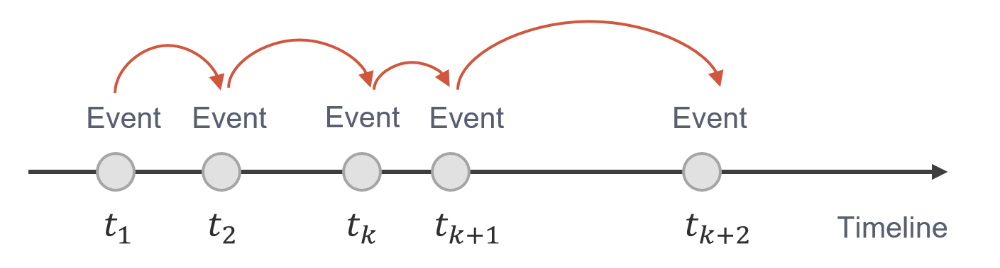

# Introduction to discrete-event simulation

*Copyright (c) 2022 Institute for Quantum Computing, Baidu Inc. All Rights Reserved.*

Discrete-event simulation (DES) is a widely-used system modeling technique in varieties of scenarios including dispatching, resource allocation and capacity planning, and has a dominant position in the simulation of computer networks [1]. Simulators such as ns-3 and OMNeT++ are all based on DES for its appealing performance on tracking and simulating the status of complex systems. Our QNET package has a fully-featured DES engine built-in to enable effective simulations for quantum networks.

In this tutorial, we will introduce the fundamental concepts and the philosophy of DES. With a concrete example and its implementation in QNET, we hope interested readers can master the usage of DES and lay a good foundation for further quantum network simulations.

## Key elements of discrete-event simulation
DES regards changes of the system state with time as a set of events happening on discrete time points. These events are processed successively along the timeline (Figure 1). In the process of simulation, changes of the system state are tied to corresponding events. In general, DES has the following characteristics:
* **Randomness**: State variables of the simulation system contain random factors.
* **Dynamicity**: The evolution of time affects state variables of the system dynamically, which may create new future events during the execution of a current event.
* **Discreteness**: The state of the system only changes when the corresponding event happens and holds still until the next event happens.



The discrete-event simulation mainly contains the following key elements:   
* **Entity**: The main object of the system to simulate, such as a user node or a physical device in a network.
* **Event**: The change of the system state at a certain time point. Each change of the system state is defined by a certain event. Events may include transmission, reception and processing of the messages between network users. Note that a specific time is required for each event.
* **Event handler**: The handler of a certain event, which may be a specific method of an entity or a protocol such as emitting a photon from the photon source.
* **Event scheduler**: A scheduler that schedules system events onto a timeline. Events are pushed into a future event list for global management. At a certain time point, events with higher priorities will be arranged to the front.
* **Simulation environment**: The whole simulation environment with a built-in virtual timeline. The simulation moves forwards by popping events from the future event list and executing them. The simulation time leaps at the discrete time points simultaneously where the events take place. The simulation terminates when all events in the list are handled or the specified end time is reached.
     
We develop a fully-featured discrete-event simulation engine in QNET. One may create an entity instance by instantiating class `Entity` and define the specific behaviors of an event by class `EventHandler`. An event is defined with its triggered time and priority in class `Event`, and scheduled by a `Scheduler`. The management and operation of the whole simulation environment are accomplished by class `DESEnv`.

| Key elements of DES | DES engine in QNET | Descriptions |
|:-----:|:-----:|:-----:|
| Entity | ``Entity`` | Entities to simulate |
| Event | ``Event`` |Events happened at certain time points |
| Event handler | ``EventHandler`` | Behaviors of certain events |
| Event scheduler | `Scheduler` | Scheduler that manages the events |
| Simulation environment | ``DESEnv`` | Drive the simulation and collect data |   

Next, we will introduce the working mechanism of discrete-event simulation by a commonly-used queuing model and demonstrate its implementation in QNET.

## A simple example: Queuing model

Consider the following queuing scenario at a service counter. Suppose that there is only one clerk at the counter in service. It takes 30 seconds for him to serve a customer and 5 more seconds to prepare for the next one. Customers queue in a line with the first-come-first-serve convention. A customer will get served if he is the only one in the queue and the clerk is idle. Otherwise, he must wait for service. We set the counter to open at a time 0 and a new customer comes in every 20 seconds. What we care about the most in this scenario is the average waiting time for each customer to get served in the working hours of the counter (e.g. an hour). We will show how to model this queuing system and get the result with DES in QNET.

First, we need to import necessary modules from `qcompute_qnet.core`.


```python
from qcompute_qnet.core.des import DESEnv, EventHandler, Entity
```

Then we define a class ``Customer`` with attributes of its service number and arrival time to simulate the role of a customer.


```python
class Customer:

    def __init__(self, service_no, arrival_time):
        self.service_no = service_no  # service number of the customer
        self.arrival_time = arrival_time  # arrival time of the customer
```

Then we define a class `ServiceCounter` to model the service counter. It is defined to inherit the class `Entity` to utilize its built-in scheduler.


```python
class ServiceCounter(Entity):

    def __init__(self, name, env=None):
        super().__init__(name, env)
        self.status = 0  # status of the clerk, 0 for idle and 1 for busy
        self.service_no = 1  # current service number
        self.queue = []  # queue of the customers
        self.waiting_time = []  # records of the waiting time

    def init(self):
        # The first customer arrives
        self.scheduler.schedule_now(EventHandler(self, "customer_arrive"))
```

There are several key operations of the service counter: 1. Customers arrive and join the queue; 2. The clerk begins a service; 3. The clerk finishes the service. These operations are modelled as three methods of the `ServiceCounter` class respectively.

### Customers arrive and join the queue

Firstly, we instantiate a `Customer` instance with the current service number and the arrival time. The current simulation time can be obtained via the `now` method of the simulation environment. Then we add the customer to the queue. If the customer is the first one in the queue and the clerk is idle, he can get served at once. Note that all behaviors that change the state of system correspond to the events in the discrete-event simulation. Thus, instead of directly calling the `begin_service` method (to define later) to simulate the service, we should schedule an event at the current time via the scheduler and set the handler method as `begin_service`. Note that we do not need to create an event manually when scheduling an event but only need to set the triggered time and its handling method via `schedule_now` or `schedule_after` method. Similarly, the event of the next customer's arrival after 20 seconds can be scheduled by the scheduler with the arrival time being 20 seconds later and the handling method being `customer_arrive`.


```python
def customer_arrive(self):
    # Create a customer and append him to the queue, record the service number and arrival time
    self.queue.append(Customer(self.service_no, self.env.now))
    self.env.logger.debug(f"Customer {self.service_no} arrives at {self.env.now}")
    # If the current customer is the first one in the queue and the clerk is idle, begin service
    if len(self.queue) == 1 and self.status == 0:
        self.scheduler.schedule_now(EventHandler(self, "begin_service"))
    self.service_no += 1
    # Schedule the arrival of next customer after a time delay 20
    self.scheduler.schedule_after(20, EventHandler(self, "customer_arrive"))
```

### The clerk begins service

The clerk will change his status to busy if there are customers in the queue. Then the first customer in the queue will get served. After that, the scheduler is used to schedule an event `end_service` with necessary parameters after 30 seconds for ending the service.


```python
def begin_service(self):
    # If the queue is not empty, the clerk begins service for the customers
    if len(self.queue) >= 1:
        # Set the working status as 1 (busy)
        self.status = 1
        # Call the first customer in the queue
        customer = self.queue.pop(0)
        self.env.logger.debug(f"Customer {customer.service_no} served at {self.env.now}")
        # Calculate the waiting time of the customer
        self.waiting_time.append(self.env.now - customer.arrival_time)
        # Schedule the end of the service after a time delay 30
        self.scheduler.schedule_after(30, EventHandler(self, "end_service", [customer]))
    # Else, hold the current status
    else:
        pass
```

### The clerk ends service
The clerk changes his status to idle when finishing the service. Then he needs 5 more seconds to prepare for the service of the next customer. This is realized by scheduling an event that happens 5 seconds after the end of the previous service with `begin_service` as its handling method.


```python
def end_service(self, customer):
    # End the service and set the status as 0 (idle)
    self.status = 0
    self.env.logger.debug(f"Customer {customer.service_no} leaves at {self.env.now}")
    # Schedule a service for the next customer after a time delay 5
    self.scheduler.schedule_after(5, EventHandler(self, "begin_service"))
```

So far we have finished the modeling of `Customer` and `ServiceCounter`. Now we are ready to run the simulation.

### Run the simulation

For any simulation, we need to create a DES simulation environment `DESEnv` first and set it to default so that all the entities will be automatically attached to it. After creating a simulation environment, we will instantiate a `ServiceCounter` instance and call the `init` method of `DESEnv` to initialize the environment. The whole simulation is launched by the `run` method of `DESEnv`, which takes a parameter `end_time` to control the length of simulation time. We set it to 3600 seconds in this case (Note that the time we set here is not the real CPU time but the simulation time. The built-in time unit of QNET is picosecond, but it won't affect the result of this case). The `run` method also allows to output a log file by setting the parameter `logging=True`, which is set to be `False` by default. Note that we repeatedly use the `logger` of the simulation environment to record important information during the simulation when modeling `ServiceCounter`. Thus, it is necessary to set the parameter `logging=True` when launching the simulation to access the crucial information recorded. Now we have finished the simulation of the queuing model and can therefore output the data we want on the terminal.


```python
# Create a simulation environment and set it to default
env = DESEnv("Queuing Model Simulation", default=True)

# Create an instance of service counter
counter = ServiceCounter("Counter")

# Initialize the simulation environment
env.init()
# Run the simulation with an end time and turn on the logging
env.run(end_time=3600, logging=True)

# Calculate and print the average waiting time
print("The number of served customers is", len(counter.waiting_time))
print("Average waiting time is:", sum(counter.waiting_time) / len(counter.waiting_time))
```

## From queuing model to network simulation

By the above example, we hope that readers can have a basic understanding of the discrete-event simulation and the usage of the DES engine in QNET. Actually, any discrete-event simulation process resembles the above queuing model. We need to first create entities to simulate such as users, repeaters and certain devices for data transmission or processing in a network, etc., and define their behaviors. All behaviors that change the state of the system are triggered by corresponding events. What we need to do is to find the scheduler in entities or protocols to schedule the events. For example, consider the scenario that node A sends a message to node B in a network. What we need to do is to schedule an event and specify its handling method as node B receiving the message. The delay of this event is the time that the message travels from node A to node B (this may be obtained from the evaluation of network parameters such as channel length). We provide some frequently-used entity templates in QNET. Users can directly use these models or customize their own models by inheriting them. Once a model is built, one can create a simulation environment and launch the simulation.

---
## References
[1] Wehrle, Klaus, et al. "Modeling and Tools for Network Simulation." [Springer-Verlag Berlin Heidelberg (2010).](https://link.springer.com/book/10.1007/978-3-642-12331-3)
