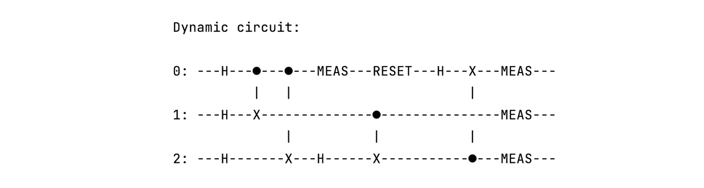
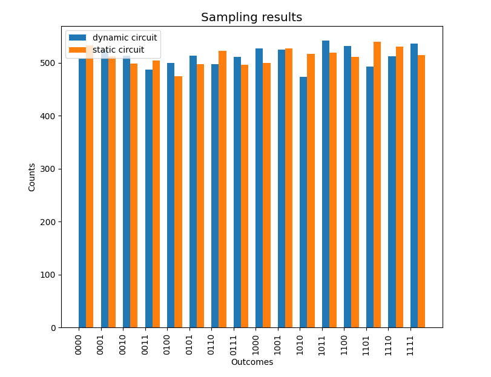
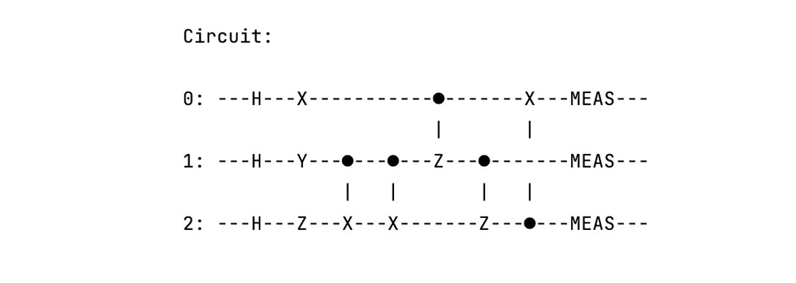
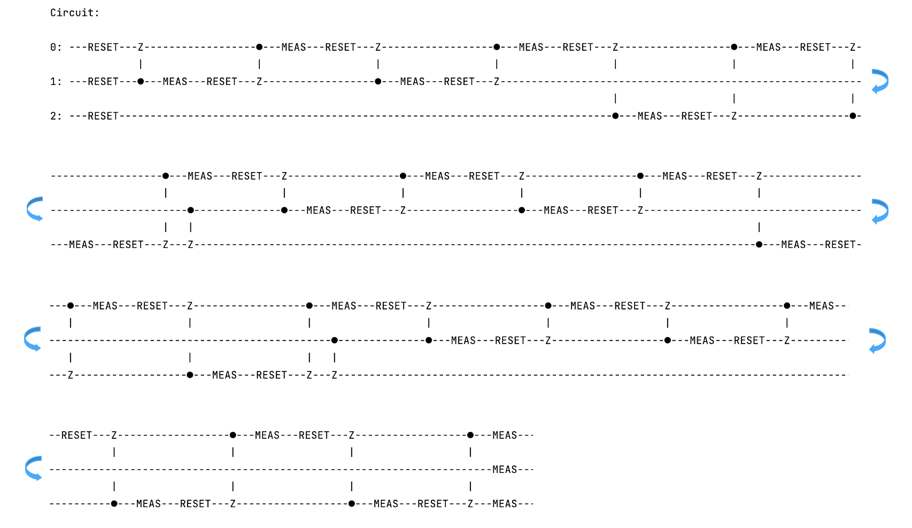

# Dynamic quantum circuit

*Copyright (c) 2022 Institute for Quantum Computing, Baidu Inc. All Rights Reserved.*

## Overview

Currently, the mainstream implementation of quantum computing is based on the static quantum circuit model. In static quantum circuits, all measurements are performed at the end of the circuit. In recent years, however, dynamic quantum circuits with mid-circuit measurements and reset operations are attracting an increasing amount of industrial interest due to the rapid advancements in hardware [[1]](#References). Using dynamic quantum circuits, we can perform measurements on a subset of qubits during the execution of the circuit. After these measurements, we can also reset the measured qubits to the ground state and continue to use them in subsequent computations.

Dynamic quantum circuits have two main advantages over static quantum circuits. First, by introducing mid-circuit measurements, dynamic quantum circuits can effectively incorporate real-time classical computation into quantum computation, thereby increasing the variety of computational tasks that can be achieved through quantum circuit model. Additionally, since the reset qubits can be used in subsequent computation process, using dynamic circuits can significantly reduce the circuit width (i.e., the number of qubits required) of static circuits when implementing the same quantum algorithm and hardly affect the computational power theoretically. Given these advantages, dynamic circuits are expected to play an important role in the development of numerous quantum algorithms and applications (such as quantum error correction and quantum network protocols) in the future. Moreover, dynamic circuits can also serve as an effective circuit optimization scheme to reduce the circuit width.

In addition to the quantum circuit model, quantum computation can also be realized through the Measurement-Based Quantum Computation (MBQC) model. In the previous tutorial, we introduced the one-to-one correspondence between the MBQC model and the quantum circuit model, and the MBQC equivalent of a quantum circuit is called the measurement pattern of the circuit. Similarly, in Blind Quantum Computation (BQC), a quantum circuit can also correspond to a measurement pattern with a specific brickwork structure, called the brickwork pattern of the circuit. For more details about blind quantum computation, interested users can refer to the tutorial on [Quantum Leaf: Blind Quantum Computation](https://quantum-hub.baidu.com/bqc/tutorial-bqc).

In particular, the current version of QNET supports the implementation of dynamic quantum circuits and related functions. Users can build dynamic quantum circuits and run simulations of these circuits with QNET's built-in backends. Besides, QNET also allows for the transpilation between quantum circuits and the two measurement patterns mentioned above. In this tutorial, we will introduce and demonstrate several main functions as follows:

1. Dynamic quantum circuit simulation,
2. Compiling dynamic quantum circuits into static quantum circuits,
3. Reducing quantum circuit width through dynamic quantum circuits,
4. Reducing quantum circuit depth through quantum gates merging,
5. Transpiling static quantum circuits into measurement patterns and brickwork patterns,
6. Transpiling measurement patterns and brickwork patterns into dynamic quantum circuits.

## Dynamic quantum circuit

In this section, we will introduce some functionalities related to dynamic quantum circuits and its realization in QNET.

### 1. Dynamic quantum circuit simulation

QNET supports dynamic quantum circuit simulation. Users are allowed to construct dynamic quantum circuits according to their needs and run simulations with QNET's built-in backends. Next, we will demonstrate how to run dynamic quantum circuit simulation through a simple example.

```python
from Extensions.QuantumNetwork.qcompute_qnet.quantum.circuit import Circuit
from Extensions.QuantumNetwork.qcompute_qnet.quantum.backends import Backend

# Create a quantum circuit
cir = Circuit("Dynamic circuit")

# Quantum state evolution
cir.h(0)
cir.h(1)
cir.h(2)
cir.cnot([0, 1])
cir.cnot([0, 2])

# Mid-circuit measurement on qubit 0
cir.measure(0, mid='a')

# Reset the measured qubit
cir.reset(0)

# Quantum state evolution
cir.h(0)
cir.h(2)
cir.cnot([1, 2])
cir.cnot([2, 0])

# Measure all qubits at the end of the circuit
cir.measure(0, mid='b')
cir.measure(1, mid='c')
cir.measure(2, mid='d')

# Set 'output_ids' for the final sampling results
cir.output_ids = ['a', 'b', 'c', 'd']

# Print dynamic quantum circuit
cir.print_circuit()

# Run simulation and print results
results = cir.run(shots=1024, backend=Backend.QNET.StateVector)
print(f"\nCircuit results:\n", results)
```

The dynamic quantum circuit and its sampling results are shown below:



```shell
Circuit results:
 {'backend': 'StateVector', 'circuit_name': 'Dynamic circuit', 'shots': 1024, 'counts': {'0000': 133, '0011': 114, '0100': 134, '0111': 133, '1000': 117, '1011': 134, '1100': 123, '1111': 136}}
```

In the above example, we create a dynamic quantum circuit for the simulation. Note that for each measurement in the circuit, a `mid` should be given as the identifier of a certain measurement. (It is recommended to use a string as its value). If it is not specified, QNET will automatically assign a `mid` for the measurement in the format of a tuple `(qubit, measurement_number)`, where `qubit` indicates the measured qubit, and `measurement_number` represents the number of measurements performed on the current qubit. In addition, if users wish to obtain results of several specified measurements (including mid-circuit measurements), they can set the `output_ids` attribute of the `Circuit` class. The `output_ids` is an ordered list of `mid` which corresponds to the desired measurement outcomes. If `outpud_ids` is not specified, the sampling results of the last measurement on each qubit will be output by default.

### 2. Compiling dynamic quantum circuits into static quantum circuits

In QNET, we also provide the compilation from a dynamic quantum circuit into an equivalent static quantum circuit, which is implemented by the `to_static` method of the `Circuit` class. For each reset operation in the input dynamic circuit, a new qubit register is assigned, and all quantum operations after the reset operation are moved to the new qubit. Besides, all measurement operations in the circuit are deferred to the end of the circuit. In this way, a dynamic quantum circuit can be transpiled into a static quantum circuit. Here is a specific example:

```python
from Extensions.QuantumNetwork.qcompute_qnet.quantum.circuit import Circuit
from Extensions.QuantumNetwork.qcompute_qnet.quantum.backends import Backend
from Extensions.QuantumNetwork.qcompute_qnet.quantum.utils import plot_results

# Create a quantum circuit
cir = Circuit()

# Quantum state evolution
cir.h(0)
cir.h(1)
cir.h(2)
cir.cnot([0, 1])

# Mid-circuit measurement on qubit 1
cir.measure(1, mid='a')

# Classically controlled operation on qubit 2 based on the measurement outcome of 'a'
cir.x(2, condition='a')

# Reset qubit 1
cir.reset(1)

# Quantum state evolution and measurements
cir.h(1)
cir.measure(2, mid='b')
cir.z(1, condition='b')
cir.cz([1, 0])
cir.measure(0, mid='c')
cir.measure(1, mid='d')

# Set 'output_ids' for the final sampling results
cir.output_ids = ['a', 'b', 'c', 'd']

# Print the dynamic quantum circuit
cir.print_circuit()
# Run simulation with QNET StateVector backend
counts1 = cir.run(shots=8192, backend=Backend.QNET.StateVector)['counts']

# Compile the dynamic circuit into a static circuit
cir.to_static()
cir.print_circuit()

# Run simulation for the compiled static quantum circuit
counts2 = cir.run(shots=8192, backend=Backend.QNET.StateVector)['counts']

# Visualization of simulation results
plot_results([counts1, counts2], ['dynamic circuit', 'static circuit'])
```

The dynamic quantum circuit and the compiled static quantum circuit are shown in the following figures:


By comparing Figure 2 and Figure 3, we can find that the `to_static` method assigns a new qubit 3 for the reset operation on qubit 1 and moves all operations after the reset operation on qubit 1 to qubit 3. According to the deferred measurement principle, it also converts all classically conditioned operations into controlled quantum gates and moves all measurements to the end of the circuit. A comparison of simulation results of the circuits in Figure 2 and Figure 3 is shown as follows:



It can be seen that the simulation results of the compiled static circuit and the dynamic circuit are basically consistent.

### 3. Reducing circuit width through dynamic quantum circuits

As mentioned in the overview, dynamic quantum circuits can be used as an optimization scheme to reduce the circuit width of static quantum circuits. For this purpose, we provide `is_reducible` method in the `Circuit` class to check whether the current circuit width can be reduced through compilation. Additionally, users can compile the static quantum circuit into an equivalent dynamic quantum circuit by calling the `reduce` method to reduce the circuit width. Here is an example of how to use these two methods:

```python
from Extensions.QuantumNetwork.qcompute_qnet.quantum.circuit import Circuit

# Create a quantum circuit
cir = Circuit()

# Quantum state evolution
cir.h(0)
cir.h(1)
cir.h(2)
cir.h(3)
cir.h(4)
cir.h(5)
cir.cnot([0, 1])
cir.cnot([1, 2])
cir.cnot([2, 3])
cir.cnot([3, 4])
cir.cnot([4, 5])
cir.cnot([5, 0])

# Set 'mid' for the measurement to obtain corresponding outcomes
cir.measure(0, mid='a')
cir.measure(1, mid='b')
cir.measure(2, mid='c')
cir.measure(3, mid='d')
cir.measure(4, mid='e')
cir.measure(5, mid='f')
# Set 'output_ids' for the final sampling results
cir.output_ids = ['a', 'b', 'c', 'd', 'e', 'f']

# Print the static quantum circuit
cir.print_circuit()

# Check whether the current circuit width can be reduced
if cir.is_reducible():
    # Reduce the circuit by 'minimum_remaining_values' algorithm
    cir.reduce("minimum_remaining_values")

# Print the dynamic quantum circuit
cir.print_circuit()
```

Currently, there are three supported compilation algorithms in the `reduce` method: `"minimum_remaining_values"` (default)、`"row_order_first"` and `"brute_force"`. The main idea of these algorithms is similar. That is, to rearrange the execution order of operations in the input quantum circuit without affecting the final sampling results of the circuit, so that all operations on a certain qubit are executed first, then that qubit is reset for recycle. After that, this qubit can be reused to execute the operations on another qubit, thereby reducing the circuit width. More specifically, for each qubit in the input circuit, the `"minimum_remaining_values"` algorithm first calculates the number of its "qubit candidates", which refers to other qubits whose operations can continue to be executed on that qubit after it is reset. Then, the algorithm prioritizes operations on the qubit with least non-zero "qubit candidates" and recycle it. The `"row_order_first"` algorithm prioritizes all operations on the qubit with the smallest qubit index (i.e. row order), then reset it for recycle. The `"brute_force"` will search for all feasible solutions of the circuit transpilation by brute force and select the optimal solution (minimum circuit width) from them. Note that both `"minimun_remaining_values"` and `"row_order_first"` are heuristic algorithms and are more suitable for transpiling larger quantum circuits compared with `"brute_force"`. In practice, users can try different transpilation algorithms to get better results. 

The static quantum circuit and the compiled dynamic quantum circuit generated by the above code are shown in the following figures:


It can be shown that by compiling the circuit using `"minimum_remaining_values"` algorithm, the circuit width is reduced by 3. Users can also check the equivalence of these two circuits by comparing their sampling results. In particular, the [Google Random Circuit Sampling (GRCS) benchmark circuits](https://github.com/sboixo/GRCS) can also be simplified by the `reduce` method. Interested readers can try it out on their own.

### 4. Reducing quantum circuit depth through quantum gate merging

The `reduce` method introduced above can be used to reduce the circuit width while ensuring the sampling results unaffected. In addition, QNET provides `simplify` method in the `Circuit` class for circuit simplification. It merges all sequential single or double qubit gates acting on the same qubits into equivalent quantum gates. As a result, the circuit depth of the quantum circuit can be reduced without affecting its functionality. Here is an example:

```python
from Extensions.QuantumNetwork.qcompute_qnet.quantum.circuit import Circuit
from Extensions.QuantumNetwork.qcompute_qnet.quantum.backends import Backend
from Extensions.QuantumNetwork.qcompute_qnet.quantum.utils import plot_results

# Create a quantum circuit
cir = Circuit()

# Quantum state evolution
cir.h(0)
cir.x(0)
cir.h(1)
cir.y(1)
cir.h(2)
cir.z(2)
cir.cnot([1, 2])
cir.cnot([1, 2])
cir.cz([0, 1])
cir.cz([1, 2])
cir.cnot([2, 0])

# Measure all qubits
cir.measure()

# Print the original quantum circuit
cir.print_circuit()
# Run simulation with QNET StateVector backend
counts1 = cir.run(shots=4096, backend=Backend.QNET.StateVector)['counts']

# Simplify the quantum circuit to reduce the circuit depth
cir.simplify()

# Print the simplified quantum circuit
cir.print_circuit()
# Run simulation for the simplified circuit
counts2 = cir.run(shots=4096, backend=Backend.QNET.StateVector)['counts']

# Visualize the simulation results
plot_results([counts1, counts2], ['original', 'simplified'])
```

The original quantum circuit and the simplified circuit are shown as follows:




Here is the comparison of the sampling results before and after calling the `simplify` method:


From the comparison of Figure 7 and Figure 8, the `simplify` method merges the first two single-qubit gates on each qubit into an equivalent U gate. It also merges the two consecutive CNOT gates on qubit 1 and qubit 2, resulting in a reduction of the circuit depth. According to Figure 9, the sampling results of the two circuits are basically consistent. Users can also print the circuit instruction list by calling the `print_list` method in the `Circuit` class to check the parameters of the equivalent quantum gates.

## Measurement pattern

In this section, we will introduce two methods related to the measurement pattern and the brickwork patten in QNET.

### 1. Transpiling static quantum circuits into measurement patterns and brickwork patterns

As mentioned in the overview, we allow users to transpile a static quantum circuit into its corresponding measurement pattern and brickwork pattern by calling `to_pattern` and `to_brickwork_pattern` methods of the `Circuit` class, respectively. Both methods return an instance of the `Pattern` class. To facilitate users' understanding, we will illustrate these two methods through an example of a 2-qubit Grover algorithm circuit (corresponding to the solution $| 11 \rangle$).

```python
from Extensions.QuantumNetwork.qcompute_qnet.quantum.circuit import Circuit

# Create a quantum circuit
cir = Circuit()

# Quantum gates for the 2-qubit Grover algorithm
cir.h(0)
cir.h(1)
cir.cz([0, 1])
cir.h(0)
cir.h(1)
cir.z(0)
cir.z(1)
cir.cz([0, 1])
cir.h(0)
cir.h(1)

# Set 'output_ids' for the final sampling results
cir.measure(0, mid='a')
cir.measure(1, mid='b')
cir.output_ids = ['a', 'b']

# Print the static quantum circuit
cir.print_circuit()
```

The circuit of the 2-qubit Grover algorithm is shown in the following figure:


By calling the `to_pattern` method, we can transpile the above circuit into its corresponding measurement pattern in MBQC, the code implementaton is as follows:

```python
# Transpile the static quantum circuit into its corresponding measurement pattern
pattern = cir.to_pattern()

# Print the command list of the measurement pattern
pattern.print()
```

The results are as follows (some commands in the list are hidden for simplicity):

```shell
------------------------------------------------------------
                    Current Command List                    
------------------------------------------------------------
Command:        E
which_qubit:    [(0, 0), (0, 0.25)]
-----------------------------------------------------------

                            ...

-----------------------------------------------------------
Command:        E
which_qubit:    [(1, 2.75), (1, 3)]
-----------------------------------------------------------
Command:        M
which_qubit:    (0, 0)
plane:          XY
angle:          -1.5707963267948966
domain_s:       []
domain_t:       []
-----------------------------------------------------------

                            ...

-----------------------------------------------------------
Command:        M
which_qubit:    (1, 3)
plane:          YZ
angle:          0
domain_s:       []
domain_t:       [(1, 2.75)]
-----------------------------------------------------------
```

From the results, the corresponding measurement pattern contains 26 vertices (${(0, 0), (0, 0.25), ..., (1, 3)}$), i.e. 26 qubits are required to implement the computation of this measurement pattern.

Similarly, by calling the `to_brickwork_pattern` method, we can also transpile the circuit into its corresponding brickwork pattern, the code implementation and the output is shown below (some commands in the list are hidden for simplicity):

```python
# Transpile the static quantum circuit into its corresponding brickwork pattern
brickwork_pattern = cir.to_brickwork_pattern()

# Print the command list of the brickwork pattern
brickwork_pattern.print()
```

```shell
------------------------------------------------------------
                    Current Command List                    
------------------------------------------------------------
Command:        E
which_qubit:    [(0, 0), (0, 1)]
-----------------------------------------------------------

                            ...

-----------------------------------------------------------
Command:        E
which_qubit:    [(0, 36), (1, 36)]
-----------------------------------------------------------
Command:        M
which_qubit:    (0, 0)
plane:          XY
angle:          -1.5707963267948966
domain_s:       []
domain_t:       []
-----------------------------------------------------------

                            ...

-----------------------------------------------------------
Command:        M
which_qubit:    (1, 36)
plane:          YZ
angle:          0
domain_s:       []
domain_t:       [(1, 35)]
-----------------------------------------------------------
```

### 2. Transpiling measurement patterns and brickwork patterns into dynamic quantum circuits

In the previous section, we transpile a static quantum circuit that implements 2-qubit Grover algorithm into its corresponding measurement pattern of MBQC and brickwork pattern of blind quantum computation using the `to_pattern` and `to_brickwork_pattern` methods. Moreover, these measurement patterns can also be transpiled into dynamic quantum circuits, which can be realized using the `to_dynamic_circuit` method of the `Pattern` class. In the following example, we will show how to transpile the measurement pattern and brickwork pattern obtained before into dynamic quantum circuits:

```python
# Transpile the measurement pattern into an equivalent dynamic quantum circuit
pat_dyn_cir = pattern.to_dynamic_circuit()

# Print the transpiled dynamic quantum circuit
pat_dyn_cir.print_circuit()
```

The equivalent dynamic quantum circuit of the measurement pattern is shown in the following figure:



By transpiling the measurement pattern into an equivalent dynamic quantum circuit, the number of qubits required to implement the same computation task is reduced from 26 to 3 (the transpiled dynamic circuit in Figure 11 is presented in separate rows considering its large circuit depth). Besides, the transpiled dynamic circuit only contains three types of operations: reset operations, measurements (corresponding to measurement commands on a vertex in MBQC) and CZ gates (corresponding to entanglement commands between two vertices in MBQC).

Similarly, the brickwork patten in part 1 can also be complied into an equivalent dynamic quantum circuit as follows. Interested readers are welcomed to try these functions.

```python
# Transpile the brickwork pattern into an equivalent dynamic quantum circuit
bw_pat_dyn_cir = brickwork_pattern.to_dynamic_circuit()

# Print the dynamic quantum circuit
bw_pat_dyn_cir.print_circuit()
```

## Conclusion

By introducing mid-circuit measurements and reset operations, dynamic quantum circuits enable an effective combination of classical and quantum computations. This feature can enrich the variety of computation tasks that can be accomplished through quantum circuit models. Besides, for certain quantum algorithms, dynamic circuits can effectively reduce the number of qubits required, making it possible to simulate these algorithms with classical computers or run them on real quantum system. Moreover, dynamic quantum circuits provide a new optimization approach for circuit transpilation. It is foreseeable that dynamic circuits will have great research significance and broad application prospects in the future.

---

## References

[1] A. D. Córcoles, Maika Takita, Ken Inoue, Scott Lekuch, Zlatko K. Minev, Jerry M. Chow, and Jay M. Gambetta, "Exploiting dynamic quantum circuits in a quantum algorithm with superconducting qubits", [Physical Review Letters **127**, 100501](https://doi.org/10.1103/PhysRevLett.127.100501). 
