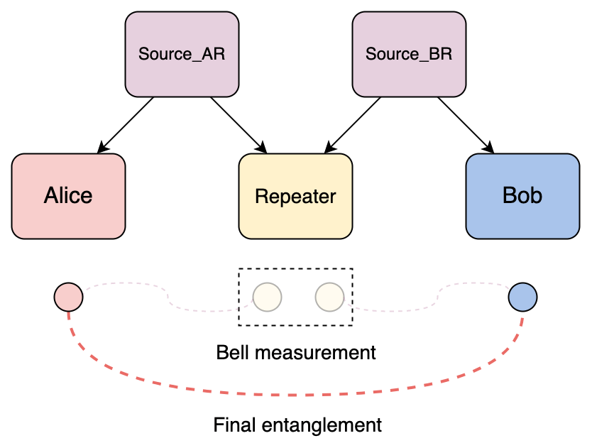

# Quantum entanglement swapping

*Copyright (c) 2022 Institute for Quantum Computing, Baidu Inc. All Rights Reserved.*

In the tutorial of quantum teleportation, we have introduced how to realize the long-distance transmission of an unknown quantum state using quantum teleportation protocol. In this tutorial, we will introduce another quantum protocol that is also widely applied in quantum networks. That is, the quantum entanglement swapping protocol.

First, we will introduce the background of the quantum entanglement swapping protocol. Then, we will describe the process of the protocol and its code implementation by QNET. Finally, we will consider a simple quantum network scenario for simulation and verification.

## 1. Background

Quantum entanglement is an important communication resource in quantum networks. By sharing the quantum entanglement, the communication parties can implement a variety of protocols such as quantum teleportation protocol. For two nodes that are directly connected in network, one can generate an entanglement pair and send one of the particles to the other to share the entanglement resource. For two nodes with no direct quantum channels, the entanglement can be generated by a third party and distributed to both parties through direct quantum channels. However, photons will be absorbed by the fiber with a certain probability during the transmission. And the probability of signal loss will increase exponentially with the distance. This has limited the transmission distance of the photons in a fiber channel. To extend the distance of the entanglement between two communication parties, one can use the quantum entanglement swapping protocol. The principle of the quantum entanglement swapping protocol is to convert multiple short-distance entanglement pairs into one long-distance entanglement pair [1].

## 2. Protocol

Let's consider a simple scenario in quantum networks: Alice wants to share an entanglement pair with Bob, but there is no direct channels between them. Thus, a quantum repeater is needed to help with the entanglement swapping to establish the long-distance entanglement between Alice and Bob (See Figure 1).

The process of the protocol is as follows:

1. The upstream node Alice sends an entanglement swapping request to the repeater node, specifying the downstream node she wants to share the entanglement as Bob;
2. Once receiving an entanglement swapping request, the repeater node sends entanglement requests to the entanglement sources, specifying the nodes he wants to share an entanglement with;
3. Once receiving an entanglement request, the entanglement source generates an entanglement pair in Bell state $| \Phi^+ \rangle = \tfrac{1}{\sqrt{2}} (|00 \rangle + |11 \rangle)$ and sends the particles to the repeater node and his upstream (downstream) node respectively;
4. Both the communication parties store the qubits in their local quantum registers when receiving them from the entanglement source;
5. The repeater node performs Bell measurement on his qubits if he receives both the qubits from two entanglement sources. Then he sends his measurement outcome to Bob via the classical channel;
6. On receiving both the qubit from the source and the classical measurement outcome from the repeater, Bob performs state correction on his qubit according to the measurement outcome to acquire the Bell state $ |\Phi^+ \rangle_{AB} $ shared with Alice.

**Note**: To verify the correctness of the protocol, we suppose that Alice and Bob both measure their qubits after the entanglement swapping. By the measurement results, we can check the correctness of the protocol.



Next, we will simulate the quantum entanglement swapping protocol using QNET.

## 3. Protocol implementation

In the QPU module, we provide ``EntanglementSwapping`` class for the simulation of the protocol. Four sub-protocols are defined to describe the behaviors of the four roles in the protocol: the entanglement source that generates and distributes the entanglement pairs (``Source``), the upstream node that sends the entanglement swapping request (``UpstreamNode``), the downstream node that corrects the state (``DownstreamNode``), the repeater node that performs entanglement swapping (``Repeater``).

```python
class EntanglementSwapping(Protocol):

    def __init__(self, name=None):
        super().__init__(name)
        self.role = None

    class Message(ClassicalMessage):

        def __init__(self, src: "Node", dst: "Node", protocol: type, data: Dict):
            super().__init__(src, dst, protocol, data)

        @unique
        class Type(Enum):

            SWAP_REQUEST = "Swapping request"
            ENT_REQUEST = "Entanglement request"
            OUTCOME_FROM_REPEATER = "Measurement outcome from the repeater"

    def start(self, **kwargs) -> None:
        role = kwargs['role']
        # Instantiate a sub-protocol by its role
        self.role = getattr(EntanglementSwapping, role)(self)
        # Start the sub-protocol
        self.role.start(**kwargs)

    def receive_classical_msg(self, msg: "ClassicalMessage", **kwargs) -> None:
        # Call its sub-protocol to receive the classical message
        self.role.receive_classical_msg(msg)

    def receive_quantum_msg(self, msg: "QuantumMsg", **kwargs) -> None:
        # Store the received qubit
        self.node.qreg.store_qubit(msg.data, kwargs['src'])
        # Call its sub-protocol for additional operations
        self.role.receive_quantum_msg()
```

### 1. Entanglement source (``Source``)

The entanglement source is responsible for entanglement generation and distribution. When receiving an ``ENT_REQUEST`` message from the repeater node, the entanglement source will generate an entanglement pair in Bell state $| \Phi^+ \rangle = \tfrac{1}{\sqrt{2}} (|00 \rangle + |11 \rangle)$ locally and respectively send the two qubits to the repeater node and its upstream (downstream) node.

```python
class EntanglementSwapping(Protocol):
    ...
    class Source(SubProtocol):

        def __init__(self, super_protocol: Protocol):
            super().__init__(super_protocol)

        def start(self, **kwargs) -> None:
            pass

        def receive_classical_msg(self, msg: "ClassicalMessage") -> None:
            if msg.data['type'] == EntanglementSwapping.Message.Type.ENT_REQUEST:
                # Generate an entanglement pair locally
                self.node.qreg.h(0)
                self.node.qreg.cnot([0, 1])

                # Distribute the qubits to the repeater node and its upstream (downstream) node
                # Send the qubit with address 0 to the first node
                self.node.send_quantum_msg(dst=msg.src, qreg_address=0)
                # Send the qubit with address 1 to the first node
                self.node.send_quantum_msg(dst=msg.data['peer'], qreg_address=1)
```

### 2. Upstream node (``UpstreamNode``)

Upstream node is the node that requests for entanglement swapping. As an upstream node, Alice will send a ``SWAP_REQUEST`` message to the repeater node and request for entanglement swapping.

To confirm that we do realize the entanglement between Alice and Bob, we suppose that Alice will measure her qubit on receiving it from the entanglement source. The measurement outcome can later be compared with that of Bob's to verify the correctness of the protocol.

```python
class EntanglementSwapping(Protocol):
    ...
    class UpstreamNode(SubProtocol):

        def __init__(self, super_protocol: Protocol):
            super().__init__(super_protocol)
            self.repeater = None
            self.peer = None

        def start(self, **kwargs) -> None:
            # Node to share the entanglement
            self.peer = kwargs['peer']
            # Repeater node to perform the entanglement swapping
            self.repeater = kwargs['repeater']
            # Send an entanglement swapping request to the repeater node
            self.request_swapping()

        def request_swapping(self) -> None:
            # Generate an entanglement swapping request
            swap_request_msg = EntanglementSwapping.Message(
                src=self.node, dst=self.repeater, protocol=EntanglementSwapping,
                data={'type': EntanglementSwapping.Message.Type.SWAP_REQUEST, 'peer': self.peer}
            )
            # Send the entanglement swapping request to the repeater node
            self.node.send_classical_msg(dst=self.repeater, msg=swap_request_msg)

        def receive_quantum_msg(self) -> None:
            # Measure the received qubit for verification of the protocol
            self.node.qreg.measure(0)
```

### 3. Downstream node (``DownstreamNode``)

Downstream node is the node that corrects the entangled state. As a downstream node, Bob will receive the qubit from the source and the classical measurement outcome from the repeater respectively. Then Bob will perform state correction on his qubit according to the measurement outcome to acquire the Bell state $ |\Phi^+ \rangle_{AB} $ shared with Alice.

To confirm the correctness of the protocol, we suppose that Bob will measure his qubit after finishing the state correction for verification.

```python
class EntanglementSwapping(Protocol):
    ...
    class DownstreamNode(SubProtocol):

        def __init__(self, super_protocol: Protocol):
            super().__init__(super_protocol)
            self.peer = None
            self.outcome_from_repeater = None

        def start(self, **kwargs) -> None:
            self.peer = kwargs['peer']

        def receive_classical_msg(self, msg: "ClassicalMessage") -> None:
            # If the message is the measurement outcome from the repeater
            if msg.data['type'] == EntanglementSwapping.Message.Type.OUTCOME_FROM_REPEATER:
                # Save the measurement outcome from the repeater
                self.outcome_from_repeater = msg.data['outcome_from_repeater']

                # Perform corresponding operations to restore the shared entanglement when receiving a qubit from the entanglement source
                if self.node.qreg.units[0]['qubit'] is not None:
                    self.correct_state()

        def receive_quantum_msg(self) -> None:
            # Perform operations to correct the quantum state if already received the qubit from the entanglement source
            if self.outcome_from_repeater is not None:
                self.correct_state()

        def correct_state(self) -> None:
            # Perform operations to correct the initial quantum state if already received the measurement outcome from the repeater
            self.node.qreg.z(0, condition=self.outcome_from_repeater[0])
            self.node.qreg.x(0, condition=self.outcome_from_repeater[1])
            # Measure the received qubit for verification of the protocol
            self.node.qreg.measure(0)
```

### 4. Repeater (``Repeater``)

The repeater is responsible for entanglment swapping. When receiving a ``SWAP_REQUEST`` message from its upstream node Alice, he will send an ``ENT_REQUEST`` message to its upstream and downstream entanglement source respectively. When receiving the qubits from both entanglement sources, the repeater node performs Bell measurement on the qubits and sends his measurement outcome to its downstream node Bob via the classical channel.

```python
class EntanglementSwapping(Protocol):
    ...
    class Repeater(SubProtocol):

        def __init__(self, super_protocol: Protocol):
            super().__init__(super_protocol)
            self.ent_sources = None
            self.upstream_node = None
            self.downstream_node = None

        def start(self, **kwargs) -> None:
            # Related entanglement source node
            self.ent_sources = kwargs['ent_source']

        def request_entanglement(self, source: "Node", peer: "Node") -> None:
            # Generate an entanglement request message
            ent_request_msg = EntanglementSwapping.Message(
                src=self.node, dst=source, protocol=EntanglementSwapping,
                data={'type': EntanglementSwapping.Message.Type.ENT_REQUEST, 'peer': peer}
            )
            # Send the entanglement request to the entanglement source node
            self.node.send_classical_msg(dst=source, msg=ent_request_msg)

        def receive_classical_msg(self, msg: "ClassicalMessage") -> None:
            if msg.data['type'] == EntanglementSwapping.Message.Type.SWAP_REQUEST:
                # Record its upstream node and downstream node
                self.upstream_node, self.downstream_node = msg.src, msg.data['peer']
                # Request an entanglement with its upstream (downstream) node
                self.request_entanglement(self.ent_sources[0], self.upstream_node)
                self.request_entanglement(self.ent_sources[1], self.downstream_node)

        def receive_quantum_msg(self) -> None:
            if self.node.qreg.units[0]['qubit'] is not None and self.node.qreg.units[1]['qubit'] is not None:
                # Get address of the qubit received from the upstream source
                address_0 = self.node.qreg.get_address(self.ent_sources[0])
                # Get address of the qubit received from the downstream source
                address_1 = self.node.qreg.get_address(self.ent_sources[1])
                # Perform Bell measurement locally
                self.node.qreg.bsm([address_0, address_1])

                # Send the classical measurement outcome to its downstream node
                outcome_msg = EntanglementSwapping.Message(
                    src=self.node, dst=self.downstream_node, protocol=EntanglementSwapping,
                    data={'type': EntanglementSwapping.Message.Type.OUTCOME_FROM_REPEATER,
                          'outcome_from_repeater': [self.node.qreg.units[address_0]['outcome'],
                                                    self.node.qreg.units[address_1]['outcome']]
                          }
                )
                self.node.send_classical_msg(dst=self.downstream_node, msg=outcome_msg)
```

## 4. Code example

Next, we use QNET to simulate the quantum entanglement swapping protocol in a quantum network.

First, we create a simulation environment ``QuantumEnv``.

```python
from qcompute_qnet.models.qpu.env import QuantumEnv

# Create an environment for simulation
env = QuantumEnv("Repeater", default=True)
```

Then, we create the quantum nodes that correspond to the four kinds of roles in the protocol and specify the pre-installed protocol in the protocol stack of each node as ``EntanglementSwapping``. Then we configure the communication links between the nodes.

```python
from qcompute_qnet.models.qpu.node import QuantumNode
from qcompute_qnet.models.qpu.protocol import EntanglementSwapping
from qcompute_qnet.topology.link import Link

# Create nodes with quantum registers and specify their pre-installed protocols
alice = QuantumNode("Alice", qreg_size=1, protocol=EntanglementSwapping)
repeater = QuantumNode("Repeater", qreg_size=2, protocol=EntanglementSwapping)
bob = QuantumNode("Bob", qreg_size=1, protocol=EntanglementSwapping)
source_ar = QuantumNode("Source_AR", qreg_size=2, protocol=EntanglementSwapping)
source_br = QuantumNode("Source_BR", qreg_size=2, protocol=EntanglementSwapping)

# Create the communication links
link_ar = Link("Link_ar", ends=(alice, repeater), distance=1e3)
link_br = Link("Link_br", ends=(bob, repeater), distance=1e3)
link_alice_source_ar = Link("Link_alice_source_ar", ends=(alice, source_ar), distance=1e3)
link_repeater_source_ar = Link("Link_repeater_source_ar", ends=(repeater, source_ar), distance=1e3)
link_bob_source_br = Link("Link_bob_source_ar", ends=(bob, source_br), distance=1e3)
link_repeater_source_br = Link("Link_repeater_source_br", ends=(repeater, source_br), distance=1e3)
```

Then, we create a quantum network and install the configured nodes and links.

```python
from qcompute_qnet.topology.network import Network

# Create a network, install the nodes and links
network = Network("Repeater network")
network.install([alice, bob, repeater, source_ar, source_br, 
                 link_ar, link_br, link_alice_source_ar, link_repeater_source_ar, 
                 link_bob_source_br, link_repeater_source_br])
```

Now we have created the simulation environment and constructed the quantum network. Next, we can call ``start`` method to start the protocol in the protocol stack.

```python
from qcompute_qnet.quantum.backends import Backend

# Start the entanglement swapping protocol
alice.start(role="UpstreamNode", peer=bob, repeater=repeater)
bob.start(role="DownstreamNode", peer=alice)
source_ar.start(role="Source")
source_br.start(role="Source")
repeater.start(role="Repeater", ent_sources=[source_ar, source_br])

# Initialize the environment and run simulation
env.init()
results = env.run(shots=1024, backend=Backend.QCompute.LocalBaiduSim2, summary=False)
# Print the running results
print(f"\nCircuit results:\n", results)
```

The simulation result is shown as follows.


```
Colors: {'Bob': 'red', 'Alice': 'blue', 'Source_AR': 'green', 'Repeater': 'yellow', 'Source_BR': 'purple'}

Circuit results:
 {'circuit_name': 'Circuit', 'shots': 1024, 'counts': {'0000': 124, '0010': 137, '0101': 119, '0111': 122, '1000': 120, '1010': 137, '1101': 133, '1111': 132}}
```

To verify the result of the quantum entanglement swapping protocol, we can call ``reduce_result`` method of the ``Circuit`` class to the measurement results of Alice and Bob.

```python
# Check the measurement results of Alice and Bob
reduced_indices = [1, 3]
reduced_results = network.default_circuit.reduce_results(results['counts'], indices=reduced_indices)
print(f"\nMeasurement results of Alice, Bob:\n", reduced_results)
```

The running results are given below:

```
Measurement results of Alice, Bob: 
{'00': 505, '11': 519}
```

---

## References

[1] Briegel, H-J., et al. "Quantum repeaters: the role of imperfect local operations in quantum communication." [Physical Review Letters 81.26 (1998): 5932.](https://journals.aps.org/prl/abstract/10.1103/PhysRevLett.81.5932)
