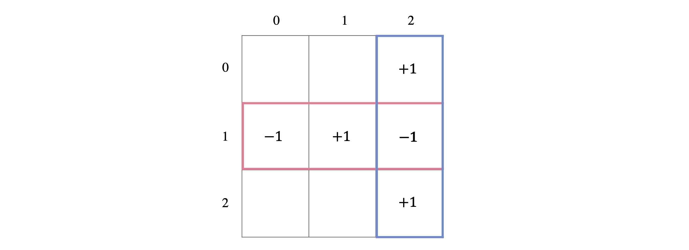
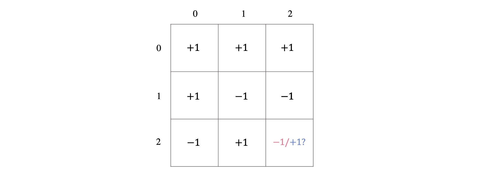
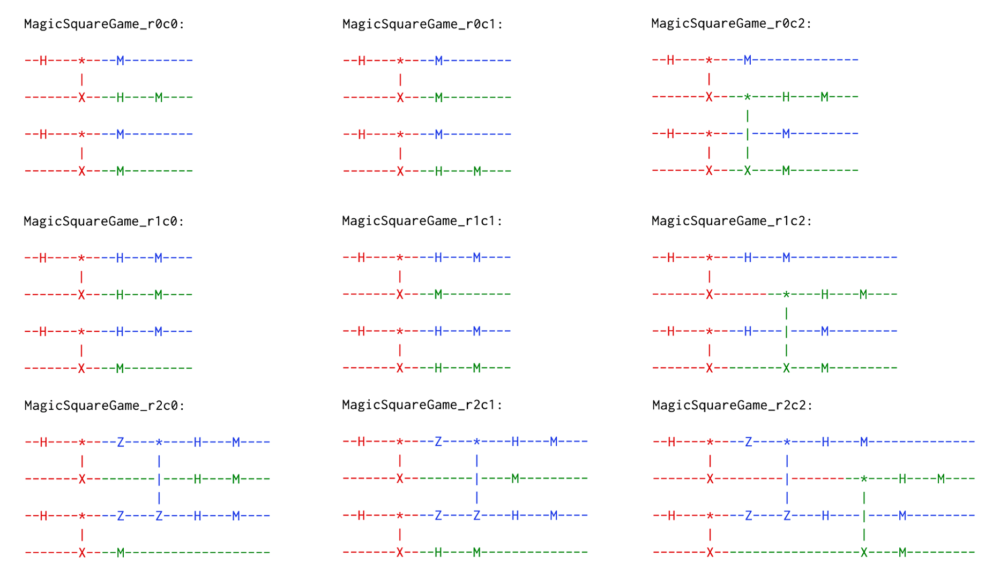

# Magic square game

*Copyright (c) 2022 Institute for Quantum Computing, Baidu Inc. All Rights Reserved.*

In the previous tutorial, we introduced the CHSH game and showed its optimal quantum strategy. By sharing an entanglement pair and a reasonable strategy, the players can acquire a higher winning probability of the game. However, the optimal strategy of this game can only achieve a winning probability of around $85\%$ according to the Tsirelson bound [1]. In this tutorial, we will introduce another interesting quantum nonlocal game, the Mermin-Peres magic square game [2, 3]. This game allows the players to use an optimal quantum strategy to win with probability $100\%$, while the winning probability of the optimal classical strategy can only reach $88.89\%$.

Next, we will first introduce the rules of the magic square game. Then, we will introduce its optimal classical strategy and optimal quantum strategy. Finally, we will simulate and verify the optimal quantum strategy of the magic square game using QNET.

## Introduction

### 1. Rules

There are three roles in the magic square game: Two players in cooperation, Alice and Bob, and one referee.

The referee keeps a $3*3$ table for the game. Players (Alice and Bob) are required to separately fill in a row and a column of the table according to the indices chosen by the referee. For each cell, they can fill with $+1$ or $-1$. Then the referee analyzes the result and judges if the players win.

The rules of the magic square game are as follows:

1. At the start of the magic square game, the referee randomly chooses two questions $x, y \in (0,1,2)$ corresponding to the indices of the row and column for the players to fill.
2. According to the questions received from the referee, Alice and Bob need to fill the $x$-th row and $y$-th column separately. Each cell of the selected row and column can be filled with $-1$ or $+1$. Then they send back their filling results to the referee.
3. When receiving the answers from Alice and Bob, the referee fills corresponding elements in his table. If the product of the elements in the row filled by Alice is $+1$, the product of the elements in the column filled by Bob is $+1$, and the elements they fill in the intersected cell of the row and column are the same, he announces that the players win; or he announces the players lose. (Figure 1 shows a possible filling scheme for the players to win the game when $x=1, y=2$.)

**Note**: The players are allowed to negotiate a proper strategy before the magic square game starts to increase their winning probability. But no communication is allowed once the game starts.



### 2. Optimal classical strategy

To maximize the winning probability, Alice and Bob can negotiate the filling schemes of each cell of the table in advance. After trying, they found that they can only confirm the values of up to 8 cells of the table. No matter what the last cell's value is, it always leads one of the players to break the rules.

One possible classical optimal strategy is shown in Figure 2. We can easily find that when $x=2, y=2$, Alice and Bob can never reach an agreement on the value of the intersected cell. If filled with $-1$, then Bob will break the rule; If filled with $+1$, the product of elements of Alice's row is not equal to $+1$ and thus break the rule. Under such a scheme, the players can only achieve the winning probability of $\frac{8}{9}$. On the other hand, we can verify that no classical strategy can make the players achieve a winning probability higher than $\frac{8}{9}$, i.e., the strategy in Figure 2 is an optimal classical strategy.



### 3. Optimal quantum strategy

Next, we will introduce the optimal quantum strategy of the magic square game, which can provide the players with the winning probability of $100\%$ by introducing two entanglement pairs.

The optimal quantum strategy of the magic square game is as follows:

1. Before the game starts, Alice and Bob need to share two EPR pairs: $|\Phi^+\rangle_{A_1B_1}=\frac{1}{\sqrt{2}}(|00\rangle+|11\rangle)$，$|\Phi^+\rangle_{A_2B_2}=\frac{1}{\sqrt{2}}(|00\rangle+|11\rangle)$, where $A_1, A_2$ and $B_1, B_2$ denote the qubits held by Alice and Bob respectively;
2. When receiving the questions from the referee, they perform corresponding operations on their qubits $A_1A_2$ ($B_1B_2$) according to the questions and make answers according to the measurement outcomes. Detailed operations and answers are shown in the table below.

| Questions| Operations of the players                                                                                 | Outcome "00" | Outcome "01"  | Outcome "10"  | Outcome "11" |
|:----------:|:----------------------------------------------------------------------------------------------------------:|:----------------:|:--------------:|:--------------:|:-------------:|
| $x=0$     | Measure the qubits in $Z$-basis                                                                           | (+1, +1, +1)    | (-1, +1, -1)  | (+1, -1, -1)  | (-1, -1, +1) |
| $x=1$     | Measure the qubits in $X$-basis                                                                           | (+1, +1, +1)    | (+1, -1, -1)  | (-1, +1, -1)  | (-1, -1, +1) |
| $x=2$     | Perform $Z_{A_1}, Z_{A_2}, CZ_{A_1, A_2}, H_{A_1}, H_{A_2}$ on the qubits, then measure them in $Z$-basis | (+1, +1, +1)    | (+1, -1, -1)  | (-1, +1, -1)  | (-1, -1, +1) |
| $y=0$     | Measure the first qubit in $X$-basis and the second one in $Z$-basis                                      | (+1, +1, -1)    | (-1, +1,  +1) | (+1, -1,  +1) | (-1, -1,-1)  |
| $y=1$     | Measure the first qubit in $Z$-basis and the second one in $X$-basis                                      | (+1, +1, -1)    | (+1, -1,  +1) | (-1, +1,  +1) | (-1, -1,-1)  |
| $y=2$     | Perform $CNOT_{B_1, B_2}, H_{B_1}$ on the qubits, then measure them in $Z$-basis                          | (+1, +1, -1)    | (-1, +1,  +1) | (+1, -1,  +1) | (-1, -1,-1)  |

Proof of the optimality of this strategy can be found in Ref. [2, 3].

Next, we will simulate the magic square game using QNET and calculate the winning probability to verify the advantages of adopting the quantum strategy in the game.

## Protocol implementation

In the QPU module, we provide ``MagicSquareGame`` class to simulate the magic square game protocol which employs the optimal strategy. Four sub-protocols are defined to describe the behaviors of the four roles in the CHSH game: the entanglement source that generates and distributes entanglement pairs (``Source``), the player that fills the $x$-th row according to the question (``Player1``), the player that fills the $y$-th column according to the question (``Player2``), and the referee (``Referee``) that sends questions to the players, receives their answers and judges whether the players win the game.

**Note**: To calculate the winning probability, the magic square game will repeat multiple rounds. Once a new round is started, a new quantum circuit needs to be created and the index of the quantum circuit is used for synchronization of the operations of each role in the protocol.


```python
class MagicSquareGame(Protocol):

    def __init__(self, name=None):
        super().__init__(name)
        self.role = None

    class Message(ClassicalMessage):

        def __init__(self, src: "Node", dst: "Node", protocol: type, data: Dict):
            super().__init__(src, dst, protocol, data)

        @unique
        class Type(Enum):

            ENT_REQUEST = "Entanglement request"
            READY = "Ready"
            QUESTION = "Question from the referee"
            ANSWER = "Answer from the player"

    def start(self, **kwargs) -> None:
        role = kwargs['role']
        # Instantiate a sub-protocol by its role
        self.role = getattr(MagicSquareGame, role)(self)
        # Start the sub-protocol
        self.role.start(**kwargs)

    def receive_classical_msg(self, msg: "ClassicalMessage", **kwargs) -> None:
        # Call its sub-protocol to receive the classical message
        self.role.receive_classical_msg(msg)

    def receive_quantum_msg(self, msg: "QuantumMsg", **kwargs) -> None:
        # Store the received qubit
        self.node.qreg.store_qubit(msg.data, kwargs['src'])
        # Synchronize the corresponding quantum circuit
        self.node.qreg.circuit_index = msg.index
        # Call its sub-protocol for additional operations
        self.role.receive_quantum_msg()

    def estimate_statistics(self, results: List[Dict]) -> None:
        # Make sure this method can only be called by the referee
        assert type(self.role).__name__ == "Referee",\
            f"The role of {type(self.role).__name__} has no right to calculate the winning probability of the game!"
        # Call this method of the corresponding sub-protocol
        self.role.estimate_statistics(results)
```

### 1. Entanglement source (``Source``)

The entanglement source is responsible for generating entanglement pairs and distributing them to the players before the game starts. When receiving an entanglement request from Alice, the entanglement source will call the ``create_circuit`` method of the quantum register to create a new quantum circuit. The created circuit will be automatically added to the ``circuits`` list of the ``Network``. Then the entanglement source will generate two entanglement pairs in Bell state $| \Phi^+ \rangle = \tfrac{1}{\sqrt{2}} (|00 \rangle + |11 \rangle)$ locally, and distribute the two qubits to Alice and Bob via quantum channels respectively.


```python
class MagicSquareGame(Protocol):
    ...
    class Source(SubProtocol):

        def __init__(self, super_protocol: Protocol):
            super().__init__(super_protocol)

        def start(self, **kwargs) -> None:
            pass

        def receive_classical_msg(self, msg: "ClassicalMessage") -> None:
            if msg.data['type'] == MagicSquareGame.Message.Type.ENT_REQUEST:
                 # Create a new quantum circuit
                self.node.qreg.create_circuit(f"MagicSquareGame_")
                # Generate two entanglement pairs locally
                self.node.qreg.h(0)
                self.node.qreg.cnot([0, 1])
                self.node.qreg.h(2)
                self.node.qreg.cnot([2, 3])

                # Distribute the qubits to the players, use 'priority' to specify the order of same actions (smaller value for higher priority)
                self.node.send_quantum_msg(dst=msg.src, qreg_address=0, priority=0)
                self.node.send_quantum_msg(dst=msg.src, qreg_address=2, priority=1)
                self.node.send_quantum_msg(dst=msg.data['peer'], qreg_address=1, priority=0)
                self.node.send_quantum_msg(dst=msg.data['peer'], qreg_address=3, priority=1)
```

### 2. Player1 (``Player1``)

The behaviors of player 1 in the protocol include:

1. Before the game starts, call the ``prepare_for_game`` method to send an entanglement request to the entanglement source to share an entanglement with another player;
2. Send a ``READY`` message to the referee when receiving both qubits from the entanglement source to play the game;
3. When receiving the question $x$ (index of the row to fill), perform corresponding operations on the qubits and measure them;
4. Send the measurement outcome as the answer back to the referee.

**Note**: According to the optimal quantum strategy introduced earlier, measurement outcomes of the players uniquely determine their final answers. So the players only need to send their measurement outcomes to the referee who will fill in the table according to the strategy negotiated before and judge if the players win the game.


```python
 class MagicSquareGame(Protocol):
    ...
    class Player1(SubProtocol):

        def __init__(self, super_protocol: Protocol):
            super().__init__(super_protocol)
            self.peer = None
            self.ent_source = None
            self.referee = None
            self.rounds = None
            self.current_round = 0

        def start(self, **kwargs) -> None:
            # Another player
            self.peer = kwargs['peer']
            # The entanglement source
            self.ent_source = kwargs['ent_source']
            # Referee of the game
            self.referee = kwargs['referee']
            # Total rounds of the game
            self.rounds = kwargs['rounds']
            # Request for the entanglement resource and prepare to play the game
            self.prepare_for_game()

        def prepare_for_game(self) -> None:
            # Update the game round counter
            self.current_round += 1
            # Send an entanglement request to the entanglement source
            self.request_entanglement()

        def request_entanglement(self) -> None:
            # Generate an entanglement request message
            ent_request_msg = MagicSquareGame.Message(
                src=self.node, dst=self.ent_source, protocol=MagicSquareGame,
                data={'type': MagicSquareGame.Message.Type.ENT_REQUEST, 'peer': self.peer}
            )
            # Send the entanglement request to the entanglement source
            self.node.send_classical_msg(dst=self.ent_source, msg=ent_request_msg)

        def receive_classical_msg(self, msg: "ClassicalMessage") -> None:
            if msg.data['type'] == MagicSquareGame.Message.Type.QUESTION:
                # Record the index of the row to fill
                row = msg.data['question']

                # If row = 0, measure the qubits in the Z-basis
                if row == 0:
                    self.node.qreg.measure(0, basis="z")
                    self.node.qreg.measure(1, basis="z")
                    self.node.qreg.circuit.name += "r0"  # record the row for player 1 to fill

                # If row = 1, measure the qubits in the X-basis
                elif row == 1:
                    self.node.qreg.measure(0, basis="x")
                    self.node.qreg.measure(1, basis="x")
                    self.node.qreg.circuit.name += "r1"  # record the row for player 1 to fill

                # If row = 2, perform several gates, and measure the qubits in the Z-basis
                elif row == 2:
                    self.node.qreg.z(0)
                    self.node.qreg.z(1)
                    self.node.qreg.cz([0, 1])
                    self.node.qreg.h(0)
                    self.node.qreg.h(1)
                    self.node.qreg.measure(0, basis="z")
                    self.node.qreg.measure(1, basis="z")
                    self.node.qreg.circuit.name += "r2"  # record the row for player 1 to fill

                # Send the answer to the referee
                answer_msg = MagicSquareGame.Message(
                    src=self.node, dst=self.referee, protocol=MagicSquareGame,
                    data={'type': MagicSquareGame.Message.Type.ANSWER,
                          'answer': [self.node.qreg.units[0]['outcome'],
                                     self.node.qreg.units[1]['outcome']]
                          }
                )
                self.node.send_classical_msg(dst=self.referee, msg=answer_msg)

                # Prepare for the next round
                if self.current_round < self.rounds:
                    self.prepare_for_game()

        def receive_quantum_msg(self) -> None:
            # Play the game after receiving all the qubits
            if all(unit['qubit'] is not None for unit in self.node.qreg.units):
                self.play_game()
        def play_game(self) -> None:
            # Send a READY message to the referee to play the game
            ready_msg = MagicSquareGame.Message(
                src=self.node, dst=self.referee, protocol=MagicSquareGame,
                data={'type': MagicSquareGame.Message.Type.READY}
            )
            self.node.send_classical_msg(dst=self.referee, msg=ready_msg)
```

### 3. Player2 (``Player2``)

The behaviors of player 2 in the protocol include:

1. Send a ``READY`` message to the referee when receiving both qubits from the entanglement source to play the game;
2. When receiving the question $y$ (index of the column to fill), perform corresponding operations on his qubits and measure them;
3. Send the measurement outcome as his answer back to the referee.


```python
class MagicSquareGame(Protocol):
    ...
    class Player2(SubProtocol):

        def __init__(self, super_protocol: Protocol):
            super().__init__(super_protocol)
            self.peer = None
            self.ent_source = None
            self.referee = None

        def start(self, **kwargs) -> None:
            # Another player
            self.peer = kwargs['peer']
            # The entanglement source
            self.ent_source = kwargs['ent_source']
            # Referee of the game
            self.referee = kwargs['referee']

        def receive_classical_msg(self, msg: "ClassicalMessage") -> None:
            if msg.data['type'] == MagicSquareGame.Message.Type.QUESTION:
                # Record index of the column to fill
                column = msg.data['question']

                # If column = 0, measure the first qubit in the X-basis, and measure the second one in the Z-basis
                if column == 0:
                    self.node.qreg.measure(0, basis="x")
                    self.node.qreg.measure(1, basis="z")
                    self.node.qreg.circuit.name += "c0"  # record the column for player 2 to fill

                # If column = 1, measure the first qubit in the Z-basis, and measure the second one in the X-basis
                elif column == 1:
                    self.node.qreg.measure(0, basis="z")
                    self.node.qreg.measure(1, basis="x")
                    self.node.qreg.circuit.name += "c1"  # record the column for player 2 to fill

                # If column = 2, perform Bell state measurement on the qubits
                elif column == 2:
                    self.node.qreg.bsm([0, 1])
                    self.node.qreg.circuit.name += "c2"  # record the column for player 2 to fill

                # Send the answer to the referee
                answer_msg = MagicSquareGame.Message(
                    src=self.node, dst=self.referee, protocol=MagicSquareGame,
                    data={'type': MagicSquareGame.Message.Type.ANSWER,
                          'answer': [self.node.qreg.units[0]['outcome'],
                                     self.node.qreg.units[1]['outcome']]
                          }
                )
                self.node.send_classical_msg(dst=self.referee, msg=answer_msg

        def receive_quantum_msg(self) -> None:
            # Play the game after receiving all the qubits
            if all(unit['qubit'] is not None for unit in self.node.qreg.units):
                self.play_game()

        def play_game(self):
            # Send a READY message to the referee to play the game
            ready_msg = MagicSquareGame.Message(
                src=self.node, dst=self.referee, protocol=MagicSquareGame,
                data={'type': MagicSquareGame.Message.Type.READY}
            )
            self.node.send_classical_msg(dst=self.referee, msg=ready_msg)
```

### 4. Referee (``Referee``)

The behaviors of the referee in the protocol include:

1. Before the game starts, wait for the ``READY`` message from the players to arrive. When both players are ready, start the magic square game;
2. When the game starts, randomly generate two questions $x, y \in \{0, 1, 2\}$ (specifying the row and column to fill) and record them, then send $x$ to player1 and $y$ to player2 respectively;
3. Wait for player1 and player2 to return their answers and save the answers;
4. According to the sampling results of the quantum circuits, fill in the table for the players in each round and judge if the players win. Then calculate the winning probability of the game.


```python
class MagicSquareGame(Protocol):
    ...
    class Referee(SubProtocol):

        def __init__(self, super_protocol: Protocol):
            super().__init__(super_protocol)
            # Players of the game
            self.players = None
            # Record whether the players are ready for the game
            self.players_ready = [False, False]
            # Save the questions in each round of the game
            self.questions = []
            # Save player 1's answer in each round of the game
            self.answers_p1 = []
            # Save player 2's answer in each round of the game
            self.answers_p2 = []

        def start(self, **kwargs) -> None:
            self.players = kwargs['players']

        def receive_classical_msg(self, msg: "ClassicalMessage") -> None:
            if msg.data['type'] == MagicSquareGame.Message.Type.READY:
                self.players_ready[self.players.index(msg.src)] = True
                # Start the game and generate questions if both players are ready
                if all(self.players_ready):
                    self.send_questions()
                    # Prepare for next round of the game
                    self.players_ready = [False, False]

            elif msg.data['type'] == MagicSquareGame.Message.Type.ANSWER:
                # Save the answers of the players after receiving them
                if msg.src == self.players[0]:
                    self.answers_p1.append(msg.data['answer'])
                elif msg.src == self.players[1]:
                    self.answers_p2.append(msg.data['answer'])

        def send_questions(self) -> None:
            # Randomly choose the row and the column to fill as the questions
            questions = numpy.random.choice([0, 1, 2], size=2)
            self.questions.append(questions)

            # Respectively send the indices of the selected row and column to the two players as questions
            for i, player in enumerate(self.players):
                question_msg = MagicSquareGame.Message(
                    src=self.node, dst=self.players[i], protocol=MagicSquareGame,
                    data={'type': MagicSquareGame.Message.Type.QUESTION,
                          'question': questions[i]}
                )
                self.node.send_classical_msg(dst=self.players[i], msg=question_msg)

        def estimate_statistics(self, results: List[Dict]) -> None:
            # Fill the selected row according to player 1's measurement outcome
            def p1_answer(row: int, outcome: List[int]) -> list:
                if row == 0:
                    if outcome == [0, 0]:
                        return [1, 1, 1]
                    elif outcome == [0, 1]:
                        return [-1, 1, -1]
                    elif outcome == [1, 0]:
                        return [1, -1, -1]
                    elif outcome == [1, 1]:
                        return [-1, -1, 1]

                elif row == 1 or row == 2:
                    if outcome == [0, 0]:
                        return [1, 1, 1]
                    elif outcome == [0, 1]:
                        return [1, -1, -1]
                    elif outcome == [1, 0]:
                        return [-1, 1, -1]
                    elif outcome == [1, 1]:
                        return [-1, -1, 1]

            # Fill the selected column according to player 2's measurement outcome
            def p2_answer(column: int, outcome: List[int]) -> list:
                if column == 0 or column == 2:
                    if outcome == [0, 0]:
                        return [1, 1, -1]
                    elif outcome == [0, 1]:
                        return [-1, 1, 1]
                    elif outcome == [1, 0]:
                        return [1, -1, 1]
                    elif outcome == [1, 1]:
                        return [-1, -1, -1]

                if column == 1:
                    if outcome == [0, 0]:
                        return [1, 1, -1]
                    elif outcome == [0, 1]:
                        return [1, -1, 1]
                    elif outcome == [1, 0]:
                        return [-1, 1, 1]
                    elif outcome == [1, 1]:
                        return [-1, -1, -1]

            # Judge if the players win
            def is_winning(row: int, column: int, answer_p1: List[int], answer_p2: List[int]) -> bool:
                # If both players obey the rules and the numbers in the crossing cell are the same, then the players win
                if numpy.prod(answer_p1) == 1 and numpy.prod(answer_p2) == -1 and answer_p1[column] == answer_p2[row]:
                    return True
                # Else, the players lose
                else:
                    return False

            num_wins = 0 # record the number of winning rounds

            for i, result in enumerate(results):
                cir_name = result['circuit_name']
                counts = result['counts']

                if "r0" in cir_name:  # player 1: fill row 0
                    row = 0
                elif "r1" in cir_name:  # player 1: fill row 1
                    row = 1
                elif "r2" in cir_name:  # player 1: fill row 2
                    row = 2

                if "c0" in cir_name:  # player 2: fill column 0
                    column = 0
                elif "c1" in cir_name:  # player 2: fill column 1
                    column = 1
                elif "c2" in cir_name:  # player 2: fill column 2
                    column = 2

                for count in counts:
                    answer_p1, answer_p2 = self.answers_p1[0], self.answers_p2[0]
                    # Sampling outcome for player 1
                    outcome_p1 = [int(count[answer_p1[0]]), int(count[answer_p1[1]])]
                    # Sampling outcome for player 2
                    outcome_p2 = [int(count[answer_p2[0]]), int(count[answer_p2[1]])]

                    if is_winning(row, column, p1_answer(row, outcome_p1), p2_answer(column, outcome_p2)):
                        num_wins += counts[count]  # record the winning rounds
            # Calculate the winning probability
            winning_prob = num_wins / sum(result['shots'] for result in results)
            print(f"\n{'-' * 60}\nThe winning probability of the magic square game is {winning_prob:.4f}.\n{'-' * 60}")
```

## Code example

Next, we will use QNET to simulate the magic square game using the optimal quantum strategy.

First, we create a simulation environment ``QuantumEnv``.


```python
from qcompute_qnet.models.qpu.env import QuantumEnv

# Create an environment for simulation
env = QuantumEnv("Magic square game", default=True)
```

Then, we create the quantum nodes that correspond to the four roles in the protocol and specify the pre-installed protocol in the protocol stack of each node as ``MagicSquareGame``. Then we configure the communication links between the nodes.


```python
from qcompute_qnet.models.qpu.node import QuantumNode
from qcompute_qnet.models.qpu.protocol import MagicSquareGame
from qcompute_qnet.topology.link import Link

# Create quantum nodes with quantum registers and specify their pre-installed protocols
alice = QuantumNode("Alice", qreg_size=2, protocol=MagicSquareGame)
bob = QuantumNode("Bob", qreg_size=2, protocol=MagicSquareGame)
source = QuantumNode("Source", qreg_size=4, protocol=MagicSquareGame)
referee = QuantumNode("Referee", qreg_size=0, protocol=MagicSquareGame)

# Create the communication links
link_as = Link("link_as", ends=(alice, source), distance=1e3)
link_bs = Link("link_bs", ends=(bob, source), distance=1e3)
link_ar = Link("link_ar", ends=(alice, referee), distance=1e3)
link_br = Link("link_br", ends=(bob, referee), distance=1e3)
```

Next, we create a quantum network and install all the configured nodes and links.


```python
from qcompute_qnet.topology.network import Network

# Create a network, install the nodes and links
network = Network("Magic square game network")
network.install([alice, bob, referee, source, link_as, link_bs, link_ar, link_br])
```

Now we have created the simulation environment and constructed the quantum network. Next, we can call ``start`` method to start the ``MagicSquareGame`` protocol in the protocol stack. Here we set the total rounds of the magic square game as 1024.


```python
# Total rounds of the game
game_rounds = 1024

# Start the magic square game protocol
alice.start(role="Player1", peer=bob, ent_source=source, referee=referee, rounds=game_rounds)
bob.start(role="Player2", peer=alice, ent_source=source, referee=referee)
source.start(role="Source")
referee.start(role="Referee", players=[alice, bob])
```

Finally, we initialize the simulation environment and run the simulation.

By calling the ``estimate_statistics`` method of ``Referee`` sub-protocol, we can analyze the results of the quantum circuits. This method will judge whether the players win the game in each round and calculate the winning probability.


```python
from qcompute_qnet.quantum.backends import Backend

# Initialize the environment and run simulation
env.init()
results = env.run(backend=Backend.QCompute.LocalBaiduSim2, summary=False)

# Calculate the winning probability of the magic square game
referee.protocol.estimate_statistics(results)
```

After the simulation, we can see that nine different circuits are printed on the terminal, which corresponds to the nice different game scenarios.

Operations of different roles in the magic square game are printed with different colors. The red color denotes operations of the entanglement source, blue denotes operations of player 1, and green denotes operations of player 2.



The calculated winning probability of the players is shown below:

```
The winning probability of the magic square game is 1.0000.
```

From the simulation, we can find that by adopting the optimal quantum strategy, the players can always win the game no matter which questions the referee chooses! This implies that using quantum strategies indeed brings us a better performance over the classical ones when coping with certain problems.

---

## References

[1] Cirel'son, Boris S. "Quantum generalizations of Bell's inequality." [Letters in Mathematical Physics 4.2 (1980): 93-100.](https://link.springer.com/article/10.1007/BF00417500)

[2] Mermin, N. David. "Simple unified form for the major no-hidden-variables theorems." [Physical Review Letters 65.27 (1990): 3373.](https://journals.aps.org/prl/abstract/10.1103/PhysRevLett.65.3373)

[3] Mermin, N. David. "Hidden variables and the two theorems of John Bell." [Reviews of Modern Physics 65.3 (1993): 803.](https://journals.aps.org/rmp/abstract/10.1103/RevModPhys.65.803)
