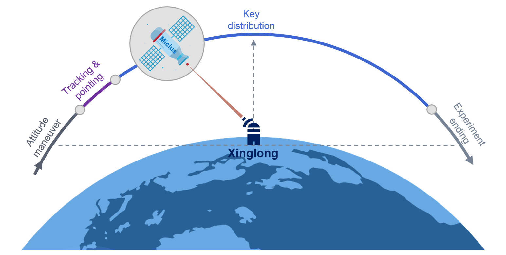
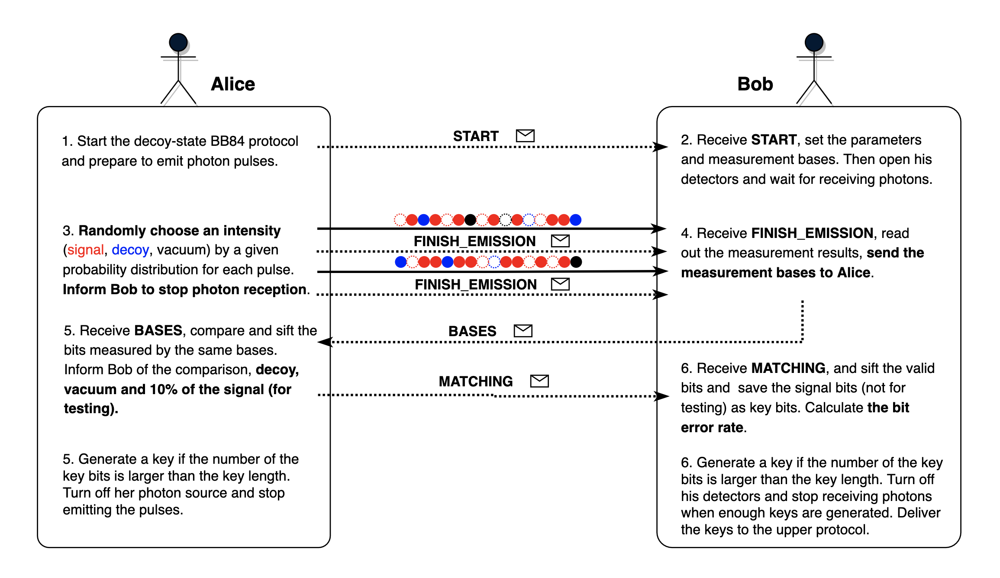
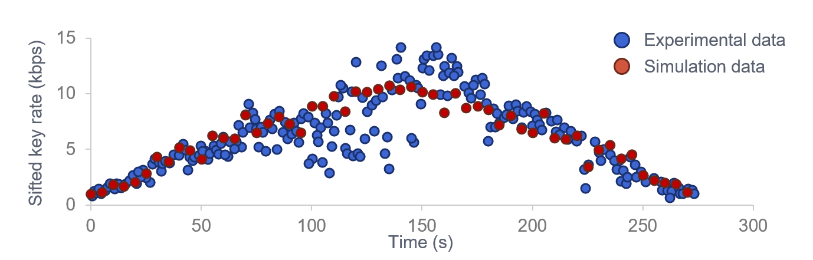

# Micius quantum satellite experiment

*Copyright (c) 2022 Institute for Quantum Computing, Baidu Inc. All Rights Reserved.*

In the previous tutorials, we have introduced how to construct and simulate a quantum network using QNET. In this tutorial, we will introduce how to use QNET to simulate the satellite-to-ground QKD experiment by the Micius quantum satellite in 2017 [1].

We will introduce the following aspects: the background of the Micuis quantum satellite, the process of the experiment, the decoy-state BB84 protocol, QNET code implementation and the result comparison.

## Introduction to the satellite-to-ground experiment

### 1. Background

Due to the ground restrictions, many places can not lay the special fiber for quantum communication. The use of quantum communication satellites for relaying can overcome the influence of many factors such as obstacles and ground curvature, making it easier to achieve long-distance quantum communication and help establish a global-scale quantum network.

The Micius quantum satellite is the world's first quantum scientific experimental satellite, launched on August 16, 2016. It has successfully performed experiments including satellite-to-ground bidirectional quantum entanglement distribution at the level of thousands of kilometers, high-speed satellite-to-ground QKD and high-speed ground-to-satellite quantum teleportation, etc. The Micius satellite has laid a solid foundation for China's leadership in the development of quantum communication technologies in the future.

### 2. Experiment process

As the sender of photons, the quantum satellite has built-in transmitters for emitting the signal and decoy states, respectively. The laser pulses are encoded by BB84 and then co-aligned and emitted with the laser pulses used for system tracking and time synchronization.

As the receiver, the ground station divides the received laser into two paths through the dichroic mirror for tracking and time synchronization respectively, and receives the photons through the BB84 decoder.

As shown in Figure 1, the satellite passes by the Xinglong ground station once a night along the sun-synchronous orbit with an elapsed time of about 5 minutes, starting at about 00:50 local time. The satellite first adjusts its attitude and points to the ground station before entering the shadow zone, and then the tracking and pointing system begins to track and point in both directions to ensure that the transmitter and receiver are firmly locked throughout the orbit. Starting at an elevation of about 15°, the QKD transmitter on board the satellite sends randomly modulated signal state and decoy photons that are received and detected by the ground station. The experiment ends when the satellite reaches an elevation angle of 10° again.



Unlike the experiments on the ground, the length of free-space channels in the satellite-to-ground experiment changes in real-time. This affects the transmission delay of messages and the loss of quantum channels, resulting in the following relationship between the sifted key rate and the distance between the satellite and ground stations:

1. When the distance is shorter, there is a lower transmission delay and photon loss rate. The sifted key rate becomes higher.
2. When the distance is longer, there is a higher transmission delay and photon loss rate. The sifted key rate becomes lower.

### 3. Decoy-state BB84 protocol

The conventional BB84 protocol is vulnerable to photon-number splitting (PNS) attacks due to the imperfection of the single-photon source, where an eavesdropper can impersonate channel loss, intercept some of the photons in the multi-photon pulse for measurement to eavesdrop on the key information, and continue sending the remaining photons. In quantum satellite experiments, the decoy state BB84 protocol is used as the key generation protocol to ensure the security of the key (see Ref. [2, 3]). In the decoy-state BB84 protocol, the sender uses a decoy signal method with three different intensities switching randomly to transmit pulses. Then both communicating parties can determine whether there is an eavesdropper in the channel by parameter estimation so as to ensure the security of key distribution.

In our simulation, the decoy-state BB84 protocol goes as follows (Figure 2):

1. Alice sends a ``START`` message to Bob for the synchronization of the start time and related parameters, then she schedules an event for sending photon pulses.
2. Bob extracts related parameters from the ``START`` message, and set the measurement bases and configurations for his detectors. He then keeps waiting for receiving the photons from Alice.
3. Alice begins the process of sending pulses. For each pulse, she randomly chooses from one of the three coherent light intensities: signal, decoy and vacuum by a given probability distribution `intensities` for photon emission. Different intensities correspond to different average photon numbers. At the same time as the emission of the last pulse in an emission round, Alice sends a classical message ``FINISH_EMISSION`` to inform Bob of the end of this round of emission (In simulation, the two messages will arrive at the same time for the lengths of the classical free-space channel and the quantum free-space channel are equal). 
4. When Bob receives the ``FINISH_EMISSION`` message, he pops out the measurement outcomes from the detectors and sets the measurement bases as invalid if both detectors click or neither them click, then he sends the updated measurement bases to Alice for a comparison.
5. When Alice receives the measurement bases from Bob, she compares and sifts the bits that are prepared and measured with the same bases. Then she extracts decoy states, vacuum states and 10% of the signal states from these valid bits for testing. The remaining 90% signal states are used as key bits. Then Alice sends Bob the comparison result, the position and initial values of the testing bits. If the number of the key bits is larger than the required key length, then a sifted key is generated. When enough keys are generated, Alice ends the protocol and delivers the sifted keys to the upper protocols.
6. When Bob receives the comparison result and testing bits from Alice, he sifts the bits that are measured using the same bases and are not parts of the testing bits, and append them to a list of key bits. He then calculates the bit error rate with the testing bits to infer whether there exists an eavesdropper. If the number of the key bits is larger than the required key length, then a sifted key is generated. When enough keys are generated, Bob ends the protocol and delivers the sifted keys to the upper protocols.




## Simulation in QNET

### 1. Satellite node

For the ease of simulation, we provide the `Satellite` class to better model the quantum satellite. As a mobile node, the satellite node has the `mobility` attribute, which characterizes the mobility of the node.


```python
class Satellite(Node, ABC):
    def __init__(self, name: str, env=None):
        super().__init__(name, env)
        self.mobility = Mobility()
        self.assign_functionality(self.mobility)
```

Moreover, we provide `QKDSatellite` class for satellites capable of quantum key distribution. The `QKDSatellite` class inherits both from `QKDNode` class and `Satellite` class and is responsible for the simulation of mobile nodes that can perform quantum key distribution.


```python
class QKDSatellite(QKDNode, Satellite):
    def __init__(self, name: str, env=None, location=None):
        super().__init__(name, env, location)
```

We can set a track for the mobile node via the `set_track` method of `Mobility` class.


```python
def set_track(self, track: "Track") -> None:
    self.track = track
```

We also provide class `Track` to model the track of a mobile node with respect to its reference node. We can set the reference node and reference time of a mobile node by specifying the parameters `ref_node` and `ref_time`. Note that the reference time is the time from the beginning of the simulation to the beginning of the movement of the mobile node. We can obtain the distance between the satellite and the reference node via the method `time2distance` and the channel loss that varies with distance via the method `distance2loss`, respectively.


```python
class Track(ABC):
    ...
    def time2distance(self, current_time: int) -> float:
        pass

    def distance2loss(self, distance: float) -> float:
        pass
```

### 2. Free space channel

Moreover, we provide `ClassicalFreeSpaceChannel` and `QuantumFreeSpaceChannel` classes to simulate free space channels that transmit classical and quantum messages.

In QNET, a free space channel is able to connect to a mobile node and a fixed node, or two fixed nodes. When one end of a free space channel is connected to a mobile node, the initial distance is set by accessing the attribute `mobility` of the mobile node and querying the current distance between the mobile node and its reference node. If both ends are fixed nodes, we need to set an initial distance manually.

In the simulation, every time the satellite and the ground stations want to communicate with each other via the method `transmit`, they should first obtain the distance and the channel loss for calculating the transmission delay and photon loss rate. These parameters can be obtained via the methods `time2distance` and `distance2loss` of the `track` class. Take the `transmit` method of `QuantumFreeSpaceChannel` class as an example:


```python
def transmit(self, msg: "QuantumMessage", priority=None) -> None:
    # Obtain the current distance and loss of the channel
    distance = self.mobile_node.mobility.track.time2distance(self.env.now)
    loss = self.mobile_node.mobility.track.distance2loss(distance)
    self.update_params(distance, loss)

    # Schedule an event for the receiver if the message is not lost
    if random.random_sample() > self.lossy_prob:
        handler = EventHandler(self.receiver, "receive_quantum_msg", [self.sender, msg])
        self.scheduler.schedule_after(self.delay, handler, priority)
```

### 3. Code example

With the modules mentioned above, we will simulate the Micius quantum satellite experiment using QNET.

**1. Set the orbit model of the quantum satellite**

First, we have collected data on the track of the Micius satellite from Ref. [1] and save it as a csv file. We set its orbit model to get real-time parameters (e.g., distance and channel loss) of the free space channels that connect the satellite and ground station.


```python
import pandas as pd
from qcompute_qnet.functionalities.mobility import Track

# Load data of the Micius satellite
micius_track = pd.read_csv("data/micius2017_track.csv")
micius_link_efficiency = pd.read_csv("data/micius2017_link_efficiency.csv")


# Set track model of the Micius satellite
class MiciusOrbit(Track):
    def __init__(self, ref_node: "Node", ref_time=0):
        super().__init__(ref_node, ref_time)

    def time2distance(self, current_time: int) -> float:
        micius_time = round((current_time - self.ref_time) * 1e-12, 1)

        global micius_track
        index = micius_track.loc[micius_track['time'] == micius_time].index[0]

        return micius_track.loc[index].distance

    def distance2loss(self, distance: float) -> float:
        distance = round(distance, 1)

        global micius_link_efficiency
        index = micius_link_efficiency.loc[micius_link_efficiency['distance'] == distance].index[0]

        return micius_link_efficiency.loc[index].loss
```

**2. Create simulation environment and network**

Then we create the simulation environment and build the quantum network to simulate the process of satellite-to-ground quantum key distribution using the decoy-state BB84 protocol.


```python
from qcompute_qnet.core.des import DESEnv
from qcompute_qnet.topology.network import Network

 # Create a simulation environment
env = DESEnv("Micius Satellite Experiment Simulation", default=True)

# Create the satellite-to-ground QKD network
network = Network("Satellite-to-ground QKD Network")
```

**3. Create QKD nodes**

We then create the satellite node and the ground station node and set the orbit of the quantum satellite. We set the ground station as its reference node and the time difference from now to the appearance of the satellite node as its reference time. Then, we set the parameters of the physical devices in our simulation using the data from Ref. [1].

Next, we set up the decoy-state BB84 protocol. Set `DecoyBB84` protocol to be the key generation protocol of the quantum satellite experiment. Moreover, as the satellite experiment uses downlink protocol, we configure the satellite with the probabilities of preparation bases `tx_bases_ratio` and the probabilities of different light intensities via `intensities`. For the ground station, we set the probabilities of its measurement bases `rx_bases_ratio`. At last, we add the `DecoyBB84` to the protocol stacks of the nodes.


```python
from qcompute_qnet.models.qkd.node import QKDSatellite, QKDNode

# Create QKD nodes
micius = QKDSatellite("Micius")
xinglong = QKDNode("Xinglong")

# Set the track of the Micius satellite
micius.mobility.set_track(MiciusOrbit(ref_node=xinglong, ref_time=-round(100e12)))  

# Set parameters of photon source and polarization detector
source_options = {"frequency": 100e6, "wavelength": 848.62, "bandwidth": 0.1}
detector_options = {"efficiency": 0.5}
micius.photon_source.set(**source_options)
xinglong.polar_detector.set_detectors(**detector_options)

# Parameters related to the key generation protocols
intensities = {"prob": [0.5, 0.25, 0.25], "mean_photon_num": [0.8, 0.1, 0]}
transmitter_options = {"protocol": "DecoyBB84", "tx_bases_ratio": [0.5, 0.5], "intensities": intensities}
receiver_options = {"protocol": "DecoyBB84", "rx_bases_ratio": [0.5, 0.5]}

# Set up decoy-state BB84 protocols
decoy_bb84_micius = micius.set_key_generation(xinglong, **transmitter_options)
micius.protocol_stack.build(decoy_bb84_micius)
decoy_bb84_xinglong = xinglong.set_key_generation(micius, **receiver_options)
xinglong.protocol_stack.build(decoy_bb84_xinglong)
```

**4. Create the link and channels, install the channels to the link.**


```python
from qcompute_qnet.topology.link import Link
from qcompute_qnet.devices.channel import ClassicalFreeSpaceChannel, QuantumFreeSpaceChannel

# Create the link between the Micius satellite and the ground station and connect both nodes
link_micius_xinglong = Link("Micius_Xinglong", ends=(micius, xinglong))

# Create communication channels and connect the nodes
cchannel1 = ClassicalFreeSpaceChannel("c_Micius2Xinglong", sender=micius, receiver=xinglong, is_mobile=True)
cchannel2 = ClassicalFreeSpaceChannel("c_Xinglong2Micius", sender=xinglong, receiver=micius, is_mobile=True)
qchannel = QuantumFreeSpaceChannel("q_Micius2Xinglong", sender=micius, receiver=xinglong, is_mobile=True)

# Install the channels to the link
link_micius_xinglong.install([cchannel1, cchannel2, qchannel])
```

**5. Install the nodes and link to the network**


```python
# Install the nodes and link to the network
network.install([micius, xinglong, link_micius_xinglong])
```

**6. Start the protocol and launch the simulation**

Then, start the protocol stack for both nodes respectively. Because there is only one layer of protocol in the protocol stack, the `start` method of `ProtocolStack` class will directly call the `start` method of `DecoyBB84` class to run the decoy-state BB84 protocol.

Here, we set the run time of the simulation environment to be 0.1s (interested readers can try different parameters). At the end of the simulation, we calculate the sifted key rate.


```python
from qcompute_qnet.models.qkd.key_generation import PrepareAndMeasure

# Start the protocol stack
micius.protocol_stack.start(role=PrepareAndMeasure.Role.TRANSMITTER, key_num=float("inf"), key_length=256)
xinglong.protocol_stack.start(role=PrepareAndMeasure.Role.RECEIVER, key_num=float("inf"), key_length=256)

# Initialize the simulation environment
env.init()

# Run the simulation environment and save the log records
env.set_log(level="INFO")
env.run(end_time=1e11, logging=True)

# Estimate the sifted key rate
key_rate = decoy_bb84_micius.key_rate_estimation()
print(f"Sifted key rate: {key_rate:.4f} kbit/s")
```

### 4. Simulation results

The comparison result of our simulation and the experimental data is given below. It can be found that the simulation result matches with the experimental data very well, thus verifying the Micius quantum satellite experiment. This example shows the advantage of a quantum network simulation tool in protocol verification. With simulation, we can quickly analyze protocol performance and do parameters optimization even without real hardware devices. This can significantly reduce the cost of protocol testing and could be essential for the standardization of quantum network architectures and large project like quantum satellites.



---

## References

[1] Liao, Sheng-Kai, et al. "Satellite-to-ground quantum key distribution." [Nature 549.7670 (2017): 43-47.](https://www.nature.com/articles/nature23655)

[2] Wang, Xiang-Bin. "Beating the photon-number-splitting attack in practical quantum cryptography." [Physical Review Letters 94.23 (2005): 230503.](https://journals.aps.org/prl/abstract/10.1103/PhysRevLett.94.230503)

[3] Lo, Hoi-Kwong, Xiongfeng Ma, and Kai Chen. "Decoy state quantum key distribution." [Physical Review Letters 94.23 (2005): 230504.](https://journals.aps.org/prl/abstract/10.1103/PhysRevLett.94.230504)
