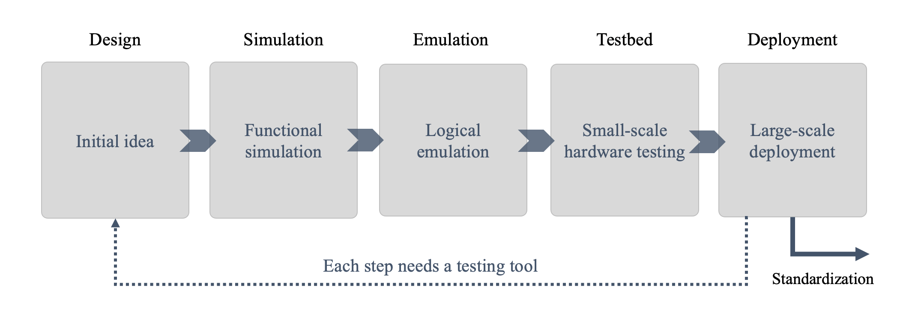

# Quantum network protocols on quantum hardware devices

*Copyright (c) 2022 Institute for Quantum Computing, Baidu Inc. All Rights Reserved.*

## Overview

A network protocol needs to go through a series of development stages including design, simulation, emulation and testbed before it can be deployed in a real network environment and realize the standardization [1] (see Figure 1).

In a quantum network protocol, apart from local quantum operations, there are both classical and quantum communications. Due to the complex and interactive behaviors of a network, it is difficult to realize a quantum network protocol on current quantum computers directly. Therefore, the stage of logical emulation combining the software and hardware is hard to complete. However, skipping this step and moving to the testbed directly will considerably increase the time cost and financial cost of the testing.

To provide a feasible solution for deploying quantum network protocols on quantum hardware devices, we developed the QPU module. This module allows users to transpile quantum network protocols to standard quantum circuits that can be deployed on real hardware devices for simulation. Users can simulate and test a quantum network protocol by utilizing the QPU module, which can automatically map the complex network behaviors (including local operations and communications) of the protocol onto quantum circuits. Users can choose to run the circuits on local or cloud simulators, or connect to real hardware devices (e.g. a quantum computer) for realistic implementation. 

Simulating a quantum network protocol on a quantum computer can help to check the performance of the protocol, optimize relevant parameters, and therefore speed up the development of quantum network protocols. Moreover, the computational power of quantum computer can be leveraged to overcome the computational bottleneck of network simulation.

## Main idea

Interactive behaviors such as the classical controlled operations and the transmission of qubits make it difficult for the quantum network protocols to be directly implemented on the quantum hardware devices. Here we propose a scheme for equivalent replacement.

- For the spatial transmission of qubits, it is equated to the rights to operate on the qubits. The process that Alice sends a qubit to Bob through a quantum channel can be viewed as the process that Alice hands over her rights to operate on the qubit to Bob. That is, we can consider the possession of a qubit as the right to perform operations (quantum gates and measurement) on it on a global circuit.
- For classical controlled operations, the classical information is stored by the nodes first. Then the related classical controlled operations can be replaced with quantum controlled operations referring to the principle of deferred measurement.

The complete implementation idea is as follows.

1. First, using the above techniques, we can transform a quantum network protocol to generalized quantum circuits with intermediate measurements.
2. Then, according to the principle of deferred measurement [2], the classically controlled operations can be replaced by quantum operations with all measurements moved to the end of the circuits. In this way, the generalized quantum circuits can be transformed into standard quantum circuits.
3. Finally, the standard quantum circuits are implemented on quantum hardware devices.

## QPU module

Here, we briefly introduce the key parts of the QPU module.

- In the QPU module, we provide ``QuantumNode`` class as a node template. ``QuantumNode`` class simulates the nodes with quantum registers ``QuantumRegister``that can store and process qubits locally. By calling the methods of  ``QuantumRegister`` class, a ``QuantumNode`` can perform quantum gates and measurements on its qubits. These operations will be automatically mapped onto a global quantum circuit of the quantum network.
- Besides, we provide ``QuantumEnv`` class as a discrete-event simulation environment with additional features. By specifying the backends, ``QuantumEnv`` can connect to simulators or real hardware devices and run the quantum circuits in the network.
- What's more, we provide several basic quantum network protocol templates. Users can refer to the protocols for a better understanding of this module.

## Tutorials

Next, we will introduce the QPU module through several basic quantum network protocols. Please refer to the following [tutorials](https://quantum-hub.baidu.com/qnet/tutorial-introduction) for more details.

- Quantum teleportation
- Quantum entanglement swapping
- CHSH game
- Magic square game

---

# References

[1] Wehrle, Klaus, et al. "Modeling and Tools for Network Simulation." [Springer-Verlag Berlin Heidelberg (2010).](https://link.springer.com/book/10.1007/978-3-642-12331-3)

[2] Nielsen, Michael A., and Isaac L. Chuang. Quantum Computation and Quantum Information. [Cambridge University Press, 2010.](https://books.google.com.hk/books?hl=en&lr=&id=-s4DEy7o-a0C&oi=fnd&pg=PR17&ots=NI1LdntvYs&sig=-UIwemSt5CMQ8GGRZE-WIIVAKKo&redir_esc=y&hl=zh-CN&sourceid=cndr#v=onepage&q&f=false)
