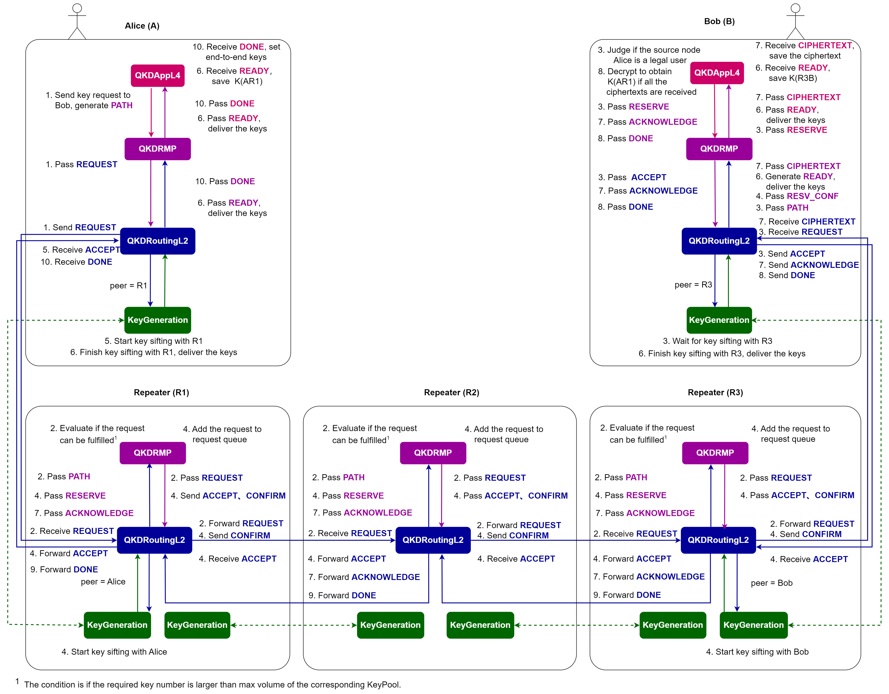

# Quantum network architecture with resource management

*Copyright (c) 2022 Institute for Quantum Computing, Baidu Inc. All Rights Reserved.*

In the tutorial of quantum network architecture simulation, we have introduced how to construct a simple network architecture for quantum key distribution using QNET, and demonstrated an example of an end-to-end key request in the Beijing metropolitan area network [1]. However, such a network architecture cannot process large numbers of requests at the same time. In this tutorial, we present a resource management architecture for quantum key distribution networks, where repeater nodes can generate sifted keys with their neighboring repeaters and save these generated keys in their local key pools (a specific structure designed for key storage and allocation). By managing network resources, this architecture can serve multiple users simultaneously. Note that this architecture is demonstrated in the context of quantum key distribution, but it can be readily adapted to other scenarios, such as quantum entanglement distribution networks.


In the remainder of this tutorial, we will first introduce the key pool structure and then detail the implementation of the network architecture. Finally, we utilize this architecture to simulate the scenario of multiple user requests in the Beijing quantum metropolitan area network.

## Resource management architecture

### 1. Key pool

Given the limited resources of quantum networks, when a certain request occupies the corresponding resource for key generation, the processing of other requests will be inevitably hindered. To deal with multiple requests in a network, a battery-like structure, called "key pool", is introduced in repeater nodes for key storage and allocation. An illustration of the key pool structure is shown in Figure 1(a). A key pool has a maximum volume (capacity) $V_m$ indicating the maximum number of keys it can accommodate, a current volume $V_c$ indicating the number of currently available keys it holds, a service interruption volume $V_i$ indicating the threshold for stopping service, and a service recovery volume $V_r$ indicating the threshold for recovering the service. When keys are delivered in response to a user request, the key pool checks its current volume, $V_c$. If it is less than $V_i$ (see Figure 1 (b)), it will stop delivering keys to new requests and invoke the key generation protocol to replenish the key pool with newly generated keys until $V_c$ reaches $V_r$ (see Figure 1 (c)).


There are two corresponding key pools in repeater node $R_i$ used to store the generated keys for each neighboring repeater node $R_p$ of $R_i$ when $R_i$ is the upstream node of $R_p$ and the downstream node of $R_p$, respectively. In addition, when a request reaches a repeater node, only the key pool in the same direction as the request path will deliver its keys to the request; the key pool in the opposite direction will not respond.

### 2. Network architecture

The four-layer quantum network architecture we propose is depicted in Figure 2. In this architecture, each endnode is equipped with a four-layer protocol stack, with the following protocols running from top to bottom:


1. `QKDAppL4` protocol that generates and receives end-to-end key requests;
2. `QKDRMP` protocol that is responsible for resource management;
3. `QKDRoutingL2` protocol that determines the path of key distribution;
4. `KeyGeneration` protocol that performs key generation with neighboring nodes.


Each repeater node has a three-layer protocol stack, which has the same structure as the endnodes except for the application layer. Compared with the three-layer architecture introduced in the tutorial of quantum network architecture simulation, the four-layer architecture is mainly supplemented with a resource management protocol (`QKDRMP`) for the management of keys, and the scheduling and processing of multiple requests. The design of the `QKDRMP` protocol is inspired by the RSVP protocol in classical networks and adopts a similar resource reservation mechanism.


The process of an end-to-end key request from Alice to Bob is as follows:


1. Alice initiates a key request to Bob, generates a `REQUEST` message, and sends it to her directly connected repeater (the message will be directly sent to Bob if there is a direct channel between them);
2. Repeater nodes receive the `REQUEST` message and choose to forward or reject it, depending on its resource requirements;
3. Bob receives the `REQUEST` message and sets his local `KeyGeneration` protocol to get ready for key generation with its upstream node, then he returns an `ACCEPT` message;
4. Repeater nodes along the path receive the `ACCEPT` message and decide whether to process the request or add it to the request queue according to the node's current status. When the request is processed, the node continues to forward the `ACCEPT` message, then it performs a key swapping operation and generates a `CIPHERTEXT` message to Bob;
5. Alice receives the `ACCEPT` message and sets her local `KeyGeneration` protocol for key generation with the downstream node;
6. Alice and Bob save the generated keys with their upstream and downstream nodes, respectively;
7. Bob receives the `CIPHERTEXT` message from a repeater node and returns an `ACKNOWLEDGE` message back;
8. Bob combines all the information to decrypt the ciphertexts when receiving all the ciphertexts from the repeater nodes on the path, and obtains the end-to-end keys with Alice, then he sends a `DONE` message to Alice to end the request;
9. The repeater nodes directly forward the `DONE` message once receiving it;
10. Alice receives the `DONE` message and sets the end-to-end keys, then she finishes the request.


It is worth noting that the end-to-end process can occur concurrently between different network users. Particularly in step 4, when a repeater node accepts a key request that cannot be processed currently, it will add it to a request queue (`RequestQueue`). This request queue will collaborate with key pools. If the request queue is full, the node rejects the request and informs the corresponding nodes.



## Code implementation

In QNET, we provide node templates `RMPEndNode` and `RMPRepeaterNode` to simulate the endnodes and repeater nodes of this architecture. The protocol stack of each endnode and repeater node in this architecture loads the `QKDRMP` and `QKDRoutingL2` protocols by default.

### 1. Alice: Initiate a `REQUEST`

Suppose that Alice wants to generate end-to-end keys with Bob. She sends a QKD request to Bob. By calling the `key_request` method of class `RMPEndNode`, the status of both nodes is set to busy. The `set_qkd_app` method is invoked to generate a `QKDAppL4` protocol instance in the local protocol stack and load it to the upper layer of the `QKDRMP` protocol. Then the `start` method of `QKDAppL4` initiates a key request to Bob.

```python
def key_request(self, **kwargs) -> None:
    if self.idle and kwargs['dst'].idle:
        # Set the status of the sender and receiver to busy
        self.set_busy()
        kwargs['dst'].set_busy()
        qkd_app = self.set_qkd_app()
        qkd_app.start(**kwargs)
    ...
```

The `start` method of `QKDAppL4` triggers the `send_request` method, which will first create a unique identifier `req_id` for the request and then generate a `QKDMessage` of type `PATH`, containing the request identifier, request path, number of requested keys and key length. Then, the message is sent to the `QKDRMP`.

```python
def send_request(self) -> None:
    request_id = self.create_request_id()   # create a unique identifier for the request
    request_msg = QKDMessage(src=self.node,
                             dst=self.request_to,
                             protocol=QKDRMP,
                             data={'type': QKDMessage.Type.PATH,
                                   'req_id': request_id,
                                   'path': [self.node],
                                   'key_num': self.key_num,
                                   'key_length': self.key_length})
    self.send_lower(QKDRMP, msg=request_msg)
```

When receiving a message from `QKDAppL4`, `QKDRMP` will first check its message type. For a `PATH` message, `QKDRMP` generates a `QKDMessage` of type `REQUEST` with the same data content and calls the `send_lower` method to pass it to the lower `QKDRoutingL2` protocol.

```python
def receive_upper(self, upper_protocol: type, **kwargs) -> None:
    msg = kwargs['msg']

    if msg.data['type'] == QKDMessage.Type.PATH:
        # Generate a 'REQUEST' message and send it to QKDRoutingL2
        request_msg = QKDMessage(src=self.node,
                                 dst=msg.dst,
                                 protocol=QKDRoutingL2,
                                 data={'type': QKDMessage.Type.REQUEST,
                                       'req_id': msg.data['req_id'],
                                       'path': msg.data['path'],
                                       'key_num': msg.data['key_num'],
                                       'key_length': msg.data['key_length']})
        self.send_lower(QKDRoutingL2, msg=request_msg)
```

When receiving a message from `QKDRMP`, `QKDRoutingL2` will also check the message type first. If a `REQUEST` message is received, if the destination node is directly connected with Alice, the message will be sent to Bob through their directly connected channel; or the message will be sent to the directly connected repeater node of Alice. If there is no repeater node capable of resource management between the two endnodes, the request will be rejected. 

```python
def receive_upper(self, upper_protocol: "type", **kwargs) -> None:
    msg = kwargs['msg']

    if msg.data['type'] == QKDMessage.Type.REQUEST:
        if isinstance(self.node, RMPEndNode):
            # Check if the destination is directly connected to the node
            if msg.dst in self.node.direct_nodes:
                self.node.send_classical_msg(dst=msg.dst, msg=msg)
            elif isinstance(self.node.direct_repeater, RMPRepeaterNode):
                self.node.send_classical_msg(dst=self.node.direct_repeater, msg=msg)
            else:
                reject_msg = QKDMessage(src=msg.src,
                                        dst=msg.dst,
                                        protocol=QKDRMP,
                                        data={'type': QKDMessage.Type.REJECT,
                                              'req_id': msg.data['req_id'],
                                              'path': msg.data['path'],
                                              'err_type': 1,
                                              'key_num': msg.data['key_num'],
                                              'key_length': msg.data['key_length']})
                self.send_upper(upper_protocol=QKDRMP, msg=reject_msg)
        ...
```

### 2. Repeater nodes: Receive and forward the `REQUEST`

When receiving a `QKDMessage`, the `QKDRoutingL2` of the repeater node checks the message type. If receiving a `REQUEST` message, it will generate a `PATH` message with the same data content and send it to `QKDRMP`.

```python
def receive_classical_msg(self, msg: "QKDMessage", **kwargs) -> None:
    if msg.data['type'] == QKDMessage.Type.REQUEST:
        # Generate a 'PATH' message and send it to QKDRMP
        request_msg = QKDMessage(src=msg.src,
                                 dst=msg.dst,
                                 protocol=QKDRMP,
                                 data={'type': QKDMessage.Type.PATH,
                                       'req_id': msg.data['req_id'],
                                       'path': msg.data['path'],
                                       'key_num': msg.data['key_num'],
                                       'key_length': msg.data['key_length']})
        self.send_upper(QKDRMP, msg=request_msg)
```

Upon receiving a `PATH` message, the `QKDRMP` protocol will evaluate the resource requirements of the request. If the next hop is a repeater node, `QKDRMP` will call the `fulfill` method of `KeyPool` to compare the number of required keys with the maximum volume of the corresponding key pool. If the number of requested keys does not exceed the service capacity of the key pool, the request will be forwarded; or it will be rejected, resulting in the generation of a `REJECT` message with the error type `err_type = 1` indicating that the `PATH` message is rejected. The message is then sent back to Alice via `QKDRoutingL2`. On the other hand, if the next hop is an endnode, the `PATH` message will be forwarded directly.

```python
def receive_lower(self, lower_protocol: "type", **kwargs) -> None:
    msg = kwargs['msg']

    if msg.data['type'] == QKDMessage.Type.PATH:
        if isinstance(self.node, RMPRepeaterNode):
            # Forward the 'PATH' to the next hop
            next_hop = self.node.quantum_routing_table[msg.dst]
            if self.node not in msg.data['path']:
                msg.data['path'].append(self.node)

            if isinstance(next_hop, RMPRepeaterNode):
                # If the request can be fulfilled, forward the 'REQUEST' message
                if self.node.key_pools[next_hop][0].fulfill(msg):
                    request_msg = QKDMessage(src=msg.src,
                                             dst=msg.dst,
                                             protocol=QKDRoutingL2,
                                             data={'type': QKDMessage.Type.REQUEST,
                                                   'req_id': msg.data['req_id'],
                                                   'path': msg.data['path'],
                                                   'key_num': msg.data['key_num'],
                                                   'key_length': msg.data['key_length']})
                    self.send_lower(QKDRoutingL2, msg=request_msg)
                else:
                    reject_msg = QKDMessage(src=self.node,
                                            dst=msg.src,
                                            protocol=QKDRoutingL2,
                                            data={'type': QKDMessage.Type.REJECT,
                                                  'req_id': msg.data['req_id'],
                                                  'path': msg.data['path'],
                                                  'err_type': 1,
                                                  'key_num': msg.data['key_num'],
                                                  'key_length': msg.data['key_length']})
                    self.send_lower(QKDRoutingL2, msg=reject_msg)

            elif isinstance(next_hop, RMPEndNode):
                request_msg = QKDMessage(src=msg.src,
                                         dst=msg.dst,
                                         protocol=QKDRoutingL2,
                                         data={'type': QKDMessage.Type.REQUEST,
                                               'req_id': msg.data['req_id'],
                                               'path': msg.data['path'],
                                               'key_num': msg.data['key_num'],
                                               'key_length': msg.data['key_length']})
                self.send_lower(QKDRoutingL2, msg=request_msg)
        ...
```

When the `QKDRoutingL2` receives the `REQUEST` message from `QKDRMP`, the message will be forwarded to the downstream node. If it receives a `REJECT` message with `err_type = 1`, the message will be forwarded to the upstream node. 

```python
def receive_upper(self, upper_protocol: "type", **kwargs) -> None:
    msg = kwargs['msg']

    if msg.data['type'] == QKDMessage.Type.REQUEST:
        if isinstance(self.node, RMPEndNode):
            ...
        elif isinstance(self.node, RMPRepeaterNode):
            next_hop = self.node.quantum_routing_table[msg.dst]
            self.node.send_classical_msg(dst=next_hop, msg=msg)

    elif msg.data['type'] == QKDMessage.Type.REJECT:
        err_type = msg.data['err_type']

        if err_type == 1:
            # Forward the 'REJECT' to the upstream node
            upstream_node = msg.data['path'][-2]
            self.node.send_classical_msg(upstream_node, msg=msg)
        ...
```

### 3. Bob: Receive the request and send back an `ACCEPT`

When Bob receives a `QKDMessage`, its `QKDRoutingL2` protocol will check the message type. When receiving a `REQUEST` message, a `PATH` message with the same data content is generated and sent to the `QKDRMP`. Upon receiving the `PATH` message, `QKDRMP` calls the `set_qkd_app` method of the `RMPEndNode` to update the protocol stack by adding a `QKDAppL4` instance. The `QKDRMP` protocol then generates a `RESERVE` message for resource reservation with the source node being Bob and the destination node being Alice, and passes the message to `QKDAppL4`.

```python
def receive_lower(self, lower_protocol: "type", **kwargs) -> None:
    msg = kwargs['msg']

    if msg.data['type'] == QKDMessage.Type.PATH:
        if isinstance(self.node, RMPRepeaterNode):
            ...
        elif isinstance(self.node, RMPEndNode):
            if msg.dst == self.node:
                self.node.set_qkd_app()
                # Generate a 'RESERVE' message and send it to QKDAppL4
                reserve_msg = QKDMessage(src=self.node,
                                         dst=msg.src,
                                         protocol=QKDAppL4,
                                         data={'type': QKDMessage.Type.RESERVE,
                                               'req_id': msg.data['req_id'],
                                               'path': msg.data['path'],
                                               'key_num': msg.data['key_num'],
                                               'key_length': msg.data['key_length']})
                self.send_upper(QKDAppL4, msg=reserve_msg, towards='down')
            ...
        ...
```

The `QKDAppL4` protocol takes different actions according to the message type. If receiving a `RESERVE` message, the `QKDAppL4` protocol will save the request identifier, request path, number of requested keys and key length. Then it determines whether to generate a ciphertext list for key swapping. Finally, the `QKDAppL4` protocol passes the `RESERVE` message back to the `QKDRMP`.

```python
def receive_lower(self, lower_protocol: type, **kwargs) -> None:
    ...
    if msg.data['type'] == QKDMessage.Type.RESERVE:
        if self.node == msg.src:
            # Set the corresponding parameters
            req_id = msg.data.get('req_id')
            if self.req_id is None and req_id is not None:
                self.req_id = req_id

            self.request_from = msg.dst
            self.key_num = msg.data['key_num']
            self.key_length = msg.data['key_length']

            path = msg.data['path']
            # Initialize the ciphertext list for key swapping
            if len(path) > 2:
                for node in path[1: -1]:
                    self.ciphertext_lists[node] = None
            msg.data['path'].append(self.node)

            self.send_lower(QKDRMP, msg=msg)
        ...
```

On receiving a `RESERVE` message from `QKDAppL4`, the `QKDRMP` protocol will first set an empty list to store the confirmation message of resource reservation from the repeater nodes, then it generates an `ACCEPT` message and sends it back along the path to inform the repeater nodes for resource reservation. The parameter `option='forward'` is set to inform the routing protocol to forward the message directly once receiving it.

```python
def receive_upper(self, upper_protocol: type, **kwargs) -> None:
    ...
    elif msg.data['type'] == QKDMessage.Type.RESERVE:
        # Initialize an empty list to record the confirmations
        for node in msg.data['path'][1: -1]:
            self.confirm_records[node] = None

        accept_msg = QKDMessage(src=msg.src,
                                dst=msg.dst,
                                protocol=QKDRoutingL2,
                                data={'type': QKDMessage.Type.ACCEPT,
                                      'req_id': msg.data['req_id'],
                                      'path': msg.data['path'],
                                      'key_num': msg.data['key_num'],
                                      'key_length': msg.data['key_length']})
        self.send_lower(QKDRoutingL2, msg=accept_msg, option='forward')
```

After receiving the `ACCEPT` message, `QKDRoutingL2` saves the request path, number of requested keys and key length, and forwards the message to the upstream node. A `PrepareAndMeasure` instance is then created to perform key generation with the upstream node.

**Note**: We assume in our network architecture that the upstream node always acts as the sender of the photons, and the downstream node acts as the receiver for the key generation between adjacent nodes.

```python
def receive_upper(self, upper_protocol: "type", **kwargs) -> None:
    ...
    elif msg.data['type'] == QKDMessage.Type.ACCEPT:
        option = kwargs['option']

        if option == 'forward':
            # Forward the 'ACCEPT' to the upstream node
            self.path = msg.data['path']
            index = msg.data['path'].index(self.node)
            upstream_node = msg.data['path'][index - 1]
            self.node.send_classical_msg(upstream_node, msg=msg)

            if self.node == msg.src:
                key_num = msg.data['key_num']
                key_length = msg.data['key_length']
                # Set the lower protocol for key generation with its upstream node
                self.node.set_key_generation(upstream_node)
                self.send_lower(PrepareAndMeasure,
                                peer=upstream_node,
                                role=PrepareAndMeasure.Role.RECEIVER,
                                key_num=key_num,
                                key_length=key_length)
        ...
```

### 4. Repeater nodes: Receive the `ACCEPT`, process the request or add it to the request queue

When a repeater node $R_m$ receives the `ACCEPT` message, the `QKDRoutingL2` protocol generates a `RESERVE` message and sends it to its upper protocol `QKDRMP`.

```python
def receive_classical_msg(self, msg: "QKDMessage", **kwargs) -> None:
    ...
    elif msg.data['type'] == QKDMessage.Type.ACCEPT:
        reserve_msg = QKDMessage(src=msg.src,
                                 dst=msg.dst,
                                 protocol=QKDRMP,
                                 data={'type': QKDMessage.Type.RESERVE,
                                       'req_id': msg.data['req_id'],
                                       'path': msg.data['path'],
                                       'key_num': msg.data['key_num'],
                                       'key_length': msg.data['key_length']})
        self.send_upper(QKDRMP, msg=reserve_msg)
        ...
```

When receiving a `RESERVE` message from `QKDRoutingL2`, `QKDRMP` takes different operations depending on the types of its upstream node and downstream node. Here, we discuss three cases according to the number of endnodes in the upstream and downstream node of the $R_m$, which corresponds to three different `pattern` values: 1) `pattern = 0`: both sides are repeater nodes; 2) `pattern = 1`: one side is an endnode, and the other side is a repeater node; 3) `pattern = 2`: both sides are endnodes.

```python
def receive_lower(self, lower_protocol: "type", **kwargs) -> None:
    ...
    elif msg.data['type'] == QKDMessage.Type.RESERVE:
        if self.node == msg.dst:
            ...
        else:
            pattern = 0
            push_flag = None

            index = msg.data['path'].index(self.node)
            upstream_node, downstream_node = msg.data['path'][index - 1], msg.data['path'][index + 1]
            for neighbor_node in [downstream_node, upstream_node]:
                if isinstance(neighbor_node, RMPEndNode):
                    pattern += 1
            ...
```

#### 1) `pattern = 0`: Repeater nodes on both sides

If `pattern = 0`, the `QKDRMP` protocol queries the status of the corresponding key pools of the request and determines whether the request can be processed. During this process, the `fulfill` method of the corresponding key pools is called to check if both of them have enough capacity to handle the request. If both key pools are idle and their current volumes can satisfy the request, the request is processed. Meanwhile, the `QKDRMP` generates an `ACCEPT` message to the lower `QKDRoutingL2` with the parameter `option = operate` to inform it to perform corresponding operations. If the corresponding key pools are not idle or their current volumes cannot handle the request, the `RESERVE` message representing the request and its corresponding `pattern` value will be added to a `RequestQueue`. The request queue will cooperate with the key pool, and serve the key requests once enough resources are available. The behavior of storing key requests is achieved by calling the `push` method of `RequestQueue`, which determines whether a new request can be accommodated by the request queue and returns a boolean value, saved in `push_flag` for subsequent operations.

```python
        ...
        if pattern == 0:
            # Check if the corresponding key pools on both sides are idle and check their volumes
            if self.node.key_pools[upstream_node][1].idle is True \
                    and self.node.key_pools[upstream_node][1].fulfill(msg) is True \
                    and self.node.key_pools[downstream_node][0].idle is True \
                    and self.node.key_pools[downstream_node][0].fulfill(msg) is True:
                # Set the status of the corresponding key pools to be busy
                self.node.key_pools[upstream_node][1].idle = False
                self.node.key_pools[downstream_node][0].idle = False
                # Generate an 'ACCEPT' message
                accept_msg = QKDMessage(src=msg.src,
                                        dst=msg.dst,
                                        protocol=QKDRoutingL2,
                                        data={'type': QKDMessage.Type.ACCEPT,
                                              'req_id': msg.data['req_id'],
                                              'path': msg.data['path'],
                                              'key_num': msg.data['key_num'],
                                              'key_length': msg.data['key_length']})
                # Call the QKDRoutingL2 to fetch the keys and calculate the ciphertext
                self.send_lower(QKDRoutingL2, msg=accept_msg, option='operate', pattern=pattern)
                # Reset the status of the corresponding key pools
                self.node.key_pools[upstream_node][1].idle = True
                self.node.key_pools[downstream_node][0].idle = True

            else:
                # Push the request to the request queue
                msg.data['pattern'] = pattern
                push_flag = self.request_queue.push(msg)
        ...
```

When the `QKDRoutingL2` receives an `ACCEPT` message from the `QKDRMP`, it checks the value of the `option`. If `option = 'operate'`, it further checks the value of the `pattern`. If `pattern = 0`, `QKDRoutingL2` fetches the keys from the corresponding key pools, and performs a bitwise XOR operation to generate the ciphertexts for key swapping: $c_m = k_{R_{m-1} R_{m}} \oplus k_{R_{m} R_{m+1}}$. The ciphertexts are then stored in the `CIPHERTEXT` message and sent to Bob along the path. At the same time, a `POP` message is generated and sent to `QKDRMP` to pop the next request from the request queue.

```python
def receive_upper(self, upper_protocol: type, **kwargs) -> None:
    ...
    elif msg.data['type'] == QKDMessage.Type.ACCEPT:
        option = kwargs['option']

        if option == 'forward':
            ...
        elif option == 'operate':   
            pattern = kwargs['pattern']

            if pattern == 0:
                self.path = msg.data['path']
                index = self.path.index(self.node)
                upstream_node, downstream_node = msg.data['path'][index - 1], msg.data['path'][index + 1]

                key_num = msg.data['key_num']
                key_length = msg.data['key_length']
                
                # Fetch the keys from key pools on both sides and calculate the ciphertext
                ciphertext_list = []
                keys_up = self.node.key_pools[upstream_node][1].allocate(key_num, key_length, towards='up')
                keys_down = self.node.key_pools[downstream_node][0].allocate(key_num, key_length, towards='down')
                for key_up, key_down in zip(keys_up, keys_down):
                    ciphertext_list.append(key_up ^ key_down)
                
                # Generate a 'CIPHERTEXT' message and send to the downstream node
                cipher_msg = QKDMessage(src=self.node,
                                        dst=self.path[-1],
                                        protocol=QKDRoutingL2,
                                        data={'type': QKDMessage.Type.CIPHERTEXT,
                                              'req_id': msg.data['req_id'],
                                              'path': msg.data['path'],
                                              'ciphertext_list': ciphertext_list,
                                              'key_num': msg.data['key_num'],
                                              'key_length': msg.data['key_length']})
                self.node.send_classical_msg(dst=downstream_node, msg=cipher_msg)
                ...
                # Generate a 'POP' message and send it to QKDRMP to pop another request
                pop_msg = QKDMessage(src=self.node,
                                     dst=self.node,
                                     protocol=QKDRMP,
                                     data={'type': QKDMessage.Type.POP})
                self.send_upper(QKDRMP, msg=pop_msg)
            ...
```

Repeater nodes along the path will forward the `CIPHERTEXT` message once receiving it.

```python
def receive_classical_msg(self, msg: "QKDMessage", **kwargs) -> None:
    ...
    elif msg.data['type'] == QKDMessage.Type.CIPHERTEXT:
        if msg.dst == self.node:
            ...
        else:
            # Forward the message to the next hop
            if isinstance(self.node, RMPRepeaterNode):
                path = msg.data['path']
                index = path.index(self.node)
                next_hop = path[index + 1]
                self.node.send_classical_msg(dst=next_hop, msg=msg)
```

Upon receiving a `POP` message from `QKDRoutingL2`, the `QKDRMP` will fetch the next request from its request queue. If `pattern = 0`, the same operations as before will be performed if the current volumes of the corresponding key pools are sufficient for the request. Otherwise, the request is pushed back to the queue for scheduling, and another request is popped up to be processed.

```python
def receive_lower(self, lower_protocol: "type", **kwargs) -> None:
    ...
    elif msg.data['type'] == QKDMessage.Type.POP:
        pop_counter = 0  # pop counter of the request queue
        while pop_counter < self.request_queue.max_volume:
            if self.request_queue.current_volume == 0:
                ...
            else:
                pop_msg = self.request_queue.pop()
                pattern = pop_msg.data['pattern']
                index = pop_msg.data['path'].index(self.node)
                upstream_node, downstream_node = pop_msg.data['path'][index - 1], pop_msg.data['path'][index + 1]

                if pattern == 0:
                    # Check if the corresponding key pools on both sides are idle and check their volumes
                    if self.node.key_pools[upstream_node][1].idle is True \
                            and self.node.key_pools[upstream_node][1].fulfill(msg) is True \
                            and self.node.key_pools[downstream_node][0].idle is True \
                            and self.node.key_pools[downstream_node][0].fulfill(msg) is True:
                        # Set the status of the corresponding key pools to be busy
                        self.node.key_pools[upstream_node][1].idle = False
                        self.node.key_pools[downstream_node][0].idle = False
                        # Generate an 'ACCEPT' message
                        accept_msg = QKDMessage(src=pop_msg.src,
                                                dst=pop_msg.dst,
                                                protocol=QKDRoutingL2,
                                                data={'type': QKDMessage.Type.ACCEPT,
                                                      'req_id': pop_msg.data['req_id'],
                                                      'path': pop_msg.data['path'],
                                                      'key_num': pop_msg.data['key_num'],
                                                      'key_length': pop_msg.data['key_length']})
                        # Call the QKDRoutingL2 to fetch the keys and calculate the ciphertext
                        self.send_lower(QKDRoutingL2, msg=accept_msg, option='operate', pattern=pattern)
                        # Reset the status of the corresponding key pools
                        self.node.key_pools[upstream_node][1].idle = True
                        self.node.key_pools[downstream_node][0].idle = True
                        break

                    else:
                        self.request_queue.push(pop_msg)  # push the request back to the queue
                        pop_counter += 1
```

#### 2) `pattern = 1`: Endnode on one side and repeater node on the other side

If `pattern = 1`, the `QKDRMP` protocol generates a `GENERATE` message to inform the `QKDRoutingL2` to set the local `KeyGeneration` protocol to get ready for the key generation with the endnode. At the same time, the `QKDRMP` protocol queries the status of the key pool corresponding to the other side (repeater node) to check if the request can be processed. If the key pool is idle and its current volume can satisfy the request, the `QKDRMP` generates an `ACCEPT` message and sends it to the lower `QKDRoutingL2` with `option = operate` to inform it to perform the corresponding operations. Otherwise, the `RESERVE` message of the request along with its corresponding `pattern` value, is pushed back to the request queue.

```python
        ...
        elif pattern == 1:
            if isinstance(upstream_node, RMPEndNode):
                end_peer, repeater_peer, towards, key_pool_index = upstream_node, downstream_node, 'down', 0
            else:
                end_peer, repeater_peer, towards, key_pool_index = downstream_node, upstream_node, 'up', 1
            
            # Prepare for key generation with the end node
            generate_msg = QKDMessage(src=self.node,
                                      dst=end_peer,
                                      protocol=QKDRoutingL2,
                                      data={'type': QKDMessage.Type.GENERATE,
                                            'req_id': msg.data['req_id'],
                                            'path': msg.data['path'],
                                            'key_num': msg.data['key_num'],
                                            'key_length': msg.data['key_length']})
            self.send_lower(QKDRoutingL2, msg=generate_msg, towards=towards)
            # Check if the corresponding key pool is idle and check the volume of corresponding key pools
            if self.node.key_pools[repeater_peer][keypool_index].idle is True \
                    and self.node.key_pools[repeater_peer][keypool_index].fulfill(msg) is True:
                self.node.key_pools[repeater_peer][keypool_index].idle = False
                
                # Generate an 'ACCEPT' message
                accept_msg = QKDMessage(src=msg.src,
                                        dst=msg.dst,
                                        protocol=QKDRoutingL2,
                                        data={'type': QKDMessage.Type.ACCEPT,
                                              'req_id': msg.data['req_id'],
                                              'path': msg.data['path'],
                                              'key_num': msg.data['key_num'],
                                              'key_length': msg.data['key_length']})
                # Call the QKDRoutingL2 to fetch the keys
                self.send_lower(QKDRoutingL2, msg=accept_msg, option='operate',
                                towards=towards, pattern=pattern)
                # Reset the status of the corresponding key pool
                self.node.key_pools[repeater_peer][keypool_index].idle = True
                
            else:
                # Push the request to the queue
                msg.data['pattern'] = pattern
                push_flag = self.request_queue.push(msg)
        ...
```

When receiving a `GENERATE` message from `QKDRMP`, the `QKDRoutingL2` creates a `KeyGeneration` instance to get ready for key generation with the corresponding node.

```python
def receive_upper(self, upper_protocol: "type", **kwargs) -> None:
    ...
    elif msg.data['type'] == QKDMessage.Type.GENERATE:
        towards = kwargs['towards']
        # Save the path of the request 
        if isinstance(msg.dst, RMPEndNode):
            if towards == 'up':
                self.keys_up[msg.dst] = {'path': msg.data['path'], 'keys': None}
            elif towards == 'down':
                self.keys_down[msg.dst] = {'path': msg.data['path'], 'keys': None}

        # Call the key generation protocol to start key generation
        self.node.set_key_generation(msg.dst, towards=towards)
        role = PrepareAndMeasure.Role.TRANSMITTER if towards == 'up' else PrepareAndMeasure.Role.RECEIVER
        self.send_lower(PrepareAndMeasure,
                        peer=msg.dst,
                        role=role,
                        key_num=msg.data['key_num'],
                        key_length=msg.data['key_length'])
```

When receiving an `ACCEPT` message from `QKDRMP` with `option = operate`, the `QKDRoutingL2` checks the value of `pattern`. If `pattern = 1`, `QKDRoutingL2` fetches the keys from the corresponding key pool and checks if the key generation with the endnode on the other side is finished. If the current node has not yet finished key generation with the endnode, the `QKDRoutingL2` caches the key fetched from the key pool and waits for key generation to be finished on the other side. If it has already generated keys with the endnode, it performs a bitwise XOR operation to generate the ciphertexts and then sends the `CIPHERTEXT` message to Bob. A `POP` message is then sent to the upper layer to inform the `QKDRMP` protocol to pop the next request from the queue.

```python
def receive_upper(self, upper_protocol: type, **kwargs) -> None:
    ...
    elif msg.data['type'] == QKDMessage.Type.ACCEPT:
        ...
        elif option == 'operate':
            pattern = kwargs['pattern']
            ...
            if pattern == 1:
                ...
                # Fetch the keys from the corresponding key pool
                ciphertext_list = []
                keys_repeater = self.node.key_pools[repeater_peer][key_pool_index].allocate(key_num, key_length, towards=towards)

                # Check if the key generation on the other side is finished
                if key_end_dict[end_peer]['keys'] is None:
                    # Save the delivered keys and wait
                    if key_pool_index == 0:
                        self.keys_up[tuple([repeater_peer, end_peer])] = {'path': self.path, 'keys': keys_repeater}
                    else:
                        self.keys_down[tuple([repeater_peer, end_peer])] = {'path': self.path, 'keys': keys_repeater}

                else:
                    # Calculate the ciphertext, generate a 'CIPHERTEXT' message and send it to the receiver
                    for key_repeater, key_end in zip(keys_repeater, key_end_dict[end_peer]['keys']):
                        ciphertext_list.append(key_repeater ^ key_end)
                    key_end_dict.pop(end_peer)

                    cipher_msg = QKDMessage(src=self.node,
                                            dst=self.path[-1],
                                            protocol=QKDRoutingL2,
                                            data={'type': QKDMessage.Type.CIPHERTEXT,
                                                  'req_id': msg.data['req_id'],
                                                  'path': msg.data['path'],
                                                  'ciphertext_list': ciphertext_list,
                                                  'key_num': msg.data['key_num'],
                                                  'key_length': msg.data['key_length'],})
                    self.node.send_classical_msg(dst=downstream_node, msg=cipher_msg)
                    ...
                    # Generate a 'POP' message and send it to QKDRMP to pop another request
                    pop_msg = QKDMessage(src=self.node,
                                         dst=self.node,
                                         protocol=QKDRMP,
                                         data={'type': QKDMessage.Type.POP})
                    self.send_upper(QKDRMP, msg=pop_msg)
            ...
```

#### 3) `pattern = 2`: Endnodes on both sides

If `pattern = 2`, the key pool will not participate in the process of the request. The `QKDRMP` protocol generates two `GENERATE` messages to inform the `QKDRoutingL2` protocol to set its local `KeyGeneration` instances to get ready for the key generation with endnodes on both sides.

```python
        ...
        elif pattern == 2:
            # Prepare for key generation with the upstream node
            generate_msg = QKDMessage(src=self.node,
                                      dst=upstream_node,
                                      protocol=QKDRoutingL2,
                                      data={'type': QKDMessage.Type.GENERATE,
                                            'req_id': msg.data['req_id'],
                                            'path': msg.data['path'],
                                            'key_num': msg.data['key_num'],
                                            'key_length': msg.data['key_length']})
            self.send_lower(QKDRoutingL2, msg=generate_msg, towards='down')

            # Prepare for the key generation with the downstream node
            generate_msg = QKDMessage(src=self.node,
                                      dst=downstream_node,
                                      protocol=QKDRoutingL2,
                                      data={'type': QKDMessage.Type.GENERATE,
                                            'req_id': msg.data['req_id'],
                                            'path': msg.data['path'],
                                            'key_num': msg.data['key_num'],
                                            'key_length': msg.data['key_length']})
            self.send_lower(QKDRoutingL2, msg=generate_msg, towards='up')
        ...
```

#### Subsequent operations of `QKDRMP`

When the `QKDRMP` protocol receives a `RESERVE` message from the `QKDRoutingL2`, it will first calculate the value of `pattern`. Then according to three different cases, different operations are performed as mentioned above. After that, the value of `push_flag` is used to determine subsequent operations. If a request is processed or pushed to the queue, an `ACCEPT` message is regenerated and sent to the `QKDRoutingL2`. The `ACCEPT` message will then be forwarded to the upstream node. Besides, a `CONFIRM` message is generated at the same time and sent back to Bob as the confirmation of receiving the resource reservation message. This `CONFIRM` message will be directly forwarded once received by a repeater node.

```python
        ...
        if push_flag in [True, None]:
            # Generate an 'ACCEPT' message and send it to QKDRoutingL2
            accept_msg = QKDMessage(src=msg.src,
                                    dst=msg.dst,
                                    protocol=QKDRoutingL2,
                                    data={'type': QKDMessage.Type.ACCEPT,
                                          'req_id': msg.data['req_id'],
                                          'path': msg.data['path'],
                                          'key_num': msg.data['key_num'],
                                          'key_length': msg.data['key_length']})
            self.send_lower(QKDRoutingL2, msg=accept_msg, option='forward')

            # Generate a 'CONFIRM' message and send it to QKDRoutingL2
            confirm_msg = QKDMessage(src=self.node,
                                     dst=msg.src,
                                     protocol=QKDRoutingL2,
                                     data={'type': QKDMessage.Type.CONFIRM,
                                           'req_id': msg.data['req_id'],
                                           'path': msg.data['path'],
                                           'key_num': msg.data['key_num'],
                                           'key_length': msg.data['key_length']})
            self.send_lower(QKDRoutingL2, msg=confirm_msg)
        ...
```

In addition, in the case of `pattern = 0` and `pattern = 1`, a request can be rejected when the request queue is found to be already full. The `QKDRMP` protocol will then generate one `REJECT` message with error type `err_type` of 2 and a `REJECT` message with error type `err_type` of 3 and forward them up/down the request path respectively. The `REJECT` message with `err_type` of 2 will be received by Alice who will be informed that the request has been rejected; and the `REJECT` message with `err_type` of 3 will be returned downstream to inform the nodes along the path of the failure of the resource reservation.

```python
        ...
        elif push_flag is False:
            # Generate a 'REJECT' message and send it to QKDRoutingL2
            reject_msg = QKDMessage(src=self.node,
                                    dst=msg.dst,
                                    protocol=QKDRoutingL2,
                                    data={'type': QKDMessage.Type.REJECT,
                                          'req_id': msg.data['req_id'],
                                          'path': msg.data['path'],
                                          'key_num': msg.data['key_num'],
                                          'key_length': msg.data['key_length'],
                                          'err_type': 2})
            self.send_lower(QKDRoutingL2, msg=reject_msg)

            # Generate another 'REJECT' message and ask the downstream nodes to cancel the resource reservation
            cancel_msg = QKDMessage(src=self.node,
                                    dst=msg.src,
                                    protocol=QKDRoutingL2,
                                    data={'type': QKDMessage.Type.REJECT,
                                          'req_id': msg.data['req_id'],
                                          'path': list(reversed(msg.data['path'])),
                                          'key_num': msg.data['key_num'],
                                          'key_length': msg.data['key_length'],
                                          'err_type': 3})
            self.send_lower(QKDRoutingL2, msg=cancel_msg)
        ...
```

On receiving a `REJECT` message from its upper `QKDRMP`, the `QKDRoutingL2` protocol sends the message to its upstream node or downstream node according to the `err_type` of the message.

```python
def receive_upper(self, upper_protocol: "type", **kwargs) -> None:
    ...  
    elif msg.data['type'] == QKDMessage.Type.REJECT:
        err_type = msg.data['err_type']
        if err_type == 1:
            ...
        elif err_type == 2:
            # Forward the 'REJECT' to the upstream node
            self.path = msg.data['path']
            index = msg.data['path'].index(self.node)
            upstream_node = msg.data['path'][index - 1]
            self.node.send_classical_msg(upstream_node, msg=msg)

        elif err_type == 3:
            # Forward the 'REJECT' to the downstream nodes to cancel the resource reservation
            self.path = msg.data['path']
            index = msg.data['path'].index(self.node)
            downstream_node = msg.data['path'][index + 1]
            self.node.send_classical_msg(downstream_node, msg=msg)
    ...
```

Repeater nodes along the path take different operations according to the value of `err_type` of the received `REJECT` message. If `err_type = 2`, the nodes directly forward the `REJECT` message to the upstream node. If `err_type = 3`, the repeater nodes continue to forward the message to the downstream node. In addition, the `QKDRMP` protocol will query its request queue to check if there is the same request according to the request identifier `req_id` carried in the message. If so, it will remove the request from the queue directly; otherwise, the request has been processed, in which case the `QKDRMP` protocol will record the corresponding delivered keys as invalid ones.

### 5. Alice: Receive the `ACCEPT` and start key generation with the downstream node

When Alice receives an `ACCEPT` message, her `QKDRoutingL2` protocol will directly set the local key generation protocol to perform key generation with the downstream node. A `RESERVE` message is generated and sent to the `QKDRMP` protocol at the same time.

```python
def receive_classical_msg(self, msg: "QKDMessage", **kwargs) -> None:
    ...  
    elif msg.data['type'] == QKDMessage.Type.ACCEPT:
        if isinstance(self.node, RMPEndNode):
            self.path = msg.data['path']
            downstream_node = self.path[1]
            key_num = msg.data['key_num']
            key_length = msg.data['key_length']

            # Create an instance for key generation with the upstream node
            self.node.set_key_generation(downstream_node)
            self.send_lower(PrepareAndMeasure,
                            peer=downstream_node,
                            role=PrepareAndMeasure.Role.TRANSMITTER,
                            key_num=key_num,
                            key_length=key_length)
        
        reserve_msg = QKDMessage(src=msg.src,
                                 dst=msg.dst,
                                 protocol=QKDRMP,
                                 data={'type': QKDMessage.Type.RESERVE,
                                       'req_id': msg.data['req_id'],
                                       'path': msg.data['path'],
                                       'key_num': msg.data['key_num'],
                                       'key_length': msg.data['key_length']})
        self.send_upper(QKDRMP, msg=reserve_msg)
```

The `QKDRMP` directly sends the `RESERVE` message to `QKDAppL4` once receiving it. The `QKDAppL4` protocol will record the reception of the `RESERVE` message.

### 6. Alice/Bob: Save sifted keys with the upstream/downstream node locally

When the endnodes Alice and Bob have finished the key generation with their downstream/upstream node, the `QKDRoutingL2` protocol will determine whether the key swapping is required according to the path information of the request. Then, it will generate a `READY` message and send it to the `QKDRMP` protocol.

```python
def receive_lower(self, lower_protocol: "type", **kwargs) -> None:
    ...
    if isinstance(self.node, RMPRepeaterNode):
        ...
    elif isinstance(self.node, RMPEndNode):
        # If the two users are directly connected, end the QKD request
        finish = True if len(self.path) == 2 else False

        # Generate a 'READY' message and send it to the QKDRMP
        ready_msg = QKDMessage(src=None,
                               dst=None,
                               protocol=QKDRMP,
                               data={'type': QKDMessage.Type.READY,
                                     'sifted_keys': self.keys[peer],
                                     'finish': finish})
        self.send_upper(QKDRMP, msg=ready_msg, peer=peer, towards=towards)
    ...
```

When receiving a `READY` message, the `QKDRMP` protocol will directly send it to `QKDAppL4`.

```python
def receive_lower(self, lower_protocol: "type", **kwargs) -> None:
    ...
    elif msg.data['type'] == QKDMessage.Type.READY:
        self.send_upper(QKDAppL4, **kwargs)
    ...
```

When receiving a `READY` message, the `QKDAppL4` protocol will save the delivered keys locally, and then determine whether to end the protocol according to the parameter `finish`.

```python
def receive_lower(self, lower_protocol: type, **kwargs) -> None:
    ...
    elif msg.data['type'] == QKDMessage.Type.READY:
        # Save the generated keys
        self.keys = msg.data['sifted_keys']
        finish = msg.data['finish']

        if finish:
            self.node.keys_delivered += len(self.keys)
            self.finish()
```

### 7. Bob: Receive ciphertexts from repeater nodes and send back the `ACKNOWLEDGE`

When receiving a `CONFIRM` message from the repeater nodes, Bob stores the acknowledgment locally and waits for the ciphertexts from the corresponding repeater node. Once a `CIPHERTEXT` message is received, the `QKDRoutingL2` protocol of Bob generates a `CIPHERTEXT` message with the same data content and sends the message to `QKDRMP`.

Bob receives a `CONFIRM` message from the repeater node, stores the acknowledgment locally and continues to wait for the arrival of the ciphertexts message. When it receives the corresponding `CIPHERTEXT` message, the `QKDRoutingL2` protocol directly generates a `CIPHERTEXT` message with the same content and sends it to the `QKDRMP` protocol.

```python
def receive_classical_msg(self, msg: "QKDMessage", **kwargs) -> None:
    ...
    elif msg.data['type'] == QKDMessage.Type.CIPHERTEXT:
        if msg.dst == self.node:
            # Generate a 'CIPHERTEXT' message and send it to QKDRMP
            cipher_msg = QKDMessage(src=msg.src,
                                    dst=msg.dst,
                                    protocol=QKDRMP,
                                    data={'type': QKDMessage.Type.CIPHERTEXT,
                                          'req_id': msg.data['req_id'],
                                          'path': msg.data['path'],
                                          'ciphertext_list': msg.data['ciphertext_list'],
                                          'key_num': msg.data['key_num'],
                                          'key_length': msg.data['key_length']})
            self.send_upper(QKDRMP, msg=cipher_msg)
    ...
```

Once receiving the `CIPHERTEXT` message, the `QKDRMP` protocol sends it to the `QKDAppL4` protocol.

```python
def receive_lower(self, lower_protocol: type, **kwargs) -> None:
    ...
    elif msg.data['type'] == QKDMessage.Type.CIPHERTEXT:
        # Send the 'CIPHERTEXT' to QKDAppL4
        self.send_upper(QKDAppL4, msg=msg, towards='down')
    ...
```

When receiving a `CIPHERTEXT` message, the `QKDAppL4` protocol of Bob saves the received ciphertexts locally and generates an `ACKNOWLEDGE` message as a reception confirmation of the ciphertexts. Then the `ACKNOWLEDGE` message is sent back to the corresponding repeater node.

```python
def receive_lower(self, lower_protocol: type, **kwargs) -> None:
    ...
    elif msg.data['type'] == QKDMessage.Type.CIPHERTEXT:
        # Save the received ciphertexts
        self.ciphertext_lists[msg.src] = msg.data['ciphertext_list']
        # Send an 'ACKNOWLEDGE' message to QKDRMP protocol
        ack_msg = QKDMessage(src=self.node,
                             dst=msg.src,
                             protocol=QKDRMP,
                             data={'type': QKDMessage.Type.ACKNOWLEDGE,
                                   'req_id': msg.data['req_id'],
                                   'path': msg.data['path'],
                                   'key_num': msg.data['key_num'],
                                   'key_length': msg.data['key_length']})
        self.send_lower(QKDRMP, msg=ack_msg)
    ...
```

On receiving the `ACKNOWLEDGE` message, the `QKDRMP` protocol of Bob generates an `ACKNOWLEDGE` message with the same data content and sends it to the `QKDRoutingL2` protocol.

```python
def receive_upper(self, upper_protocol: type, **kwargs) -> None:
    ...
    elif msg.data['type'] == QKDMessage.Type.ACKNOWLEDGE:
        # Generate an 'ACKNOWLEDGE' message and send it to QKDRoutingL2
        ack_msg = QKDMessage(src=msg.src,
                             dst=msg.dst,
                             protocol=QKDRoutingL2,
                             data={'type': QKDMessage.Type.ACKNOWLEDGE,
                                   'req_id': msg.data['req_id'],
                                   'path': msg.data['path'],
                                   'key_num': msg.data['key_num'],
                                   'key_length': msg.data['key_length']})
        self.send_lower(QKDRoutingL2, msg=ack_msg)
    ...
```

### 8. Bob: Decrypt the ciphertexts to obtain the end-to-end keys, and send `DONE` to Alice

Bob checks if he has received all the ciphertexts from the repeater nodes each time a `CIPHERTEXT` message arrives. If he does, he will use the locally saved key $k_{BR_{n}}$ to decrypt all the ciphertexts and obtain the end-to-end keys shared with Alice: $k_{AB} = k_{BR_{n}} \oplus c_n \oplus c_{n-1} \oplus ... \oplus c_{1} = k_{B R_{n}} \oplus ( k_{B R_{n}} \oplus k_{R_{n} R_{n-1}} ) \oplus (k_{R_{n} R_{n-1}} \oplus k_{R_{n-1} R{n-2}}) \oplus ... \oplus (k_{R_{3} R_{2}} \oplus k_{R_{2} R_{1}}) \oplus (k_{R_{2} R_{1}} \oplus k_{R_{1} A}) = k_{R_{1} A}$. At the same time, he will return a `DONE` message back to Alice to end the key request. The message is sent to the lower `QKDRMP`.

```python
def receive_lower(self, lower_protocol: type, **kwargs) -> None:
    ...      
    elif msg.data['type'] == QKDMessage.Type.CIPHERTEXT:
        ...
        # If all ciphertext lists are received, begin decryption for swapped keys
        if all(ciphertext_list is not None for ciphertext_list in self.ciphertext_lists.values()):
            swapped_keys = self.keys

            for ciphertext_list in self.ciphertext_lists.values():
                swapped_keys = [key ^ ciphertext for key, ciphertext in zip(swapped_keys, ciphertext_list)]
                self.keys = swapped_keys
            ...
            # Send back a 'DONE' message to Alice
            done_msg = QKDMessage(src=self.node,
                                  dst=self.request_from,
                                  protocol=QKDRMP,
                                  data={'type': QKDMessage.Type.DONE,
                                        'req_id': msg.data['req_id'],
                                        'path': msg.data['path'],
                                        'key_num': msg.data['key_num'],
                                        'key_length': msg.data['key_length']})
            self.send_lower(QKDRMP, msg=done_msg)
            self.finish()
```

When receiving a `DONE` message, the `QKDRMP` protocol generates a `DONE` message of the same data content, then passes it to the lower `QKDRoutingL2`.

```python
def receive_upper(self, upper_protocol: type, **kwargs) -> None:
    ...
    elif msg.data['type'] == QKDMessage.Type.DONE:
        # Generate 'DONE' message and send to QKDRoutingL2
        done_msg = QKDMessage(src=msg.src,
                              dst=msg.dst,
                              protocol=QKDRoutingL2,
                              data={'type': QKDMessage.Type.DONE,
                                    'req_id': msg.data['req_id'],
                                    'path': msg.data['path'],
                                    'key_num': msg.data['key_num'],
                                    'key_length': msg.data['key_length']})
        self.send_lower(QKDRoutingL2, msg=done_msg)
    ...
```

Once receiving a `DONE` message from the `QKDRMP` protocol, the `QKDRoutingL2` protocol sends the message to the upstream node directly.

```python
def receive_upper(self, upper_protocol: type, **kwargs) -> None:
    ...      
    elif msg.data['type'] == QKDMessage.Type.DONE:
        # Send 'DONE' to the upstream node
        upstream_node = msg.data['path'][-2]
        self.node.send_classical_msg(upstream_node, msg=msg)
    ...
```

### 9. Repeater nodes: Forward the `DONE`

The repeater nodes along the path directly forward the message to their upstream nodes when receiving a `DONE` message.

```python
def receive_classical_msg(self, msg: "QKDMessage", **kwargs) -> None:
    ...
    elif msg.data['type'] == QKDMessage.Type.DONE:
        if msg.dst == self.node:
            ...
        else:
            # Forward the 'DONE' to the next hop
            if self.node in msg.data['path']:
                index = msg.data['path'].index(self.node)
                next_hop = msg.data['path'][index - 1]
                self.node.send_classical_msg(dst=next_hop, msg=msg)
    ...
```

### 10. Alice: Receive the `DONE`, finish the end-to-end key generation

Upon receiving the `DONE` message, the `QKDRoutingL2` protocol of Alice generates a `DONE` message with the same data content based on the received message and sends it to the upper `QKDRMP`, which sends it directly to the `QKDAppL4` protocol. The `QKDAppL4` protocol will then deliver the locally saved keys to the node and finish the protocol.

```python
def receive_lower(self, lower_protocol: type, **kwargs) -> None:
    ...  
    elif msg.data['type'] == QKDMessage.Type.DONE:
        # Record the delivery and end the request
        self.node.keys_delivered += len(self.keys)
        self.finish()
```

### Code example

Next, we use this architecture to examine the capability of request processing with different key pool capacities on the Beijing quantum metropolitan area network [1].

In our experiment, we select the receiver and the time at which each endnode creates key requests at random. The amount of each key request is fixed to be $10$ keys, each of length $32$. In the key pool, we set $V_i = V_m/4 = V_r/4$, and the maximum volume (capacity) is chosen from $20$ to $80$ keys with step size $10$; each key is of length $32$. The simulation time is chosen from $0.1$ to $0.6$ seconds with step size $0.1$.

A specific code example is shown as follows. First, we create the simulation environment and network. Then, the network topology is automatically generated according to the configuration JSON file via the method `load_topology_from`. (In this code example, the key pool capacity is set to be $20$. Users can modify the JSON file as needed.) Next, we set the attribute `random_request = True` for each endnode to allow for random end-to-end key requests. Then, we initialize the simulation environment and run the simulation (the simulation time is set to be $0.5$ seconds), with the `logging` turned on. Finally, the `summary` function is used to summarize the number of requests and keys delivered during the simulation. Also, the `print_traffic` function can be used to visualize the network traffic in different colors.

```python
import os
from Extensions.QuantumNetwork.qcompute_qnet.core.des import DESEnv
from Extensions.QuantumNetwork.qcompute_qnet.topology.network import Network
from Extensions.QuantumNetwork.qcompute_qnet.models.qkd.node import RMPEndNode
from Extensions.QuantumNetwork.qcompute_qnet.models.qkd.utils import summary, print_traffic

# Create the simulation environment and the network
env = DESEnv("QKD Resource Management", default=True)
network = Network("Beijing QMAN")

# Load network topology from the JSON file
filename = "data/beijing_qman_topology_rmp.json"
filename = os.path.abspath(filename)
network.load_topology_from(filename)

# Activate random request generation for endnodes
for node in network.nodes:
    if isinstance(node, RMPEndNode):
        node.random_request = True

# Initialize the simulation environment and run the simulation
env.init()
env.run(end_time=5e11, logging=True)

# Summarize the requests and keys delivered in the whole simulation
summary(network)
# Display the network traffic
print_traffic(network, num_color=10)
```

 The relationship between the number of processed requests and key pool capacity; (b) Visualization of the network load")

With multiple experiments, we can obtain the relationship between the average number of processed requests and key pool capacity, as depicted in Figure 3(a). It can be found that increasing the key pool capacity can increase the number of processed requests and thus the network throughput. However, after the key pool capacity reaches a threshold of around $40$ keys, the network throughput hardly improves, even if we increase the key pool capacity further. This is because the larger the capacity of the key pool, the more keys it can cache and, thereby, the more requests it can process. However, once the key pool capacity reaches a certain point, the capacity of the key pool saturates the demand for keys in the network, leaving the throughput unchanged. This example shows how QNET can be used to assess the performance of a network architecture and quickly determine the best performance settings. Besides, QNET can also be used to monitor network status visually. For example, in Figure 3(b), the colored nodes are repeater stations, and the closer to red they are, the busier they can be. It is clear that some of them are significantly busier than others and might end up being the bottleneck for the network throughput. This suggests that we might be able to balance the load on the network by giving these nodes more resources.

## References

[1] Chen, Yu-Ao, et al. "An integrated space-to-ground quantum communication network over 4,600 kilometres." [Nature 589.7841 (2021): 214-219.](https://www.nature.com/articles/s41586-020-03093-8)