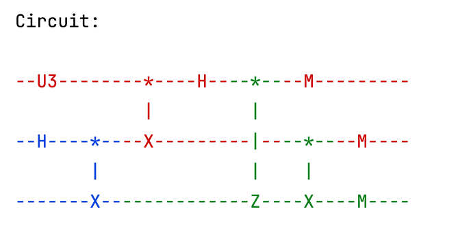

# Quantum teleportation

*Copyright (c) 2022 Institute for Quantum Computing, Baidu Inc. All Rights Reserved.*

In this tutorial, we will demonstrate the usage of QPU module by the quantum teleportation protocol. We will first introduce the background of quantum teleportation. Then we will show how to simulate this protocol with QNET and get the results of its corresponding quantum circuit by running on a simulator or a real quantum hardware device.

## 1. Background

Consider a common quantum communication scenario: Alice wants to send an unknown quantum state $|\psi \rangle$ to Bob who is far apart. But there is no quantum channel between them to transmit the quantum state directly. Due to the no-cloning principle, it is impossible for Alice to clone multiple copies of the unknown quantum state and obtain its accurate information by statistical analysis, and then send the information to Bob through a classical channel to restore the quantum state. Therefore, how to realize the long-distance transmission of quantum states becomes a key challenge. In 1993, Charles Bennett and his collaborators proposed the quantum teleportation protocol, which allowed for the long-distance transmission of quantum states utilizing quantum entanglement.

## 2. Protocol

Quantum teleportation is a key protocol in quantum information theory. The process of the protocol is as follows:

1. First, Alice and Bob need to share a pair of Bell state $|{\Phi^+} \rangle_{AB}$;
2. Next, Alice performs Bell measurement on two of her particles (one particle of the Bell state and the particle to teleport) locally;
3. Then, Alice sends her measurement outcome $M_1M_2$ to Bob through the classical channel;
4. Finally, Bob corrects the quantum state with Pauli operators according to Alice's measurement outcome and restores the teleported state $|\psi \rangle$ .

Next, we will use QNET to simulate the quantum teleportation protocol, and in particular, demonstrate the QNET syntax for implementing a quantum network protocol.

## 3. Protocol implementation

In the QPU module, we provide ``Teleportation`` class to simulate the quantum teleportation protocol. Three sub-protocols (``SubProtocol``) are defined to describe the behaviors of three roles in the protocol: ``Source`` is an entanglement source capable of generating and distributing entangled states. ``Sender`` is the sender to teleport the quantum state. ``Receiver`` is the receiver of the teleported state. In ``Teleportation`` protocol, once receiving a quantum state, one will store the state in the local quantum register for subsequent operations.


```python
class Teleportation(Protocol):

    def __init__(self, name=None):
        super().__init__(name)
        self.role = None

    class Message(ClassicalMessage):

        def __init__(self, src: "Node", dst: "Node", protocol: type, data: Dict):
            super().__init__(src, dst, protocol, data)

        @unique
        class Type(Enum):

            ENT_REQUEST = "Entanglement request"
            OUTCOME_FROM_SENDER = "Measurement outcome from the sender"

    def start(self, **kwargs) -> None:
        role = kwargs['role']
        # Instantiate a sub-protocol by its role, 
        # e.g., if role == "Sender", instantiate a "Sender" sub-protocol
        self.role = getattr(Teleportation, role)(self)
        # Start the sub-protocol
        self.role.start(**kwargs)  

    def receive_classical_msg(self, msg: "ClassicalMessage", **kwargs) -> None:
        # Call its sub-protocol to receive the classical message
        self.role.receive_classical_msg(msg)  

    def receive_quantum_msg(self, msg: "QuantumMsg", **kwargs) -> None:
        # Store the received qubit
        self.node.qreg.store_qubit(msg.data, kwargs['src'])  
        # Call its sub-protocol for additional operations
        self.role.receive_quantum_msg()  
```

### 1. Entanglement source (``Source``)

The entanglement source is responsible for entanglement generation and distribution. When the entanglement source Charlie receives a request for entanglement distribution, he will locally generate an entangled pair in Bell state $| \Phi^+ \rangle = \tfrac{1}{\sqrt{2}} (|00 \rangle + |11 \rangle)$ and send each of the two quantum states to the two communication parties separately.


```python
class Teleportation(Protocol):
    ...
    class Source(SubProtocol):

        def __init__(self, super_protocol: Protocol):
            super().__init__(super_protocol)

        def start(self, **kwargs) -> None:
            pass

        def receive_classical_msg(self, msg: "ClassicalMessage") -> None:
            # If receive an entanglement request
            if msg.data['type'] == Teleportation.Message.Type.ENT_REQUEST:
                # Generate an entangled pair locally
                self.node.qreg.h(0)
                self.node.qreg.cnot([0, 1])

                # Distribute the qubits to the nodes
                # Send the qubit with address 0 to the first node
                self.node.send_quantum_msg(dst=msg.src, qreg_address=0)  
                # Send the qubit with address 1 to the second node
                self.node.send_quantum_msg(dst=msg.data['peer'], qreg_address=1)  
```

### 2. Sender (``Sender``)

As a sender, Alice needs to send a request to the entanglement source to share an entangled pair with the receiver. After receiving the quantum state, she performs a Bell measurement on the received state and the state to teleport. Then she sends the measurement outcome $M_1M_2$ to the receiver Bob through a classical channel.


```python
class Teleportation(Protocol):
    ...
    class Sender(SubProtocol):

        def __init__(self, super_protocol: Protocol):
            super().__init__(super_protocol)
            self.peer = None
            self.ent_source = None
            self.address_to_teleport = None

        def start(self, **kwargs) -> None:
            # Receiver of the teleported state
            self.peer = kwargs['peer']  
            # Entanglement source node
            self.ent_source = kwargs['ent_source']  
            # Register address of the qubit to teleport
            self.address_to_teleport = kwargs['address_to_teleport']  
            # Send an entanglement request to the source
            self.request_entanglement()  

        def request_entanglement(self) -> None:
            # Generate an entanglement request
            ent_request_msg = Teleportation.Message(
                src=self.node, dst=self.ent_source, protocol=Teleportation,
                data={'type': Teleportation.Message.Type.ENT_REQUEST, 'peer': self.peer}
            )
            # Send the entanglement request to the source
            self.node.send_classical_msg(dst=self.ent_source, msg=ent_request_msg)

        def receive_quantum_msg(self) -> None:
            # Get the register address of the received qubit
            address_reception = self.node.qreg.get_address(self.ent_source)  
            # Perform Bell measurement
            self.node.qreg.bsm([self.address_to_teleport, address_reception])  

            # Obtain the measurement outcome
            m1 = self.node.qreg.units[self.address_to_teleport]['outcome']
            m2 = self.node.qreg.units[address_reception]['outcome']

            # Send the measurement outcome to the receiver through the classical channel
            outcome_msg = Teleportation.Message(
                    src=self.node, dst=self.peer, protocol=Teleportation,
                    data={'type': Teleportation.Message.Type.OUTCOME_FROM_SENDER,
                          'outcome_from_sender': [m1, m2]}
                )
            self.node.send_classical_msg(dst=self.peer, msg=outcome_msg)
```

### 3. Receiver (``Receiver``)

As a receiver, Bob needs to wait for both the qubit from the entanglement source and the measurement outcome $M_1M_2$ from Alice for next operations. Once both messages received, he corrects the quantum state with Pauli operators according to Alice's measurement outcome and restores the teleported state $|\psi \rangle$. To check the correctness of teleportation, we require that the receiver performs a measurement after the state correction.


```python
class Teleportation(Protocol):
    ...
    class Receiver(SubProtocol):

        def __init__(self, super_protocol: Protocol):
            super().__init__(super_protocol)
            self.peer = None
            self.ent_source = None
            self.outcome_from_sender = None

        def start(self, **kwargs) -> None:
            # Sender of the teleported state
            self.peer = kwargs['peer']  
            # Entanglement source node
            self.ent_source = kwargs['ent_source']  

        def receive_classical_msg(self, msg: "ClassicalMessage") -> None:
            # If the message is the measurement outcome from the sender
            if msg.data['type'] == Teleportation.Message.Type.OUTCOME_FROM_SENDER:
                # Save the measurement outcome from the sender
                self.outcome_from_sender = msg.data['outcome_from_sender']  
                # Get the register address of the received qubit
                address_reception = self.node.qreg.get_address(self.ent_source)  
                # If the qubit from the entanglement source is received
                if self.node.qreg.units[address_reception]['qubit'] is not None:
                    # Perform operations to correct the initial quantum state 
                    self.correct_state()

        def receive_quantum_msg(self) -> None:
            #  If the measurement outcome from the sender is received
            if self.outcome_from_sender is not None:
                # Perform operations to correct the initial quantum state
                self.correct_state()

        def correct_state(self) -> None:
            # Get the register address of the qubit received from the entanglement source
            address_reception = self.node.qreg.get_address(self.ent_source)  
            # Perform corresponding Pauli operators according to the measurement outcome from the sender
            self.node.qreg.z(address_reception, condition=self.outcome_from_sender[0])
            self.node.qreg.x(address_reception, condition=self.outcome_from_sender[1])

            # Perform measurement to check the correctness of teleportation
            self.node.qreg.measure(address_reception)
```

## 4. Code example

Next, we will use QNET to simulate a complete quantum teleportation scenario.

First, we create a simulation environment ``QuantumEnv``. Compared to the frequently-used ``DESEnv`` in the previous tutorials, ``QuantumEnv`` can interface with virtual or real quantum backends to implement quantum circuits that are automatically generated from the quantum network protocol.


```python
from qcompute_qnet.models.qpu.env import QuantumEnv

# Create an environment for simulation
env = QuantumEnv("Teleportation", default=True)
```

Then, we create the nodes that correspond to the three kinds of roles in the quantum teleportation protocol: Alice, sender of the teleported state; Bob, receiver of the teleported state; Charlie, the entanglement source. Then we configure the communication links between the nodes.

**Note**: If we specify the distance of each link, 4 logical channels (2 classical channels and 2 quantum channels) will automatically be installed in each link at the initialization.

Here we use the node template ``QuantumNode``. A ``QuantumNode`` pre-installs a quantum register for storing and processing quantum information. The size of the quantum register can be specified by passing the parameter ``qreg_size``. Additionally, users can specify the protocol installed in the protocol stack by passing the parameter ``protocol``. Here we specify this parameter as ``Teleportation``.


```python
from qcompute_qnet.models.qpu.node import QuantumNode
from qcompute_qnet.models.qpu.protocol import Teleportation
from qcompute_qnet.topology.link import Link

# Create nodes with quantum registers and specify their pre-installed protocols
alice = QuantumNode("Alice", qreg_size=2, protocol=Teleportation)
bob = QuantumNode("Bob", qreg_size=1, protocol=Teleportation)
charlie = QuantumNode("Charlie", qreg_size=2, protocol=Teleportation)

# Create the communication links
link_ab = Link("Link_ab", ends=(alice, bob), distance=1e3)
link_ac = Link("Link_ac", ends=(alice, charlie), distance=1e3)
link_bc = Link("Link_bc", ends=(bob, charlie), distance=1e3)
```

Next, we create a quantum network and install the configured nodes and links. The ``Network`` is loaded with a global quantum circuit ``default_circuit``, which is used to record the quantum circuit generated by the quantum network protocol.


```python
from qcompute_qnet.topology.network import Network

# Create a network, install the nodes and links
network = Network("Teleportation network")
network.install([alice, bob, charlie, link_ab, link_ac, link_bc])
```

Next, let Alice prepare a quantum state $|\psi \rangle$ randomly for teleportation. By calling the ``start`` method of ``QuantumNode``, we can start the protocol in the protocol stack.


```python
import numpy

# Randomly prepare a quantum state to teleport
theta, phi, gamma = numpy.random.randn(3)
print(f"Rotation angles (rad) of U3: theta: {theta:.4f}, phi: {phi:.4f}, gamma: {gamma:.4f}")
alice.qreg.u3(0, theta, phi, gamma)

# Start the teleportation protocol
alice.start(role="Sender", peer=bob, ent_source=charlie, address_to_teleport=0)
bob.start(role="Receiver", peer=alice, ent_source=charlie)
charlie.start(role="Source")
```

Finally, we initialize the simulation environment and run the simulation. By calling the ``run`` method of ``QuantumEnv``, we can run the quantum circuit generated from the protocol with different backends. Users can specify the parameter ``shots`` to set the number of sampling. Besides, users can set ``backend`` to connect to local/cloud simulators or real quantum computers to run the quantum circuit. Note that if you choose a cloud simulator, a valid ``token`` is required.

When the simulation is finished, ``QuantumEnv`` will call the ``print_circuit`` method of the ``Circuit`` class to show the circuit and return the sampling results in a dictionary. The circuit results will include the circuit's name (``circuit_name``), sampling shots (``shots``) and the sampling results (``counts``).


```python
from qcompute_qnet.quantum.backends import Backend

# Initialize the environment and run simulation
env.init()
results = env.run(shots=1024, backend=Backend.QCompute.LocalBaiduSim2, summary=False)
# Print the running results
print(f"\nCircuit results:\n", results)
```

The simulation result is shown as follows.

```
Rotation angles (rad) of U3: theta: 0.7683, phi: 0.3789, gamma: 0.4121
```



```
Colors: {'Alice': 'red', 'Charlie': 'blue', 'Bob': 'green'}

Circuit results:
 {'circuit_name': 'Circuit', 'shots': 1024, 'counts': {'000': 206, '001': 41, '010': 221, '011': 47, '100': 210, '101': 40, '110': 228, '111': 31}}
```

To check the measurement outcome of the qubit held by the receiver, Bob, we can call the ``reduce_results`` method of the ``Circuit`` class. By passing the parameter ``indices`` we can obtain the reduced results. To verify the correctness of the simulation, we can create another circuit and input the same state as Alice initially generated. Finally, we can compare the two results.

```python
from qcompute_qnet.quantum.circuit import Circuit

# Check the measurement results of the receiver
reduced_indices = [2]
reduced_results = network.default_circuit.reduce_results(results['counts'], indices=reduced_indices)
print(f"\nMeasurement results of the receiver:\n", reduced_results)

# Create a circuit and apply a U3 gate with the same parameters
comp_cir = Circuit("Circuit for verification")
comp_cir.u3(0, theta, phi, gamma)
comp_cir.measure(0)

# Check the results of the circuit
results = comp_cir.run(shots=1024, backend=Backend.QCompute.LocalBaiduSim2)
print(f"\nMeasurement results of the origin state for verification:\n", results['counts'])
```

The comparison results are given below:

```
Measurement results of the receiver:
 {'0': 865, '1': 159}

Measurement results of the origin state for verification:
 {'0': 888, '1': 136}
```

---

## References

[1] Bennett, Charles H, et al. "Teleporting an unknown quantum state via dual classical and Einstein-Podolsky-Rosen channels." [Physical Review Letters 70.13 (1993): 1895.](https://journals.aps.org/prl/abstract/10.1103/PhysRevLett.70.1895)
