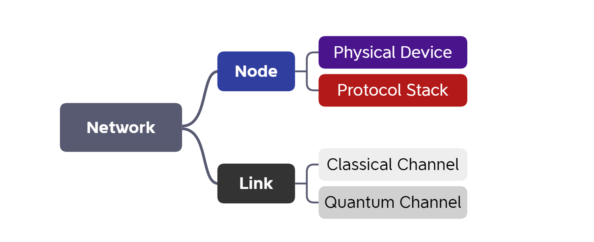
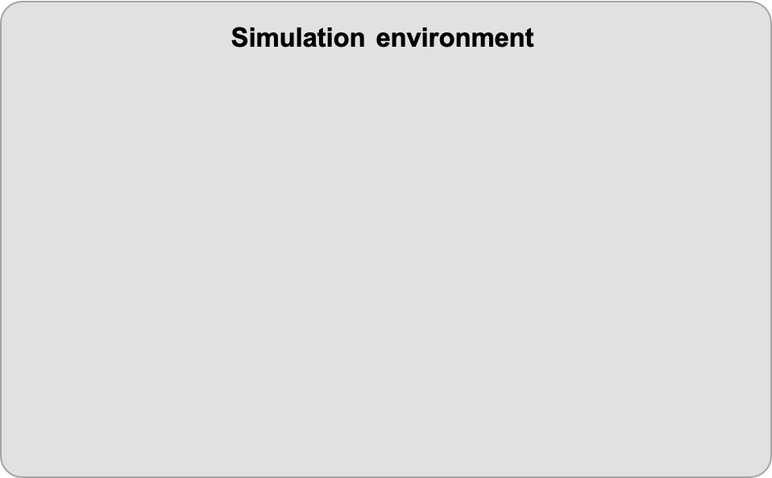
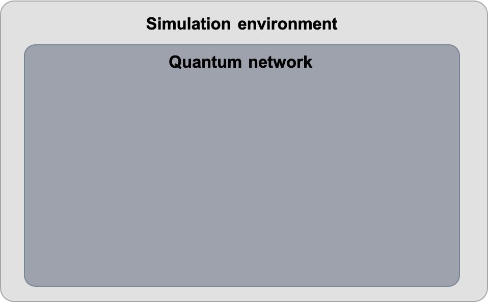
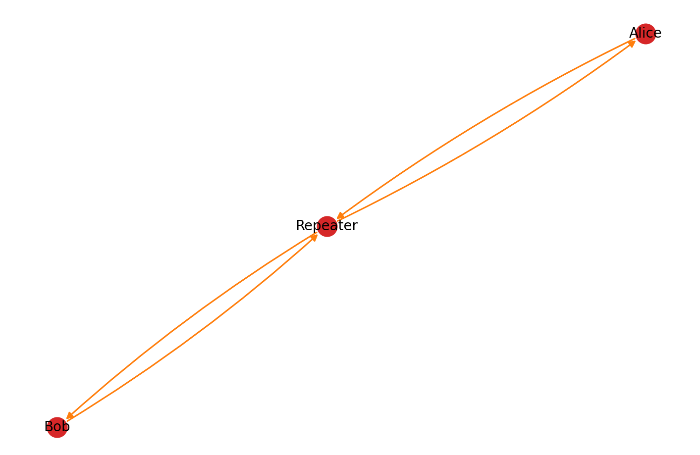
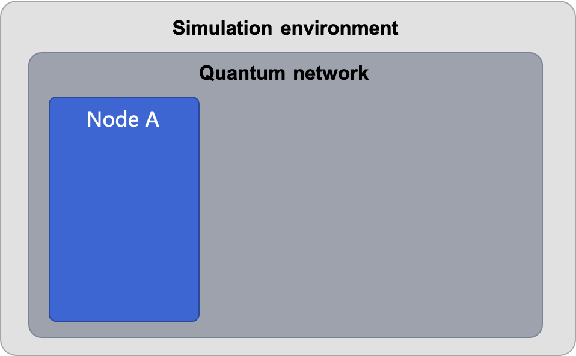
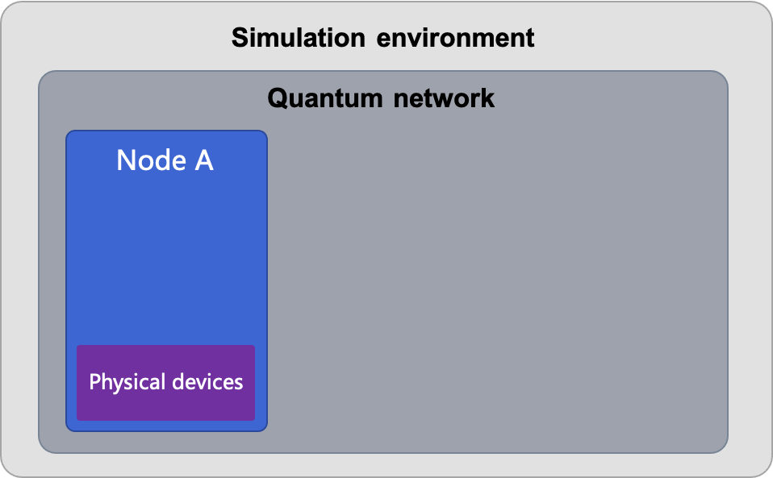
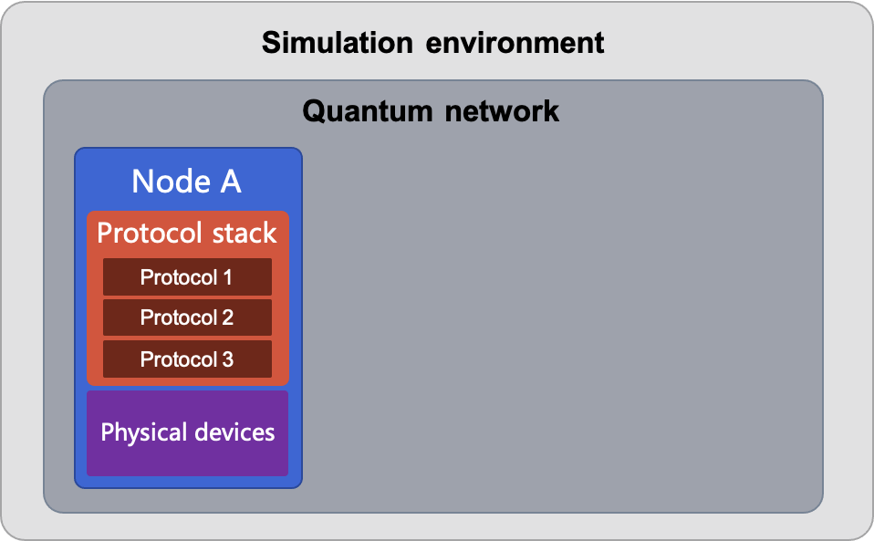
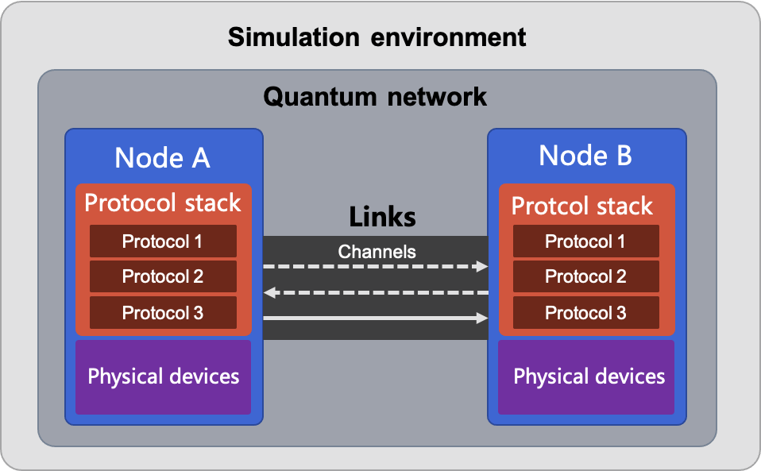

# Tour guide to quantum network simulation

*Copyright (c) 2022 Institute for Quantum Computing, Baidu Inc. All Rights Reserved.*

In the previous tutorial, we have given a simple introduction to the working mechanism of discrete-event simulation and the simulation environment `DESEnv`. With the demonstration of the queuing model, we introduced the rules to create a simulation environment and launch the simulation. To simulate a quantum network, we need a few more steps. First, we need to construct the network and complete its configuration. Then we need to attach all related entities to the simulation environment and finally simulate the interactions between them.

In this tutorial, we will introduce the basic components of quantum networks and their implementations in QNET.

## Basic components of quantum network

First, we will introduce the basic components that construct a complete quantum network (Figure 1). Same as a classical network, a quantum network is made up of nodes and links. Nodes can install certain physical devices, and work according to the loaded protocol stack, while links in a network usually include classical and quantum channels connecting nodes. More details about quantum networks can be found in Ref. [1,2].

In QNET, the quantum network and its components are all entities in the discrete-event simulation, that is, corresponding classes including `Network`, `Node`, `Link`, `Channel` and other physical devices all inherit from the class `Entity`. There is a built-in event scheduler (`Scheduler`) for each entity, which requires users to specify the simulation environment when instantiated, as the scheduler needs to find the corresponding simulation environment to schedule events on the timeline. If an entity is instantiated without a specific simulation environment, it will be added to the default environment. All entities use the `install` method of class `Entity` to add their components.

**Note**: The protocol stack is a set of network protocols. They do not belong to network entities but run as a set of rules for nodes and protocols of each layer.

Above are the basic components for the construction of a quantum network. Next, we will briefly introduce relevant modules and demonstrate how to construct a quantum network with them.



### 1. Simulation environment

Before running any simulation, we need to create a discrete-event simulation environment (`DESEnv`) at first to drive the simulation of the entire quantum network.

Moreover, we need to set the simulation environment to default (i.e., set the parameter `default=True`) to allow the entities to add themselves to the default environment automatically. This can be done by calling the method `set_default_env` as well.


```python
from qcompute_qnet.core.des import DESEnv

env = DESEnv("Simulation Env", default=True)
```



Every simulation environment provides a logging function to record key information of the simulation. We can specify parameters of the logging function (such as `path` for the output file and `level` for the log records) via the method `set_log`.


```python
env.set_log(path="./filename.log", level="INFO")
```

Having finished the instantiation of the simulation environment and construction of the network (see the rest of this tutorial), we need to call the `init` method to initialize the environment before launching the simulation. This will call the `init` method of each `Entity` to initialize all entities in the simulation environment.

After this, we can launch the network simulation by calling the `run` method of `DESEnv`. The duration of the simulation can be specified by passing the parameter `end_time` (the time unit is picosecond by default, and the time we talk about here is not the real CPU time but a virtual time) to the method. If no `end_time` specified, the `run` method will take its default value, infinite, which means the simulation will not end until the future event list in the simulation environment is empty. Moreover, we can set the bool value of the parameter `logging` which is `False` by default to decide whether to output the log files of the simulation.


```python
env.init()  # initialize the simulation environment
env.run(end_time=8e9, logging=True)  # specify the end time and whether to output a log file
```

Now we have successfully created the simulation environment. The next step is to construct the quantum network we want to simulate.

### 2. Network

Next, we need to construct a network (`Network`) to manage nodes and links.

`Network` belongs to entities in the simulation environment. It will be initialized via the `init` method while initializing the simulation environment. The initialization of a `Network` includes checking the network configuration and calculating the static routing tables.


```python
from qcompute_qnet.topology.network import Network

network = Network("Simple Network")  # create a quantum network
```



QNET provides two approaches to construct a quantum network topology.
1. Users create the nodes and links manually, then add them to the quantum network via the `install` method of class `Network`;
2. Users load the network topology from a JSON file via the `load_topology_from` method, which creates nodes and links in the network automatically according to the JSON file.


```python
network.install([node1, node2, link])  # approach 1：add nodes and links via the install method

filename = "./network_topology.json"
network.load_topology_from(filename)  # approach 2: load the network topology from a JSON file
```

Moreover, the `Network` class allows users to print its topology for convenience. One may check the classical or quantum topology figure by calling the `print_classical_topology` or the `print_quantum_topology` method.

**Note**: Please first add the nodes and links to the network via the `install` or `load_topology_from` method before calling `print_classical_topology` or `print_quantum_topology`.


```python
network.print_classical_topology()  # print the classical network topology
network.print_quantum_topology()  # print the quantum network topology
```

The following figure is a quantum network topology obtained by calling the `print_quantum_topology` method. There are two user nodes, Alice and Bob, and a repeater node in the network. Each user node has two quantum channels connecting to the repeater node.



Now we have constructed the framework of a quantum network, what to do next will be adding nodes and links to it.

### 3. Node

Nodes (`Node`) such as users and routers in a network are entities capable of information processing and communication. `Node` is one of the key components of a quantum network.

We can call the `install` method of the class `Network` to add nodes to the network.


```python
from qcompute_qnet.topology.node import Node

alice = Node("Alice")  # create a node
network.install(alice)  # add it to the network
```



Nodes can send classical or quantum messages to others by calling the `send_classical_msg` or `send_quantum_msg` method with a specified destination node parameter `dst`. From the view of discrete-event simulation, calling the methods above will actually schedule corresponding events and call the method `receive_classical_msg` or `receive_quantum_msg` of the destination node to receive the messages.


```python
alice.send_classical_msg(dst=bob, msg=cmsg)  # send a classical message
alice.send_quantum_msg(dst=bob, msg=qmsg)  # send a quantum message
```

#### 3.1 Install physical devices

After creating nodes for the network, users can add relevant physical devices. For example, a QKD node usually contains a photon source (`PhotonSource`) and a photon detector (`PolarizationDetector`). The physical devices can be added via the `install` method.


```python
from qcompute_qnet.devices.source import PhotonSource
from qcompute_qnet.devices.detector import PolarizationDetector

source = PhotonSource("Photon source")  # create a photon source
detector = PolarizationDetector("Polarization detector")  # create a photon detector

alice.install([source, detector])  # add the physical devices to the node
```

For more details about physical devices and their usages, please refer to the API documentation.



#### 3.2 Load a protocol stack

Apart from the physical devices, we need to provide the node with relevant software, i.e., protocol stack (`ProtocolStack`), which is a set of protocols (`Protocol`). Similar to the classical network, each level of the protocol stack in a quantum network relates to certain functions, which determine the rules of the transmission of classical and quantum information through the network. To complete an entire task in the network, it usually requires cooperations and communications between protocols in the protocol stack with their upper and lower layers.

We can customize a protocol stack by splicing different protocols. `ProtocolStack` class provides a `build` method to build a protocol stack after creating protocols and defining their hierarchical relationships. The protocol stack can then be loaded to a node via the `load_protocol` method. (Note that protocol stacks cannot be loaded via the `install` method because they are not entities.)


```python
from qcompute_qnet.models.qkd.key_generation import BB84
from qcompute_qnet.models.qkd.routing import QKDRouting
from qcompute_qnet.protocols.protocol import ProtocolStack

bb84 = BB84("BB84")
routing = QKDRouting("QKD Routing")
stack = ProtocolStack("QKD Network Stack")

# Build a protocol stack according to the relation of protocols on different layers,
# here we set QKD routing protocol as the upper protocol of BB84 protocol
stack.build([(routing, bb84)])  

# Load the protocol stack to the node
alice.load_protocol(stack)
```

For more details about protocols and protocol stacks, please refer to the API documentation.



#### 3.3 Frequently-used node templates

As stated above, users can create nodes, load protocol stacks and install physical devices manually. Besides this, we provide some frequently-used node templates in QNET to speed up the workflow. Users can directly use them or inherit them to customize new nodes.

For example, we provide `QKDNode` that can be used for quantum key distribution. In a `QKDNode`, we pre-install a photon source and a photon detector for it. One can access these physical devices through their attributes `photon_source` and `polar_detector` respectively. Besides, we pre-install an empty protocol stack for the `QKDNode` and allow users to set the key generation protocol by specifying parameters when instantiating a `QKDNode`.

For the sake of flexibility, we allow users to pass `peer` and keyword arguments to set parameters related to the key generation protocol to the `set_key_generation` method of `QKDNode`. This method will return a key generation protocol with configured parameters (If no keyword arguments are passed, a `BB84` protocol with default parameters will be used as the key generation protocol of `QKDNode`), and then users can manually add the returned protocol to the protocol stack.

Next, we will briefly explain how to use and configure the node template. Since the `QKDNode` has already pre-installed a photon source and a photon detector, we do not need to repeat the steps in 3.1 for configuring the physical device, but only need to set up its protocol stack.


```python
from qcompute_qnet.models.qkd.node import QKDNode

# Create QKD nodes
alice = QKDNode("Alice")
bob = QKDNode("Bob")

# Set protocols and build protocol stacks from them
bb84_alice = alice.set_key_generation(bob)
alice.protocol_stack.build(bb84_alice)

bb84_bob = bob.set_key_generation(alice)
bob.protocol_stack.build(bb84_bob)
```

For more details about the node templates, please refer to the API documentation.

Now, we have added physical devices and loaded protocol stacks to the nodes. The remaining is to connect these nodes via links to enable them to communicate with each other.

### 4. Link

`Link` is the connection of nodes in the network, indicating the connectivity of nodes. Link is a logical concept that usually contains specific classical or quantum channels that connect the nodes at both ends.

We can add links to the quantum network via the `install` method of the class `Network`.

Besides, we need to call the `connect` method of the class `Link` to realize the connection of links and nodes. (Note that there is no inclusion relation between nodes and links so we cannot establish the connection via the `install` method.)


```python
from qcompute_qnet.topology.link import Link

link_ab = Link("A_B")  # create a link
network.install(link_ab)  # add the link to the network
link_ab.connect(alice, bob)  # connect the link to two ends
```

Alternatively, we can set the `ends` parameter at the instantiation to connect with the specified nodes.


```python
from qcompute_qnet.topology.link import Link

link_ab = Link("A_B", ends=(alice, bob))  # create a link with given ends
network.install(link_ab)  # add the link to the network
```

#### 4.1 Install the communication channels

Links that connect two nodes need to install physical channels (`Channel`). There may exist classical channels or quantum channels between two nodes. We can create a classical fiber channel or a quantum fiber channel by instantiating `ClassicalFiberChannel` (inherited from `ClassicalChannel`) or `QuantumFiberChannel` (inherited from `QuantumChannel`). Similarly, we can add the channels to a link via the `install` method.

After the instantiation, we need to call the `connect` method to connect the ends of a channel to the corresponding nodes to ensure the nodes can find an actual physical channel to communicate with each other.

**Note**: The `ClassicalFiberChannel` and `QuantumFiberChannel` are both unidirectional channels, so the call of `connect` method has to set the `sender` and `receiver` in the right order.

In addition to the unidirectional channels, QNET also provides duplex channels (`DuplexChannel`) and free space channels (`FreeSpaceChannel`), please refer to the API documentation for more details.


```python
from qcompute_qnet.devices.channel import ClassicalFiberChannel, QuantumFiberChannel

# Create channels and then connect to the nodes
c1 = ClassicalFiberChannel("c_A2B", distance=1e3)
c1.connect(alice, bob)
c2 = ClassicalFiberChannel("c_B2A", distance=1e3)
c2.connect(bob, alice)

# Create channels with the specified sender and receiver
q1 = QuantumFiberChannel("q_A2B", sender=alice, receiver=bob, distance=1e3)
q2 = QuantumFiberChannel("q_B2A", sender=bob, receiver=alice, distance=1e3)

link_ab.install([c1, c2, q1, q2])  # add channels to the link
```

So far, we have finished the introduction of all basic modules for the construction of a quantum network as well as the building process. A schematic figure of the completed quantum network is shown as follows.



## A complete example

Next, we will demonstrate a simple example for a better understanding of the entire process.

Suppose we want to simulate a scenario that two users, Alice and Bob, establish a pair of keys using BB84 protocol. The process of simulation is as follows:

1. Create a simulation environment;
2. Create a network;
3. Create two QKD nodes (add physical devices) and load protocol stacks;
4. Create the link and communication channels, and connect them to the nodes;
5. Add nodes and links to the network;
6. Launch the protocols and set the roles (Note: the `BB84` protocol inherits from `PrepareAndMeasure` class and the role of node is either `TRANSMITTER` or `RECEIVER`);
7. Initialize the environment and run the simulation (for the simulation details, one can choose to output the log file for further analysis).

Here is a complete code implementation.


```python
from qcompute_qnet.core.des import DESEnv
from qcompute_qnet.topology.network import Network
from qcompute_qnet.models.qkd.node import QKDNode
from qcompute_qnet.topology.link import Link
from qcompute_qnet.devices.channel import ClassicalFiberChannel, QuantumFiberChannel
from qcompute_qnet.models.qkd.key_generation import PrepareAndMeasure

# 1. Create the simulation environment and set as default
env = DESEnv("BB84", default=True)

# 2. Create a quantum network
network = Network("BB84 Network")

# 3. Create the QKD nodes and load protocols
alice = QKDNode("Alice")
bob = QKDNode("Bob")

# Set the protocols and build the protocol stacks
bb84_alice = alice.set_key_generation(bob)
alice.protocol_stack.build(bb84_alice)

bb84_bob = bob.set_key_generation(alice)
bob.protocol_stack.build(bb84_bob)

# 4. Create and connect the link
link_ab = Link("A_B", ends=(alice, bob))

# 4.1 Create the channels and connect the nodes
cchannel1 = ClassicalFiberChannel("c_A2B", sender=alice, receiver=bob, distance=1e3)
cchannel2 = ClassicalFiberChannel("c_B2A", sender=bob, receiver=alice, distance=1e3)
qchannel = QuantumFiberChannel("q_A2B", sender=alice, receiver=bob, distance=1e3)

# 4.2 Install the channels to the link
link_ab.install([cchannel1, cchannel2, qchannel])

# 5. Install the nodes and the link to the network
network.install([alice, bob, link_ab])

# 6. Set parameters (role, key number, key length) for the start of protocol stacks
alice.protocol_stack.start(role=PrepareAndMeasure.Role.TRANSMITTER, key_num=2, key_length=256)
bob.protocol_stack.start(role=PrepareAndMeasure.Role.RECEIVER, key_num=2, key_length=256)

# 7. Initialize the environment and run simulation with log records turned on
env.init()
env.run(logging=True)
```

Above are all the steps for simulating a quantum network with QNET. By the introduction and code demonstration, we hope that users can get a basic understanding of the simulation process. We also encourage users to use QNET to design new quantum network protocols and push this field of research further.

---

## References

[1] Kimble, H. Jeff. "The quantum internet." [Nature 453.7198 (2008): 1023-1030.](https://www.nature.com/articles/nature07127)

[2] Wehner, Stephanie, David Elkouss, and Ronald Hanson. "Quantum internet: A vision for the road ahead." [Science 362.6412 (2018): eaam9288.](https://www.science.org/doi/abs/10.1126/science.aam9288)
