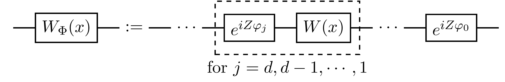
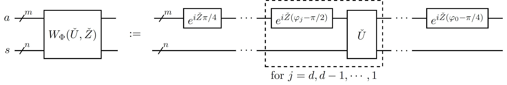
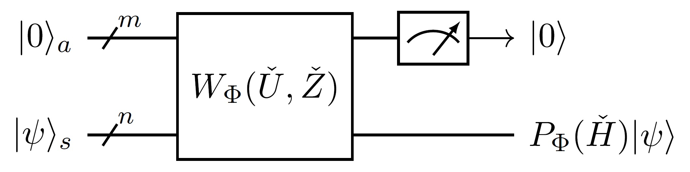
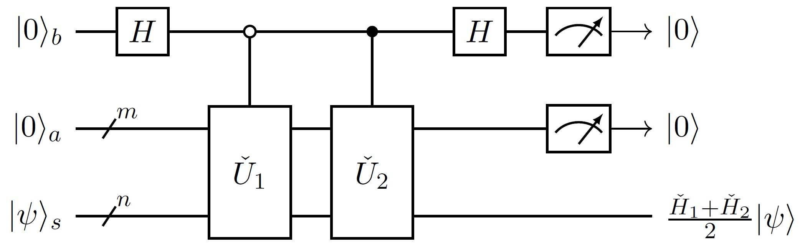

# 理论简述

*版权所有 (c) 2022 百度量子计算研究所，保留所有权利。*

量子力学中，系统的能量由**哈密顿量**所描述，求解给定系统的哈密顿量的性质，构成了凝聚态物理、高能物理和计算化学等一系列学科的核心问题。然而，由于态空间的维数随着系统自由度的增加而指数级增加，导致一般情况下无法利用经典计算机有效模拟量子系统——即便用光全世界的内存和硬盘也不能直接储存一个仅几百量子比特的系统的态矢量。与经典计算机不同，量子计算机由于其所有的操作都是直接作用在同样为指数级别的态空间上，因而在模拟一个量子系统上量子计算机具有经典计算机无法比拟的天然优势。实际上，设计一个可控的量子系统来高效模拟自然界中的量子系统，正是著名物理学家理查德·费曼在上世纪 80 年代提出量子计算这一概念时的最初想法$^{[1]}$：

>"大自然不是经典的，如果你想模拟它的话，那你最好使用量子力学。"

通用量子计算机以及一系列量子模拟器的发展令费曼的设想有了实现的可能。在通用量子计算机上进行**数字量子模拟**——利用量子门构造量子线路以实现模拟量子系统演化的操作，由于该方法具有较高的可拓展性和通用性，因而被认为是最有潜力的技术路线。具体来说，就是输入一个哈密顿量 $\check H$ 的某种编码形式，要在量子电路层面实现其 $\tau$ 时间演化算子 $e^{-i\check H\tau}$。

近年，**量子信号处理**理论$^{[3]}$被 Low 等提出，其在哈密顿量模拟这一问题上达到算法复杂度的渐进最优$^{[4]}$，进而大放异彩；其引申出的**量子比特化**$^{[5]}$、**量子奇异值变换**$^{[7]}$算法作为量子算法工具与模板$^{[9]}$吸引了更多学者的研究。然而当将这些理论应用到具体实际的问题时，在算法层面所必须且唯一需要面对的问题，便是量子信号处理的处理参数的计算$^{[6,8,9,10]}$。

在基于量子比特化算法或量子奇异值变换的哈密顿量模拟任务中，计算量子信号处理的处理参数是最困难的。Dong 等提出了对称量子信号处理，并可以基于优化方法更好地计算对称量子信号处理的处理参数$^{[10,11]}$。

本篇作为量子奇异值变换工具集教程的概述，带领读者简要地了解量子信号处理、块编码、酉线性组合、量子特征值变换等量子算法与工具，以便使用量子奇异值变换工具集进行进一步的学习与探索。更多的技术细节、更严谨的理论结果等参见后续章节的详细介绍，推荐按照顺序阅读学习。读者也可以参考[量桨](https://qml.baidu.com/)教程中[《量子信号处理与量子奇异值变换》](https://qml.baidu.com/tutorials/quantum-simulation/quantum-signal-processing-and-quantum-singular-value-transformation.html)一节，更深入地学习这些理论。关于代码实现，以及部分未展示的细节可以参考量子奇异值变换的 [API 文档](https://quantum-hub.baidu.com/docs/qsvt/)。

---

## 量子信号处理

**量子信号处理**最初被设计成一种单量子比特演化模型$^{[3]}$，通过交替地调用量子信号和量子处理两种量子门形成量子电路，来实现对信号的处理效果。特别地，这里系对单一信号执行多次处理。

具体地，量子信号处理电路 $W_\Phi(x)$ 可以被认为是单变量 $x$ 的**矩阵函数**，而 $\Phi$ 作为该函数的参变量，编码了这个矩阵函数：

其中 $W(x)$ 为 $Rx$ 型信号量子门，编码有信号参数 $x\in[-1,1]$；各 $e^{iZ\varphi_j}$ 为 $Rz$ 型处理量子门，对应某次处理操作，编码有处理参数 $\Phi=(\varphi_0,\varphi_1,\cdots,\varphi_d)\in\mathbb R^{d+1}$ 的分量 $\varphi_j$。

基于单比特量子电路的酉性质，我们可以将量子信号处理电路 $W_\Phi(x)$ 表示为：

$$
W_{\Phi}(x)= \begin{pmatrix}
P_\Phi(x)&i\sqrt{1-x^2}Q_\Phi(x)\\
i\sqrt{1-x^2}Q_\Phi^*(x)&P_\Phi^*(x)
\end{pmatrix},
$$

其中 $P_\Phi(x)$ 和 $Q_\Phi(x)$ 都是 $x$ 的复系数多项式，$*$ 表示多项式的复共轭多项式。我们可称 $P_\Phi$ 为量子信号处理函数，即我们想对信号 $x$ 执行的处理效果。

## 块编码

**块编码**是一种量子编码方法$^{[5]}$。因为量子电路模型当中，所有的量子操作都是以量子门或者量子门组合而成的量子电路来实现，这样一来，这些量子操作的矩阵形式必然是酉矩阵。对于那些并非酉矩阵的量子操作，我们需要引入合适的编码方式，使得它可以被很好地调用。

所谓块编码，就是将所需编码的量子操作，作为矩阵编码在一个规模更大的量子操作对应的矩阵里，比如

$$
\check U=\begin{pmatrix}\check H&\cdot\\\cdot&\cdot\end{pmatrix}
$$

中 $\check H$ 就被编码在了 $\check U$ 的左上角。若 $\check U$ 和 $\check H$ 分别是 $m+n$ 和 $n$ 比特的量子操作，我们通过对 $|0\rangle\otimes|\psi\rangle$ 作用 $\check U$，来得到

$$
\check U\left(|0\rangle\otimes|\psi\rangle\right)=|0\rangle\otimes\left(\check H|\psi\rangle\right)+|0^\perp\rangle,
$$

这里我们可以通过对前 $m$ 个比特的系统的输出态进行测量并选择，当状态确实在 $|0\rangle$ 时，后 $n$ 个比特的系统就将塌缩到（归一化后的）量子态 $\check H|\psi\rangle$。我们可以将这个流程记为：

此时，我们称 $\check U$ 是 $\check H$ 的一个块编码，$\check H$ 是 $\check U$ 的块。 

注：在本教程中，我们使用 $s,a,b,c,\cdots$ 指代不同的量子系统，其中 $s$ 表示系统寄存器，$a,b,c,\cdots$ 表示依次引入的辅助寄存器。我们给量子系统或量子操作添加角标，以注明它是对应量子系统（或联合系统）上的量子态或量子操作。

## 量子特征值变换

面向初学者地，本篇中我们这里只介绍量子奇异值变换退化版本的**量子特征值变换**$^{[4]}$。量子特征值变换，顾名思义，我们要量子地实现特征值的变换。

沿用前述块编码的符号，我们假定 $2^n$ 维厄米矩阵 $\check H$ 被块编码在 $m+n$ 比特量子黑盒 $\check U$ 的左上角，且 $\check U$ 满足 $\check U^\dagger=\check U$（即黑盒 $\check U$ 同时也是厄米的）。设 $\check H$ 有谱分解 $\check H=\sum_\lambda \lambda|u_\lambda\rangle\langle u_\lambda|$，其中 $\lambda$ 是 $\check H$ 的特征值，$|u_\lambda\rangle$ 为对应的特征态。

引入前 $m$ 个量子比特构成的系统 $a$ 上绕子空间 $|0\rangle\langle0|$ 的高维旋转算子

$$
e^{i\check Z\varphi}:=e^{i\varphi}|0\rangle\langle0|+e^{-i\varphi}(I-|0\rangle\langle0|),
$$

则可实现量子特征值变换电路：

可以证明，它恰是信号处理函数 $P_\Phi$ 的在矩阵 $\check H$ 处的矩阵函数像

$$
P_\Phi(\check H):=\sum_\lambda P_\Phi(\lambda)|u_\lambda\rangle\langle u_\lambda|
$$

的块编码:

如此，我们便从 $\check H$ 的块编码得到了 $P_\Phi(\check H)$ 的块编码，简言之，我们实现了块到块的量子特征值变换。

## 酉线性组合

**酉线性组合**是一种常见的构建块编码的方法$^{[2]}$。我们不仅可以使用酉线性组合来实现块编码的输入，也可以进一步实现块编码的线性组合。

这里只用最简单的例子来演示下块编码的线性组合：如果我们有相同规模的量子黑盒 $\check U_1$ 和 $\check U_2$ 分别块编码了相同规模的矩阵 $\check H_1$ 和 $\check H_2$，那么量子操作

$$
|+\rangle\langle+|\otimes \check U_1 + |-\rangle\langle-|\otimes \check U_2=\frac{1}{2}
\begin{pmatrix}
\check U_1+\check U_2&\check U_1-\check U_2\\
\check U_1-\check U_2&\check U_1+\check U_2
\end{pmatrix}
$$
 
便是 $\frac{\check U_1+\check U_2}{2}$ 的块编码，进一步也是 $\frac{\check H_1+\check H_2}{2}$ 的块编码。这里上述量子操作可以用 $\check U_1$ 和 $\check U_2$ 控制版本的量子黑盒以及若干单比特门来电路实现。

作为一个推论，我们可以把量子特征值变换酉线性组合起来，得到形如 $\frac{P_{\Phi_1}(\check H)+P_{\Phi_2}(\check H)}{2}$ 操作的块编码。如此，我们可以突破量子信号处理函数的限制，实现更复杂的量子特征值变换，这里就不再详述了。

## 哈密顿量模拟

**哈密顿量模拟**是量子计算中一个重要的议题。假设一个系统的哈密顿量为 $\check H$，根据薛定谔方程，它的 $\tau$ 时间演化算子为 $e^{-i\check H\tau}$。在量子计算中，哈密顿量模拟需要我们在输入 $\check H$ 的某种编码及演化时间 $\tau$ 后，输出量子电路 $\check C$，使得 $\check C$ 与 $e^{-i\check H\tau}$ 之间的误差小于既定的计算精度 $\epsilon$。实现哈密顿量模拟的算法有很多，这里我们继续围绕量子特征值变换来完成演示。

如前所述，我们依旧假设哈密顿量 $\check H$ 被块编码在厄米的量子黑盒 $\check U$ 中。若我们能找到 $\Phi$ 使得 $P_\Phi(x)\approx e^{-i\tau x}$，那么对应的量子特征值变换电路 $W_\Phi(\check H,\check Z)$ 就近似是 $e^{-i\check H\tau}$ 的块编码。

因为量子信号处理函数本身具有奇偶性限制，为了能更好地提高模拟精度，我们需要将特征值变换函数拆分成若干个部分，比如

$$
e^{-i\tau x}=\cos(\tau x)-i\sin(\tau x),
$$

然后分别寻找 $\Phi_{\mathfrak{R}}$ 和 $\Phi_{\mathfrak{I}}$，使得

$$
\forall\,x\in[-1,1],\ P_{\Phi_{\mathfrak{R}}}\left(x\right)\approx \cos(\tau x),\ P_{\Phi_{\mathfrak{I}}}\left(x\right)\approx -i\sin(\tau x),
$$

再基于酉线性组合得到 $\frac{P_{\Phi_{\mathfrak{R}}}(\check H)+ P_{\Phi_{\mathfrak{I}}}(\check H)}{2}\approx\frac{e^{-i\check H\tau}}{2}$ 的块编码电路。考虑到这与我们所预期的 $e^{-i\check H\tau}$ 还相差一个常数倍，需要再引入振幅放大的技巧，便可得到 $e^{-i\check H\tau}$ 的近似块编码电路。 

---

## 参考资料
[1] Feynman, R. P. "Simulating physics with computers." International Journal of Theoretical Physics 21.6 (1982).  
[2] A. M. Childs and N. Wiebe, “Hamiltonian Simulation Using Linear Combinations of Unitary Operations,” Quantum Information & Computation 12, 901 (2012).  
[3] Low, Guang Hao, Theodore J. Yoder, and Isaac L. Chuang. "Methodology of resonant equiangular composite quantum gates." Physical Review X 6.4 (2016): 041067.  
[4] Low, Guang Hao, and Isaac L. Chuang. "Optimal Hamiltonian simulation by quantum signal processing." Physical review letters 118.1 (2017): 010501.  
[5] Low, Guang Hao, and Isaac L. Chuang. "Hamiltonian simulation by qubitization." Quantum 3 (2019): 163.  
[6] J. Haah. Product decomposition of periodic functions in quantum signal processing. Quantum, 3:190, 2019.  
[7] Gilyén, András, et al. "Quantum singular value transformation and beyond: exponential improvements for quantum matrix arithmetics." Proceedings of the 51st Annual ACM SIGACT Symposium on Theory of Computing. 2019.  
[8] Chao, Rui, et al. "Finding angles for quantum signal processing with machine precision." arXiv preprint arXiv:2003.02831 (2020).  
[9] Martyn, John M., et al. "Grand unification of quantum algorithms." PRX Quantum 2.4 (2021): 040203.  
[10] Dong, Yulong, et al. "Efficient phase-factor evaluation in quantum signal processing." Physical Review A 103.4 (2021): 042419.  
[11] Wang, Jiasu, Yulong Dong, and Lin Lin. "On the energy landscape of symmetric quantum signal processing." arXiv preprint arXiv:2110.04993 (2021).  

