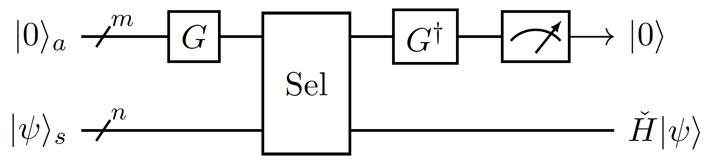

# 块编码与酉线性组合

*版权所有 (c) 2022 百度量子计算研究所，保留所有权利。*

## 块编码

**块编码**（Block-Encoding）是一种量子编码方法，在 $[2]$ 中被首度提出。因为量子电路模型当中，所有的量子操作都是以量子门或者量子门组合而成的量子电路来实现，这样一来，可以实现的操作被限制为酉操作。那些非酉的操作便需要引入合适的编码方式，以使它可以被很好地调用。

所谓块编码，就是将所需编码的量子操作，作为矩阵编码在一个规模更大的量子操作对应的矩阵里，比如

$$
\check U=\begin{pmatrix}\check H&\cdot\\\cdot&\cdot\end{pmatrix}
$$

中 $\check H$ 就被编码在了 $\check U$ 的左上角。

严格地，假设 $\check H$ 是 $n$ 比特的量子操作，若 $\check U$ 为 $m+n$ 比特的量子操作（$m\ge1$）且满足

$$
\left(\langle0|^{\otimes m}\otimes I_{2^n}\right)\cdot \check U\cdot\left(|0\rangle^{\otimes m}\otimes I_{2^n}\right)=\check H,\tag{1}
$$

我们就称 $\check H$ 是 $\check U$ 的块，$\check U$ 是 $\check H$ 的一个块编码，或者 $\check U$ 块编码了 $\check H$。这里 $I_{2^n}$ 表示 $2^n$ 维单位矩阵。

为了简化记号，在本教程中，我们使用 $s,a,b,c,\cdots$ 指代不同的量子系统，其中 $s$ 表示系统寄存器，$a,b,c,\cdots$ 表示依次引入的辅助寄存器。我们给量子系统或量子操作添加角标，以注明它是对应量子系统（或联合系统）上的量子态或量子操作。如此，可以略去不产生影响的单位操作，记后 $n$ 个比特所在的量子寄存器为系统寄存器 $s$，前 $m$ 个比特所在的量子寄存器为辅助寄存器 $a$，并简记 $|0\rangle^{\otimes m}$ 为 $|0\rangle$，那么上述块编码定义式 $(1)$ 可简记为：

$$
\langle0|_a \check U_{as}|0\rangle_a=\check H_s.
$$

可以证明 $\check U$ 在 $|0\rangle_a|\psi\rangle_s$ 上的作用结果为：

$$
\check U_{as}|0\rangle_a|\psi\rangle_s=|0\rangle_a(\check H|\psi\rangle)_s+|0^\perp\rangle_{as},
$$

其中 $|0^\perp\rangle_{as}$ 满足 $\langle 0|_a|0^\perp\rangle_{as}=0_s$ 是寄存器 $s$ 上的 $0$ 算子。这里我们可以通过对寄存器 $a$ 的输出态进行测量并选择，当状态确实在 $|0\rangle$ 时，寄存器 $s$ 中的量子态就将塌缩到 $\check H|\psi\rangle$ 的归一化

$$
\frac{\check H|\psi\rangle}{\sqrt{\langle\psi|\check H^\dagger\check H|\psi\rangle}},
$$

相应的，寄存器 $a$ 被测量到 $|0\rangle$ 的概率即 $1/\langle\psi|\check H^\dagger\check H|\psi\rangle$。在电路表示下，我们可以将这个流程简记为：

注：酉矩阵 $\check U$ 的块 $\check H$ 都会有 $\|\check H\|_2\le 1$ 的限制，这里范数 $\|\cdot\|_2$ 定义为矩阵最大的奇异值。对于 $\|\check H\|_2>1$ 的矩阵，我们可以尝试构造其归一化后的矩阵 $\check H/\|\check H\|_2$ 的块编码。 

## 酉线性组合

**酉线性组合**$^{[1]}$（Linear Combination of Unitary Operations，LCU）是一种常见的构建块编码的方法。我们不仅可以使用酉线性组合来实现块编码的输入，也可以进一步实现块编码的线性组合。

对方阵 $\check H$，若其可以表示成若干相同规模的酉矩阵的复线性组合：

$$
\check H=\sum_j c_jU_j,
$$

那么我们便可以基于 $U_j$ 给出 $\check H$ 的一个块编码。考虑到 $\frac{c_j}{|c_j|}U_j$ 也是酉矩阵，这里不妨假设各系数 $c_j$ 为正实数。令 $G$ 为量子态 $\sum_j\sqrt{c_j}|j\rangle$ 的制备电路，即 $G|0\rangle=\sum_j\sqrt{c_j}|j\rangle$，记

$$
\operatorname{Sel}_{as}:=\sum_j\left(|j\rangle\langle j|\right)_a\left(U_{j}\right)_s,
$$

那么我们有

$$
\langle0|_aG^\dagger_a\operatorname{Sel}_{as}G_a|0\rangle_a=\check H_s,
$$ 

即 $G_a^\dagger\operatorname{Sel}_{as}G_a$ 是 $\check H$ 的一个块编码。

## 例

接下来我们举两个例子来演示酉线性组合。

### 泡利线性组合

记 $H=\frac{1}{\sqrt{2}}(X+Z)$ 为阿达玛门，以如下两比特量子操作为例，

$$ 
\frac12H\otimes H=\frac{1}{4}X\otimes X+\frac{1}{4}X\otimes Z+\frac{1}{4}Z\otimes X+\frac{1}{4}Z\otimes Z,
$$

取 $G=H\otimes H$，我们有 $G|0\rangle=\frac{1}{2}\left(|0\rangle+|1\rangle+|2\rangle+|3\rangle\right)$；取 

$$
\operatorname{Sel}_{as}=
|0\rangle\langle0|\otimes X\otimes X+
|1\rangle\langle1|\otimes X\otimes Z+
|2\rangle\langle2|\otimes Z\otimes X+
|3\rangle\langle3|\otimes Z\otimes Z
$$

便有 $G_a^\dagger\operatorname{Sel}_{as}G_a$ 是 $H\otimes H$ 的块编码。

推而广之，$2^n$ 维的厄米矩阵总能表示成 $n$ 比特泡利矩阵的实线性组合，基于此，我们总能实现这类厄米矩阵的块编码。

### 块编码的酉线性组合

另一个例子是“块编码的线性组合是线性组合的块编码”，说来绕口，但理解起来并不复杂：

若 $m+n$ 比特酉操作 $\check U_1,\cdots,\check U_j,\cdots$ 分别在各自的左上角编码了 $2^n$ 维矩阵 $\check H_1,\cdots,\check H_j,\cdots$，那么其任意的线性组合 $\sum_jc_j\check U_j$ 也必在左上角编码了 $2^n$ 维矩阵 $\sum_jc_j\check H_j$。进一步，$\sum_jc_j\check U_j$ 的块编码，比如酉线性组合电路，便也同时是 $\sum_jc_j\check H_j$ 的块编码。需要区别的是，这里的辅助系统从一个扩充成了两个，分别是起初块编码各 $\check H_j$ 的辅助系统，另一是实现酉线性组合电路时额外引入的辅助系统。

这一点将在量子特征值变换、量子奇异值变换两节中将再次被用到。

---

## 参考资料

[1] A. M. Childs and N. Wiebe, “Hamiltonian Simulation Using Linear Combinations of Unitary Operations,” Quantum Information & Computation 12, 901 (2012).  
[2] Low, Guang Hao, and Isaac L. Chuang. "Hamiltonian simulation by qubitization." Quantum 3 (2019): 163.  