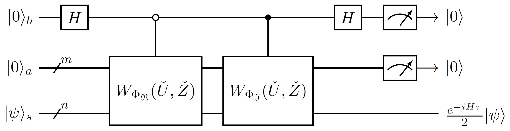
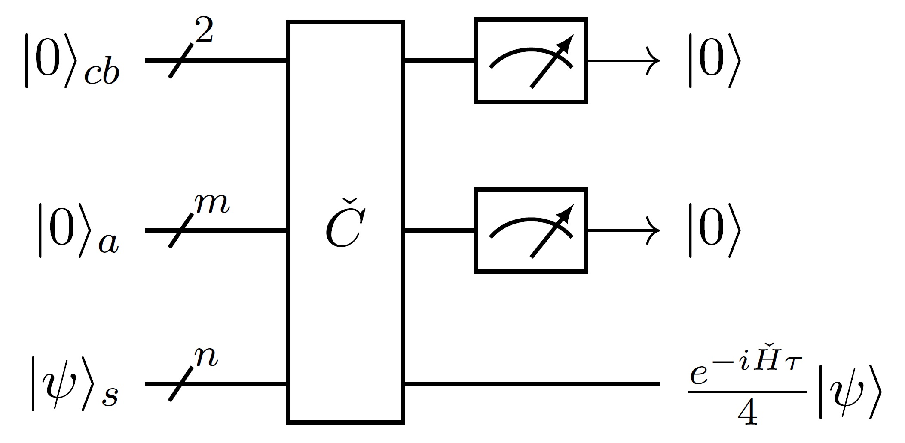

# 哈密顿量模拟

*版权所有 (c) 2022 百度量子计算研究所，保留所有权利。*

## 定义

本篇我们继续介绍**哈密顿量模拟**（Hamiltonian Simulation）。假设一个系统的哈密顿量不随时间变化，设为 $\check H$，根据薛定谔方程

$$
i\frac{d}{dt}|\psi(t)\rangle=\check H|\psi(t)\rangle,
$$

我们可以得到 $\tau$ 时刻与 $0$ 时刻系统量子态之间的关系为

$$
|\psi(\tau)\rangle= e^{-i\check H\tau}|\psi(0)\rangle.
$$

只要我们能量子地实现算符 $e^{-i\check H\tau}$，便能模拟该系统 $\tau$ 时间长度前后的量子态间演化。我们称算符 $e^{-i\check H\tau}$ 为哈密顿量 $\check H$ 的 $\tau$ 时间演化算符，使用量子电路近似实现时间演化算符的过程为**数字量子模拟**（Digital Quantum Simulation）。

具体地，我们需要在输入哈密顿量 $\check H$ 的某种编码及时间 $\tau$ 后，构造量子电路 $\check C$，使得 $\check C$ 与 $e^{-i\check H\tau}$ 之间的误差小于既定的计算精度 $\epsilon$。后面我们将继续围绕量子特征值变换和量子奇异值变换来实现数字量子模拟。

## 变换函数拆分

如前所述，我们依旧假设 $n$ 比特量子系统的哈密顿量 $\check H$ 被块编码在 $m+n$ 比特厄米量子黑盒 $\check U$ 的左上角。根据量子特征值变换，若我们能找到处理参数 $\Phi$ 使得量子信号处理函数 $P_\Phi(x)\approx e^{-i\tau x}$，那么量子特征值变换电路 $W_\Phi(\check H,\check Z)$ 就近似是 $e^{-i\check H\tau}$ 的块编码。

注：考虑到 $e^{-i\check H\tau}=e^{-i\left(\check H/s\right)\cdot\left(s\tau\right)}$，当 $\|\check H\|_2>1$ 时，我们可以假设 $\check U$ 是 $\check H/s$ 的块编码，其中 $s>\|\check H\|_2$，范数 $\|\check H\|_2$ 是 $\check H$ 的最大奇异值（这里也是最大特征值），然后改为实现哈密顿量 $\check H/s$ 的 $s\tau$ 时间演化算符。

因为量子信号处理函数本身具有奇偶性限制，为了能更好地提高模拟精度，我们需要将特征值变换函数拆分成两个部分，比如

$$
e^{-i\tau x}=\cos(\tau x)-i\sin(\tau x),
$$

然后分别寻找处理参数 $\Phi_{\mathfrak{R}}$ 和 $\Phi_{\mathfrak{I}}$，使得

$$
\forall\,x\in[-1,1],\ P_{\Phi_{\mathfrak{R}}}\left(x\right)\approx \cos(\tau x),\ P_{\Phi_{\mathfrak{I}}}\left(x\right)\approx -i\sin(\tau x),
$$

再基于块编码的酉线性组合得到 $\frac{P_{\Phi_{\mathfrak{R}}}(\check H)+ P_{\Phi_{\mathfrak{I}}}(\check H)}{2}\approx\frac{e^{-i\check H\tau}}{2}$ 的块编码电路。

## 逼近多项式

上小节中提到要找处理参数使得量子信号处理函数逼近于三角函数，真实的做法是先找到三角函数的逼近多项式，再由逼近多项式出发寻找对应的处理参数。

由雅可比–安格尔展开$^{[6]}$

$$
\begin{aligned}
&\cos(\tau x)= \frac12J_0(\tau)+\sum_{j=1}^\infty J_{2j}(\tau)T_{4j}(x),\\
&\sin(\tau x)= \sum_{j=1}^\infty J_{2j-1}(\tau)U_{4j-3}(x), 
\end{aligned}\tag{1}
$$

其中 $T_k(x)=\cos(k\arccos x),\ U_k(x)=\sin((k+1)\arccos x)/\sqrt{1-x^2}$ 分别为第一、二类切比雪夫多项式，

$$
J_k(\tau)=\frac{1}{\pi}\int_0^\pi \cos\left(kt-\tau\sin t\right)dt
$$

为第一类贝塞尔函数。可以证明 $(1)$ 中两级数均以指数速度收敛，我们便对两级数选择一个合适的截断，即可得到近似多项式 $f_{\cos}(x)\approx \cos(\tau x)$ 与 $f_{\sin}(x)\approx \sin(\tau x)$，再通过量子信号处理的参数计算算法，便可计算出对应近似演化的处理参数 $\Phi_{\mathfrak{R}}$ 与 $\Phi_{\mathfrak{I}}$，使得：

$$
P_{\Phi_{\mathfrak{R}}}\approx f_{\cos},\ P_{\Phi_{\mathfrak{I}}}\approx -if_{\sin}.
$$

## 对称量子信号处理

然而实际情况下，为了能完成更长时间的哈密顿量模拟，我们采取了具有更好算法稳定性的对称量子信号处理及优化算法，来分别寻找 $\Phi_{\mathfrak{R}}$ 和 $\Phi_{\mathfrak{I}}$ 使得：

$$
\forall\,x\in[-1,1],\ \frac{P_{\Phi_{\mathfrak{R}}}(x)+P_{\Phi_{\mathfrak{R}}}^*(x)}{2}\approx \frac{f_{\cos}(x)}{2},\ \frac{P_{\Phi_{\mathfrak{I}}}(x)+P_{\Phi_{\mathfrak{I}}}^*(x)}{2}\approx \frac{f_{\sin}(x)}{2},
$$

进一步有：

$$
\frac{(P_{\Phi_{\mathfrak{R}}}(x)+P_{\Phi_{\mathfrak{R}}}^*(x))-i(P_{\Phi_{\mathfrak{I}}}(x)+P_{\Phi_{\mathfrak{I}}}^*(x))}{4}\approx\frac{f_{\cos}(x)-if_{\sin}(x)}{4}\approx\frac{e^{-i\tau x}}{4}.
$$

基于块编码的酉线性组合，我们可以实现 $e^{-i\check H\tau}/4$ 的近似块编码电路 $\check C$，即

$$
\langle0|_{cba}\check C_{cbas}|0\rangle_{cba}\approx\left(e^{-i\check H\tau}/4\right)_s.
$$

可简记为

## 定点振幅放大

对于 $\check C$ 近似块编码了 $e^{-i\check H\tau}/4$ 这种情形，编码块的奇异值均近似为 $1/4$，只要我们能找到一个奇信号处理函数 $P_\Phi$ 能将奇异值 $1/4$ 映射为模长为 $1$ 的复数 $z$，我们便有量子奇异值变换电路 $W_\Phi(\check C,\hat Z)$ 近似是 

$$
P_\Phi^{(SV)}\left(e^{-i\check H\tau}/4\right)\approx ze^{-i\check H\tau}
$$

的块编码，忽略掉全局相位 $z$，我们便实现了 $e^{-i\check H\tau}$ 的块编码电路 $W_\Phi(\check C,\hat Z)$，其中

$$
\hat Z=(2|0\rangle\langle0|-I)_{cb}.
$$

取 

$$
\begin{aligned}
\Phi_{\operatorname{AA}}:=\left(\hat\varphi_0,\hat\varphi_1,\cdots,\hat\varphi_7\right):=\frac{1}{2}\left(0,-\arccos\frac{1}{3},-\arccos\frac{7}{9},0,0,\arccos\frac{7}{9},\arccos\frac{1}{3},0\right)\in\mathbb R^8,
\end{aligned}
$$
 
我们可以计算出

$$
P_{\Phi_{\operatorname{AA}}}(x)=\frac{1024 x^7}{27}-\frac{640 x^5}{9}+\frac{364 x^3}{9}-\frac{169 x}{27}\in\mathbb R[x]
$$

满足 $P_{\Phi_{\operatorname{AA}}}(1/4)=-1$。那么量子奇异值变换电路 $\check C_{\operatorname{AA}}:=W_{\Phi_{\operatorname{AA}}}(\check C,\hat Z)$ 便是

$$
P_\Phi^{(SV)}\left(e^{-i\check H\tau}/4\right)= -e^{-i\check H\tau}
$$

的近似块编码。

注：对于 $\check C_{\operatorname{AA}}$ 这种近似编码了酉矩阵的情形，

$$
\langle0|_{cba}(\check C_{\operatorname{AA}})_{cbas}|0\rangle_{cba}\approx-\left(e^{-i\check H\tau}\right)_s
$$

等价于

$$
(\check C_{\operatorname{AA}})_{cbas}|0\rangle_{cba}\approx-|0\rangle_{cba}\left(e^{-i\check H\tau}\right)_s,
$$

具体地，量子电路表示可以改记为：

如此表述时，$cba$ 三个系统的量子比特可以被近似认为是零化辅助量子比特$^{[7]}$（Zeroed Qubit）。

---

## 参考资料
[1] Low, Guang Hao, and Isaac L. Chuang. "Optimal Hamiltonian simulation by quantum signal processing." Physical review letters 118.1 (2017): 010501.  
[2] Low, Guang Hao, and Isaac L. Chuang. "Hamiltonian simulation by qubitization." Quantum 3 (2019): 163.  
[3] Gilyén, András, et al. "Quantum singular value transformation and beyond: exponential improvements for quantum matrix arithmetics." Proceedings of the 51st Annual ACM SIGACT Symposium on Theory of Computing. 2019.  
[4] Martyn, John M., et al. "Grand unification of quantum algorithms." PRX Quantum 2.4 (2021): 040203.  
[5] Dong, Yulong, et al. "Efficient phase-factor evaluation in quantum signal processing." Physical Review A 103.4 (2021): 042419.  
[6] wiki, Jacobi-Anger expansion, https://en.wikipedia.org/wiki/Jacobi%E2%80%93Anger_expansion  
[7] Craig Gidney. “Constructing Large Controlled Nots.” https://algassert.com/circuits/2015/06/05/Constructing-Large-Controlled-Nots.html  
