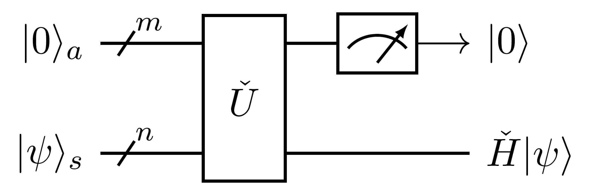

# Brief Introduction

*Copyright (c) 2022 Institute for Quantum Computing, Baidu Inc. All Rights Reserved.*

In quantum mechanics, the energy of a system is described by its **Hamiltonian**. It constitutes the core problem of a series of disciplines to solve the properties of the Hamiltonian for a given system, such as condensed matter physics, high-energy physics, and computational chemistry. However, since the dimension of the state space increases exponentially with the increase of the system, it is generally impossible to use classical computers to simulate quantum systems effectively. Even if the memories and hard drives are used up all over the world, the state vector of a system with only a few hundred qubits cannot be directly stored. Unlike classical computers, quantum computers have natural advantages that classical computers cannot match in simulating a quantum system, because all operations of quantum computers are directly on a state space with the same exponential dimension. In fact, designing a controllable quantum system to efficiently simulate quantum systems in nature was exactly the original idea of the famous physicist Richard Feynman when he proposed the concept of quantum computing in the 1980s$^{[1]}$:

>"Nature isn't classical, dammit, and if you want to make a simulation of nature, you'd better make it quantum mechanical, and by golly it's a wonderful problem, because it doesn't look so easy."

The development of universal quantum computers and a series of quantum simulators made Feynman's vision possible. **Digital quantum simulation** on a universal quantum computer—the use of quantum gates to construct quantum circuits to achieve quantum simulation, is considered to be the most promising technology route due to its high scalability and generality. Specifically, given a certain encoding form of the Hamiltonian $\check H$, then its $\tau$ time evolution operator $e^{-i\check H\tau}$ could be realized on the quantum circuit level.

A few years ago, the Quantum Signal Processing$^{[3]}$ (QSP) was proposed and shined, which achieves the asymptotically optimal$^{[4]}$ in the complexity for Hamiltonian simulation. As extending, Qubitization$^{[5]}$ and Quantum Singular Value Transformation$^{[7]}$ (QSVT) algorithms are used as quantum algorithm tools and the templates$^{[9]}$, and have attracted more scholars' research. However, when these theories are applied to specific practical problems, the only problem that must be faced at the algorithm level is the calculation of the processing parameters of QSP$^{[6,8,9,10]}$.

Computing the processing parameters for QSP is the most difficult task in Hamiltonian simulation by qubitization or QSVT. Dong et al. proposed Symmetric Quantum Signal Processing (SQSP), and an algorithm to compute the processing parameters based on optimization methods$^{[10,11]}$.

This page serves as an overview of the theory tutorial for QSVT toolkit, leading readers to briefly understand several quantum algorithms and tools, such as QSP, block-encoding, Linear Combination of Unitary Operations (LCU) and Quantum Eigenvalue Transformation (QET), in order to use QSVT toolkit for further researching and exploring. For more technical details and more rigorous theoretical results, please refer to the detailed introduction in the subsequent sections, which is recommended to be read in order. In addition, reader may refer to tutorial [*Quantum Signal Processing and Quantum Singular Value Transformation*](https://qml.baidu.com/tutorials/quantum-simulation/quantum-signal-processing-and-quantum-singular-value-transformation.html) in [Paddle Quantum](https://qml.baidu.com/). For code and some details not shown, please refer to the [API documentation](https://quantum-hub.baidu.com/docs/qsvt/) of QSVT toolkit.

---

## Quantum Signal Processing

**Quantum signal processing** was designed as a single-qubit evolution model$^{[3]}$ originally, which realizes the effect of signal processing by alternately calling two kinds of quantum gates, quantum signal gates and quantum processing gates, to form a quantum circuit. In particular, here multiple processing is performed on a single signal.

Specifically, QSP circuit $W_\Phi(x)$ could be considered as a **matrix function** for univariate $x$, meanwhile $\Phi$ encodes such matrix function as its parametric variables:

Here $W(x)$ is a $Rx$ gate and called signal gate, encoding the signal parameter $x\in[-1,1]$; each $e^{iZ\varphi_j}$ is a $Rz$ gate and called processing gate, corresponding to a processing operation and encoding a component $\varphi_j$ of the processing parameters $\Phi=(\varphi_0,\varphi_1,\cdots,\varphi_d)\in\mathbb R^{d+1}$.

Based on the unitarity of single-qubit circuit, we could represent QSP circuit $W_\Phi(x)$ as:

$$
W_{\Phi}(x)= \begin{pmatrix}
P_\Phi(x)&i\sqrt{1-x^2}Q_\Phi(x)\\
i\sqrt{1-x^2}Q_\Phi^*(x)&P_\Phi^*(x)
\end{pmatrix},
$$

where $P_\Phi(x)$ and $Q_\Phi(x)$ are both complex polynomial in variable $x$, and $*$ denotes the complex conjugate polynomial of polynomials. We call $P_\Phi$ QSP function, which is the processing effect on signal $x$.

## Block-Encoding

**Block-Encoding** is a quantum encoding method$^{[5]}$. Since all quantum operations in the quantum circuit model are realized by quantum gates or quantum circuits composed of quantum gates, in this way, these quantum operations must be unitary. For those none-unitary operations, we need to introduce proper encoding so that they can be called well.

The so-called block-encoding is to encode the required quantum operation as a matrix block in the matrix corresponding to a larger quantum operation, such as in

$$
\check U=\begin{pmatrix}\check H&\cdot\\\cdot&\cdot\end{pmatrix},
$$

$\check H$ is encoded in the upper left corner of $\check U$. Suppose that $\check U$ and $\check H$ are quantum operations on $m+n$ and $n$ qubits respectively. We could operate $\check U$ on $|0\rangle\otimes|\psi\rangle$ to obtain

$$
\check U\left(|0\rangle\otimes|\psi\rangle\right)=|0\rangle\otimes\left(\check H|\psi\rangle\right)+|0^\perp\rangle.
$$

Here we can measure and select the output state of the first $m$ qubit. When the state is indeed $|0\rangle$, the other $n$ qubits will collapse to the quantum state $\check H|\psi\rangle$ (to be normalized). This procedure is denoted as:

Then we call $\check U$ is a block-encoding for $\check H$, and $\check H$ is a block of $\check U$。 

**Remark.** In this tutorial, we use $s,a,b,c,\cdots$ to denote quantum systems, where $s$ indicates system registers, and $a,b,c,\cdots$ indicates ancilla registers in the order of introduction. Moreover, we add subscripts to quantum systems or quantum operations to indicate that it is a quantum state or quantum operation on the corresponding quantum system (or joint system).

## Quantum Eigenvalue Transformation

For beginners, in this page we only introduce the **quantum eigenvalue transformation**$^{[4]}$ as a degenerated version of quantum singular value transformation. In quantum eigenvalue transformation, as its name suggests, we need to realize the transformation of eigenvalues quantumly.

Following previous notation in block-encoding, we assume a $2^n$-dimensional Hermitian matrix $\check H$ is encoded in the upper left corner of an $m+n$ qubit oracle $\check U$, and $\check U$ satisfies $\check U^\dagger=\check U$ (i.e. $\check U$ is also Hermitian). Let the spectral decomposition of $\check H$ be $\check H=\sum_\lambda \lambda|u_\lambda\rangle\langle u_\lambda|$, where each $\lambda$ is an eigenvalue of $\check H$, and $|u_\lambda\rangle$ is a corresponding eigenstate.

By introducing the high-dimensional rotation operator around the subspace $|0\rangle\langle0|$ on ancilla system $a$ composed of the first $m$ qubits:

$$
e^{i\check Z\varphi}:=e^{i\varphi}|0\rangle\langle0|+e^{-i\varphi}(I-|0\rangle\langle0|),
$$

we could construct a QET circuit $W_\Phi(\check U,\check Z)$:

It is proved that such QET circuit is exactly a block-encoding of the function image

$$
P_\Phi(\check H):=\sum_\lambda P_\Phi(\lambda)|u_\lambda\rangle\langle u_\lambda|
$$

for the QSP function $P_\Phi$ at the matrix $\check H$:

In this way, we get the block-encoding of $P_\Phi(\check H)$ from the block-encoding of $\check H$. In short, we realize the quantum eigenvalue transformation from block to block.

## Linear Combination of Unitary Operations

**Linear Combination of Unitary Operations** is a common method to construct block-encodings$^{[2]}$. We use LCU to realize not only the input for block-encodings, but also linear combinations of block-encodings.

Here we demonstrate the linear combinations of block-encodings with a simple example. Suppose oracles $\check U_1$ and $\check U_2$ with the same dimension are block-encodings of $\check H_1$ and $\check H_2$ also with the same dimension respectively, and then the quantum operation

$$
|+\rangle\langle+|\otimes \check U_1 + |-\rangle\langle-|\otimes \check U_2=\frac{1}{2}
\begin{pmatrix}
\check U_1+\check U_2&\check U_1-\check U_2\\
\check U_1-\check U_2&\check U_1+\check U_2
\end{pmatrix}
$$
 
is a block-encoding of $\frac{\check U_1+\check U_2}{2}$, and further $\frac{\check H_1+\check H_2}{2}$. Here the operation could be implemented by the control version oracles for $\check U_1$ and $\check U_2$ and several Hadamard gates $H$.

As a corollary, we could use LCU to combine QET circuit, and obtain block-encodings of operations of form $\frac{P_{\Phi_1}(\check H)+P_{\Phi_2}(\check H)}{2}$. In this way, we can break through the limitation of QSP functions and realize more complex QET, which will not be described in detail here.

## Hamiltonian Simulation 

**Hamiltonian simulation** is an important topic in quantum computing. Assuming that the Hamiltonian of a system is $\check H$, according to the Schrödinger equation, its $\tau$ time evolution operator is $e^{-i\check H\tau}$. In quantum computing, Hamiltonian simulation requires us to output a quantum circuit $\check C$ after inputting a certain encode of $\check H$ and time $\tau$, so that the error between $\check C$ and $e^{-i\check H\tau}$ is less than the given precision $\epsilon$. There are lots of algorithms for realizing Hamiltonian simulation, while we continue to complete the demonstration around QET.

As aforementioned in subsection QET, we assume the Hamiltonian $\check H$ is block-encoded in a Hermitian oracle $\check U$. If we can find processing parameters $\Phi$ such that the QSP function $P_\Phi(x)\approx e^{-i\tau x}$, then the corresponding QET circuit $W_\Phi(\check H,\check Z)$ is approximate to a block-encoding of $e^{-i\check H\tau}$.

Since the QSP function has itself limitation on parity, we need to split the QSP function into several parts, in order to improve the simulation accuracy better, such as

$$
e^{-i\tau x}=\cos(\tau x)-i\sin(\tau x).
$$

Then we need to find $\Phi_{\mathfrak{R}}$ and $\Phi_{\mathfrak{I}}$ respectively, such that they satisfy

$$
\forall\,x\in[-1,1],\ P_{\Phi_{\mathfrak{R}}}\left(x\right)\approx \cos(\tau x),\ P_{\Phi_{\mathfrak{I}}}\left(x\right)\approx -i\sin(\tau x).
$$

After that, we could construct a block-encoding of $\frac{P_{\Phi_{\mathfrak{R}}}(\check H)+ P_{\Phi_{\mathfrak{I}}}(\check H)}{2}\approx\frac{e^{-i\check H\tau}}{2}$ by LCU of block-encodings. Considering that this differs from our expected $e^{-i\check H\tau}$ by a constant multiple, we need to introduce the technique of amplitude amplification, to get a quantum circuit approximate to a block-encoding for $e^{-i\check H\tau}$.

---

## References
[1] Feynman, R. P. "Simulating physics with computers." International Journal of Theoretical Physics 21.6 (1982).  
[2] A. M. Childs and N. Wiebe, “Hamiltonian Simulation Using Linear Combinations of Unitary Operations,” Quantum Information & Computation 12, 901 (2012).  
[3] Low, Guang Hao, Theodore J. Yoder, and Isaac L. Chuang. "Methodology of resonant equiangular composite quantum gates." Physical Review X 6.4 (2016): 041067.  
[4] Low, Guang Hao, and Isaac L. Chuang. "Optimal Hamiltonian simulation by quantum signal processing." Physical review letters 118.1 (2017): 010501.  
[5] Low, Guang Hao, and Isaac L. Chuang. "Hamiltonian simulation by qubitization." Quantum 3 (2019): 163.  
[6] J. Haah. Product decomposition of periodic functions in quantum signal processing. Quantum, 3:190, 2019.  
[7] Gilyén, András, et al. "Quantum singular value transformation and beyond: exponential improvements for quantum matrix arithmetics." Proceedings of the 51st Annual ACM SIGACT Symposium on Theory of Computing. 2019.  
[8] Chao, Rui, et al. "Finding angles for quantum signal processing with machine precision." arXiv preprint arXiv:2003.02831 (2020).  
[9] Martyn, John M., et al. "Grand unification of quantum algorithms." PRX Quantum 2.4 (2021): 040203.  
[10] Dong, Yulong, et al. "Efficient phase-factor evaluation in quantum signal processing." Physical Review A 103.4 (2021): 042419.  
[11] Wang, Jiasu, Yulong Dong, and Lin Lin. "On the energy landscape of symmetric quantum signal processing." arXiv preprint arXiv:2110.04993 (2021).  

