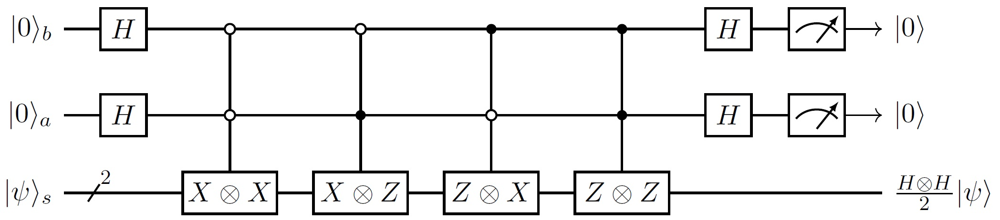

# Block-Encoding and Linear Combination of Unitary Operations

*Copyright (c) 2022 Institute for Quantum Computing, Baidu Inc. All Rights Reserved.*

## Block-Encoding

**Block-Encoding** is a quantum encoding method, first proposed in $[2]$. Since all quantum operations in the quantum circuit model are realized by quantum gates or quantum circuits composed of quantum gates, in this way, these quantum operations must be unitary. For those none-unitary operations, we need to introduce proper encoding so that they can be called well.

The so-called block-encoding is to encode the required quantum operation as a matrix block in the matrix corresponding to a larger quantum operation, such as in

$$
\check U=\begin{pmatrix}\check H&\cdot\\\cdot&\cdot\end{pmatrix}
$$

$\check H$ is encoded in the upper left corner of $\check U$. 

Strictly, given an $n$ qubit quantum operation $\check H$, if another $m+n$ qubit quantum operation $\check U$ with $m\ge1$ satisfies 

$$
\left(\langle0|^{\otimes m}\otimes I_{2^n}\right)\cdot \check U\cdot\left(|0\rangle^{\otimes m}\otimes I_{2^n}\right)=\check H,\tag{1}
$$

we say $\check H$ is a block of $\check U$, $\check U$ is a block-encoding of $\check H$ or $\check U$ block-encodes $\check H$, where $I_{2^n}$ denotes the identity matrix of dimension $2^n$.

To simplify notations, in this tutorial we use $s,a,b,c,\cdots$ to denote quantum systems, where $s$ indicates system registers, and $a,b,c,\cdots$ indicates ancilla registers in the order of introduction. Moreover, we add subscripts to quantum systems or quantum operations to indicate that it is a quantum state or quantum operation on the corresponding quantum system (or joint system). 

In this way, we set the last $n$ qubits as the system register $s$, and the first $m$ qubits as the ancilla register $a$, omit unaffected identity operations, abbreviate $|0\rangle^{\otimes m}$ as $|0\rangle$, and then abbreviate the above block encoding definition $(1)$ as:

$$
\langle0|_a \check U_{as}|0\rangle_a=\check H_s.
$$

It is proved that the operation results of $\check U$ on $|0\rangle_a|\psi\rangle_s$ is

$$
\check U_{as}|0\rangle_a|\psi\rangle_s=|0\rangle_a(\check H|\psi\rangle)_s+|0^\perp\rangle_{as},
$$

where $|0^\perp\rangle_{as}$ satisfies $\langle 0|_a|0^\perp\rangle_{as}=0_s$, which is the $0$ operator on register $s$. Here we can measure and select the output state in register $a$. When the state is indeed $|0\rangle$, the state in register $s$ will collapse to the quantum state

$$
\frac{\check H|\psi\rangle}{\sqrt{\langle\psi|\check H^\dagger\check H|\psi\rangle}},
$$

which is the normalization of $\check H|\psi\rangle$. Correspondingly, the probability that register $a$ is measured to $|0\rangle$ is $1/\langle\psi|\check H^\dagger\check H|\psi\rangle$. We can abbreviate this process as following in circuit representation:

**Remark.** The block $\check H$ of unitary matrices $\check U$ always has a limitation that $\check H$'s largest singular value (which is denoted as $\|\check H\|_2$) is always no more than $1$. For matrices $\check H$ with $\|\check H\|_2>1$, we could construct the block-encodings of its normalized matrix $\check H/\|\check H\|_2$ instead.

## Linear Combination of Unitary Operations

**Linear Combination of Unitary Operations** (LCU$^{[1]}$) is a common method to construct block-encodings. We use LCU to realize not only the input for block-encodings, but also linear combinations of block-encodings.

For any square matrix $\check H$, if it is a complex linear combination of several unitary operations with the same dimension:

$$
\check H=\sum_j c_jU_j,
$$

then we could construct a block-encoding for $\check H$ based on $U_j$s. Considering each $\frac{c_j}{|c_j|}U_j$ is also unitary, we assume each coefficient $c_j$ is a positive real number without loss of generality. Let $G$ be the preparation circuit for quantum state $\sum_j\sqrt{c_j}|j\rangle$, i.e. $G|0\rangle=\sum_j\sqrt{c_j}|j\rangle$; denote

$$
\operatorname{Sel}_{as}:=\sum_j\left(|j\rangle\langle j|\right)_a\left(U_{j}\right)_s,
$$

and then we have

$$
\langle0|_aG^\dagger_a\operatorname{Sel}_{as}G_a|0\rangle_a=\check H_s,
$$ 

which is equal to say LCU circuit $G_a^\dagger\operatorname{Sel}_{as}G_a$ is a block-encoding of $\check H$.

## Examples

Next we give two examples to demonstrate LCU.

### Linear Combination of Pauli Matrices

Denote $H=\frac{1}{\sqrt{2}}(X+Z)$ as Hadamard gate. Take the following two-qubit quantum operation as an example,

$$ 
\frac12H\otimes H=\frac{1}{4}X\otimes X+\frac{1}{4}X\otimes Z+\frac{1}{4}Z\otimes X+\frac{1}{4}Z\otimes Z.
$$

Set $G=H\otimes H$, and we have $G|0\rangle=\frac{1}{2}\left(|0\rangle+|1\rangle+|2\rangle+|3\rangle\right)$; set

$$
\operatorname{Sel}_{as}=
|0\rangle\langle0|\otimes X\otimes X+
|1\rangle\langle1|\otimes X\otimes Z+
|2\rangle\langle2|\otimes Z\otimes X+
|3\rangle\langle3|\otimes Z\otimes Z,
$$

and we have $G_a^\dagger\operatorname{Sel}_{as}G_a$ is a block-encoding of $H\otimes H/2$.

By extension, $2^n$-dimensional Hermitian matrices can always be expressed as real linear combinations of $n$ qubit Pauli matrices, and based on this, we can always construct block-encodings of such Hermitian matrices (with a scalar).

### LCU of Block-Encodings

Another example is “Linear combinations of block-encodings are block-encodings of linear combinations of blocks”.

If $m+n$ qubit unitary operations $\check U_1,\cdots,\check U_j,\cdots$ are block-encodings of $2^n$-dimensional matrices $\check H_1,\cdots,\check H_j, \cdots$ in their upper left corner respectively, then their arbitrary linear combination $\sum_jc_j\check U_j$ must also be a block-encoding of the $2^n$-dimensional matrix $\sum_jc_j\check H_j$ in the upper left corner. Furthermore, the block-encodings of $\sum_jc_j\check U_j$, such as the LCU circuit, are also block-encodings of $\sum_jc_j\check H_j$. What needs to be distinguished is that the ancilla system here has been expanded from one to two. One is the ancilla system for block-encoding each $\check H_j$ at the beginning, and the other is the additional ancilla system introduced when realizing the LCU circuit.

This point will be used again in the next section, quantum eigenvalue and singular value transformation.

---

## References

[1] A. M. Childs and N. Wiebe, “Hamiltonian Simulation Using Linear Combinations of Unitary Operations,” Quantum Information & Computation 12, 901 (2012).  
[2] Low, Guang Hao, and Isaac L. Chuang. "Hamiltonian simulation by qubitization." Quantum 3 (2019): 163.  