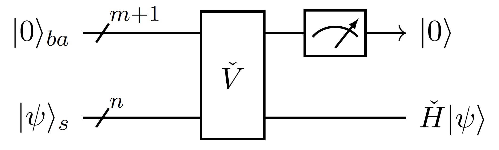
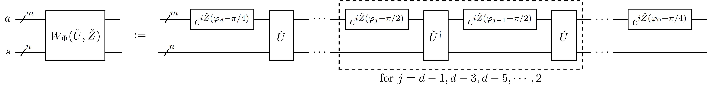
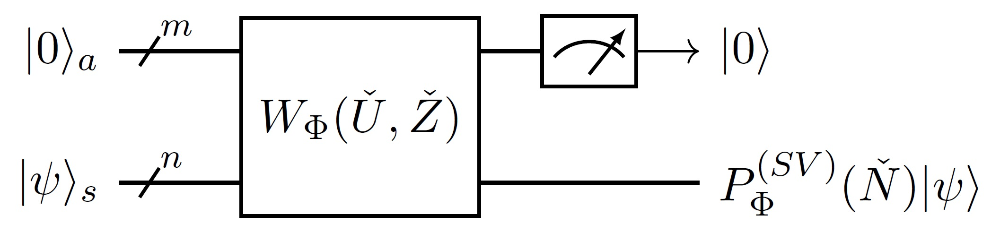

# Quantum Eigenvalue and Singular Value Transformation

*Copyright (c) 2022 Institute for Quantum Computing, Baidu Inc. All Rights Reserved.*

In this page, we continue to introduce **Quantum Eigenvalue Transformation** (QET$^{[1,2]}$) and **Quantum Singular Value Transformation** (QSVT$^{[3]}$).

## Quantum Eigenvalue Transformation

In quantum eigenvalue transformation, as its name suggests, we need to realize the transformation of eigenvalues quantumly. When we say a transformation, it involves only two things, one is the initial value and the other is the mapping. For initial values in QET, we could use block-encodings as quantum inputs; for mappings in QET, we could use QSP functions as quantum transformations. Therefore, QET is a combination of block-encodings and QSP, the correctness of which comes from the theory of qubitization$^{[2]}$.

Following previous notation in block-encoding, we assume a $2^n$-dimensional Hermitian matrix $\check H$ is encoded in the upper left corner of an $m+n$ qubit oracle $\check U$, denoted as 

$$
\langle0|_a \check U_{as}|0\rangle_a=\check H_s,
$$

where we assume additionally oracle $\check U$ satisfies $\check U^\dagger=\check U$, i.e. oracle $\check U$ is also Hermitian. Let the spectral decomposition of $\check H$ be $\check H=\sum_\lambda \lambda|u_\lambda\rangle\langle u_\lambda|$, where $\lambda$ is eigenvalues of $\check H$, and $|u_\lambda\rangle$ is corresponding eigenstate of eigenvalue $\lambda$.

Denoting

$$
|0_\lambda\rangle_{as}:=|0\rangle_a|u_\lambda\rangle_s,\ 
|0_\lambda^\perp\rangle_{as}:=\frac{\check U|0_\lambda\rangle-\lambda|0_\lambda\rangle}{\sqrt{1-\lambda^2}},
$$

and introducing the reflection operator $\check Z$ and high-dimensional rotation operator $e^{i\check Z\varphi}$ about subspace $|0\rangle\langle0|$ in system $a$:

$$
\begin{aligned}
\check Z:=&\ 2|0\rangle\langle0|-I,\\
e^{i\check Z\varphi}=&\ e^{i\varphi}|0\rangle\langle0|+e^{-i\varphi}(I-|0\rangle\langle0|),
\end{aligned}
$$

then we find that the following equations hold

$$
\begin{aligned}
e^{i\check Z\varphi}\cdot(|0_\lambda\rangle,|0_\lambda^\perp\rangle)&=(|0_\lambda\rangle,|0_\lambda^\perp\rangle)\cdot e^{iZ\varphi},\\
ie^{-i\pi\check Z/4}\check Ue^{-i\pi\check Z/4}\cdot(|0_\lambda\rangle,|0_\lambda^\perp\rangle)&=
(|0_\lambda\rangle,|0_\lambda^\perp\rangle)\cdot W(\lambda),
\end{aligned}\tag{1}
$$

where

$$
(|0_\lambda\rangle,|0_\lambda^\perp\rangle):=|0_\lambda\rangle\langle0|+|0_\lambda^\perp\rangle\langle1|
$$ 

is a matrix of dimension $2^{m+n}\times2$, $e^{iZ\varphi}$ and $W(\lambda)$ are exactly the processing gate and the signal gate defined in QSP, respectively. It is clear that in $(1)$, the multi-qubit operations on the left side of $(|0_\lambda\rangle,|0_\lambda^\perp\rangle)$ can be equivalent to the processing or signal gates on the right side of $(|0_\lambda\rangle,|0_\lambda^\perp\rangle)$. In other words, those multi-qubit operations are equivalent to the processing or signal gates when limited to the two-dimensional subspace spanned by $|0_\lambda\rangle$ and $|0_\lambda^\perp\rangle$.

We can multiply processing gates and signal gates alternately to assemble a QSP circuit $W_\Phi(\lambda)$. For 

$$
(|0_\lambda\rangle,|0_\lambda^\perp\rangle)\cdot W_\Phi(\lambda)
$$

move those processing and signal gates to the left side of $(|0_\lambda\rangle,|0_\lambda^\perp\rangle)$, based on the combination rate of matrix multiplication and equations $(1)$, and then we obtain

$$
W_\Phi(\check U,\check Z):=i^de^{i\check Z\varphi_0}\prod_{j=1}^d\left(e^{-i\pi\check Z/4}\check Ue^{-i\pi\check Z/4} e^{i\check Z\varphi_j}\right)
$$

satisfies

$$
W_\Phi(\check U,\check Z)\cdot(|0_\lambda\rangle,|0_\lambda^\perp\rangle)=(|0_\lambda\rangle,|0_\lambda^\perp\rangle)\cdot W_\Phi(\lambda).
$$

Correspondingly, the circuit representation for $W_\Phi(\check U,\check Z)$ is following

Since $i^d$ is a global phase factor, it is not reflected in the circuit representation. Further, according to superposition, it can be proved that circuit $W_\Phi(\check U,\check Z)$ is a block-encoding of $P_\Phi(\check H)$, where $P_\Phi(\check H)$ is the matrix function value of univariate function $P_\Phi$ at the Hermitian matrix $\check H$:

$$
\langle0|_aW_\Phi(\check U,\check Z)_{as}|0\rangle_a
=\sum_\lambda P_\Phi(\lambda)|u_\lambda\rangle_{s}\langle u_\lambda|_s
=:P_\Phi(\check H)_s,\tag{2}
$$

whose proof is attached in the appendix of this page.

Thus, we call $W_\Phi(\check U,\check Z)$ QET circuit. From a macro perspective, $W_\Phi(\check U,\check Z)$ can distinguish different eigenspaces of $\check H$, and import the eigenvalues as signal parameters into QSP, process all the eigenvalues in a parallel way, and realize the transformation of each eigenvalue along the function $P_\Phi$ at the same time. This technique of treating multiple two-dimensional subspaces as qubits and parallel operating is called **qubitization**.

**Remark.** Although we have assumed $\check U^\dagger= \check U$ earlier, this condition is not harsh. For any oracle $\check U$, we could introduce an ancilla qubit $b$ and use the control version oracle $C(\check U)=|0\rangle\langle0|\otimes I + |1\rangle\langle1|\otimes\check U$ and its inverse $C(\check U)^\dagger$ to construct another oracle $\check V$:

.JPG)

which coule be represented in math as

$$
\check V_{bas}= H_b C(\check U)_{bas}^\dagger X_b C(\check U)_{bas}H_b,
$$

where $H$ is Hadamard gate. Then we can verify that $\check V$ is also a block-encoding of $\check H$, and satisfies $\check V^\dagger=\check V$. It is noted that the dimension of $\check V$ is doubled compared to that of $\check U$.

## Quantum Singular Value Transformation

As a generalized version of QET, we continue to introduce a special case of **quantum singular value transformation** briefly.

Before talking about QSVT, we feel that it is necessary to know what a singular value is. For a complex matrix $\check N$, its singular values are defined as the arithmetic square root of the eigenvalues of Hermitian matrix $\check N^\dagger\check N$ (multiplicity counted). It is noted that the number of singular values of a square matrix always equals to its dimension, but for those none-square matrices only none-zero singular values are cared, even though we define singular values none-zero. Based on the spectral decomposition of $\check N^\dagger\check N$, we have the singular value decomposition for $\check N$:

$$
\check N=\sum_\sigma \sigma|u_\sigma\rangle\langle v_\sigma|
$$

where each singular value $\sigma>0$, $|u_\sigma\rangle$ orthogonal to each other, $|v_\sigma\rangle$ orthogonal to each other. In math, matrix $\check N$ maps the high-dimensional unit ball into a high-dimensional ellipsoid when regarded as a linear map, meanwhile none-zero singular values of $\check N$ are exactly those principal semi-axes of the ellipsoid. Because $0$ singular values are corresponding to those degenerated dimensions of such ellipsoid, we don't care about them.

Going back to singular value transformation, we assume a $2^n$-dimensional square matrix $\check N$ is encoded in the upper left corner of an $m+n$ qubit oracle $\check U$ denoted as 

$$
\langle0|_a \check U_{as}|0\rangle_a=\check N_s,
$$

and introduce the reflection operator $\check Z$ and high-dimensional rotation operator $e^{i\check Z\varphi}$ about subspace $|0\rangle\langle0|$ in system $a$

$$
\begin{aligned}
\check Z&:=2|0\rangle\langle0|-I,\\
e^{i\check Z\varphi}&:=e^{i\varphi}|0\rangle\langle0|+e^{-i\varphi}(I-|0\rangle\langle0|),
\end{aligned}
$$

an odd integer $d$ and processing parameters $\Phi=(\varphi_0,\varphi_1,\cdots,\varphi_d)\in\mathbb R^{d+1}$. Then we change the definition of QET circuit $W_\Phi(\check U,\check Z)$ as following to obtain the definition of QSVT circuit, which is also denoted as $W_\Phi(\check U,\check Z)$.

In math, the QSVT circuit $W_\Phi(\check U,\check Z)$ is defined as

$$
W_\Phi(\check U,\check Z)=i^de^{i\check Z\varphi_0}\prod_{j=1}^d\left(e^{-i\pi\check Z/4}\check U^{(-1)^{j+1}}e^{-i\pi\check Z/4} e^{i\check Z\varphi_j}\right),
$$

where $i^d$ is also a global phase factor, which is not reflected in the circuit representation. Then it is proved that QSVT circuit $W_\Phi(\check U,\check Z)$ is a block-encoding of a singular value transformation result $P_\Phi^{(SV)}(\check N):=\sum_\sigma P_\Phi(\sigma)|u_\sigma\rangle\langle v_\sigma|$ for $\check N$:

$$
\langle0|_aW_\Phi(\check U,\check Z)_{as}|0\rangle_a
=P^{(SV)}_\Phi(\check N).
$$

When talking about QSVT without ambiguity, we can abbreviate $P^{(SV)}_\Phi$ as $P_\Phi$. It can be verified that QET is a special case of QSVT when $\check U^\dagger=\check U$ and $\check N^\dagger=\check N$. 

---

## Appendix

#### The Proof of $(2)$

$$
\begin{aligned}
 &\langle0|_aW_\Phi(\check U,\check Z)_{as}|0\rangle_a\\
=&\langle0|_aW_\Phi(\check U,\check Z)_{as}|0\rangle_a\sum_\lambda|u_\lambda\rangle_s\langle u_\lambda|_s\\
=&\sum_\lambda\langle0|_a\left(W_\Phi(\check U,\check Z)|0_\lambda\rangle\right)_{as}\langle u_\lambda|_s\\
=&
\sum_\lambda\langle0|_a\cdot\left(
    |0_\lambda\rangle_{as}\cdot\left(\langle0|W_\Phi(\lambda)|0\rangle\right)+
    |0_\lambda^\perp\rangle_{as}\cdot\left(\langle1|W_\Phi(\lambda)|0\rangle\right)
    \right)\langle u_\lambda|_s\\
=&
\sum_\lambda\left(
    P_\Phi(\lambda)\langle0|_a\cdot|0_\lambda\rangle_{as}+
    i\sqrt{1-\lambda^2}Q_\Phi(\lambda)\langle0|_a\cdot|0_\lambda^\perp\rangle_{as}
    \right)\langle u_\lambda|_s\\
=&
\sum_\lambda P_\Phi(\lambda)|u_\lambda\rangle_{s}\langle u_\lambda|_s\\
=:&P_\Phi(\check H)_s,
\end{aligned}
$$

## References

[1] Low, Guang Hao, and Isaac L. Chuang. "Optimal Hamiltonian simulation by quantum signal processing." Physical review letters 118.1 (2017): 010501.  
[2] Low, Guang Hao, and Isaac L. Chuang. "Hamiltonian simulation by qubitization." Quantum 3 (2019): 163.  
[3] Gilyén, András, et al. "Quantum singular value transformation and beyond: exponential improvements for quantum matrix arithmetics." Proceedings of the 51st Annual ACM SIGACT Symposium on Theory of Computing. 2019.  